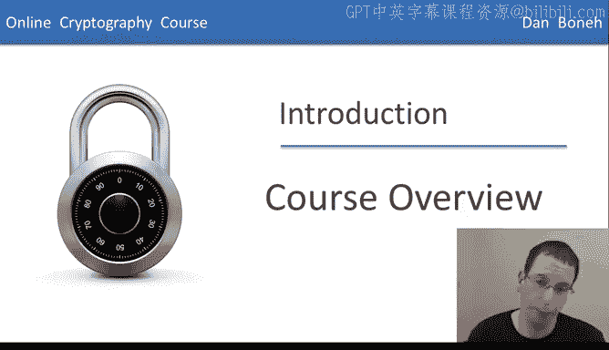
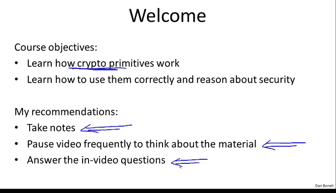
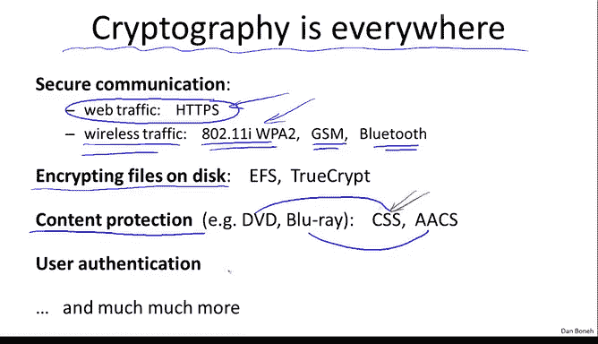
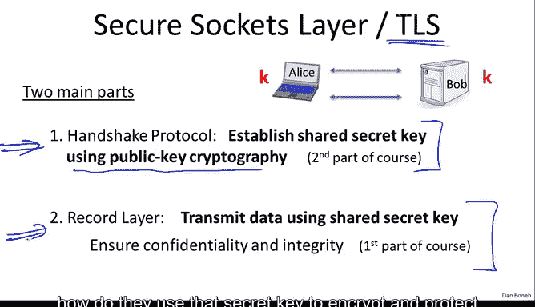
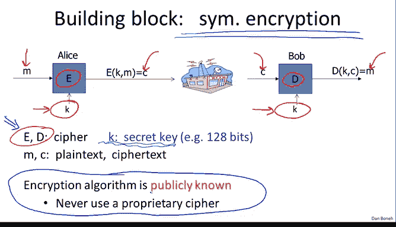
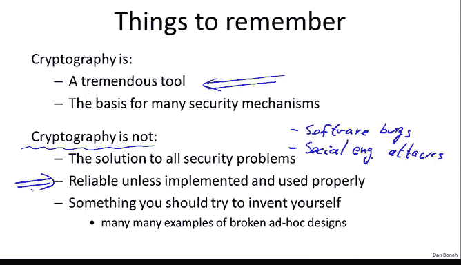

# 斯坦福大学《密码学｜Cryptography 1》中英字幕 - P1：01_01_03_课程概述.zh_en - GPT中英字幕课程资源 - BV1Rf421o79E

Hello， my name is Dan Bonet， and I'd like to welcome you to my course on cryptography that I'll be teaching at Stanford University this quarter。

 This quarter， I'm experimenting with recording the lectures and having the students watch the lectures online。

 In fact， anyone is welcome to watch the lectures and join the course。 This is an experiment。

 so we'll see how it goes。😊。

My goals for this course are basically to teach you how cryptographic primitives work。

 but more importantly I'd like to teach you how to use cryptographic primitives correctly and reason about the security of your constructions we will see various abstractions of cryptographic primitives and we'll do some security proofs My goal is that by the end of the course you'll be able to reason about the security of cryptographic constructions and be able to break ones that are not secure。

😊，Now I'd like to say a few words on how I would like you to take the class first of all。

 I'm a big believer in taking notes as you listen to the lectures。

 so I would really encourage you to summarize and take notes in your own words of the material that's being presented。

😊，Also， I should mention that on the videos I'm able to go much faster than I would go in a normal classroom。

 and so I would encourage you to periodically pause the video and think about the material that's being covered and not move forward until the material is clear in your mind。

Also from time to time the video will pause and pop up questions will come up these are intended to kind of help you along with the material and I would really encourage you to answer those questions by yourselves rather than skip them usually the questions are about the material that has just been covered and so it shouldn't be too difficult to answer the questions so I would really encourage you to do them rather than skip them。

Now by now I'm sure everybody taking the class knows that cryptography is used everywhere computers are。

 It's a very common tool that's used to protect data。 For example。

 web traffic is protected using a protocol called HTPS wireless traffic for example。

 Wi-fi traffic is protecting using the WPA2 protocol that's part of A0211i cellphone traffic is protected using an encryption mechanism in GSM。

 Bluetooth traffic is protected using cryptography and so on we're going to see how these various systems work In fact。

 we're going to cover SSL and in fact even 80211i in quite a bit of detail and you'll see how these systems work in practice cryryptography is also used for protecting files that are stored on disk by encrypting them So if the disk is stolen the files are not compromised It's also used for content protection for example。

 when you buy DVDs and blueray disks the movies on these disks are encrypted in particular DVD uses a system called CSS the contents crmbling system。

CSS and blueray uses a system called AACS we'll talk about how CSS and AACS work。

 it turns out that CSS is a fairly easy system to break and we'll talk about how we'll do some cry analysis and actually show how to break encryption that's used in CSS。

Cryptography is also used for user authentication and many， many。

 many of the other applications that we'll talk about in the next segment。

Now I want to go back to secure communication and talk about the case where here we have a laptop trying to communicate with a web server。

 This is a good time to also introduce our friends， Alice and Bob。

 who are going to be with us throughout the quarter。

 essentially Alice is trying to communicate securely with Bob here。

 Alice is on the laptop and Bob is on the server。 The protocol that's used to do that is called Https and in fact。

 actual protocol is called SSL sometimes it's called TlS and the goals of these protocols is basically to make sure this this data travels across the network。

 An attacker， first of all， can't eavesdrop on this data and second of all。

 an attacker can't modify the data while it's in the network So no eavesdropping and no tampering。

Now as I said， the protocol that's used to secure web traffic called TLS actually consists of two parts the first part is called this Handshake protocol where Alice and Bob talk with one another and at the end of the handshake basically a shared secret key appears between the two of them。

 so both Alice and Bob know this secret key but an attacker looking at the conversation has no idea what the keyK is。

Now， the way you establish just secret key， the way you do the handshake is using public key cryptography techniques。

 which we're going to talk about in the second part of the course。

Now once Alice and Bob have the shared key， you can use this key to communicate securely by properly encrypting data between them。

 and in fact， this is going to be the first part of the course。

 which is essentially once the two sides have a shared secret key。

 how do they use that secret key to encrypt and protect data that goes back and forth between them？

Now as I said， another application of cryptography is to protect files on disk so here you have a file that happens to be encrypted so that even if the disk is stolen。

 an attacker can't actually read the contents in the file and if an attacker tries to modify the data on disk。

 the data in the file while it's on disk when Alice tries to decrypt this file that will be detected and she'll then basically ignore the contents of the file so we have both confidentiality and integrity for files stored on disk Now I want to make a minor philosophical point that in fact storing encrypted files on disk is very much the same as protecting communication between Alice and Bob in particular when you store files on disk it's basically Alice who stores a file today wants to read the file tomorrow so rather than communicating between two parties Alice and Bob in the case of a stored disk encryption it's Alice today who's communicating with Alice tomorrow but really the two scenarios。

 secure communications in secure files are kind of philosophical。

かりでせん。Now， the building block for securing traffic is what's called symmetric encryption systems。

 and we're going to talk in the first half of the course extensively about symmetric encryption systems。

 So in a symmetric encryption system， basically the two parties Alice and Bob share a secret key K which the attacker does not know only they know the secret keyK。

 Now they're going to use a cipher， which consists of these two algorithms。

 E and D E is called an encryption algorithm and D is called the decryption algorithm。

 The encryption algorithm takes the message and the key is input and produces a corresponding ciphertext。

 and the decryption algorithm does the opposite。 It takes the ciphertext as input along with the key and produces the corresponding message。

 Now， a very important point that I'd like to stress。

 I'm only going to say this once now and never again， but it is an extremely important point。

 and that is that the algorithms E and the actual encryption algorithms are publicly known adversary knows exactly how they work。

 The only thing that's kept secret is the。Secret keyK other than that。

 everything else is completely public and it's really important to realize that you should only use algorithms that are public because those algorithms have been peerreviewed by a very large community of hundreds of people for many。

 many many years and these algorithms only begin to be used once this community has shown that they cannot be broken essentially so in fact if someone comes to you and says hey I have a proprietary cipher that you might want to use the answer usually should be that you stick to standards to standard algorithms and not use a proprietary cipher in fact there are many examples of proprietary ciphers that as soon as they were reverse engineered they were easily broken simple analysis。

Now， even in the simple case of symmetric encryption。

 which we're going to discuss in the first half of the course。

 there are actually two cases that we're going to discuss in turn。

 The first is when every key is only used to encrypt a single message。

 we call these one time keys Okay， so for example， when you encrypt email messages。

 It's very common that every single email is encrypted using a different symmetric key。 Yeah。

 different symmetric cipher key。Because the key is used to only encrypt one message。

 there are actually fairly efficient and simple ways of encrypting messages using these one time keys。

 and we'll discuss those actually in the next module。

Now there are many cases in fact where keys need to be used to encrypt multiple messages we call these many time keys。

 for example when you encrypt files in a file system， the same key is used to encrypt many。

 many different files and it turns out if the key is now going to be used to encrypt multiple messages。

 we need a little bit of more machinery to make sure that the encryption system is secure In fact。

 after we talk about one time keys will move over and talk about encryption modes that are specifically designed for many time keys and we'll see that there are a couple more steps that need to be taken to ensure secure it in those cases。

Okay， the last point I want to make is that there are a couple of important things to remember about cryptography。

 First of all， cryptography， of course， is a fantastic tool for protecting information in computer systems。

 However， it's also very important that cryptography has its limitations。 First of all。

 cryptography is really not a solution to all security problems for example。

 if you have software bugs， then very often cryptography is not going to be able to help you。

 Similarlyly， if you're worried about social engineering attacks。

 where the attacker tries to fool the user into taking actions that are going hurt the user。

 then cryptography is very often actually not going help you。

 So it's very important that although it's a fabulous tool。

 it's not a solution to all security problems。 Now。

 another very important point is that cryptography essentially becomes useless if it's implemented incorrectly。

 So， for example， there are a number of systems that work perfectly fine and we'll see examples of those systems that in fact。

 allow Alice and Bob to communicate and in fact， messages that Alice sent to Bob Bob。😊。

Receive and decrypt。 However， because cryptography is implemented incorrectly。

 the systems are completely insecure。 And actually。

 I should say that I like to mention an old encryption。

 a standard called WEP web that's used for encrypting Wifi traffic web contains many mistakes in it。

 And often when I want to show you how not to do things in cryptography。

 I will point to how things were done in web as an example。

 So for me it's very fortunate to have an example protocol I can point to for how not to do things。😊。

And finally a very important point that I'd like you to remember is that cryptography is not something you should try to invent and design yourself As I said。

 there are standards in cryptography standard cryptographic primitives which we're going to discuss at length during this course and primarily you're supposed to use these standard cryptographic primitives and not invent things these primitives yourself。

 they have the standards have all gone through many years of review by hundreds of people and that's not something that's going to happen to an ad hoc design and as I said over the years there are many examples of ad hoc designs that were immediately broken as soon as they were analyzed。

😊。