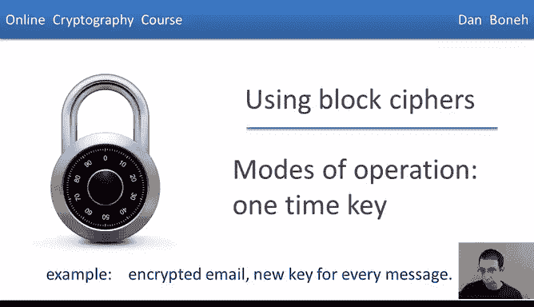
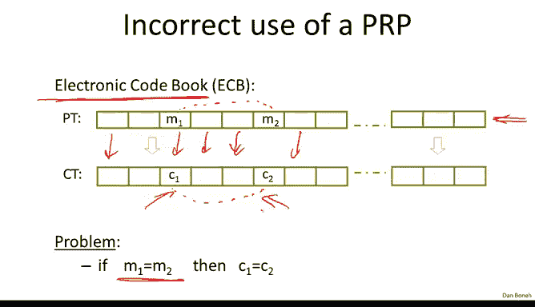
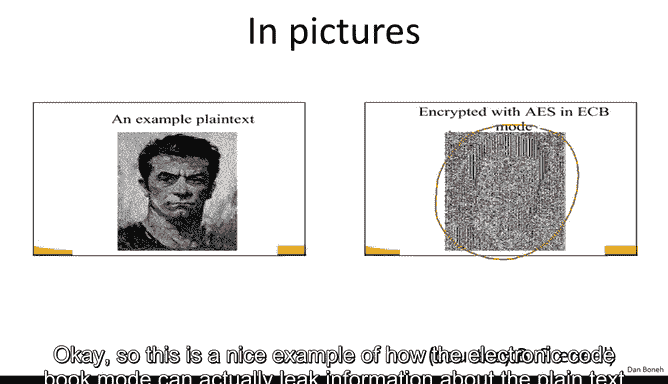
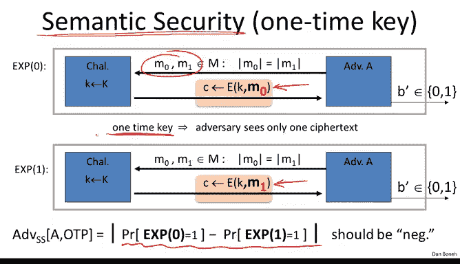
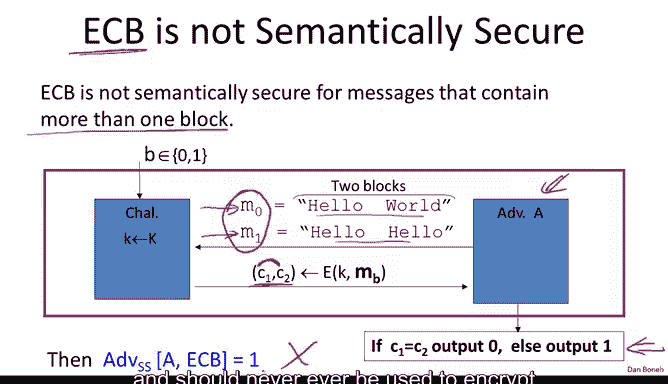
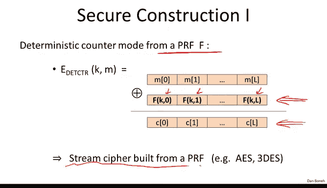
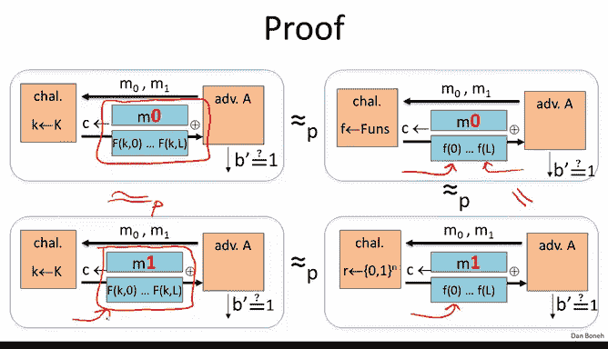

# 斯坦福大学《密码学｜Cryptography 1》中英字幕 - P20：20_02_02_操作模式：一次性密钥.zh_en - GPT中英字幕课程资源 - BV1Rf421o79E

So as our first example， let's look at a very simple way of using a block cipher for encryption。

 in particular we'll see how to use a block cipher with a one time key。

So in this segment we're just going to use the block cipher to encrypt using keys that are used one time。

 In other words， all the adversary gets to see as one cipher textex and his goal is to break semantic security of that ciphertex Now in the next segment we're going to turn into more interesting applications of block ciphers and we're going to see how to encrypt using keys that are used many。

 many times to encrypt many messages So before we start I want to mention that there is like a classic mistake in using a block cipher。

 unfortunately there are some products that actually work this way and they are badly broken so I want to make sure that none of you guys actually make this mistake So this mode of operation is called an electronic codebook and it works as follows the first thing that comes to mind when you want to use a block cipher for encryption。

What we do is we take our message， we break it into blocks。

 each block as big as the block cipher block， so in the case of AES。

 we would be breaking our message into 16 by blocks。And then we encrypt each block separately。

So this mode is often called electronic codebook。 And unfortunately。

 it's terribly insecure because you realize if two blocks are equal。 For example， here。

 these two blocks happen to be equal， then necessarily。

 the result in Cyphert are also going to be equal。 So an attacker who looks at the ciphertex。

 even though he might not know what's actually written in these blocks will know that these two blocks are equal。

 And as a result， he learned something about the plain text that he shouldn't have learned。

And if this isn't clear enough for you abstractly， the best way to explain this is using a picture and so here's this guy here that know has this really dark black hair and when we encrypt this image this bitmap image using electronic codebook mode you see that his hair that contains lots of ones basically always gets encrypted the same way so that his silhouette actually is completely visible even in the encrypted data so this is a nice example of how the electronic codebook mode can actually leak information about the plain text that could tell something to the attacker so the question is how to correctly use blockyphers to encrypt log messages and so I just want to briefly remind you of the notion we're trying to achieve which is basically semantic security using a one time key so the adversary outputs to messages M0 and M1 and then he gets either the encryption of M0 or the encryption of M1 these are two different experiments and then our goal is to say that the adversary can't distinguish between these two experiments so he can't distinguish the encryption of M0 from the encryption M。

1。And the reason we call the security for a one time key is that the key is only used to encrypt a single message and as a result。

 the adversary will ever only see one cipher textex encrypted using this key。

Okay so the first thing we want to show is that in fact。

 the mode that we just looked at electronic codebook， in fact， is not semantically secure。

 and this is true as long as you're encrypting more than one block。 So here's an example。

 suppose we encrypt two blocks using a block cipher。 let me show you that in fact。

 electronic codebook would not be secure。 So here's what we would do。 but so we're the adversary。

 So we would output put two messages M0 and M1 where in one message the blocks are distinct and in the other message the blocks are the same the two blocks are equal to one another。

Well， so what is challenge are going to do is the challenger is going to encrypt either M0 or M1 either way we're going to get two blocks back so the Cyphertex actually contains two blocks。

 The first block is going to be an encryption of the word hello and the second block is going to be either an encryption of the word hello or the word world and then if the two Cyphertex blocks are the same then the adversary knows that he received an encryption of the message hello hello and if they're different he knows that he received an encryption of the message hello world so he just follows the simple strategy here and if you think about it for a second you'll see what his advantage is so what is the advantage。

Well， this adversary， when he received an encryption of the message M1， he will always output zero。

 and when he receive an encryption of the message M0， he will always output1。

 and because of that the advantage basically is one， which means that the scheme is not secure。

 which again shows you that electronic codebook is not semantically secure and should never ever be used to encrypt messages that are more than one block long。

So what should we do。 Well， so here's a simple example。

 What we could do is we could use what's called the termministic counter mode。

 So in the termministic counter mode， basically， we build a stream cipher out of the block cipher。

 So suppose we have a PF F。 So again， you should think of AE。 when I say that。

 So AE S is also a secure PRF。And what we'll do is basically we'll evaluate A yes at the point0 at the point1 at the point2 up to the point L。

 This will generate a pseudoran pad。And we'll exort that with all the message blocks and recover the cipherex as a result。

 so really this is just a stream cipher that's built out of a PRf like AES and triple D。

 and it's a simple way to do encryption I wanted to just very quickly show you the security theorem in fact we've already seen the security theorem when it applied to stream cipher is using to the random generator so I'm not going to repeat this again I'll just remind you that essentially for every adversary A that's trying to attack the deterministic counter mode we prove that there's an adversary B that's trying to attack the PRf and since this quantity is negligible because the PRf is secure we obtain that this quantity is negligible and therefore the adversary has negligible advantage in defeating the deterministic counter mode and the proof in picture is a really simple proof so I'll just show it to you one more time for completeness So basically what we want to show is when the adversary is given the encryption of the message M0 here this is the encryption of the message M0 M0 Xor counter apply。

To the PRf versus in giving the encryption of the message M1。

We want to argue that these two distributions are computationally in distinguishable。

 so the way we do that is basically we say well the top distribution， if instead of a PRf。

 we use a truly random function， namely here F is a truly random function。Then the adversary。

 because of the property of the PRf， the adversary cannot distinguish these two experiments， right。

 a PRf is indistinguishable from a truly random function， therefore。

 when we replace the PRf on the left with a truly random function on the right。

 the adversary is going to behave the same。 Basically， he can't distinguish these two distributions。

But now because F is a truly random function that had here is a truly one time pad and therefore no adversary can distinguish an encryption of M0 from an encryption of M1 under the one time pad。

 so again these two distributions are the same in fact here there's actually equality。

 these two distributions literally are the same distribution。AndSimilarly again。

 when we go back from a truly random function here to a PRF because the PRF is secure。

 the adversary can't distinguish these two bottom distributions the left from the right。

 And so by following these three qualities， basically we've proven that the things we wanted to prove equal are actually computationally in distinguishuishable so that's a very simple proof to show that the termministic counter mode is in fact secure。

 and it's basically the same proof as we had when we proved that a stream cipher gives a semantic security。

Okay， so that completes this segment and in the next segment we'll talk about modes that enable us to use a key to encrypt multiple messages。

