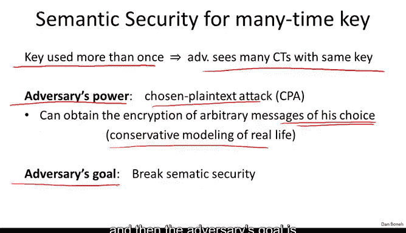
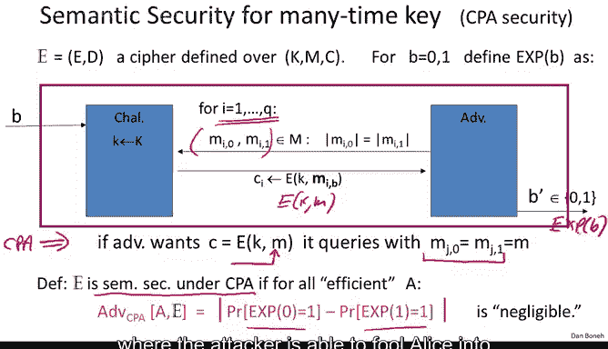
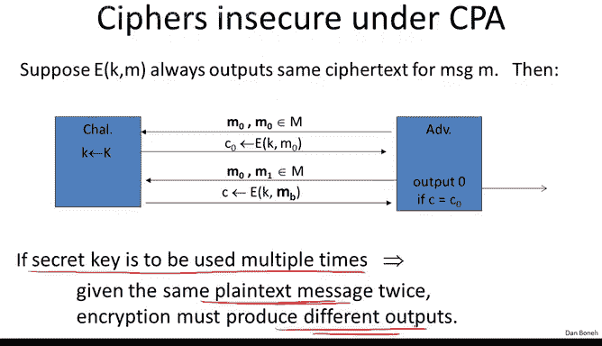
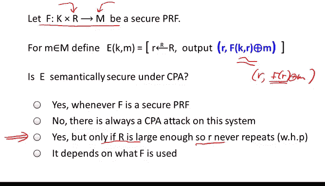
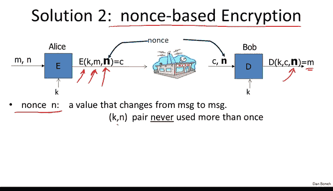
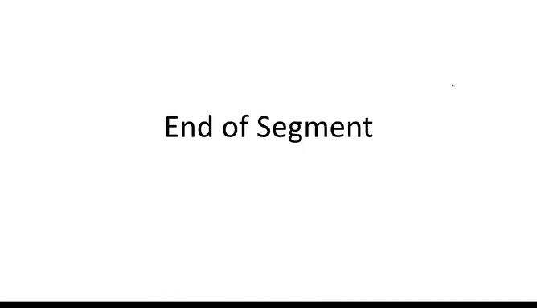

# 斯坦福大学《密码学｜Cryptography 1》中英字幕 - P21：21_02_01_多密钥安全性：CPA安全.zh_en - GPT中英字幕课程资源 - BV1Rf421o79E

In this segment， we will look at how to use block cphers to encrypt multiple messages using the same key。

This comes up in practice， for example， in file systems where the same key is used to encrypt multiple files。

 it comes up in networking protocols where the same key is used to encrypt multiple packets。

 So let's see how to do it。 The first thing we need to do is to define what does it mean for a cipher to be secure when the same key is used to encrypt multiple messages。

When we use the key more than once， the result of that is that the adversary gets to see many Cypherts encrypted using the same key。

 As a result， when we define security， we're going to allow the adversary to mount what's called a chosen plain text attack。

 In other words， the adversary can obtain the encryption of arbitrary messages of his choice。 So。

 for example， if the adversary is interacting with Alice。

 the adversary can ask Alice to encrypt arbitrary messages of the adversary's choosing。

 and Alice will go ahead and encrypt those messages and give the adversary the resulting cpherts。

You might wonder why would Alice ever do this。 How can this possibly happen in real life。

 But it turns out this is actually very common in real life。 And in fact。

 this modeling is quite a conservative modeling of real life。 For example。

 the adversary might send Alice an email。 When Alice receives the email。

 she writes it to her encrypted disk thereby encrypting the adversary's email using her secret key。

 If later， the adversary steals disk。 Then he obtains the encryption of an email that he sent to Alice under Alice's secret key。

 So that's an example of a chosen plain text attack where the adversary provided Alice with a message and she encrypted that message using her own key。

 and then later， the attacker was able to obtain the resulting Cyphertext。😊。

So that's the adversary's power， and then the adversary's goal is basically to break semantic security。

So let's define this more precisely， as usual， we're going to define semantic security under a chosen Plax attack using two experiments。

 experiment zero and experiment1 that are modeled as a game between a challenger and an adversary。

When the game begins， the challenger is going to choose a random keyK。

And now the adversary basically gets to query the challenger so the adversary begins by submitting a semantic security query。

 namely he submits two messages M0 and M1。 I added another index。

 but let me ignore that extra index for a while so the adversary submits two messages M0 and M1 that happened to be of the same length and then the adversary receives the encryption of one of those messages either of M0 or of M1 in experiment0。

 he receives the encryption of M0 in experiment1， he received the encryption of M1 So so far this would look familiar。

 this looks exactly like a standard semantic security game However， in a chosen plain test attack。

 the adversary can now repeat this query again So now he can issue a query with two other chosen plan text again of the same length and again he would receive the encryption of one of them in experiment0 he would receive the encryption of M0 in experiment1。

 he would receive the encryption of M1 and the attacker can continue issuing queries like this In fact。

Will say that he can issue up to Q queries of this type。

 again remember every time he issues a pair of messages。That happen to be of the same length。

 And every time he either gets the encryption of the left side or the right side。 again。

 in experiment 0， he will always get the encryption of the left message in experiment 1。

 he will always get the encryption of the right message。

And then the adversary's goal is basically to figure out whether he is an experiment 0 or an experiment 1。

 In other words， whether he was constantly receiving the encryption of the left message or the encryption of the right message。

 So in some sense， this is a standard semantic security game just iterated over many queries that the attacker can issue adaptively one after the other。

 Now， the chosen plaintiffs attack is captured by the fact that if the attacker wants the encryption of a particular message M。

 What he could do is， for example， use query J for some J。 where in this query J。

 he'll set both the zero message and the one message to be the exactly the same message M。

 In other words， both a left message and the right message are the same and both are set to the message M。

 In this case， what he will receive since both message are the same。

 he knows that he' is going to receive the encryption of this message M that he was interested in。

 So this is exactly what we meant by a chosen plaintiff attack where the adversary can submit a message M and receive the encryption。

Of that particular message M of his choice。So some of his queries might be of this chosen plain text flavor where the message on the left is equal to the message on the right。

 but some of the queries might be standard semantic security queries where the two messages are distinct and that actually gives them information on whether he's an experiment 0 or an experiment1。

Now， by now， you should be used to this definition where we say that the system is semantically secure under a chosen plain test attack。

 If for all efficient adversaries， they cannot distinguish experiment0 from experiment 1。

 In other words， the probability that at the end， the output B prime。

 which we're going to denote by the output of experiment B。 This output will be the same。

 whether they' an experiment 0 or experiment1。So the attacker couldn't distinguish between always receiving encryptions of the left messages versus always receiving encryptions of the right messages。

 So in your mind， I'd like you to be thinking of an adversary that is able to mount a chosen plaintiff' attack。

 namely be given the encryption of arbitrary messages of his choice and his goal is to break semantic security for some other challenge Cyphertexts。

And as I said， in his game models the real world where the attacker is able to fool Alice into encrypting for him messages of his choice。

 and then the attacker's goal is to somehow break some challenge Cyphertexts。

So I claim that all the cphers that we've seen up until now。

 namely the Terministic counter mode or the one time pad。

 are insecure under a chosen plaintiff attack。More generally。

 suppose we have an encryption scheme that always outputs the same cipher text for a particular message M。

 In other words， if I ask the encryption scheme to encrypt the message M once。

And then I asked the encryption scheme to encrypt the message M again。

 if in both cases the encryption scheme outputs the same Cyphertext。

 then that system cannot possibly be secure under a chosen plaintiff test attack。

And both the Terministic counter mode and the one time pad were of that flavor。

 they always output the same cipher textex given the same message。

And so let's see why that cannot be chosen planx secure and the attack is actually fairly simple。

 What the attacker is going to do is he's going to output the same message twice。

 This just says that he really wants the encryption of M0。

 So here the attacker is given C0 which is the encryption of M0。

 So this was his chosen plan' query where he actually received the encryption of the message M0 of his choice。

 and now he's going to break semantic security。 So what he does is he outputs two messages M0 and M1 of the same length。

And he's going to be given the encryption of M。 But lo and behold。

 we said that the encryption system always outputs the same Cyphertex when it's encrypting the message M0。

 Therefore， if B is equal to 0， we know that C， this challenge Cyphertext is simply equal to C 0。

 because it's the encryption of M0。 However， if b is equal to1。

Then we know that this challenge Cyphert is the encryption of M1， which is something other than C0。

So all the attacker does is he just checks if c is equal to c0， he outputs zero， in other words。

 he outputs  one。So in this case， the attacker is able to perfectly guess this bit B。

 so he knows exactly whether he was given the encryption of M0 or the encryption of M1。

 and as a result， his advantage in winning this game is one meaning that the system cannot possibly be CPA secure。

 one is not a negligible number。So this shows that the termministic encryption schemes cannot possibly be CP secure。

 but you might wonder well， what does this mean in practice Well， in practice。

 this means again that every message is always encrypted to the same Cyphertext。

 What this means is if you're encrypting files on disk and you happen to be encrypting two files that happen to be the same。

 they'll result in the same Cyphertext and then the attacker by looking at the encrypted disk will learn that these two files actually contain the same content。

 The attacker might not learn what the content is， but he will learn to two encrypted files are an encryption of the same content and he shouldn't be able to learn that。

Similarly， if you send two encrypted packets on the network that happen to be the same。

 the attacker will not learn the content of those packets。

 but he will learn that those two packets actually contain the same information。

Think for example of an encrypted voice conversation， every time there's quiet on the line。

 the system will be sending encryptions of zero， but since encryptions of zero are always mapped to the same Cyphertext。

 an attacker looking at the network will be able to identify exactly the points in the conversation where there is quiet because he will always see those exact same Cyphertext every time。

So these are examples where deter deterministic encryption cannot possibly be secure。

And as I say formally， we say that deter deterministic encryption cannot be semantically secure under a chosen plain text attack。

So what do we do Well， the lesson here is if the secret key is going to be used to encrypt multiple messages。

 it had better be the case that given the same plain text to encrypt twice。

 the encryption algorithm must produce different cipherts。And so there are two ways to do that。

 The first method is what's called randomized encryption。 Here。

 the encryption algorithm itself is going to choose some random string during the encryption process。

 and it's going to encrypt a message M using that random string。

 So what this means is that a particular message M0， for example。

 isn't just going to be mapped to one ciphertext。 but it's going to be mapped to a whole ball of ciphertexs。

Where on every encryption， basically we output one point in this ball。

So every time we encrypt the encryption algorithm chooses a random string and that random string leads to one point in this ball。

 Of course， the decryption algorithm when it takes any point in this ball will always map the result to M0 Similarlyly the Cyphertext M1 will be mapped to a ball and every time we encrypt M1 we basically output one point in this ball and these balls have to be this joint so that the encryption algorithm when it obtains a point in the ball corresponding to M1 will always output the message M1。

In this way， since the encryption algorithm uses randomness。

 if we encrypt the same message twice with high probability we'll get different ciphertex。

Unfortunately， this means that the cphertext necessarily has to be longer than the plain text because somehow the randomness that was used to generate the ciphertext is now encoded somehow in the ciphertext。

 so the Cyphertext takes more space and roughly speaking the cphertext size is going to be larger than the plain text by basically the number of random bits that were used during encryption。

So if the plane texts are very big， if the plane texts are gigabytes long。

 the number of random bits is going to be on the order of 128。

 so maybe this extra space doesn't really matter， but if the plain texts are very short。

 maybe they themselves are 128 bits and adding an extra 128 bits to every cphertext is going to double the total ciphertex size and that could be quite expensive。

So as I say， randomized encryption is a fine solution。

 but in some cases it actually introduces quite a bit of costs。

So let's look at a simple example， so imagine we have a pseudo random function that takes inputs in a certain space R。

 which is going to be called a non space and it outputs in the message space。

And now let's define the following randomized encryption scheme， when we want to encrypt a messageM。

 what the encryption algorithm is going to do is first it's going to generate a random R in this non space R。

And then it's going to output a ciphertex that consists of two components。

 the first component is going to be this value R， and the second component is going to be an evaluation of the pseudo random function at the point R xord with the message M。

And my question to you is， is this encryption system semantically secure under a chosen plane test attack？

So the correct answer is yes， but only if the nonspace R is large enough so that little R never repeats with very。

 very high probability。 And let's quickly argue why that's true。 So first of all。

 because F is a secure pseudo or random function， we might as well replace it with a truly random function。

 In other words， this is indistinguishable from the case where we encrypt the message M using a truly random function。

 little F evaluated at the point R and then xor with M。

But since this little R never repeats every Cyphertext uses a different little R。

 what this means is that the values of F of R are random uniform， independent strings every time。

 So every time we encrypt a message， we encrypt it essentially using a new uniform random one time pad。

And since exoring a uniform string with any string simply generates a new uniform string。

 the resulting Cyphertext is distributed as simply two random uniform strings。

 I'll call them R and R prime and so both an experiment0 and an experiment1。

 all the attacker gets to see are truly uniform random strings R comma R prime。

 and since in both experiments the attacker is seeing the same distribution。

 he cannot distinguish the two distributions。And so since security holds completely when we're using a truly random function。

 it's also going to hold when we're using a pseudo random function。Okay。

 so this is a nice example of how we use the fact that a pseudo random function behaves like a random function to argue security of this particular encryption scheme。

Okay， so now we have a nice example of randomized encryption。

The other approach to building chosen plain text secure encryption schemes is what's called non space encryption。

Now in a non spaced encryption system， the encryption algorithm actually takes three inputs rather than two。

 as usually takes the key and the message， but it also takes an additional input called a Nonce。

And similarly， the decryption algorithm also takes the No input and then produces the resulting decryptive plain text。

 So what is this Nonce value N。This nounnce is a public value。

 It does not need to be hidden from the adversary， but the only requirement is that the pair key comma Nonce is only used to encrypt a single message。

 In other words， this pair K comma N must change from message to message then there are two ways to change it one way to change it is by choosing a new random key for every message and the other way is to keep using the same key all the time。

 but then we must choose a new nounnce for every message。And and as I said， I want to emphasize。

 again， this nos need not be secret and need not be random。

 The only requirement is the nos is unique。 And， in fact。

 we're going to use this term throughout the course。

 A nonce for us means a unique value that doesn't repeat。 It does not have to be random。

So let's look at some examples of choosing a nonce， Well。

 the simplest option is simply to make the no be a counter。So for example， a networking protocol。

 you can imagine the Nnce being a packet counter that's incremented every time a packet is sent by the sender or received by the receiver。

This means that the encryptor has to take state for message to message。

 namely has to keep the this counter around and incremented after every message is transmitted。

Interestingly， if the decryptor actually has the same state。

 then there's no need to include the nuuns in the ciphertext since the nouns is implicit。

Let's look at an example， the HtTPS protocol is run over a reliable transport mechanism。

 which means that packets sent by the center are assumed to be received in order at the recipient。

So if the sender sends packet 5 and then packet 6， the recipient will receive packet number five and then packet number six in that order。

This means that if the sender maintains a packet counter。

 the recipient can also maintain a packet counter， and the two counters basically increment in sync。

 In this case， there's no reason to include the nos in the packets because the nouns is implicit between the two sides。

However， in other protocols， for example， in IP IP S has a protocol designed to encrypt the IP layer。

 the IP layer does not guarantee in order delivery。

 and so the sender might send packet number5 and then packet number6。

 but those will be received in reverse order at the recipient。In this case。

 it's still fine to use a packet counter as a nounnce。

 but now the nos has to be included in the packet so that the recipient knows which nouns to use to decrypt the received packet。

 So as I say， Nos based encryption is a very efficient way to achieve CP security。 and in particular。

 if the nouns is implicit， it doesn't even increase the cipherex length。Of course。

 another method to generate a unique nonce is simply to pick the Nos at random。

 assuming the No space is sufficiently large so that with high probability。

 the nos will never repeat for the life of the key。Now in this case。

 nonspaced encryption simply reduces to randomized encryption。

 however the benefit here is that the sender does not need to maintain any state from message to message。

 so this is very useful for example， if encryption happens to take place on multiple devices for example I might have both a laptop and a smartphone they might both use the same key。

 but in this case if I required stateful encryption。

 then my laptop and the smartphone would have to coordinate to make sure that they never reuse the same Nos。

 whereas if both of them simply pick nos as at random。

 they don't need to coordinate because with very high probability they'll simply never choose the same Nos。

 again assuming the nonspace is big enough。So there are some cases where stateless encryption is quite important。

 in particular where the same key is used by multiple machines。

So I want to define more precisely what security means for nonspace encryption and in particular I want to emphasize that the system must remain secure when the nos are chosen by the adversary。

 The reason it's important to allow the adversary to choose the Nos is because the adversary can choose which Cyphertex it wants to attack。

 so imagine the Nonce happens to be a counter。And it so happens that when the counter hits the value 15。

 maybe at that point it's easy for the adversary to break semantic security。

 so the adversary will wait until the 15th packet is sent and only then he will ask to break semantic security So when we talk about nonbased encryption。

 we generally allow the adversary to choose the nonce and the system should remain secure even under those settings So let's define the CPA game in this case and it's actually very similar to the game before basically the attacker gets to submit pairs of messages Mi0 and MI1 obviously they both have to be of the same length and he gets to supply the Nos。

In response， the adversary is given the encryption of either MI0 or MI1。

 but using the nuuns that the adversary chose and of course。

 as usual the adversary's goal is to tell whether he was given the encryption of the left plain text or the right plain text。

And as before the adversary gets to iterate these queries and he can issue as many queries as he wants。

 we usually let Q denote the number of queries that the adversary issues。Now， the only restriction。

 of course， which is crucial， is that although the adversary gets to choose the nonsenses。

 he's restricted to choosing distinct nonsenses， the reason we force him to choose distinct nonsenses is because that's the requirement in practice even if the adversary fools Alice into encrypting multiple messages for him。

 Alice will never use the same nouns again， as a result。

 the adversary will never see messages encrypted using the same nos， and therefore even in the game。

 we require that all the nonsenses be distinct。And then as usual we say that the system is a non-spaced encryption system that's semantically secure under a chosen plain test attack if the adversary cannot distinguish experiment0 where he's given encryptions of the left messages from experiment1 where he's given encryption of the right messages So let's look at an example of a nonspaced encryption system as before we have a secure PRf that takes inputs in the nonspace R and output strings in the message space M Now when a new key is chosen。

 we're going to reset our counter R to be0 and now when we encrypt a particular message M。

 what we'll do is we'll increment our counter R and then encrypt the message M using the pseudo random function apply to this value R and as before the Cyphertex is going to contain two components。

 a current value of the counter and then the one- timepa encryption of the message M and so my question to you is whether this is a secure nonspaced encryption system。

So the answer as before is yes， but only if the non space is large enough so as we increment the counter R。

 it will never cycle back to0 so that the Nos will always always be unique。

 we argue security the same way as before because the PRf is secure we know that this encryption system is indistinguishable from using a truly random function in other words。

 if we apply a truly random function to the counter and X or the results with the plain text M but now since the nonsr never repeats every time we compute this f of R we get a truly random uniform and independent string so that we're actually encrypting every message using the one-time pad and as a result all the adversary gets to C in both experiments are basically just a pair of random strings。

So both in experiment0 and an experiment1， the adversary gets to see exactly the same distribution。

 namely the responses to all these chosen plain text queries are just pairs of strings that are just uniformly distributed。

 and this is basically the same in experiment0 and experiment1 and therefore the attacker cannot distinguish the two experiments。

And since he cannot win the semantic security game with a truly random function。

 he also cannot win the semantic security game with the secure PRf， and therefore。

 the scheme is secure。 So now we understand what it means for a symmetric system to be secure when the key is used to encrypt multiple messages。

 The requirement is that it' be secure under a chosen plain text attack。

And we said that basically the only way to be secure under a chosen plaintiff test attack is either to use randomized encryption or to use non spaced encryption where the Nos never repeats。

And then in the next two segments， we're going to build two classic encryption systems that are secure when the key is used multiple times。

