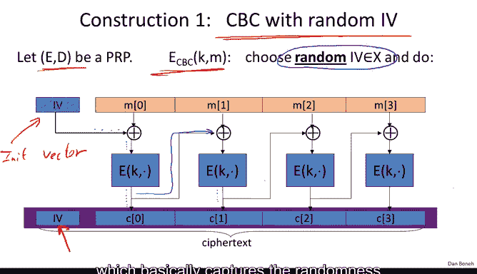
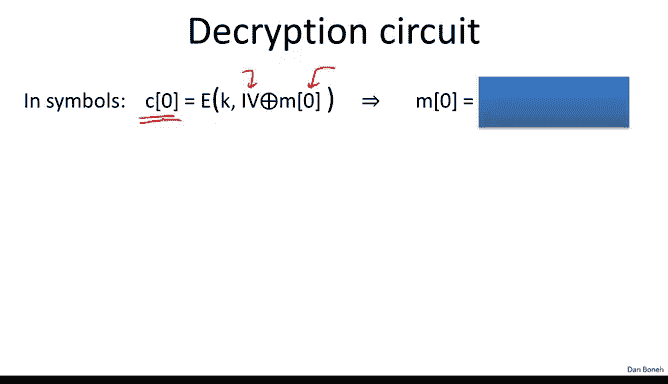
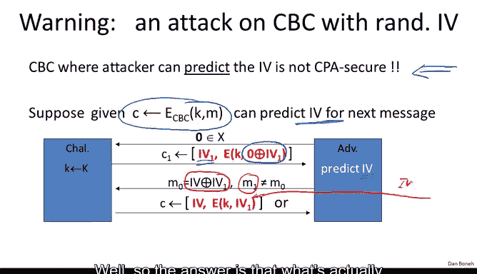
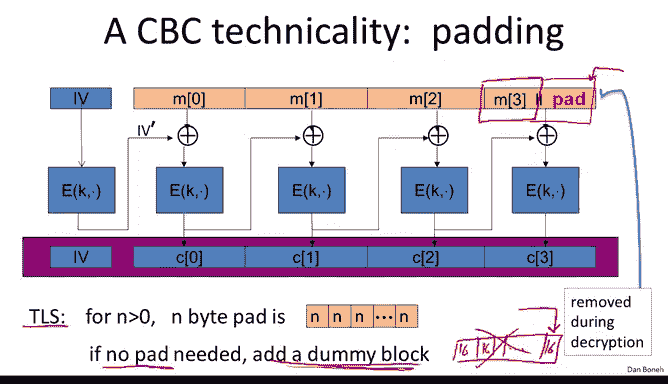

# 斯坦福大学《密码学｜Cryptography 1》中英字幕 - P22：22_02_02_操作模式：多密钥CBC.zh_en - GPT中英字幕课程资源 - BV1Rf421o79E

Now that we understand chosen plante security， let's build encryption schemes that are chosen plan tech secure and the first such encryption scheme is going to be called cipher block chaining。

 so here is how cipher block chain works。 Cypher block chaining is a way of using a block cipher to get chosen plant security In particular。

 we're going to look at a mode called cipher blocklock chaining with a random IV CBC stands for Cypher blocklock chaining。

So suppose we have a block cipher， so ED is a block cipher and let's define EBC to be the following encryption scheme。

 So the encryption algorithm when it's asked to encrypt a message M the first thing it's going to do is it's going to choose a random IV that's exactly one block of the block cipher So IV is one cipher block So in the case of A the IV would be 16 bytes and then we're going to run through the algorithm here。

 the IV basically that we chose is going to be exor into the first plainex block and then the result is going to be encrypted using the block cipher and output the first block of the ciphert and now comes the chaining part where we actually use the first block of the cipher textex to kind of mask the second block of the plain text So we exhort the two together and the encryption of that becomes the second ciphert block and so on and so on and so forth。

 So this is cipher block chaining you can see that each cipher block is chained an Xor into the next planex block and the final ciphertex is going to be essentially the IV。

The initial IV that we chose along with all the Cyphertex blocks。

 I should say that IV stands for initialization vector。

And we're going to be seeing that term used quite a bit every time we need to pick something at random at the beginning of the encryption scheme。

 typically we'll call that an IV for initialization vector so you notice that the cphertex is a little bit longer than the plain text because we had to include this IV in the Cyphertex which basically captures the randomness that was used during encryption。

So the first question is how do we decrypt the result of CBC encryption and so let me remind you again that if when we encrypt the first message block。

 we exOate with the IV encrypt the result and that becomes the first Cyphertex block so let me ask you how would you decrypt that so given the first Cyphertex block。

 how would you recover the original first plainex block？

So decryption is actually very similar to encryptption here where I wrote down the decryption circuit and you can see basically it's almost the same thing except the XO is on the bottom instead of on the top and again you realize that essentially we chopped off the IV as part of the decryption process and we only output the original message back The IV is dropped by the decryption algorithm。

Okay， so the following theorem is going to show that in fact CBC mode encryption with a random IV is in fact semantically secure under a chosen plan text attack。

 and so let's state out more precisely， basically if we start with a PRP。

 in other words a pure block cipher E， that's defined over a space X。

 then we're going to end up with a encryption algorithm EBC that takes messages of length L and output ciphertext of length L plus 1。

And then suppose we have an adversary that makes Q chosen plain text queries。

Then we can state the following security fact that for every such adversary that's attacking ECBC。

 there exist adversary that's attacking the PRRP， the block cipher with the following relation between the two algorithms in other words。

 the advantage of algorithm A against the encryption scheme is less in the advantage of algorithm B against the original PRp plus some noise term so let me interpret this theorem for you as usual。

 so what this means is that essentially since E is a secure PRP。

 this quantity here is negligible and our goal is to say that adversaries A's advantage is also negligible however here we're prevented from saying that because we got this extra error term this is often called an error term and to argue that CBC is secure we have to make sure the error term is also negligible because if both of these terms on the right or negligible there some is negligible and therefore the advantage of a against ECBC would also be negligible。

So this says that in fact， for ECBC to be secure， it had better be the case that Q squared L squared is much。

 much， much smaller than the value x。 so let me remind you what Q and L are。

 so L is simply the length of the messages that we're encrypting so L could be like say 1000 which would mean that we're encrypting messages that are at most 1000 AS blocks。

Q is the number of Cypherts that the adversary gets to see under the CPA attack。 but in real life。

 what Q is is basically the number of times that we've used the keyK to encrypt messages。

 In other words， if we use a particular AS key to encrypt 100 messages， Q would be 100。

 It says because the adversary would then see at most 100 messages encrypted under this keyK。Okay。

 so let's see what this means in the real world。 So here I rewrote the error bounds from the theorem and just remind you you useuse the number of messages encrypted with K and L at the length of the messages。

And so suppose we want the advers series's advantage to be less than1 over 2 to the 32。

 This means that the error term had better be less than1 over2 to the 32。

 Okay so let's look at AES and see what this means for AS AS of course uses 128 bit blocks so x is going to be2 to the 128 the size of x is 2 to the 128 and if you plug this into the expression。

 you see that basically the product Q times L had better be less than 2 to the 48 This means that after we use a particular key to encrypt 2 to the 48 AS block we have to change the key essentially CBC stops being secure after the key is used to encrypt2 to the 48 different AES blocks So it's kind of nice that the security theorem tells you exactly how long the key can be used and then how frequently essentially you have to replace the key。

Now， interestingly， if you apply the same analysis to DES DES actually has a much shorter block。

 namely only 64 bits， you see the key has to be changed much more frequently and namely after all every 65。

000 DS blocks essentially you need to generate a new key so this is one of the reasons why AES has a larger block size so that in fact modes like CBC would be more secure and one can use the key for a longer period of time before having to replace it What this means is after you encrypt  two to the 16 blocks。

 each block of course is8 bytes so after you encrypt about half a megabyte of data you would have to change the DES key which is actually quite low。

And you notice with AAS， you can encrypt quite a bit more data before you have to change the key。

 So I want to warn you about a very common mistake that people have made when using CBC with a random IV。

 And that is that the minute that the attacker can predict the IV that you're going to be using for encrypting a particular message。

 the cipher， this ECBC is no longer CBA secure。 So when using CBC with a random IV。

 like we just shown， it's crucial that the IV is not predictable。 but let's see an attack。

So suppose it so happens that given the encryption of a particular message。

 the attacker can actually predict the IV that will be used for the next message。 Well。

 let's show that in fact， the resulting system is not CP secure So the first thing the adversary is going to do is he' is going to ask for the encryption of a one block message and in particular that one block is going to be0 So what the adversary gets back is the encryption of one block which namely is the encryption of the message namely0 x or the IV。

Okay， and of course， the adversary also gets the IV。 Okay。

 so now the adversary by assumption can predict the IV that's going to be used for the next encryption。

 Okay， so let's say that IV is called well， IV。 So next the adversary is going to issue his semantic security challenge and the message M0。

 is going to be the predicted IV X or IV1， which was used in the encryption of C1。

And then the message M1 is just going to be some other message， it doesn't really matter what it is。

So now let's see what happens when the adversary receives the resulting semantic security challenge。

 well he's going to get the encryption of M0 or the encryption of M1 so when the adversary receives the encryption of M0。

 tell me what is the actual plain textex that's encrypted in the Cyphert C。Well。

 so the answer is that what's actually encrypted is the message which is IV X or IV1 X or the IV that's used to encrypt that message which happens to be IV and this of course is IV1 So when the adversary receives the encryption of M0 he's actually receiving the block Ipher encryption of IV1 and lo and behold。

 you notice that he already has that value from his chosen plain text query。

And then when he's receiving the encryption of the message M1。

 he just receives a normal CBC encryption of the message M1。

So you realize that now he has a simple way of breaking the scheme namely what he'll do is he'll say he's going to ask is the second block of the Cypherexc equal to the value that I received in my CPA query if so I'll say that I received the encryption of m0 otherwise I'll say that I received the encryption of M1 So really his test is C1 he refers to the second block of C and c11 refers to the second block of c1 if the two are equal he says0 and otherwise he says1 so the advantage of this adversary is going to be1 and as a result he completely breaks CPA security of the CPC encryption So the lesson here is if the IV is predictable then in fact there is no CPA security and unfortunately this is actually a very common mistaken practice in particular even in SSL protocol and TlS11 it turns out that the IV for record number I is in fact the last Cyphertex block of record number I minus-1。

That means that exactly given the encryption of record number I minus-1。

 the adversary knows exactly what IV is going to be used for record number I very recently。

 just last summer this was actually converted into a pretty devastating attack on SSL We'll describe that attack when we talk about SSL in more detail。

 but for now I wanted to make sure you understand that when you use CBC encryption。

 it's absolutely crucial that the IV be random。Okay。

 so now I'm going to show you the non based version of CBC encryption so in this mode the IV is replaced by a non random but unique Nouns。

 for example， the numbers1，2，3，4，5 could all be used as a nonce。

And now the appeal of this mode is that if the recipient actually knows what the nouns is supposed to be。

 then there's no reason to include the nouns in the ciphertext。

In which case the ciphertt is exactly the same length as the plain text， unlike CBC with a random IV。

 where we have to expand the ciphertext to include the IV。

 here if the noun is already known to the recipients。

 there's no reason to include it in the ciphertext and the ciphertext is exactly the same length as the plain text。

So it's perfectly fine to use a non-random but unique nonce。

 however it's absolutely crucial to know that if you do this there's one more step that you have to do before you use the Nos in the CBC chain in particular in this mode now we're going to be using two independent keys K and K1 the keyK is as before going to be used to encrypt the individual message blocks。

 However， this key K1 is going to be used to encrypt the nonrandom but unique nonce so that the output is going to be a random IV which is then used in the CBC chain。

So this extra step here of encrypting the Nos with the key K1 is absolutely crucial without it CBC mode encryption would not be secure in particular。

 if you just directly use the nons feed that into CBC encryption。

 in other words you use the Nos as the IV then we already know that a non-random Nos would not be CPA secure。

 we saw that on the previous slide， but in fact even if you said K to be equal to K1 in other words you just encrypt the Nouns using the keyK that also well is not going to be CPA secure and can lead to significant attacks。

So I want to make sure you understand that if the nons in CBC mode encryption is not random。

 this extra encryption step has to take place and you so I'll make this extra step kind of dance here just to make sure you never forget to put it in。

And I'll tell you that this is an extremely common mistake in practice。

 there are many real-w products and crypto libraries that actually forget to encrypt the non-ran Nos before using it in the CBC chain。

 and that actually leads to practical and significant attack， for example。

 this was not done in TLS TLS as we said， use predictable IVs and that led to a significant attack on TLS。

Moreover， the reason this is so important to know is that in fact。

 many crypto APIpis are set up to almost deliberately mislead the user into using CBC incorrectly。

 So let's look at how CBC is implemented inside of open SSL So here the arguments to the function。

 basically this is the plain text， this is the where the ciphertex will get written to this is the length of the plain text。

 this is the AA key， finally there's an argument here that says whether you're encrypting or decrypting and the most important parameter that I wanted to point out here is the actual IV and unfortunately the user is asked to supply this IV and the function uses the IV directly in the CBC encryption mechanism。

 It doesn't encrypt the IV before using it and as a result if you ever call this function using a non-ran IV the resulting encryption system won't be CP secure so it's very important to know that when calling functions like this CBC encryption and open SSL。

 either supply a truly random IV or if you want the IV to be a counter， then you have to encrypt。

Counsor using AAS before you actually call a CBC encryption and you have to do that yourself。

So again， it's very important that the programmer knows that needs to be done。

 otherwise the CB encryption is insecure。 One last technicality about CBC is what to do when the message is not a multiple of the block cipher block length。

 That is what do we do if the last message block is shorter than the block length of AES。

 for example， So the last message block is less than 16 bys。

And the answer is that we add a pad to the last block so that it becomes as long as 16 bytes as long as the AES block size。

 and this pad of course is going to be removed during an encryption。

So here's a typical pad this is the pad that's used in TlS。 Basically if you pad with n bytes。

 then essentially what you do is you write the number n n times。 so for example。

 if you pad with five bytes， you pad with the string55，5。

55 so five bytes where each bytes is the value 5 and the key thing about this pad is basically when the decryptor receives the message what he does is he looks at the last byte of the last block so suppose that value is5。

 then he simply removes the last five bytes of the message。

Now the question is what do we do if in fact a message is a multiple of 16 bytes。

 so in fact no pad is needed if we don't pad at all。

 then that's a problem because the decryptor is going to look at the very last byte of the last block which is now part of the actual message and he's going to remove that many bytes from the plain text so that actually would be a problem。

So the solution is， if in fact there is no pad that's needed。

 nevertheless we still have to add a dummy block， and since we add this dummy block。

 this would be a block that basically contains 16 bytes， each one containing the number 16。Okay。

 so we add essentially 16 dummy blocks， the decryptor that when he's decrypting。

 he looks at the last byte of the last block， he sees that the value is 16。

 therefore he removes the entire block， and whatever is left is the actual plain text。

So it's a bit unfortunate that， in fact， if you're encrypting short messages with CBC and the messages sayy happen to be say 32 bys。

 so they are a multiple of 16 bytes， then you have to add one more block and make all the Cyphertex B 48 bytes just to accommodate the CBC padding。

 I should mention that there's a variant of CBC called CBC with Cyphertex stealing that actually avoids this problem but I'm not going describe that here if you're interested。

 you can look that up online so that's the end of our discussion of CBC And then the next segment we'll see how to use counter mode to encrypt multiple messages using a single key。

