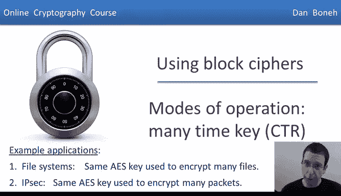
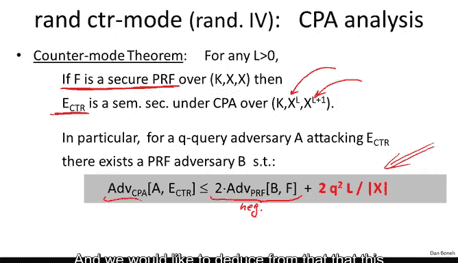
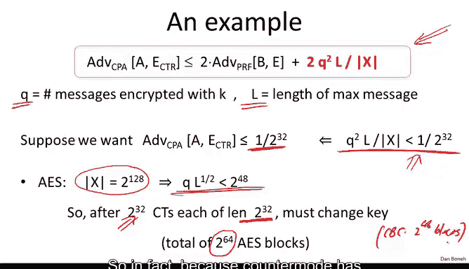
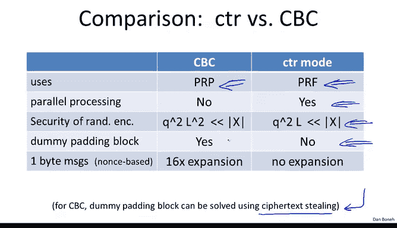

# 斯坦福大学《密码学｜Cryptography 1》中英字幕 - P23：23_02_03_操作模式：多密钥CTR.zh_en - GPT中英字幕课程资源 - BV1Rf421o79E

In this segment we're going to look at another method to achieve chosen plainx security that's actually superior to CBC and this method is called randomized counter mode unlike CBC。

 randomized counter modeode uses a secure PRF， it doesn't need a block cipher it's enough for counter mode to just use a PRF because we're never going to be inverting this function F。

So we're going to let F be the secure PRF and it acts on n bit blocks。

 again if we use AAS N with B 128， and the way the encryption algorithm works in counter mode is it starts off by choosing a random IV。

 that's 128 bit random IV in the case of AES。And then essentially we start counting from this random IV so you notice the first encryption is of IV then of IV plus1 up to IV plus L so we generate this random pad we exhor the result with the message and that gives us the ciphertex and as usual you notice that the IV here is included along with the ciphertex so that in fact the ciphertex is a little longer than the original plain text and the point of course is that the encryption algorithm chooses a new IV for every message and so even if I encrypt the same message twice I'm going to get different resulting ciphertexs。

One thing to note that this mode is completely parallelzable。

 unlike CBC CBC was sequential in other words， you couldn't encrypt block number5 until you've encrypted blocks number one to4 so hardware companies who might have multiple AAS engines working in parallel cannot actually use those AAS engines when using CBC because CBC is inherently sequential。

 so even though you might have two or three or four AAS engines you can only use one of them when doing CBC encryption with counter mode everything is completely parallelzable if you have three AAS engines encryption basically will work three times as fast。

So that's the beauty of counter mode and counter modede also has a corresponding nonspace counter mode where the IV is not truly random。

 but rather it's just a nonce which could be a counter and the way you would implement nonspace counter mode is you would take the 128 bits block that's used in AES and then you would split it in two。

 you would use the left 64 bits as the nonnce， so the counter say it would count from zero to 2 to the 64。

And then that will be the nonnce part of it， and then once you specified the nonce。

 the lower order 64 bits would be doing the counting inside of the counterro encryption。

Okay so noance goes on the left and the counterward encryption counter goes on the right and it's perfectly fine if this nonce is unpredictable。

 the only restriction is that you encrypted most two to the 64 blocks using one particular nounnce。

 the danger is that you don't want this counter to reset to zero so that then you will have two blocks。

 say this guy and this guy that are encrypted using the same one time pad namely this one and this one。

So let's quickly state the security theorem for randomized counter mode by now you should be used to these kind of theorems。

 basically we are given a secure PRf。What we end up with is an encryption scheme we'll call it e subctr e sub counter modede。

 which is semantically secure under a chosen plan test attack。

 it encrypts messages that are L blocks long and produce a ciphertex that are L plus1 blocks long because the IV has to be included in the Cyphertext this is for randomized counter mode and then the error bounds are stated over here。

 it's basically the same bounds as in the case of CBC encryption as usual we argue that this term is negligible because the PRfF is secure and we would like to deduce from that that this term is negligible so that ETR is secure unfortunately we have this error term here and so we have to make sure this error term is negligible and for that we have to make sure the Q squared L is less than a size of a block we remember Q is the number of messages encrypted under a particular key and L is the maximum length of those messages Now interestingly in the case of CBC we had Q squared L squared has to be less than x which is。

Worse than we have for counter modes in other words。

 counter mode can actually be used for more blocks than CBC could and let's see a quick example of that。

 So here's again the error term for counter mode， remember Q is again the number of messages encrypted with the key and L is the length of those messages。

And as before， just as in the case of CBC， suppose we want the adversary's advantage to be at most1 or 2 to the 32 that basically requires that this Q squared L over x be less than1 over 2 to the 32。

 And so for A yes， what happens is if you plug in the values X is 2 to the 128128 bit blocks So Q times squared of L should be less than 2 to the 48。

 This is basically the bound you get from plugging in 2 to the 128 into this bound here。

 and as a result you can see if you're encrypting messages that are each2 to the 32 blocks。

 then after 2 to the 32 sets messages， you have to replace your secret key otherwise randomized counter mode is no longer CP secure。

 So this means we could encrypt a total of 2 to the 64 As blocks using a single secret key。

 remember for CBC corresponding value was 2 to the 48 blocks。 So in fact。

 because counter mode has a better security parameterization In fact。

 we can use the same key to encrypt more blocks with counter mode than we could with CBC。

So I wanted to do a quick comparison of counter modede in CBC and argue that in every single aspect counter mode is superior to CBC。

 and that's actually why most modern encryption schemes actually are starting to migrate to counter modede and abandon CBC。

 even though CBC is still quite widely used。 So let's look at the comparison first of all。

 recall that CBC actually had to use a block cipher， because if you look at the decryption circuit。

 The decryption circuit actually ran the block cipher in reverse。

 It was actually using the decryption capabilities of the block cipher。 whereas counter mode。

 we only need a PRf。 We never ever use the decryption capabilities of the block cipher。

 We only use it in the forward direction only encrypt with it because of this counter modede is actually more general and you can use primitives like salsa。

 for example， salsa 20， if you remember as a PRf but is not a PRP So counterm can use salsa but CBC cannot And in that sense。

 counter mode is more general than CBC。Co mode as we said。

 is actually parallel whereas CBC is a very sequential process。

 we said that counter mode is more secure， the security bounds。

 the error terms are better for counter modes than there are for CBC and as a result you can use a key to encrypt more blocks in counter mode than you could with CBC。

😊，The other issue is， remember in CBC， we talked about the dummy padding block。

 If you have a message that's a multiple of the block length in CBC。

 we said that we had to add a dummy block， whereas in counter mode this was't necessary。

 although I did want to mention that there is a variation of CBC called CBC where ciphertext dealinging that actually avoids a dummy block issue。

 So for standardized CBC we actually need a dummy block but in fact there is a modification to CBC that doesn't need a dummy block just like counter mode。

 Finally， suppose you're encrypting just a stream of1 B messages and using nons-based encryption with an implicit nouns。

 So the nos is not included in a ciphertext。 In this case。

 every single one by message would have to be expanded into a 16 by block and then encrypted in the result would be a 16 by block。

 So if you have like a stream of 1001 B messages。

Each one separately would have to become a 16 byte block。

 and you'll end up with a stream of 116 byte cphertexts。

 So you get a 16 x expansion on the length of the ciphertext compared to the length of the plain text。

In counter mode of course this is not a problem， you would just encrypt each one byte message by exoring it with the first byte of the screen that's generated in counter mode。

 so every Cyphertext would just be one byte just like the corresponding plain text and so no expansion at all using counter mode so you see that essentially in every single aspect counter mode dominates CBC and that's why it's actually the recommended mode to be using today。

Okay， so this concludes our discussion of chosen Plaex security。

 I want to just quickly summarize and remind you that we're going to be using these PRP and PRF abstractions of block cpher's route。

 this is actually the correct way of thinking of block cphers and so well always think of them as either pseudorandom permutations or pseudorandom functions。

And then I wanted to remind you again that so far we saw two notions of security。

 both only provide security against eavesdropping， they don't provide security against tampering with a ciphertext。

 one was used when the key is only used to encrypt a single message。

 the other one was used when the key was used to encrypt multiple messages。And as we said。

 because neither one is designed to defend against tampering。

 neither one provides data integrity and we're going to see that this is a real problem and as a result in fact。

 I'm going to say in the next segment that these modes actually should never ever be used。

 you should only be using these modes in addition to an integrity mechanism which is our next topic so so far we've seen basically if for using the key ones you can use stream ciphers or you can use the deterministic counter mode if you're going to use the key many times you could use randomized CBC or randomized counter mode and we're going to talk about how to provide integrity and confidentiality once we cover the topic of integrity which is our next module。

