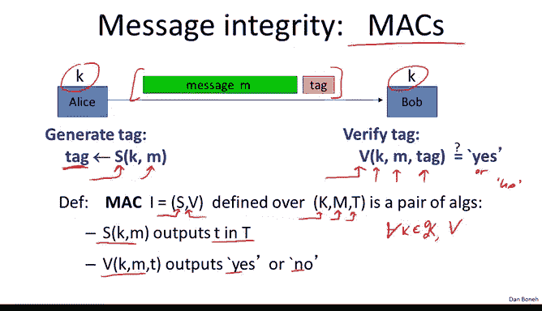
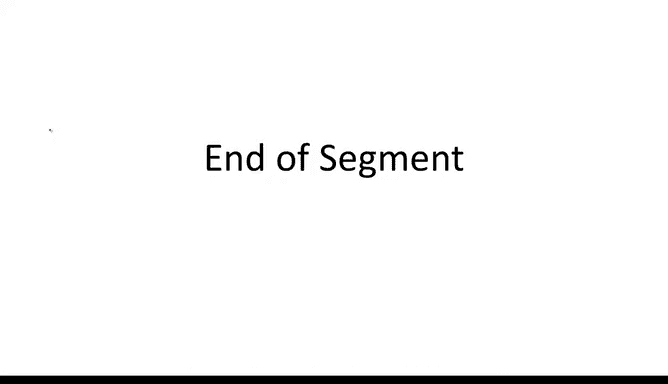

# 斯坦福大学《密码学｜Cryptography 1》中英字幕 - P24：24_03_01_消息认证码.zh_en - GPT中英字幕课程资源 - BV1Rf421o79E

In this module， we're going to stop talking about encryption。 and instead discuss message integrity。

 Next， we will come back to encryption and show how to provide both encryption and integrity。

 So as I said， our goal here is to provide integrity without any confidentiality。 And there are。

 in fact， many cases in the real world where this comes up。 For example。

 you can think of operating system files on your disk。 say if you're using Windows。

 All the windows operating system files on disk are not confidential。

 They're public and known to the world， but it is quite important to make sure that they're not modified by a virus or some malware。

 That's an example where you want to provide integrity， but you don't care about confidentiality。

Another example is banner ads on web pages， the provider of the ads doesn't care at all if someone copies them and shows them to other people。

 so there's no confidentiality issue at all， but they do care about modifying those ads。

 so for example they do want to prevent people from changing the ads into different types of ads。

So that's another example where integrity matters， but confidentiality is not important at all。

 So how do we provide message integrity， The basic mechanism is what's called a Mac。

 a message authentication code Mac。And the way we do it is as follows。

 so here we have our friends Alice and Bob， they have a shared key K which is not known to the attacker but known to both of them。

 and there's a public message M that Alice wants to send to Bob such that an attacker along the way cannot modify this message on its way to Bob。

The way Alice does it is by using what's called a Mac signing algorithm well denoted by S。

 where the Mac signing algorithm takes his input the key and the message and produces a very short tag。

 the tag could be like 90 Bs or 100 bits or so on。 even though the message is gigabytes long the tag is actually very。

 very short。 and then she appends the tag， the message and sends the combination of the two to Bob。

 Bob receives the message in the tag， and then he runs what's called the Mac verification algorithm on this tag。

 so the Mac verification algorithm takes his input the key。

 the message in the tag and it says basically yes or no。

 depending on whether the message is valid or whether it's been tampered with。Okay。

 so more precisely what is a Mac well we said the Mac basically consists of two algorithms。

 a signing algorithm and a verification algorithm， as usual they're defined over a key space。

 a message space and a tag space， and as we said it's a pair of algorithms so the signing algorithm will output a tag in the tag space and the verification algorithm basically given the key the message and the tag will output yes or no。

And I want to remind you as usual， there are these consistency requirements such that for every k in the key space and for every message in the message space。

 it so happens that if I sign the message using a particular key and then I verify the tag using the same key I should get yes in response。

 So this is the standard consistency requirement which is the analog of the one that we saw for encryption。

 Now one thing I'd like to point out is that integrity really does require a shared key between Alice and Bob。

 And in fact， there's a common mistake that people make where they try to provide integrity without actually a shared key。

 So here's an example。 So consider CRC CRC stands for cyclic redundancy check This is a classic checkam algorithm that's designed to detect random errors and messages。

 So imagine instead of using a key to generate the tag。

 Alice basically uses a CRC algorithm which is keys doesn't take any key to generate a tag and then she appends this tag to the message she sends it over to Bob。

Bob will basically verify that the CRC is still correct。 In other words。

 Bob will still verify the tag is equal to CRCM。 And if so， the verification algorithm will say yes。

 and otherwise， the verification algorithm will say no。

 So the problem with this is this is very easy for an attacker to defeat。 In other words。

 an attacker can very easily modify the message and route and fool Bob into thinking that the new message is a valid one。

 The way the attacker will do it is he'll cancel the message in the tag he'll simply block them。

 and then he'll produce his own message and prime and compute his own CRC on this message and prime and then send the concatenation of the two over to Bob。

 Bob will run the verification algorithm verification will work properly because in fact。

 the righthand side is， in fact， a valid CRC for the lefthand side。 and as a result。

 Bob would think that this message came from Alice but in fact。

 has been completely modified by the attacker and has nothing to do with the original message that Alice sent。

 so the problem is because CRC doesn't have。There's no difference between Alice and the attacker。

 and as a result， Bob doesn't know where the message came from。 Once we introduce a key。

 now Alice can do something that the attacker can't do and as a result you might be able to compute a tag that the attacker can't modify。

So the point you remember is that CRC as we said， is designed to detect random errors。

 not malicious errors， and here our goal is to make sure that even a malicious attacker cannot modify messages and routes。

 So next we want to define what it means for a Mac system to be secure。

So as usual， we define security in terms of the attacker's power。

 what can the attacker do and the attacker's goal， what is he trying to do So in the case of Max。

 the attacker's power is what's called a chosen message attack。 In other words。

 the attacker can give Alice arbitrary messages of his choice M1 to MQ。

 and Alice will compute a tag for him on those messages and give him those tags。So again。

 you might wonder why would Alice ever do that， Why would Alice ever compute the tag on a message that the attacker gave her So just like in the case of chosenen plaintiff attack。

 it's very common in the real world that the attacker can give Alice a message。

 Alice will compute the tag on that message and then the attacker will obtain the resulting tag。

 For example， the attacker might send Alice an email。

 Alice might want to save the email to disk in a way that will prevent someone from tampering with a disc so she'll compute a tag on the message and save the message and a tag to disk。

Later on， the attacker might steal Alice's disc， and now he's recovered Alice's tag on the message that he sent to Alice。

 So this is an example of a chosen message attack in the real world where the attacker actually obtains a tag on the message that he gave Alice。

Okay so that's what the attacker can do basically this chosen message attack and what is his goal well his goal is to do something called an existential forgery。

 in other words， what he's trying to do is to produce some new valid message tag pair so some message tag pair that's different from one of the pairs that were given to him during the chosen message attack。

And if you can do that， then we say that the system is insecure and if you can't。

 then we'll say the system is secure。So I want to emphasize that existential forgery means that the attacker cannot produce a new message tag pair even for a message that's completely gibberish and again you might wonder well why do we care if the attacker computes a tag on a message is gibberish just not of any values of the attacker but we want to build Macs that are secure under any usage settings and there are in fact cases where for example you might want to compute an integrity tag on a random secret key in which case。

 even if the attacker is able to compute a tag on a completely random message。

 he might be able to fool a user into using the wrong secret key and as a result we want to make sure that if the Mac is secure the attacker can't produce a valid tag for any message whether it's gibberish or aensical another property that's implied by the security definition is if the attacker is given some message tag pair。

 he shouldn't be able to produce a new tag for the same message in other words。

 even though there might be another tag。Prime for the same message M。

 the attacker given M and T shouldn't be able to find this new T prime and again， you might wonder。

 well why do we care if the attacker already has a tag on the message M。

 why does it matter if you can produce another tag for the message M He already has one tag。

But as we'll see there are actually applications where it's really important that the attacker not be able to produce a new tag for a previously signed message in particular this will come up when we combine encryption and integrity。

So that we're going to demand that given one tag in the message。

 it's impossible to find another tag for the same message Okay so now that we understand the intuition of what we're trying to achieve。

 let's define it as usual using a more precise game。

 So here we have two algorithms S and V and we have an adversary A and the game proceeds as follows the challenger as usual just chooses a random key for the Mac and then the adversary basically does his chosen message tag so he submits an M1 to the challenger and receives a tag on that message M1 then he submits an M2 to the challenger and receives a tag on that M2 and so on and so forth until he submits Q messages to the adversary and receives Q tags on all those messages。

So that's the chosen message attack part， and then the adversary goes ahead and tries to do an existential forgery。

 namely he outputs a message tag pair， a new message tag pair。

 and we say that he wins the game In other words， B' is equal to one means that he wins the game if first of all。

 the message tag pair that he outputs is a valid message tag pair。

 so the verification algorithm says yes， and second of all。

 it's a fresh message tag pair In other words， it's not one of the message tag pairs that we gave him before In other words。

 we say that the attacker lost the game namely be' is equal to0。

And as usual we say we define the advantage of an adversary as the probability that the challenger outputs one in this game。

 and we say that a Mac system is secure if for all efficient adversaries the advantage is negligible okay in other words。

 no efficient adversary can win this game with non negligible probability。All right。

 that's our definition of secure Mac and our goal is to build a secure max like this Before we do that。

 I want to ask you two questions。

So the first question is， suppose we have a Mac。And it so happens that the attacker can find two messages M0 and M1。

That happened to have the same tag for about half of the keys。 In other words。

 if you choose a key at random with probability 1 half。

 the tag on the message M0 will be the same on the tag on the message M1。

 And my question to you is can this be a secure Mac。

 So I want to emphasize the attacker doesn't know what the tag on M0 and M1 is All he knows is that the two messages happen to have the same tag with probability1 half。

So the question is whether this is a secure Mac。So the answer is no， this is not a secure Mac。

 And the reason is because of the chosen message attack， essentially。

 the attacker can ask for the tag on the message M0。

 and then he'll receive M0 comma T from the challenger and in fact t would be a valid tag for the message M0。

 and then what he would output as his existential forgery as M1 comma T and you notice M1 comma T is different from M0 comma T So this is a valid existential forger。

 and as a result， the attacker wins the game with advantage1 half。

 So we conclude that this Mac is not secure。 The second question I'd like to ask you is suppose we have a Mac that happens to always output a5 bit tag。

 In other words， the tag space for this Mac happens to be 01 to the 5。

So for every key and for every message， the signing algorithm will just output a five bit tag。

 and the question is can this Mac be secure？Of course the answer is no because the attacker can simply guess the tag so what he would do is he wouldn't ask any chosen message attacks。

 all he would do is he would output an existential forgery as follows。

 he would just choose a random tag so choose a random tag T at random in01 to the5 and then he would just output his existential forgery the message 0 and the tag T and now with probability 1 over 2 to a5。

 this tag will be a valid tag for the message 0 and so the adversary advantage is 1 over 32 which is nonnegligible。

So this basically says that tags can't be too short。

 they have to have some length to them and in fact。

 the typical tag length would be say 64 bits or 96 bits or 128 bit。

 Tls for example uses tags that are 96 bits long if you try to guess the tag for a message when the tag is 96 bits。

 The probability of guessing it correctly is one over 296 so the advers advantage would just be1 over 296 which is negligible So now that we understand what Macs are I want to show you a simple application in particular。

 let's see how Macs can be used to protect system files on disk。

So imagine that when you install an operating system， say when you install Windows on your machine。

 one of the things that Windows does is it asks the user for a password and then derives a key K from this password and then for every file that erars the disk in this case the files would be F1。

 F2 up to FN what the operating system would do is it would compute a tag for that file and then store the tag along with the file so here it concatenates the tag to each one of the files and then it erases the keyK so it no longer stores the keyK on disk or in memory or anywhere。

Okay so now later imagine that the machine gets infected with a virus and the virus tries to modify some of the system files。

 The question is whether the user can detect which files were modified。 so here's one way to do it。

 basically the user would reboot the machine into some clean OS say you reboot from a USB disk or something and then once the machine boots from this clean OS the user would supply his password to this clean running operating system and then this new clean running operating system would go ahead and check the Mac for each one of the system files。

Now the fact that the Mac is secure means that the poor virus couldn't actually create a new file let's call F prime with a valid tag so it couldn't actually create an f prime t prime because if it could then that would be an existential forgery on this Mac and because well the Mac is existentially unforible the virus couldn't create any F prime no matter what the F prime is and consequently because of the security of the Mac。

 the user will detect all the files they were modify by the virus Now there's one caveat to that。

 one thing that the virus can do is actually swap two files so for example he can swap this file F1 where the file F2 here just literally swap them so when the system or when the user tries to run file F1 instead they'll be running file F2 and of course that could cause all sorts of damage and so the way to defend against that is essentially by placing the file name inside of the Maced area so in fact we're computing an intake。

check on the file name as well as on the contents of the file。 and as a result。

 if the virus tries to swap two files， the system will say hey。

 the file is located in position F1 doesn't have the right name。

 and therefore it will detect that the virus did the swap even though the Mac actually verifies。

 So it is important to remember that Max can help you defend against file tampering or data tampering in general。

 but they won't help you defend against swapping of authenticated data and that has to be done by some other means。

 so that concludes our introduction to Max and in the next segment will go ahead and construct our first examples of secure Mac。

