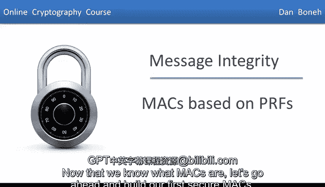
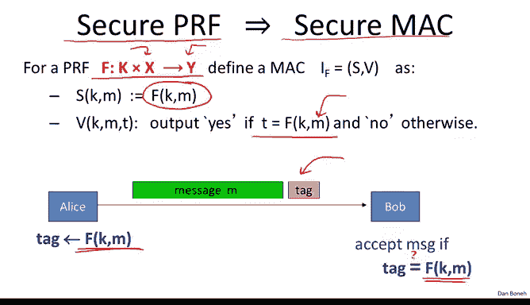
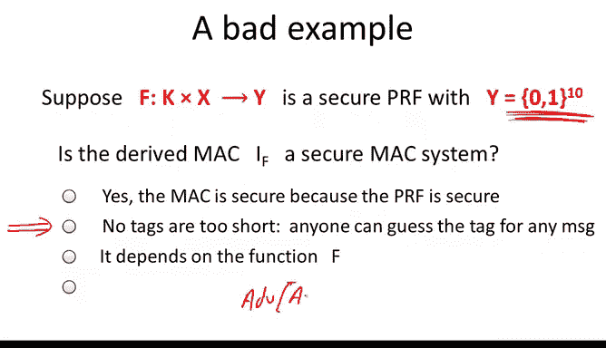
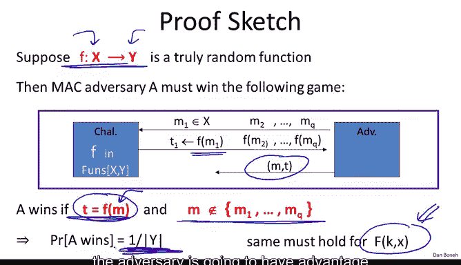
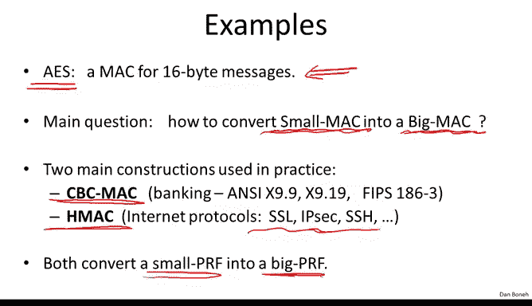
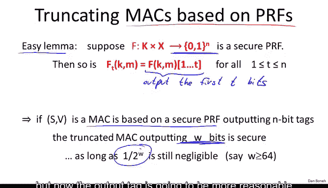

# 斯坦福大学《密码学｜Cryptography 1》中英字幕 - P25：25_03_02_基于PRF的MAC.zh_en - GPT中英字幕课程资源 - BV1Rf421o79E

Now that we know what Macs are， let's go ahead and build our first secure max。 First。

 I want to remind you that a Mac is a pair of algorithms。

 The first is a signing algorithm that's given a message and a key will generate a corresponding tag。

And the second is verification algorithms are given a key a message in tag while outputs 0 or 1。

 depending on whether the tag is valid or not。 And we said that a Mac is secure。

 if it is existentially unforgeable under a chosen message attack。 In other words。

 the attacker is allowed to mount a chosen message attack。

 where he can submit arbitrary message of his choice and obtain the corresponding tags for those messages。

 and then despite the ability to generate arbitrary tags。

 the attacker cannot create a new message tag pair that was not given to him during the chosen message attack。

Okay， so we've already seen this definition in the last segment and now the question is how do we build secure Q Max？

So the first example I want to give you is basically showing that any secure PRf directly gives us a secure Mac as well。

 So let's see how we do it。 So suppose we have a pseudorandom function。

 So the pseudorandom function takes inputs in X and outputs outputs in Y。

 and let's define the following Mac。 So the way we sign a message M is basically by simply evaluating the function at the point M。

 So the tag for the message M is simply the value of the function at the point M。

 And then the way we verify a message tag pair is by recomputing the value of the function at the message M and checking whether that's equal to the tag that was given to us。

 we say yes， if so and we say and we reject otherwise。

 So here you have it in pictures basically when Alice wants to send a message to Bob。

 she computes a tag by evaluating the PRf。 and then she appends this tag to the message Bob receives the corresponding message tag pair。

 he recomputes the value of the function and tests whether the given tag is actually equal to the value of the function at the point M。

So let's look at a bad example of this instruction。

 And so suppose that we have a pseudo random function that happens to output only 10 B。 Okay。

 so this is a fine pseudo random function。 It just so happens that for any message。

 I it only outputs 10 B value。 My question to you is， if we use this function F to construct a Mac。

 I that gonna be a secure Mac。So the answer is no， this Mac is insecure in particular because the tags are too short。

 so consider the following simple adversary， what the adversary will do is simply choose an arbitrary message M and just guess the value of the Mac for that particular message。

Now， because the tag is only 10 bits long， the adversary has a chance of one in 2 to the 10 in guessing the Mac correctly。

 In other words， the advantage of this guessing adversary。

 one that simply guesses a random tag for a given message that adversary is going to have advantage against the Mac that's basically one over2 to the 10。

 which is one over1024 and that's definitely non-negligible。

 So the adversary basically will successfully forge the Mac on a given message with probability 1 in 1000 which is insecure。

 However， it turns out this is the only example that where things can go wrong。

 only when the output of the function is small， can things go wrong。

 if the output of the PRrf is large， then we get a secure Mac out of this function。

 let's state the security theorem here。 So suppose we have a function F that takes message in x and outputs tags in Y then the Mac that's derived from this PRf in fact is a secure Mac。

 And in particular， if you look at the security theorem here you'll see very clearly the error bounds。

 So in other words， since the PRf is secure。

We know that this quantity here is negligible and so if we want this quantity to be negligible。

 this is what we want。 we want to say that no adversary can defeat the Mac I ofF that implies if we want this quantity to be negligible。

 In other words， when we want the output space to be large。 And so for example。

 taking a PRf that outputs 80 bits is perfectly fine that we'll generate an 80 bit Mac and therefore the advantage of any adversary will be most1 over2 to the 80。

 So now the proof of this theorem is really simple。 So let's just go ahead and do it。 So in fact。

 let's start by saying that suppose instead of a PRf we have a truly random function from the message space to the tag space。

 So this is just a random function from x to y that's chosen at random from the set of all such functions。

Now let's see if that function can give us a secure Mac。

 So what the adversary says is I want to tag on the message M1。

 What he gets back is the tag which just happens to be the function evaluated at the point M1。

 notice there's no key here because F is just a truly random function from X to Y。

 and then the adversary gets to choose a message M2 and he obtains the tag on M2 He choose M3 and4 up to Mq and he obtains all the corresponding tag。

 Now his goal is to produce a message tag pair。 and we say that he wins。

 remember if this is an existential forgery。 In other words， first of all。

 T has to be equal to f of M。 This means that t is a valid tag for the message M。 And second of all。

 the message M has to be new。 So the message M had better not be one of M1 to Mq But let's just think about this for a minute。

 what does this mean So the adversary got to see the value of a truly random function at the point M1 to Mq。

 And now he's supposed to predict a value of this function at some new point M。However。

 for a truly random function， the value of the function of the point m is independent of its value at the points M1 to Nq。

 so the best the adversary can do at predicting the value of the function of the point M is just guess the value because he has no information about f of M and as a result his advantage if he guesses the value of the function of the point M。

 he'll guess it right with probability exactly1 over y and then as tagged that he produce will be correct with probability exactly1 over y again。

 he had no information about the value of the function of M and so the best he can do is guess and if he guesses he'll get it right with probability1 over y。

AndNow， of course， because the function capital F is a pseudoran function。

 the adversary is going to behave the same。 whether we give him the truly random function or the pseudoran function。

 the adversary can't tell the difference。 And as a result， even if we use a pseudoran function。

 the adversary is gonna to have advantages most one over Y in winning the game。

 so you can see exactly the security theorem let's go back there for just a second。

 essentially this is basically that why we got an error term of one over y because of the guessing attack and that's the only way that the attacker can win the game。

 So now that we know that any secure PRf is also a secure Mac。

 we already know that we have our first example Mac in particular， we know that A yes。

 or at least we believe that AS is a secure PRrf。 Therefore， A yes。

 since it takes 16 by inputs the message space for A is 128 B， which is 16 by。

 Therefore the A stpher essentially gives us a Mac that can Mac messages that are exactly 16 bys。

 so that's our first example of。

But now the question is， if we have a PRf for small inputs like AS that only acts on 16 bytes can we build a Mac for big messages that can act on gigabytes of data Sometimes I call this the McDonald's problem basically given a small Mac can we build a big Mac out of it In other words given a Mac for small messages can we build a Mac for large messages So we're going to look at two constructions for doing so the first example is called a CBC Mac that again takes a PR for small messages as inputs and produces a PRf for very large messages as outputs the second one will see as Hmac。

 which does the same thing again takes a PR for small inputs and generates a PRf for very large inputs Now the two are used in very different context。

 CBC Mac is actually very commonly used in the banking industry for example there's a system called the automatic clearinghouse AC which banks use to clear checks with one another and in that system CBC Mac is used to ensure integrity of the checks as they're transferred for bank to bank on the internet protocols like SSL and I。

SSH， those all use HM for integrity okay so these are two different Macs and we're going to discuss them in the next couple of segments and as I said both of them start from a PRF for small messages and produce a PRF for messages that are gigabytes long and in particular they can both be instanttiated with AAS as the underlying cipher。

So the last comment I want to make about these PRf based Macs is that in fact their output can be truncated。

 so suppose we have a PRf that outputs n bit outputs so again for AS this would be a PRf that outputs 128 bits as outputs It's an easy lemma to show that in fact。

 if you have an nB PRF if you trunccate it in other words， if you only output first Tbits。

The result is also a secure PRf and just the intuition here is if the big PRf outputs n bits of randomness for any inputs that you give to the PRf。

 then certainly chopping it off and truncating it to T bits is still going to look random the attacker now gets less information So his job in distinguishing the outputs from random just became harder In other words。

 if the endbit PRf is secure， then the T less than n bit PRf。

 the truncate a PRf would also be secure。 So this is an easylemma。

 since any secure PRf also gives us a secure Mac， what this means is if you give me a Mac that based on a PRf。

 what I can do is I can trunccate it to W bits， however。

 because of the error term in the Macbased PRf theorem we know that truncating to W bits will only be secure as long as one over two to the W is negligible。

 So if you trunccate the PRf to only three bits， the resulting Mac is not going to be secure。

 However， if you trunccate it to say 80 bits or maybe even 64 bits。

 then a resulting Mac is still going。Be a secure Mac Okay so the thing to remember here is that even though we use AES to construct with larger PRs and the output of these PRfs is going to be 128 bits。

 it doesn't mean that the Mac itself has to produce 128 bit tags。

 we can always truncate the output to 90 bits or 80 bits and as a result we would get still secure Mac but now the output tag is going to be more reasonable size and doesn't have to be the full 128 bits Okay so in the next segment we're going to look at how the CBC Mac works。

