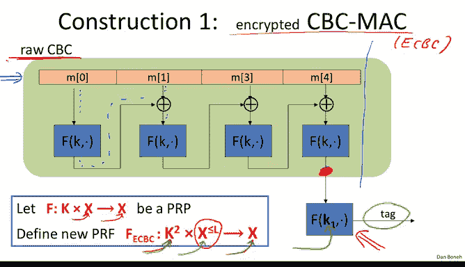
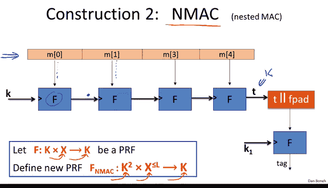
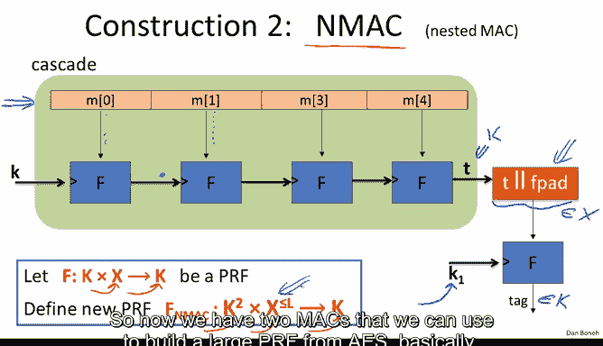
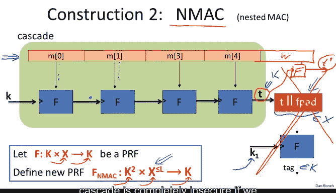
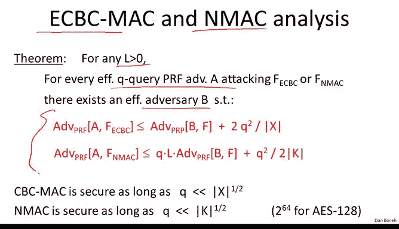
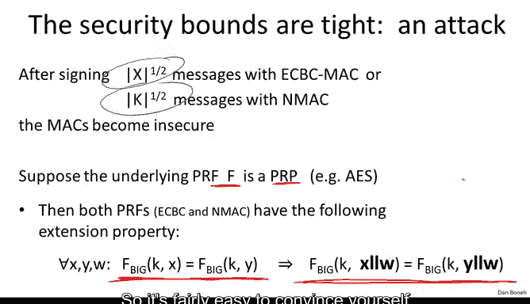
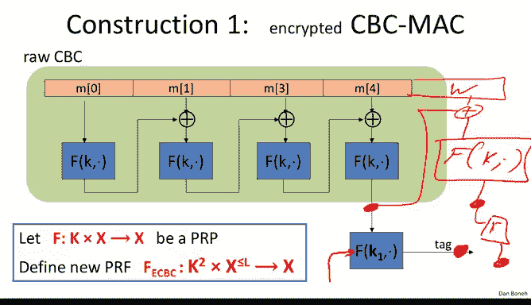
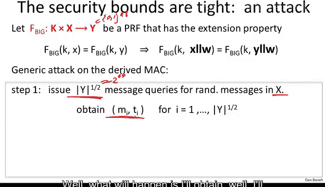
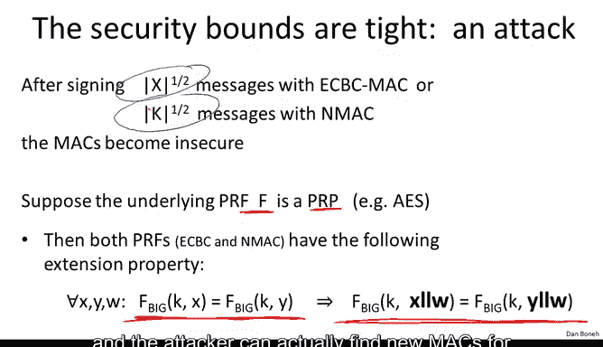

# 斯坦福大学《密码学｜Cryptography 1》中英字幕 - P26：26_03_01_CBC-MAC与NMAC.zh_en - GPT中英字幕课程资源 - BV1Rf421o79E

In this segment， we're going to construct two classic Macs。

 the CBC Mac and the N Mac recalled in the last segment， we said that if you give me a secure PRF。

Then that secure PRF can actually be used to construct a secure Mac simply by defining the signature on a message M as the value of the function at the point M。

 The only caveat was that the output of the PRF F had to be large。 For example。

 it could be 80 bit or 128 B， and that would generate a secure Mac。Now。

 we also said that because AES is a secure PRF， essentially。

 AES already gives us a secure Mac except that it can only process 16 by messages。

And the question now is， given a PRF for short messages like AAS for 16 byte messages。

 can we construct a PRF for long messages that are potentially gigabytes long？

And just shorthand for what's coming， I'm going to denote by x the sets 01 to the n where n is then block size for the underlying PRF。

 so since we're always going to be thinking of AES as the underlying PRF。

 you can think of n as essentially 128 bits。

So our first construction is called the encrypted CBC Mac or ECC for short encrypted CBC Mac。

 So ECBC uses a PRf that takes messages in the set x 01 to the N and outputs messages in the same set X and what we're going to be building is a PRf that basically takes pairs of keys it takes very long messages in fact arbitraryrarily long messages and I'll explain this in just a second and it outputs also tags in01 to the n。

 So that's our goal。 Now what is this x to less than or equal to L。 The point here is that in fact。

 CBC Mac can take very long messages up to L blocks， L could be a million or a billion。

 but it can also take very length messages as input。 In other words。

 x less than or equal to L means that we allow the input to be messages that contain an arbitrary number of blocks between one and L。

 So ECBC can process messages that are one block long two blocks long 10 blocks long。

100 blocks long It's perfectly fine。Vable size inputs， but just to keep the discussion simple。

 we upper bound the maximum length by capital L。 So let's see how ECBC works。 Well。

 we start by taking our message and breaking it into blocks。

 Each block is as long as a block of the underlying function F and then essentially we run through the CBC chain except that we don't output intermediate values So you notice we basically encrypt the first block and then feed the results into the x or with a second block and then feed that into F again and we do that again and again and again and finally we get a value out here which is called the CBC outputs of this long chain and then I'd like to point your attention to the fact that we do one more encryption step and this step is actually done using an independent key K1 that's different and chosen independently of the key K and finally the output gives us tag。

 So in this case the tag would be n bits long。 but we also mentioned that the previous segment that it's fine to trunet the tag to less than n bits long as long as one over two to the n is。

短十と。So now you can see that FECBC takes a pair of keys as inputs。

 It can process variable length messages and it produces an output in the set X。

 So you might be wondering what this last encryption step is for。

 And I'll tell you that the function that's defined without this last encryption step iss called the raw CBC function。

 In other words， if we simply stop processing over here and we take that as the output that's called raw CBC。

 And as we'll see in a minute， raw CBC is actually not a secure Mac。

 So this last step is actually critical for making the Mac secure。

 So another classic construction for converting a small PRf into a large PRf is called Nm or nested Mac。

 Now the Nm starts from a PRf that as before takes inputs in X。 but outputs element in the keyspace。

 remember that for CBC， the output have to be in the set X here。

 the output needs to be in the keyspace K。 And again， we basically obtain the PRf F N Mac。

 which takes pairs of keys as input again， can process variable length messages。

Up until L blocks。 and the output is an element in the key space。

 And the way Nm works is kind of starts as before。 we take our message and we break it into blocks。

 Each block is， again， as big as the block length of the underlying PRF。

And now we take our key and we feed our key as the key input into the function F and the message block is given as the data input into the function F。

 What comes out is the key for the next block of NMac so now we have a new key for the next evaluation of the PRF and the data for the next evaluation is the next message block and so on and so forth until we reach the final output。

😊，The final output is going to be an element in K and just as before， in fact， if we stop here。

 the function that we obtain is called a cascade function。

 and we're going to look at cascade in more detail in just a minute。

 So the cascade will output an element in K however， that as we'll see again。

 is not a secure Mac to get a secure Mac what we do is we need to map this element T。

 which is in K into the set X， and so typically as we'll see Nmac is used with PRfs where the block length X is much bigger than the key length。

And so what we do is we simply append fixedpa， Fpa is called a fixed pad that gets appended to this tag T。

 and then this becomes this input here， this block here becomes an element of x。

 we feed this into the function and again notice here that there's an independent T that's being used for the last encryption step and then finally the last tag is an element of k which we output as the output of NMac。

So remember without the last encryption step the function is called a cascade with the last encryption step as we'll see which is necessary for security。

 we actually get a PRf which outputs elements in K and can process variable length messages that are up to L blocks long All right so that's the Nmac construction so now we have two Mac that we can use to build a large PRf from AS basically。

😊。

So before we analyze the security of these Mac instructions。

 I'd like you to understand better what the last encryption step is for。

 So let's start with Nmac So I claim that it's actually very easy to see that if we omitted the last encryption step in other words。

 if we just use the cascade function， then the Mac would be completely insecure so suppose we look at this Mac defined find over here in other words。

 all we do is we output directly the cascade applied to M without the last encryption step then let me ask you how would you forge tags for this Mac and I guess I've kind of given it away that this answer is incorrect。

So I hope everybody sees that the answer is that in fact， given one chosen message query。

 you can mount an existential forgery and the reason is I'll show you in a second in the diagram but let me write it out in symbols first。

 the reason is if you give me the output of the cascade function applied to a message M I can derive from it me being the adversary。

 I can derive from it the cascade applied to the message M concaten a W for any message W for any W。

 So first of all， it should be clear that this is enough to mount an existential forgery because essentially by asking for a tag on this message I obtain the tag on this longer message which I can then output as my forgery so the Mac is insecure because I'm given a Mac and one message I can produce a Mac and another message。

But let's go back to the diagram describing cascade and see why this is true and so let's see what happens if this last step isn't there as an attacker。

 what I can do I can add one more block here which we call W and then basically I can take the output of cascade which is this value T and I can simply apply the function F to it again so here I'll take this t value I'll plug into F and plug my last block W into it and what I'll get is t prime which is。

 well the evaluation of cascade on the message m concatennate a W and now I'll calculated a t prime which I can use for my existential forgery。

Okay， so this kind of shows you why this property of cascade holds this is called an extension attack where given the tag of the message M I can deduce the tag for an extension of M and in fact for any extension of my choice so basically cascade is completely insecure if we don't do this last encryption step and the last encryption step here basically prevents this type of extension attack。

I can tell you， by the way， that in fact， extension attacks are the only attacks on cascade and that can be made precise。

 but I'm not going to do that here。 The next question is why did we have the extra encryption block in the ECBC construction？

 So again， let me show you that without this extra encryption block， ECBC is insecure。

 So let's define a Mac that uses raw CBC In other words， it's the same as CBC Mac。

 but without the last encryption step。And let's see that that Mac is also insecure。

 except now the attacker is a little bit more difficult than a simple extension attack。

 So suppose the attacker is given this value the raw CBC value for a particular message M and now the attacker wants to extend and compute the Mac on some message M concatenated with some word W。

 So here's our W。 Well the poor attacker can take this value and try to exhort the two together but now you realize he has to evaluate the function at this point。

 but he doesn't know what this key K is and as a result he doesn't know what the output of the function is。

So he simply can't just depend a block W and compute the value of raw CBC on M concaten a W。

 however it turns out that he can actually evaluate dysfunction by using the chosen message attack and I want to show you how to do that。

Okay， so we said that basically， So our goal is to show that raw CBBC is insecure。

 So let's look at a particular attack。So in the attack。

 the adversary is going to start by requesting the tag on a particular message M that's a one block message So what does it mean to apply CBC to a one blocklock message Well。

 basically all you do is you just apply the function F directly So what you get is the tag which is just the application of F directly to the one block message M good so now the adversary has this value T。

And now I claim that he can define this message M prime， which contains two blocks。

 the first block is M， the second block is Tx or M。

 and I claim that the value T that he just received is a valid tag for this two block message M prime。

So let's see why that's true Well so suppose we apply the raw CBC construction to this message M prime so if you plug it in directly what let's see so the way it would work is first of all the first message M is processed by encrypting it directly using the function F。

 then we X or the result with the second block which is Tx or M。

 and then we apply F to the results of that that is the definition of raw CBC。

Now what do we know about FKM FKM is simply this value T by definition。

 so the next step we get is essentially T X or Tx or M。

But this T X or T simply goes away and what we get is fk of M， which is， of course， T。

 And as a result， T is a valid Mac for the two block message M comma Tx or M。

 So the adversary was able to produce this valid tag T for this two block message that he never queried And therefore。

 he was able to break the Mac。 So let's look at the EBC diagram for just one more second。

 let me point out that if you don't include this last encryption step in the computation of the Mac。

 essentially the Mac would be insecure because of the attack that we just saw。

 And I'll tell you that there are many products that do this incorrectly， and in fact。

 there are even standards that do this incorrectly so that the resulting Mac is insecure。

 You now know that this needs to be done and you won't make this mistake yourself。

So let's take this ECBC and Nm security theorems and so the statement is as usual for any message length that we'd like to apply the Mac to essentially for every PRf adversary A。

 there's an efficient adversary B and these are kind of the usual statements where the facts that you need to know are the error terms which are kind of similar in both cases。

 by the way， I'd like to point out that the analysis for CBC actually uses the fact that F is a PRRP。

 even though we never had to invert F during the computationmplication of ECBC。

 the analysis is better if you assume that F is actually a PRP， in other words it's invertible。

 not just a function for Nmac the PRf need not be invertible So what these error terms basically say is that these Macs are secure as long as key is not used to Mac more than square root of x or square root of K messages。

😊。

So for ASS， of course， this would be 2 to the 64， but I want to show you an example of how you would use these bounds and so here I stated the security theorem again for the CBC Mac。

And Q here， again， is the number of messages that are markeded with a particular key。

 So suppose we want to ensure that for all adversaries。

 the adversary has advantage less than one over two to the 32 in distinguishing the PRF from a truly random function。

Suppose that's our goal。 Well， by the security theorem。

 what that means is we need to ensure that  Q squared of x is less than 1 over 2 to the 32 right we want this term to be。

 well I'm going to ignore this two here just for simplicity。

 we want to ensure this term is less than 1 over 2 to the 32 and this term of course。

 is negligible so we can just ignore it and this would imply that this term is also less than1 over 2 to the 32。

Okay， so if we want to ensure that the advantage is less than 1 over2 to the 32。

 we need to ensure the Q squared of x is less than1 over 2 to the 32 for A， basically。

 this means that after mac 2 to the 48 messages， you have to change your key。 Otherwise。

 you won't achieve the security level。 So you can Mac at most2 to the 48 messages。

 you notice that if I plug in triple D， which has a much shorter block only 64 Bs。

 the same result says you now have to change your key every 65000 messages。

So this basically is quite problematic whereas this is fine， this is actually a fairly large number。

 is for AES， this means you have to change your key。

 only every 16 billion messages which is perfectly reasonable and so this is one of the reasons why AES has a larger block than tripleDs these modes remain secure and you don't have to change your key as often as you would with tripleDs。

Okay， so I want to show you that， in fact， these attacks are not just in the statements in a security theorem。

 In fact， there really are real attacks that corresponds to these values。

 The max really do become insecure after you sign squared of x or squared of K messages。

 So I'm going to show you an attack on both PRfs。 So either ECBC or N Mac。

 assuming that the underlying function is a PRRP is actually a block cipher like a yes。

 let's call F big。 let's say that F big is either F EBC or F N Mac。

 It's a F big means it's a PRf for large messages。Now it turns out both constructions have the following extension property。

 namely if you give me a collision on messages X and Y。

Then in fact that also implies a collision on an extension of x and Y， in other words。

 if I append W to both x and y， I'll also get a collision on the resulting words。

 so it's fairly easy to convince yourself that this extension property holds and you do it just by staring at a diagram for a second and so imagine I give you two messages that happen to collide at this point。

Now remember I assume that F is a PRP， so once you fix K1， it's a one to one function。

 so if the two messages happen to map to the same value at the output。

This means they also happen to map to the same value at the output of the raw CBC function。

But if they map to the same value at the output of the raw CBC function。

 that means that if I add another block， let's call a W and I take this output here。

Then I'm computing the same value for both messages and I'll get for both messages。

 I'll get the same value at this point too。 And when I encrypt again with K1， I'll also get。

 you know， so there's one more F here， I'll also get the same output。

 final output after I've appended the block W， so if the two values happen to be the same for two distinct messages。

 if I appended block W to both messages， I'm still gonna get the same value out。

 It's easy to convince yourself to the same is true for Nmac as well。 Okay。

 so both of these PRfs have this extension property。 So based on this， we can define an attack。

 So here's the extension property stated again。 And the attack would work as follows。

 So I issue square root of y chosen message queries。 So for A， remember the value of y is basically0。

1 to the 128。

So this would mean that I would be asking two to the 64 shows message queries。

For just arbitrary messages in the input space。Well。

 what will happen is I'll obtain well I'll obtain2 to the 64 message Mac pairs Now we're going to see in the next module actually that there's something called a birthday paradox。

 some of you may have heard of it already， that basically says that if I have two to the 64 random elements of a space of size 2 to 128。

 there's a good chance the two of them are the same so I'm going to look for two distinct messages M and MV for which the corresponding Mac are the same and as I said by the birthday paradox。

 these are very likely to exist。

Once I have that now I've basically found M and MV that have the same Mac， and as a result。

 what I can do is I can extend M with an arbitrary word W and ask for the tag for the word M concate a W。

But because MU and MV happen to have the same output。

 I know that M concateated a W has the same output as MV concateated a W。

 so now that I've obtained the output for M concate a W， I also have the output for MV concaten a W。

😊，And therefore I have obtained my forgery so now T is also a forgery for the message MV concate into a W。

 which I've never asked before， and therefore this is a valid existential forgery。 Okay。

 so this is kind of a cute attack at a bottom line here is that in fact。

 after square root of y queries I am able to forge a Mac with fairly good probability。😊。

so what does squared of y mean if we go back to the security theorems。

 this means that basically for ECBC after square root of x or for Nmac after squared of k messages has been maced。

 the Mac becomes insecure and the attacker can actually find new Mac for messages for which he was never given a Mac for So again this is a attack that shows that the bounds of the theorem really are real and as a result these bounds that we derived in this example are real and you should never use a single key to Mac more than say2 to 48 messages with AESbasedC So to conclude I'll just mention that we've seen two examples we saw ECBC and Nmac ECBC is in fact a very commonly used Mac that's built from AES80211i for example uses ECBC with AES for integrity there's also a N standard called Cm that we'll talk about in the next segment that also is based on CBC Mac Nmac in contrast is not typically used with a block cipher and the main reason is you noticed that in the Nmac construction。

The key changes from block to block That means that the whole AAS key expansion has to be computed and recomputed on every block and AAS is not designed to perform well when you change this key very rapidly and so typically when you use NMac you use block ciphers that are better at changing their keys on every block and as a result Nmac typically is not used with AAS but in fact Nmac is a basis of a very popular Mac called HMac。

 which we're also going to look at next and you'll see very clearly the NMac underlying the HMac construction so that's the end of this segment and we'll talk about more Macax in the next segment。

