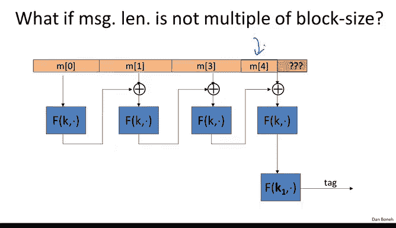

# 斯坦福大学《密码学｜Cryptography 1》中英字幕 - P27：27_03_02_MAC填充.zh_en - GPT中英字幕课程资源 - BV1Rf421o79E

In the last segment， we talked about the CBC Mac and the N Mac。 But throughout the segment。

 we always assumed that the message length was a multiple of the block size。 In this segment。

 we're going to see what to do when the message length is not a multiple of the block size。

 So recall that the encrypted CBC Mac or EBC Mac for short uses pseudo random permutation F to actually compute the CBC function as we discussed in the last segment。

 But in the last segment， we always assumed that the message itself could be broken into an integer number of blocks for the block cipher。

 And the question is what to do when the message length is not a multiple of the block size。

 So here we have a message where the last block actually is shorter than the full block。

 And the question is how to compute the EBC Mac in that case。 So the solution， of course。

 is to pad the message and the first path that comes to mind is to simply pad the message with all zeros。

 In other words， we take the last block and just add zeros to it until the last block becomes as long as one full block size。

And so my question to you is whether the resulting Mac is secure。So the answer is no。

 the Mac is not secure and let me explain why basically the problem is that it's possible now to come up with messages so that the message M and the message m concatenated0 happen to have exactly the same pad and as a result once we plug in both m and M0 into ECBC will get the same tag out which means that both M and M concaten at 0 have the same tag and therefore the attacker can mount as essential forgery。

 he would ask for the tag on the message m and then he would output it as forgery the tag on the message m concatenated 0 and it's easy to see why that's the case basically to be absolutely clear here we have our message M which after padding becomes m000。

 say we had to add30s to it and here we have the message M0 and M then end with0 and after padding we basically now only have to add two0s to it and lo behold they become the same pad so that they're going to have exactly the same tag which。

Allows the adversary to mount the existential forgery attack。So this is not a good idea。 In fact。

 appending all zeros is a terrible idea。 And if you think about concrete case where this comes up。

 imagine in the automatic clearinghouse system used for clearing checks。

 I might have a check for 100 and a tag on that check。

 Well now the attacker basically could app a zero to my check and make it a check for 1000 and that wouldn't actually change the tag。

 so this ability to extend the message without changing the tag actually could have pretty disastrous consequences。

So I hope this example convinces you that the padding function itself must be a one to one function。

 In other words， it should be the case that two distinct messages always map to two distinct padded messages。

 We shouldn't actually have a collision on the padding function。

 Another way of saying it is that the padding function must be invertible。

 That guarantees that the padding function is one to one。

So a standard way to do this was proposed by the International Standards organization， ISO。

 what they suggested is basically let's append the string 10000 to the end of the message to make the message be a multiple of the block length。

Now to see that this padding is invertible， all we do is describe the inversion algorithm。

 which simply is going to scan the message from right to left until it hits the first one。

 and then it's going to remove all the bits to the right of this one， including the one。

And you see that once we remove the pad in this way we obtain the original message so here's an example。

 so here we have a message where the last block happens to be shorter than the block length and then we append the 100 string to it。

 it's very easy to see what the pad is simply look for the first one from the right we can remove this pad and recover the original message back。

Now there's one corner case that's actually quite important。

 and that is what do we do if the original message length is already a multiple of the block size？

In that case， it's really very， very important that we add an extra dummy block that contains the pad 1000。

 And again， I can't tell you how many products and standards have actually made this mistake where they didn't add a dummy block and as a result the Mac is insecure because there's an easy existential forgery attack and let me show you why so suppose in case the message is a multiple of the block length。

 suppose we didn't add a dummy block and we literally maced this message here， Well。

 the result now is that if you look at the message。

 which is a multiple of the block size and a message which is not a multiple of the block size but is padded to the block size and imagine it so happens that this message M prime1 happens to end with 100。

At this point， you realize that here the original message here。 Let me draw it this way。

 You realize that the original message after padding would become identical to the second message that was not padded at all。

 And as a result， if I ask for the tag on this message over here。

 I would obtain also the tag on the second message to happen to end in 100。 Okay。

 so if we didn't add the dummy block basically， again。

 the pad would be not invertible because two different messages。

 two distinct messages happened to map to the same padded result。 again， as a result。

 the Mac becomes insecure。So to summarize this ISO standard is a perfectly fine way to pad。

 except you have to remember to also add a dummy block in case message is a multiple of the block lens to begin with。

Now some of you might be wondering if there's a padding scheme that never needs to add a dummy block and the answer is that if you look at the deter deterministic padding function。

 then it's pretty easy to argue that there will always be cases where we need to pad and the reason is just literally the number of messages there are a multiple of the block length is much smaller then the total number of messages that need not be a multiple of the block length and as a result we can't have one to one function from this bigger sets of all messages to the smaller set of messages which are a multiple little block length。

 there will always be cases where we have to extend the original message and in this case that would correspond to adding this Pa dummy padding block however there is a very clever idea called CMAC which shows that using a randomized padding function we can avoid having to ever add a dummy block and so let me explain how CMac works so CMac actually uses three keys and in fact sometimes this is called a three key construction so the first key K is used in the CBC the standard CBC Mac algorithm。

And then the keys K1 and K2 are used just for the padding scheme at the very。

 very last block and in fact， in the CMAC standard。

 the keys K1 K2 are derived from the keyK by some sort of a pseudoran generator。

So the way CMMAC works is as follows， well， if the message happens to not be a multiple of the block length。

 then we append the ISO padding to it， but then we also exO this last block with a secret key K1 that the adversary doesn't know。

However， if the message is a multiple of the block length。

 then of course we don't append anything to it， but we exhort with a different key K2 that again the adversary doesn't actually know So it turns out just by doing that it's now impossible to apply the extension attacks that we could do on the cascade function and on Ross CBbC because the poor adversary actually doesn't know what is the last block that went into the function he doesn't know K1 and therefore he doesn't know the value at this particular point and as a result he can't do an extension attack in fact this is a provable statement so that this construction here simply by Xoring K1 or xoring K2 is really a PRf despite not having to do a final encryption step after the Ros CBbC function is computed so that's one benefit that there's no final encryption step and the second benefit is that we resolve this ambiguity between whether padding did happen or padding didn't happen by using two different keys to distinguish the case that the message is a multiple of the block length versus the。

where it's not but we have a pad appendant to the message so the two distinct keys resolve this ambiguity between the two cases and as a result this padding actually is sufficiently secure and as I said there's actually a nice security theorem that goes with CMMAC that shows that the CM construction really is a pseudoran function with the same security properties as CBCM。

So I wanted to mention that CMAC is a federal standard standardized by NIST。

 and if you now these days wanted to use a CBC Mac for anything。

 you would be actually using CMAC as the standard way to do it， particularly in CAC。

 the underlying blockcipher is AS， and that gives us a secure CBC Mac derived from AES。

So that's the end of the segment and in the next segment we'll talk about a parallel Mac。

