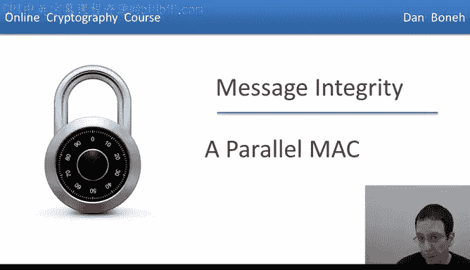
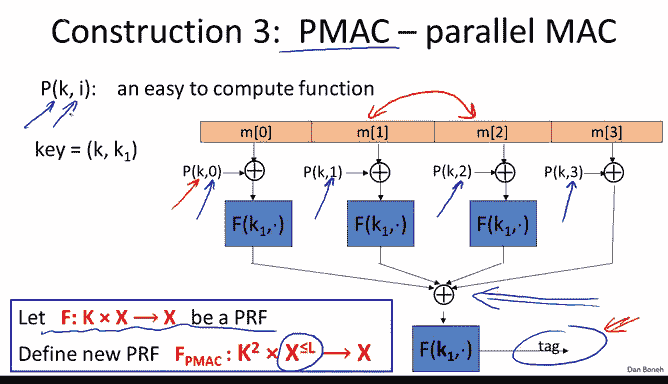
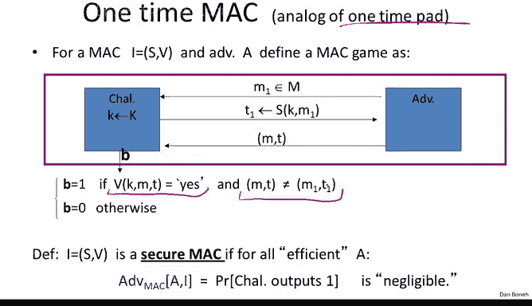
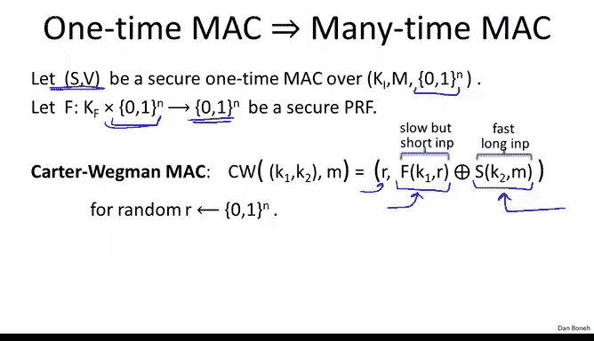
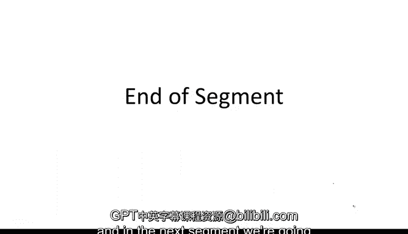

# 斯坦福大学《密码学｜Cryptography 1》中英字幕 - P28：28_03_01_PMAC与卡特-韦格曼MAC.zh_en - GPT中英字幕课程资源 - BV1Rf421o79E

In the last two segments， we talked about the CBC Mac and Nmac to convert a PRf for small messages into a PRf for much larger messages。

 Those two constructions were sequential in the sense that if you have multiple processors。

 you couldn't make the construction work any faster。 In this segment。

 we're going to look at a parallel Mac that also converts a small PRf into a large PRf but does it in a very parallelizable fashion。

 In particular， we're going to look at a parallel Mac construction called Pmac。

 It uses in underlying PRf to construct a PRf for much larger messages。 In particular。

 the PRf can process much longer messages that can have variable length and have as many as L blocks in them。

 Now， the construction works as follows。 We take our message and we break it into blocks。

 And then we process each block independently of the other。

 So the first thing we do is we evaluate some function P and we exor the result into the first message block。

 And then we apply our function F using a key K1。 We do the same for each one of the message blocks。

 And you notice that we can do it all parallel， All message blocks are processed。

Independently of one another。 and we collect all these results into some final Xor。

 and then we encrypt one more time to get the final tag value。 Now， for a technical reason， actually。

 on the very last block， we actually don't need to apply the PRFF。 But as I said。

 this is just for a technical reason and I'm going to ignore that for now。

 Now I want to explain what the function P is for and what it does。

 So imagine just for a second that the function P isn't actually there。

 that is imagine we actually directly feed each message block into the PRf without applying any other processing to it。

 Then I claim that the resulting Mac is completely insecure。

 And the reason is that essentially no order is enforced between the message blocks。 in particular。

 if I swap two message blocks that doesn't change the value of the final tag because the Xor is commutative the tag will be the same whether we swap the blocks or not。

 As a result an attacker can request the tag for a particular message and then he obtains the tag for a message where two of the blocks are swapped and that counts as an existential form。

Ory。So what this function P tries to do is essentially enforce order on these blocks and you notice that the function takes。

 first of all， it's a key function， so it takes a key as input。 and second of all， more importantly。

 it takes a block number as input。 In other words， the value of the function is different for each one of the blocks and that's actually exactly what's preventing this blocks swapping attack。

 So the function P actually is a very easy to compute function。

 essentially given the key and the message block， all it is is just a multiplication and some finite field so it's a very。

 very simple function to compute It adds very little to the running time of Pmac and yet it's enough to ensure that the Pmac is actually secure。

As we said， the key for PMac is this pair of keys， one key for the PRF。

 and one key for this masking function P， and finally I'll tell you that if the message length is not a multiple of the block length。

 that is imagined the last block is shorter than full block length。

 then PMac actually uses a padding that's similar to CMMAC so that there is no need for an additional dummy block ever。

So that's the Pmac construction and as usual we can state its security theorem so the security theorem by now you should be used to it essentially it says that if you give me an adversary attacking Pmac I can construct an adversary attacking the underlying PRf plus an additional error term and so since again the PRf is secure we know that this term is negligible and so if we want this term to be negligible we know that we need this error term to also be negligible here as usual Q is the number of messages that are maced using a particular key and L is the maximum length of all those messages and Pmac is secure as long as this product is less than the square root of the block size So for A yes this would be 2 to the 128 at the square root therefore would be 2 to the 64 so the Mac would be secure as long as Q times L is less than 2 to the 64 and every time as it gets closer to that value of course it would have to change the key in order to continue mac more messages so the main thing to remember is that Pmac also gives us a PRf and。

When it processes the message blocks independently of one another。

Turns out that PMac also has a very interesting property， namely the Pac Mac is incremental。

 So let me explain to you what that means。So suppose the function F that's used to construct PMAC is not just a PRf。

 but in fact， a permutation， a PRP， so we can actually invert it when we need to。Now。

 suppose we've already computed the Mac for a particularly long message M。

And now suppose just one message block of this long message changes。

 So here M1 is changed into M prime1， but the remaining message blocks all remain the same for other Macs like CBC Mac。

 even though only one message block changed， you would have to recompute the tag on the entire message。

 recomputing the tag basically would take time that's proportional to the length of the message。

It turns out with Pac， if we only change one block or a small number of blocks。

 actually we can recompute the value of the tag for the new message very， very quickly。

And let me ask you a puzzle to see if you can figure out how to do that yourself and remember the function F is a PRP and therefore is invertible。

 so let's see if you can figure out how to compute a Mac and a new message by yourself。

So it turns out this can be done and you can quickly recompute the tag and the new message using this third line here。

 so just to make sure we all see the solution， let's quickly go back to the original diagram for PMac and I can show you what I mean so imagine this one message block changed into some other block say it changed into M prime1。

Then what we could do is we can take the tag on the original message before the change was made。

 so we can invert the function F and determine the value before the function F was applied。Now。

 well since we now have an Xor of a bunch of blocks。

 what we can do is we can cancel out the Xor that came from the original message block basically by Xoring this value that came from the original message block into this Xor accumulator and then Xoring again。

 the value that would come from the new message block back into the XO accumulator and then apply the function F again and that would give us the tag for the new message where just one block was changed so in symbols basically I wrote the formula over here。

 you can see basically we decrypt the tag and then we Xor with the block that comes from the original message block。

 we XO again with the block that comes from the new message block and then we reenrypt the final Xor accumulator to get the new tag for the message with a one block changed。

So that's kind of a neat property， it kind of shows that if you have very large messages。

 you can very quickly update the tag， of course you would need a secret key to do the update。

 but you can quickly update the tag if just a small number of message blocks changed。Okay。

 so that concludes our discussion of PMAC， and now I want to switch topics a little bit and talk about the concept of a one time Mac。

 which is basically the analog of the onetime pad， but in the world of integrity。

So let me explain what I mean by that so imagine we want to build a Mac that is only used for integrity of a single message。

 in other words， every time we compute integrity of a particular message。

 we also change the key so that any particular key is used for only for integrity of one message。

Then we can define the security game as basically saying the attacker is going to see one message Therefore we only allow him to do one chosen message attack so he gets to submit one message query and he is given the tag corresponding to that one message query and now his goal is to forge a message tag pair so you can see his goal is to produce one message tag pair that verified correctly and is different from the pair that he was actually given as we'll see just like the onetime pad and stream ciphers were quite useful。

 it turns out onetime act are also quite useful for the same applications where we only want to use a key to encrypt or to provide integrity for just a single message So as usual we would say that a onetime act is secure if basically no adversary can win this game。

Now the interesting thing is that one time Max， just like the one time pad。

 can be secure against infinitely powerful adversaries， and not only that。

 because they're only designed to be secure for one time use。

 they can actually be faster than Macs that are based on PRs。

And so I just wanted to give you a quick example of one one time Mac。

 this is a classic construction for a one time Mac， and let me show you how it works。

The first step is to pick a prime that's slightly larger than our block size in this case we're going to use 128 bit blocks。

 so let's pick the first prime that's bigger than 2 to the 128 this happens to be2 to the 128 plus 51。

AndNow the key is going to be a pair of random numbers in the range one to our prime， so one to Q。

 so we choose two random integers in the range one to Q。Now we're given a message。

 so we're going to take our message and break it into blocks where each block is 128 bits and we're going to regard each number as an integer and the range 0 to 2 to the 128 minus-1 Now the Mac is defined as follows。

 the first thing we do is we take our message blocks and we kind of construct the polynomial out of them so if there are L blocks in our message we're going to construct the polynomial degree L and you notice that the constant term of this polynomial is set to0。

And then we define the Mac very simply， basically what we do is we take the polynomial that corresponds to the message。

 we evaluate it at the point k that's one half of our secret key。

 and then we add the value A which is the second half of our secret key and that's it。

 that's the whole Mac so just basically construct the polynomial that corresponds to our message。

 evaluate that polynomial at half of the secret key and add the other half of the secret key to the result and of course reduce the final result modular Q。

Okay so that's it so that's the whole Mac， it's a one time secure Mac。

 and the way we argue that this Mac is one time secure。

 essentially is by arguing that if I tell you the value of the Mac for one particular message。

That tells you nothing at all about the value of the Mac at another message and as a result。

 even though you've seen the value of the Mac on a particular message。

 you have no way of forging this Mac on some other message。

 Now I should emphasize that this is a one time Mac， but it's not two time secure， in other words。

 if you get to see the value of the Mac on two different messages that actually completely compromises a secret key and you can actually predict the Mac for a third or fourth message of your choice。

 So then the Mac becomes forgeible but for one time use it is a perfectly secure Mac and I'll tell you that in fact this is a very fast Mac to evaluate。

😊，So now that we've constructed one timeax， it turns out there's actually a general technique that will convert one timeax into many timeaxs。

 and I just wanted to briefly show you how that works So suppose we have our one timeax let's call it S and V for signing and verification algorithms and let's just assume that the tags themselves are in bit strings。

In addition， let's also look at a PRf as a cure PRF that also happens to output and bit strings。

 but also takes as inputs on B strings。Let's now define a general construction for a Mac。

 these Macs are called Car redman Mac that works as follows。

 basically what we would do is we would apply the onetime Mac to the message M and then when we're going to encrypt the result using a PRF so how do we encrypt the result while we choose a random R and then we compute kind of a onetime pad from this R by applying the PRF to it and then we exhort the result with the actual onetime Mac。

So the neat thing about this construction is that the fast onetime Mac is applied to the long message which could be gigabytes long。

 and the slower PRF is only applied to this nonnce R。

 which is then used to encrypt the final result of the Mac and you can argue that if the Mac that was given to us as a building block is a one time secure Mac and the PRF is secure。

 then in fact we get a manytime secure Mac that happens to output two nbit tags。

 so we're going to see Carwagman Mac later on when we talk about authenticated encryption and in fact one of the N standard methods for doing encryption with integrity。

 uses a Carwagman Mac for providing integrity。

I wanted to mention that this Carter wagonagagon Mac is a good example of a randomized Mac where this non R is chosen afresh every time the tag is computed。

 and so for example， if you try to compute tag for the same message twice each time you'll choose a different R and as a result you'll get different tags both times and so this is a nice example of a Mac that's actually not a pseudoran function。

 not a PRF because a single message could actually be mapped to many different tags。

 all of which are valid for that one message。To conclude our discussion of the Caragman Mac。

 let me ask you the following question here we have the equation for the Caragman Mac as usual you see the nonnce R is part of the Mac and the second part of the Mac I'm going to denote by T this is basically the onetime Mac applied to the message M and then encrypted using the pseudo random function applied to the Nonce R So we'll denote the result of this X or by T So my question to you is given the Carterwman Mac pair R comma T for a particular message M how would you verify that this Mac is valid。

And recall that this algorithm V here is the verification algorithm for the underlying one time Mac。

So this is the right answer and to see why， just observe that this Xor here decryptps the quantity T to its plain X value。

 which is basically the original underlying one time Mac。

 and so we can directly feed that into theification algorithm for the one time Mac。

The last type of Mac I wanted to tell you about is one that's very popular in Internet protocols It's called the HMac。

 but before we talk about HMac we have to talk about hash functions and in particular collision resistant hash functions and we're going to do that in the next module So this is the end of our first module on Mac and I wanted to point out that there's really beautiful theory that went into constructing all the Mac that we saw I kind of gave you the highlights that showed you the main constructions but there's really quite a bit of theory that goes into constructing these Macs and if you'd like to learn more about that I kind of listed a couple of key papers that you might want to look at let me quickly tell you what they are the first one is what's called the three key construction which is the basis of CMAC。

 very elegant paper that gives a very efficient construction out of CBC Mac the second paper is a more technical paper but basically shows how to prove the bounds of CBC Mac as a PRF。

The third paper talks about PMac and its construction again a very acute paper fourth paper talks about security of NMac and HMac as well HMac we're going to cover in the next module。

 the last paper I listed asks an intriguing question recall that all of our constructions we always assumed that AES is a pseudorandom function for 16 byte messages and then we built a pseudorandom function and therefore a Mac for much longer messages。

This paper says， well， what do we do if AES is not a pseudoran function。

 but still satisfies some weaker security property called an unpredictable function。

 and then they ask if AES is only an unpredictable function but not a pseudoran function。

 can we still build Macs for long messages and so they succeed in actually giving constructions just based on the weaker assumption that AES is an unpredictable function。

 but their constructions are far less efficient than CBC Macac or NMac or PMac that we discussed in these segments？

And so if you're interested in a different perspective on how to build Macs from block ciphers like AES。

 please take a look at this paper and there are actually some nice open questions to work on in this area。

 So this concludes our first segment on integrity and in the next segment we're going to talk about collision resistance。

