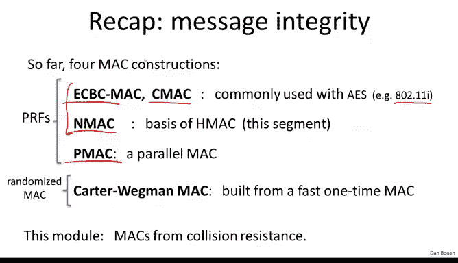
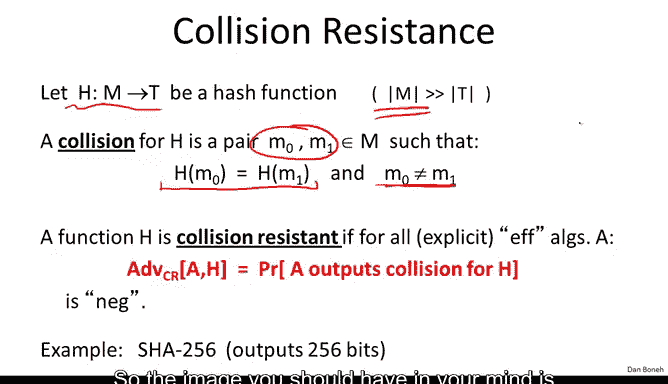
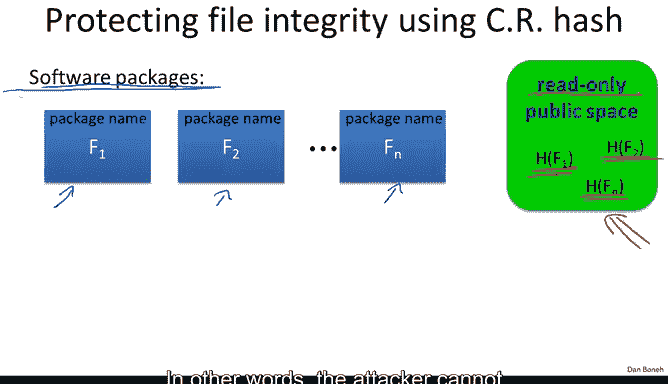

# 斯坦福大学《密码学｜Cryptography 1》中英字幕 - P29：29_03_01_引言.zh_en - GPT中英字幕课程资源 - BV1Rf421o79E

In this module， we're going to talk about a new concept called collision resistance。

 which plays an important role in providing message integrity。

 Our end goal is to describe a very popular Mac algorithm called Hmac that's widely used in Internet protocols。

 Hmac itself is built from collision resistance hash functions。 Before we do that。

 let's do a quick recap of where we are。 In the last module。

 we talked about message integrity where we said that a Mac system is secure。

 if it is existentially unforgeible under a chosen message attack。

 This means that even an attacker who is given the tag on arbitrary messages of his choice cannot construct a tag for some new message。

And then we showed that in fact， any secure PRF immediately gives us a secure Mac。

 and so then we turned around and said， well， can we build secure PRFs that take large messages as inputs？

And so we looked at four constructions， the first construction was based on CBC when we looked at two variants of it。

 one called encrypted CBC and one called CMMAC， and we said that these are commonly used with AAS。

 in fact in the 80211I standard， a CBC Mac is used for message integrity in particular with the AES algorithm。

We looked at another mode called NMac， which also converts a PRf for short inputs into a PRf that's capable of taking very large messages as inputs and these two were both sequential Mac。

 We then looked at a parallelizable Mac called Pmac which again was able to convert a PRf for small inputs into a PRf for very large inputs but it did so in a parallel fashion so a multiprocessor system would be more efficient with Pmac than say with CBC Mac all three of these built a Mac for large messages by constructing a PRf for large messages and then we looked at the Car Wagman Mac which actually is not a PRf。

 It's a randomized Mac， So a single message could actually have many。

 many different valid tags and therefore Car Wagman Mac is actually not a PRf And if you remember the Car Wagman Mac was built by first of all taking the bulk message and hashing it down to a small tag using a fast onetime Mac and then encrypting that tag using a PRf。

The benefit of the Caragagon Mac was that as we said。

 the hashing of the bulk message is done using a fast one time Mac and then in this module we're going to construct Mac from new concepts called collision resistance and so the first thing we're going to do is construct collision resistant hash functions。

So let's first of all start by defining what does it mean for a hash function to be collision resistant So think of a hash function from some message space to a tag space T and you should be thinking of the message space as much。

 much bigger than the tag space so the messages could be gigabytes long but the tags would only be like 160 bits Now a collision for the function H is a pair of messages M0 M1 that happen to be distinct however when you apply the function H to them you end up with the same output so the image you should have in your mind is essentially there are two inputs M0 and M1 they belong to this gigantic message space。

However， when we apply the hash function to them they happen to collide and they both map to the same output in the tag space Now we say that the function a collision resistant。

 if it's hard to find collisions for this function Now this should seem a little bit counterintuitive because we know that the output space is tiny compared to the input space so by the pigeonhole principle there must be lots and lots and lots of messages that map the same output just because there isn't enough space in the output space to accommodate all the messages without collisions。

And so we know that there are lots of collisions and the question is is there an efficient algorithm that finds any such collisions explicitly So we say that the function is collision resistant。

 if for all explicit efficient algorithms a and these algorithms are not able to print a collision for the function H and well as usual we'll define the advantage as the probability that the algorithm A is able to output a collision Now I'm not going to formalize a term explicit here。

 all I'll say is that it's not enough to just say that an algorithm exists in an algorithm that simply print a collision because we know many collisions exist。

 what we actually want an explicit algorithm that we can actually write down and run on a computer to generate these collisions there are ways to formalize that but I'm not going to do that here。

😊，Now a classic example of a collision resistant hash function is shot 256 which happens to output 256 bits but can take arbitrary large input for example。

 it can take gigabytes and gigabytes of data and it'll map at all to 256 bits and yet nobody knows how to find collisions for this particular function so just to show you that this concept of collision resistance is very useful let's see a very quick application for it in particular。

 let's see how we can trivially build a Mac given a collision resistant hash function so suppose we have a Mac for short messages so you should be thinking something like AES which can map 16 by messages。

And then suppose we have a hash function， a collision resistant hash function from large message space that contains gigabyte messages into our small message space。

 say into 16 byte outputs。Then basically we can define a new Mac， let's call it I big。

 which happens to be Mac large messages， and we'll define it simply by applying the small Mac to the output of the hash function。

And how do we verify a Mac Well basically given a tag we verified by rehashing the given message and then checking that small Mac actually verifies under the given tag so this is a very simple way to show you how collision resistance can take a primitive that's built for small inputs and expand it into a primitive that's built for very large inputs and in fact we're going to see this not just for Macs later on when we talk about digital signatures we're going to do the same thing。

 we're going to build a digital signature scheme for small inputs and then we're going to use collision resistance to expand the input space and make it as large as we want。

So the security theorem basically is in some sense trivial here。

 basically it says if the underlying Mac is secure and HS collision resistance。

 then the combination which can actually Mac large messages is also a secure Mac and as a quick example。

 let's apply this to AES so let's use the one example that we mentioned Sha to 56。😊。

So in this case， shot of 56 outputs， 256 bit outputs， which is 32 bytes。

 so we have to build a Mac that can Mac 32 by messages and the way we could do that is basically by applying the 16 byte AES plugging it into a two block CBC。

 a two block CBC would expand AES from a PRF on 16 bytes to a PRF on 32 bytes。

And then take the output of shot 256 and plug it into this two blocks CBC based on AES。

 and then we get a very， very simple Mac， which is secure。

 assuming AAS is a PRF and shot 256 is collision resistance。

So one thing I wanted to point out is that in fact。

 collision resistance is necessary for this construction to work。 So in fact。

 collision resistance is not just a madeup term， collision resistance really is kind of the essence of why this combined Mac is secure and so let's just assume for a minute that the function H the hash function we're using is not collision resistance In other words。

 there is an algorithm that can find two distinct messages that happened to mapped to the same output in this case。

 the combined Mac is not going to be secure because what the adversary can do is simply use a chosen message attack to get a tag or m0 and then output M1 comm tag as a forgery and indeed t is a valid Mac for M1 because H of M1 happens to be equal to H of M0 and so in doing so just with a one chosen message attack the attacker was able to break this combined Mac simply because the hash function was not collision resistant so it should be again I want to emphasize that if someone advertised even one collision。

For Sha 256， you know two messages， just one pair of messages that happened to have the same output under shot 256 that would already make this construction insecure because an attacker could then ask for the tag on one message and in doing so he would obtain the tag on the other message as well and that would count as an existential forgery。

Okay， so already we see the collision resistance very useful primitive in that it lets us expand the input space of cryptographic primitives。

 I want to show you one more application where collision resistance is directly used for message integrity。

😊。

Imagine again we have files that we want to protect let's imagine these files are actually software packages that we want to install in our system。

 so here are three different software packages， know maybe one is GCC。

 one is emX and another one is I don't know VI。Now the user wants to download the software package and he wants to make sure that he really did get a version of the package that he downloaded。

 and it's not some version that the attacker tampered with and modified its content。

So what he could do is basically refer to a read only public space that's relatively small。

 All it has to do is hold small hashes of the software packages。

 so there is a lot of space needed here。 The only requirement is that the space is read only in other words。

 the attacker cannot modify the hashes stored in the space。

And then once he consults this public space， he can very easily compute the hash of a package that he downloaded。

 compare it to the value in the public space。 and if the two match。

 then he knows that a version of the package he downloaded is in fact a correct one Why is that true Well。

 because the function Hs collision resistance the attacker cannot find an F1 hat that would have the same hash as F1 and as a result。

 the attacker cannot modify F1 without being detected because there's no way that the hash of his F1 hat would map that the value that's stored in the public space So the reason I brought up this example is I wanted to contrast this with the Mac example we kind of saw similar situation with Mac in the Mac example we needed a secret key to verify the individual file tags。

But we didn't need a resource that was a read only public space。These collision resistant hashes。

 we kind of get the exact complement where in fact we don't need a key to verify anyone can verify。

 you don't need a secret key for it。 However now all of a sudden we need this extra resource which is some space that the attacker cannot modify and in fact later on we're going to see that with digital signatures we can kind of get to the best of both worlds where we have both public verifiability and we don't need a read only space but so far with either max or collision resistance we can have one but not the other。

So I'll tell you that in fact this kind of scheme is very popular。

 in fact Linux distributions often use public spaces where they advertise hashes of their software packages and anyone can make sure that they downloaded the right software package before installing it on their computer。

 so this is in fact something that's used quite extensively in the real world。Okay。

 so in the next segment， we'll talk about generic attack on collision resistance。

 and then we'll go ahead and build collision resistant hash functions。

