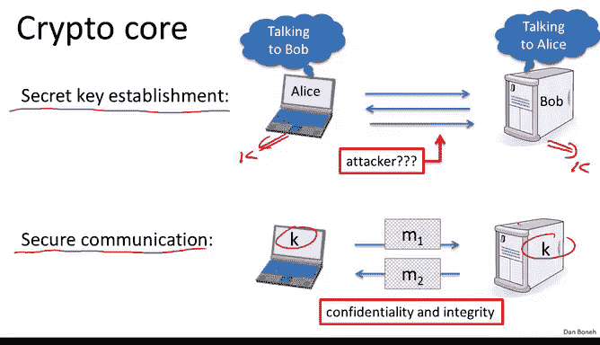
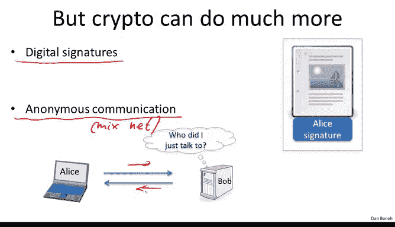

# 斯坦福大学《密码学｜Cryptography 1》中英字幕 - P2：02_01_04_密码学是什么.zh_en - GPT中英字幕课程资源 - BV1Rf421o79E

Before we start with the technical material， I want to give you a quick overview of what cryptography is about in the different areas of cryptography。

So the core of cryptography， of course， is secure communication that essentially consists of two parts。

 the first is secure key establishment， and then how do we communicate securely once we have a shared key。

We already said that secure key establishment essentially amounts to Alice and Bob sending messages to one another。

 such that at the end of this protocol， there is a shared key that they both agree on， shared key K。

 And beyond that， beyond just a shared key， In fact。

 Alice would know that she is talking to Bob and Bob would know that he is talking to Alice。

 But a poor attacker who listens in on this conversation has no idea what the shared key is。

And we'll see how to do that later on in the course Now once they have a shared key。

 they want to exchange messages securely using a key and we'll talk about encryption schemes that allow them to do that in such a way that an attacker cant figure out what messages are being sent back and forth and furthermore an attacker cannot even tamer with this traffic without being detected In other words these encryption schemes provide both confidentiality and integrity。

But cryptography does much， much， much more than just these two things。

 and I want to give you a few examples of that。

So the first example I want to give you is what's called a digital signature。

 so a digital signature basically is the analog of the signature in the physical world。

In the physical world， remember when you sign a document。

 essentially you write your signature on that document and your signature is always the same。

 you always write the same signature on all documents that you want to sign。In the digital world。

 this can't possibly work because if the attacker just obtained one signed document for me。

 he can cut and paste my signature onto some other document that I might not have wanted to sign。

And so it's simply not possible in a digital world that my signature is the same for all documents that I want to sign。

So we're going to talk about how to construct digital signatures in the second half of the course。

 it's really quite an interesting primitive and we'll see exactly how to do it。

 just to give you a hint the way digital signatures work is basically by making the digital signature be a function of the content being signed So an attacker who tries to copy my signature from one document to another is not going to succeed because the signature on the new document is not going to be the proper function of the data in the new document and as a result。

 the signature won't verify。 And as I said， we're going to see exactly how to construct digital signatures later on and then we'll prove that those constructions are secure。

Another application of cryptography that I wanted to mention is anonymous communication。

 so here imagine user Alice wants to talk to some chat server Bob。

 and perhaps she wants to talk about a medical condition and so she wants to do that anonymously so that the chat server doesn't actually know who she is。

Well， there's a standard method called a Minet that allows Alice to communicate over the public internet with Bob through a sequence of proxies such that at the end of the communication。

 Bob has no idea who it just talked to。The way Minets work is basically as Alice sends her messages to Bob through a sequence of proxies。

 these messages get encrypted and decryed appropriately so that Bob has no idea who we talk to and the proxies themselves don't even know that Alice is talking to Bob or that actually who's talking to who more generally。

One interesting thing about this anonymous communication channel is it bidirectional， in other words。

 even though Bob has no idea who it's talking to， he can still respond to Alice and Alice will get those messages once we have anonymous communication we can build other privacy mechanisms and I want to give you one example which is called anonymous digital cache。

Remember that in the physical world， if I have a physical dollar。

 I can walk into a bookstore and buy a book， and the merchant would have no idea who I am。

 The question is whether we can do the exact same thing in the digital world。In the digital world。

 basically， Alice might have a digital dollar， a digital dollar coin。

 and she might want to spend that digital dollar at some online merchants。

 perhaps some online bookstore。Now what we'd like to do is make it so that when Alice spends her coin at the bookstore。

 the bookstore would have no idea who Alice is so we provide the same anonymity that we get from physical cash Now the problem is that in the digital world。

 Alice can take the coin that she had this $1 coin and before she spent it she can actually make copies of it。

And then all of a sudden， instead of having just $1 coin。

 now all of a sudden she has $3 coins and they're all the same， of course。

 and there's nothing preventing her from taking those replicas of the dollar coin and spending it at other merchants。

And so the question is how do we provide anonymous digital cash。

 but at the same time also prevent Alice from double spending the dollar coin at different merchants。

 in some sense there's a paradox here where anonymity is in conflict with security because if we have anonymous cash。

 there's nothing to prevent Alice from double spending the coin and because the coin is anonymous we have no way of telling who committed this fraud。

And so the question is how do we resolve this tension。

 and it turns out it's completely doable and we'll talk about anonymous digital cache later on just to give you a hint。

 I'll say that the way we do it is basically by making sure that if Alice explains the coin once。

 then no one knows who she is， but if she spends the coin more than once。

 all of a sudden her identity is completely exposed。

 and then she could be subject to all sorts of legal problems。

And so that's how a none of digital cache would work at a high level and we'll see how to implement it later on in the course Another application of cryptography has to do with more abstract protocols。

 but before I state the general results I want to give you two examples so the first example has to do with election systems。

So here's the election problem。 Suppose we have two parties， party 0 and party 1。

 and voters vote for these parties。 So， for example， this voter could have voted for party 0。

 this voter votedr for party 1 and so on。 So in this election。

 party 0 got three votes and party 2 got two votes。 So the winner of the election， of course。

 is party 0。 but more generally， the winner of the election is the party who received a majority of the votes。

Now， the voting problem is the following。 The voters would somehow like to compute the majority of the votes。

 but do it in such a way so that nothing else is revealed about their individual votes。

 so the question is how to do that and to do so， we're going to introduce an election center who's going to help us compute the majority but keep the votes otherwise secret。

 And what the parties will do is they will each send the funny encryption of their votes to the election center in such a way that at the end of the election。

 the election center is able to compute and output the winner of the election。 However。

 other than the winner of the election， nothing else is revealed about the individual votes。

 The individual votes otherwise remain completely private。 Of course。

 the election center is also going to verify that this voter， for example。

 is allowed to vote and that the voter has only voted once。 But other than that information。

 the election center and the rest of the world learn nothing else。

About that votersr's vote other than the result of the election。

So this is an example of a protocol that involves six parties。

 in this case there are five voters and one election center。

 these parties compute amongst themselves and at the end of the computation。

 the result of the election is known but nothing else is revealed about the individual inputs。Now。

 a similar problem comes up in the context of private auctions。So in a private auction。

 every bidder has his own bid that he wants to bid and now suppose the auction mechanism that's being used is what's called a Vi auction。

 where the definition of a Vi auction is that the winner is the highest bidder。

But the amount that the winner pays is actually the second highest bid so it pays the second highest bid so this is a standard auction mechanism called the Vi auction。

 and now what we'd like to do is basically enable the participants to compute to figure out who the highest bidder is and how much he's supposed to pay。

 but other than that， all other information about the individual bids should remain secret。

 So for example， the actual amount that the highest bidder bid should remain secret。

 the only thing that should become public is the second highest bid in the identity of the highest bidder。

So again， now the way we will do that is we'll introduce an auction center in a similar way。

 essentially everybody will send their encrypted bids to the auction center。

 the auction center will compute the identity of the winner and in fact。

 he will also compute the second highest bid but other than these two values。

 nothing else is revealed about the individual bids。

 Now this is actually an example of a much more general problem called secure multiparty computation and me explain what secure multiparty computation is about。

 So here basically abstractly the participants have a secret input to themselves。

 So in the case of an election， the inputs would be the votes in the case of an auction the inputs would be the secret bids。

And then what they'd like to do is compute some sort of a function of their inputs again。

 in the case of an election， the function is a majority， in the case of auction。

 the function happens to be the second highest largest number among x1 to x4 And the question is how can they do that such that the value of the function is revealed but nothing else is revealed about the individual votes。

So let me show you can have a dumb， insecure way of doing it。

 What we do is introduce a trusted party， and then this trusted authority basically collects individual inputs。

And it kind of promises to keep the individual inputs secret so that only it would know what they are。

 and then it publishes the value of the function to the world。

 So the idea is now that the value of the function became public。

 but nothing else is revealed about the individual inputs。 But of course。

 you got this trusted authority that you've got to trust。

 And if for some reason it's not trustworthy then you have a problem。

And so there's a very central theorem in crypto this really is quite a surprising fact that says that any computation you'd like to do any function F you'd like to compute that you can compute with a trusted authority。

 you can also do without a trusted authority。 Let me at a high level explain what this means。

 basically what we're going to do is we're going to get rid of the authority。

 So the parties are actually not going to send their inputs to the authority。

 and in fact there is no longer going to be an authority in the system。 Instead。

 what the parties are going to do is they're going to talk to one another using some protocol。

 such that at the end of the protocol， all of a sudden the value of the function becomes known to everybody。

 and yet nothing other than the value of the function is revealed。 In other words。

 the individual inputs is still kept secret。But again， there is no authority。

 there's just a way for them to talk to one another such that the final output is revealed。

 so this is a fairly general result， it's kind of a surprising fact that this is at all doable and in fact it is and towards the end of the class we'll actually see how to make this happen。

Now there are some applications of cryptography that I can't classify in any other way other than to say that they're purely magical。

 let me give you two examples of that。So the first is what's called privately outsourcing computation。

 So I'll give you an example of a Google search just to illustrate the point。

 So imagine Alice has a search query that she wants to issue。

It turns out that there are very special encryption schemes such that Alice can send an encryption of her query to Google。

And then because of the property of the encryption scheme。

 Google can actually compute on the encrypted values without knowing what the plain text are。

 So Google can actually run its massive search algorithm on the encrypted query and recover an encrypted results。

Okay， Google would send the encrypted results back to Alice。 Alice would decrypt。

 and then she would receive the results。 But the magic here is all Google saw was just encryptions of her queries and nothing else。

 And so Google， as a result， has no idea what Alice just search for。 And nevertheless。

 Alice actually learned exactly what she wanted to learn。 Okay。

 so these are magical kind of encryption schemes that're fairly recent。

 This is only a new development from about two or three years ago that allows us to compute unencrypted data。

 Even though we don't really know what's inside the encryption。😊，Now。

 before you rush off and think about implementing this。

 I should warn you that this is really at this point。

 just theoretical in the sense that running a Google search on encrypture data probably would take a billion years。

 but nevertheless， just the fact that this is doable is already really surprising and is already quite useful for relatively simple computations。

 So in fact， we'll see some applications of this out later on。

The other magical application I want to show you is what's called zero knowledge。

 and in particular I'll tell you about something called a zero knowledge proof of knowledge。

So here what happens is there's a certain number N， which Alice knows。

 And the way the number n was constructed is as a product of two large primes。

 So imagine here we have two primes P and Q。 Each one you can think of it as like 1000 digits。

 And you probably know that multiplying 2000 digits numbers is fairly easy。

 But if I just give you their product figuring out their factorization into primes is actually quite difficult。

 And in fact， we're going to use the fact that factoring is difficult to build public key cryptoytems in the second half of the course。

 so Alice happens to have this number N， and she also knows the factorization of N。 Now。

 Bob just has the number N。 He doesn't actually know the factorization。Now。

 the magical fact about the zero knowledge proof of knowledge is that Alice can prove to Bob that she knows the factorization of N。

 Yeah， she can actually give this proof to Bob that Bob can check and become convinced that Alice knows the factorization of N。

 However， Bob learns nothing at all about the factors P And Q。 And this is provable。

 Bob absolutely learns nothing at all about the factor P And Q。 And this statement actually is very。

 very general， this is not just about proving the factorization of N。 In fact。

 almost any puzzle that you want to prove that you know an answer to。

 you can prove it in zero knowledge。 So if you have a crossword puzzle that you've solved。 Well。

 maybe crosswords is not the best example。 But if you have like a souco puzzle， for example。

 that you want to prove that you've solved， you can prove it to Bob。

 in a way that Bob would learn nothing at all about the solution， and yet。

 Bob would be convinced that you really do have a solution to this puzzle。😊。

Okay so those are kind of magical applications。 And so the last thing I want to say is that modern cryptography is a very rigorous science。

 and in fact， every concept we're going to describe is going to follow three very rigorous steps Okay and we're going to see these three steps again and again and again。

 So I want to explain what they are。 So the first thing we're going to do when we introduce a new primitive like a digital signature is we're going to specify precisely what the threat model is that is what can an attacker do to attack a digital signature and what is his goal in forging signature so we're going to define exactly what does it mean for a signature。

 for example， to be unforgeible。😊。

Unforfordgeable。and I'm giving digital signatures just as an example。

 for every primitive we describe， we're going to precisely define what the threat model is。

 Then we're going to propose a construction， and then we're going to give a proof that any attacker that's able to attack the construction under this threat model。

 that attacker can also be used to solve some underlying hard problem and as a result。

 if the problem really is hard， that actually prove that no attacker can break the construction under the threat model but these three steps are actually quite important in the case of signatures will define what it means for a signature to be unge。

 then will give a construction and then， for example。

 will say that anyone who can break our construction can then be used to say factor integers。

 which is believed to be a hard problem。Okay， so we're going to follow these three steps throughout and you'll see how this actually comes about Okay。

 so this is the end of the segment and then in the next segment we'll talk a little bit about the history of cryptography。

