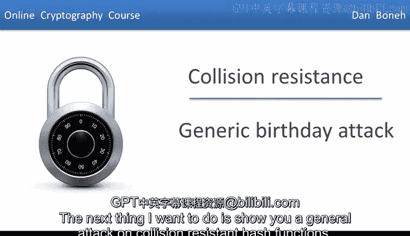
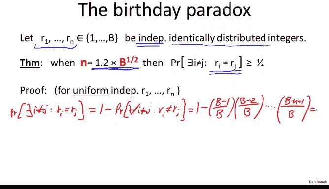
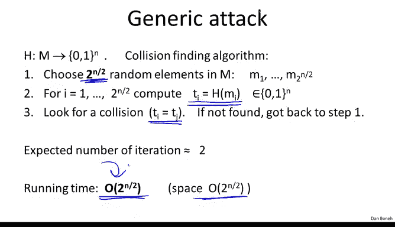
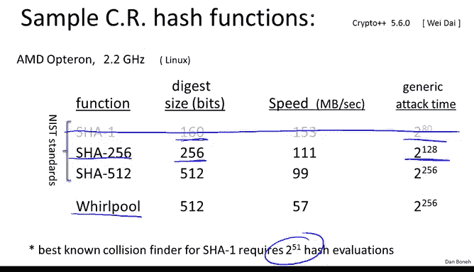

# 斯坦福大学《密码学｜Cryptography 1》中英字幕 - P30：30_03_02_通用生日攻击.zh_en - GPT中英字幕课程资源 - BV1Rf421o79E

The next thing I want to do is show you a general attack on collision resistant hash functions if you remember when we talked about block ciphers。

 we saw a general attack on block ciphers which we called the exhaustive search and that attack forced the key size for a block cipher to be 128 bits or more。

Similarly on collision resistance is a general attack called the birthday attack。

 which forces the outputs of a collision resistant hash functions to be more than a certain bound。

 and so let me show you the attack and then we'll see what those bounds come out to be。

So here's a general attack that can work on arbitrary collision resistant hash functions。

 So here we have our collision resistant hash functions， supposedly。

 let's suppose that it outputs end bit values。 In other words。

 the output space is roughly of size 2 to the n Now the message space is going to be much。

 much larger than n bits。 Let's say that the messages that are being hashed are say you know 100 times n bits。

I want to show you an algorithm that can find a collision for this hash function H in time roughly2 to the n over2 okay so roughly the square root of the size of the output space so here's how the algorithm is going to work what we'll do is we'll choose random2 to the n over2 messages in our message space let's called them M1 to M2 to the n over2 now because the messages themselves are much bigger than n bits there are 100 times n bits it's very likely that all these messages are distinct so they'll be distinct with high probability but for each one of these messages we're going to apply the hash function and obtain a tag t subi so this is of course the t sub are n bit long strings and now we're going to look for a collision among the t subi in other words we're going to find an I and a J says that t sub i equals to t subj and once we've done that we've basically found the collision because as we said with very high probability Mi is not equal to Mj but the hash of Mi is equal to the hash of Mj and therefore we found the collision。

The function H Now， if it so happens that we look through all two of the n over two T subs and we don't find the collision。

 we go back to step one and try another set of two of the N over two messages。So the question is。

 how well will this work， In other words， how many times do we have to iterate this process until we actually find the collision。

 and I want to show you that in fact， the number of iterations is going to be very， very small。

 which means that this algorithm will find a collision in time that's roughly proportional two to the in over two。

 So to analyze this type of attack， I have to tell you a little bit about the birthday paradox。

 I imagine some of you have already heard of the birthday paradox here stated as a theorem and I want to prove it to you because everybody should see a proof of the birthday paradox at least once in their lives。

So here it is， so imagine we have n random variables R1 to Rn in the interval 1 to B and the only thing I'm going to assume about them is that they're actually independent of one another。

 that's crucial that these n samples R1 to n to RN in this interval are independent of one another and they also happen to be distributed identically so for example they might all be uniform in the interval 1 to B。

 but again these would be independently uniform variables。

Now it so happens that if we set n to be about a square root of B， in other words。

 if we sample roughly square root of B samples from the interval1 to B， you know to be precise。

 it's 1。2 times the square root of B， then the probability that two of those samples will be the same is at least a half。

Okay， and then it turns out， in fact， the uniform distribution is the worst case for the birthday paradox。

 In other words， if the distribution from which the Rs are sampled from is non-uniform， then in fact。

 fewer than 1。2 times squared of V samples are needed。

 The uniform distribution is the worst case So we're going to prove this for the uniform distribution and that basically just also proves that for all other distributions。

 but the proof that I want to show you here will hold just for the uniform distribution。

 Okay so let's do the proof it's actually not difficult at all。

 So we're asking what is the probability that there exists in I is not equal to j such that R is equal to Rj。

Well， let's negate that， so there's basically one minus probability that for all I not equal to J。

 we have that R I is not equal to Rj。 This basically means that no collision occurred among the n samples that we chose。

Well let's try to write this out more precisely while we're going to write this as1 minus and now when we choose r1。

 basically it's the first one we choose， so it's not going to collide with anything。

But now let's look at what happens when we choose R2。 when we choose r2。

 let me ask you what is the probability that R2 does not collide with R1 Well。

 r1 takes one slots So there are b minus1 slots that if R2 falls into it's not going to collide with R1 So in other words。

 the probability that R2 does not collide with R1 is b minus1 slots divided by all B possible slots Similarlyly when we pick R3。

 what is the probability that r3 does not collide with either R1 or R2 again R1 and R2 take up two slots and so there are B minus2 slots that remain for r3 if it falls into either one of those b minus2 slots it's not going to collide with either R1 or R2 So I imagine you see the pattern now So R4 its probability of not colliding with R1 R2 or R3 is B minus3 over B and so on and so forth until we get to the very last Rn and the probability that。

RN does not collide with the previous Rs well there are n minus1 slots taken up by the previous Rs。

 so if RN falls into any of the remaining b minus n plus1 slots it's not going to collide with any of the previous R1 to Rn minus1 Now you notice the reason I was able to multiply all these probabilities is exactly because the Rs are all independent of one another so it's crucial for this step that the Rs are independent。

So let me rewrite this expression a little bit。 Let me write it as one minus the product of I goes from1 to n minus1 of1 minus I over B。

 Okay all I did is I just rewrote this as a big product as opposed to writing the terms individually。

 So now I'm going to use the standard inequality。 This says that for any positive x1 minus x is less than e to the minus x。

 And that's actually easy to see because e to the minus x。

 if you look at this Taylor expansion is1 minus x plus x squared over 2 minus and so on and so forth。

 And so you can see that we're basically ignoring this latter part of the Taylor expansion。

 which happens to be positive。 And as a result， the left side here is going be smaller than the righthand side。

 Okay so let's plug this inequality in。 And what do we get we get this is greater than1 minus the product of I goes from one to n -1。

Of E to the minus I over B。Okay， simply plugged in x equals I over B for each one of those terms。Now。

 the nice thing about exponentials is that we multiply them the exponent add as a result。

 this is simply equal to 1 minus E to the power of here let me take the1 over B out of the parentheses。

 sum of I goes from a1 to n minus1 of I。Okay so all I did is I took the minus1 over b out of the parentheses and we left with a simple sum of1 to n minus1 and so the sum of the integers from 1 to n minus1 is simply n times n minus1 over2。

 which I can bound by n squared over 2 and so really what I get at the end here is1 minus e to the power of minus n squared over 2 b。

Okay， I literally bounded this sum here by n squared over 2 Okay very good。

 now so what do we know about n squared over 2 b， Well。

 we can derive exactly what n squared over 2 b is from the relationship here。

 So if you think about it let's look at n squared over 2 Well n squared over 2 is 1。

2 squared over 2 1。2 squared is 1。44 divided by 2 is 0。

72 times the square root of b squared which is B so n squared over 2 is 0。72 B and as a result。

 n squared over 2 b is just 0。72 so we get 1 minus e to the power of minus 0。72。

Well so now you just plug this into your calculator and you get 0。

53 which is far as I know is always bigger than a half。

 so this proves the birthday paradox and you notice it was crucial to assume that the samples are independent of one another。

 we only prove that for the uniform distribution but as I said。

 it's actually fairly easy to argue now that any distribution that's away from the uniform distribution will satisfy this with even a lower bound so if you have 1。

2 squared of V， the theorem will certainly hold for non-unform distributions。

 The reason it's called a paradox is because it's very paradoxical that the square root function grows very slowly in particular。

 if you try to apply this to birth dates so let's assume that we have a number of people in a room and let's assume that their birth dates are independent of one another and our uniform in the interval 1 to 365。

Then what the birthday paradox says is that we need roughly 1。2 times square root 365。

Whi I believe is something like 23， which says we need roughly 23 people in a room and then with probability1 half。

 two of them will actually have the same birthday， The reason it's called a paradox is because the number 23 seems really small to people and yet by this theorem that we just proved with probability1 half there will be two people with the same birthday by the way。

 the intuition for why this fact is true is because really what the collision is counting is it's looking at all possible pairs of people and if you have a square root of B people then there are square root of B squared pairs roughly which is roughly B pairs total。

 and so it's very likely that each pair collides with probability one over B and if you have B pairs it's likely that one of the pairs will collide。

So hopefully this gives you intuition for where the square root comes from。

 it's basically from the fact that if you have n people in a room there are n squared possible pairs I should say by the way that even though the birthday paradox is often applied to birth dates。

 birth dates are actually not uniform at all if you actually look at the birth dates of people。

 you see that there's a very clear bias towards being born in September and for some bizarre reason there's also a bias towards being born on a Tuesday and so when we apply the birthday paradox to birthdays。

 in fact the actual bound is going to be smaller than one minus two squared to B because we said that for non-uniform distributions。

 you need even fewer samples before you get a collision。

So let me show you a graph of the birthday paradox it's quite interesting how it behaves。

 so here I set B to be a million， in other words we're picking random uniform samples in range one to a million。

And the x axis here is the number of samples that we're picking and the y axis is the probability that we get a collision among those n samples。

 so we see that the probability of one half happens around 1。2 square root of b， roughly 12001。

2 square root of b and you see that if we look at exactly square root of b。

 the probability for a collision is around 0。4 or 0。

41 and you notice the probability goes up to 1 extremely fast， for example。

 already at roughly two square root of B， the probability of a collision is already 90% Similarlyly when we go below square root of B。

 the probability of a collision very， very quickly drops to0 so there's kind of a threshold phenomena around square root of b where the probability for a collision goes to1 very quickly above square root of B and drops to0。

 very quickly below square root of B。

So now we can analyze our attack algorithm， so let me remind you here we chose two to the interval two random elements in the message space。

 we hash them。And so we started off with a random distribution in the message space after we hash them。

 we end up with some distribution， this distribution over tags might not be uniform。

 but we don't care the point is that these all these tags。

 t12 to the n over 2 are independent of one another and as a result。

 if we choose 2 to the n over 2 or 1。2 to the n over 2 tags。

 the probability that the collision will exist is roughly one half。So let me ask you then。

 in that case， how many times do we have to iterate this algorithm before we actually find the collision？

Well， so since each generation is going to find a collision with probability one half。

 we have to iterate about two times an expectation。 and as a result。

 the running time of this algorithm is basically2 to the n over 2 evaluations of the hash functions so notice also this algorithm takes a lot of space。

 but we're going to ignore the space issue and we're just going focus on the running time。

 so this is kind of cool。 This says that if your hash function outputs n bit outputs。

 there will always be an attack algorithm that runs in time2 to the n over 2。 So for example。

 if we output 128 bit outputs。 then a collision could be found in time 2 to the 64。

 which is not considered sufficiently secure。 Okay so this is why collision resistant hash functions generally are not going to output 128 bits。

 So let me show you some examples。 The first three are actually federal standards Sha1 shot to 56 and Sha 512。

 and the fourth one is an example from the designers of AS called whirlpool。

 And so you can see shall1。😊。

Plus's 160 bits and as a result there's a generic attack on it that runs in time 2 to the 80。

 shot 256 output 256 bits， so the generic attack will run in time 2 to the 128 and so on and so forth。

I also listed the speeds of these algorithms and you notice that the bigger the block size actually the slower the algorithm is and so there's a performance penalty。

 but nevertheless there is quite a bit of benefit in terms of security Now you notice the Shah function is actually grayed out the Sha function although nobody has found collisions for Shah1 yet it still recommended that in new projects and hopefully in programming projects in this class you don't use Shah1 instead use Sha to 56 and in particular。

 there is actually a theoretical collision finder on Shah1。 there works in time2 to the 51。

 So it's probably just a matter of time until finally someone finds a collision for Shah 1 and just kills altogether but the current advice is Shah 1 is still a collision resistant hash function because nobody is found collisions for it but it's probably just a matter of time just a few months or a few years until a collision is found and as a result in new projects and new projects Shah1 should not be used and only use Shah to56 or if you want to be even more cautious than use Shah 512 So this is the end of this。

And now we're going to turn to building collision resistant hash functions。

