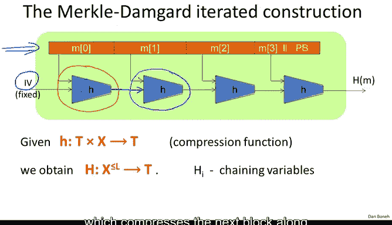

# 斯坦福大学《密码学｜Cryptography 1》中英字幕 - P31：31_03_01_默克尔-达姆加德范式.zh_en - GPT中英字幕课程资源 - BV1Rf421o79E

So now we're going to look at a very general paradigm called the Merle downguard paradigm that's used for constructing collision resistant hash functions。

 Before we do that， let me just remind you what our goals are。

 So as usual we say that H is a hash function that maps some large message space into a small tag space and we say that a collision for the hash function is basically a pair of distinct messages that happen to map to the same value under this hash function and our goal is to build collision resistant hash functions namely functions where it's hard to find even a single collision。

 even though we know many collisions exist， no efficient algorithm can even output a single collision So we're going to construct these hash functions。

 these collision resistant hash functions in two steps the first step which we're going to do in this segment is to show that if you give me a collision resistant hash function for short messages we can extend it and build a collision resistant hash function for much much much longer messages and the next segment will actually build collision resistant hash functions for short messages so let's look at the construction the construction is actually very general and in fact all。

Colllusionion resistant hash functions follow this paradigm。 It's actually a very elegant paradigm。

 and let me show you how it works。😊，So here we have our function H。

 which we're going to assume is a collision resistant hash function for small size inputs。

So the way we're going to use this little function H。

 this H is sometimes called a compression function。

 is we're going to take a big message M and break this message into blocks。

 and then we use a fixed value called the IV here in this case the IV is fixed forever and it's basically embedded in the code and in the standards。

 it's just a fixed IV that's part of the definition of the function。

And then what we do is we apply the small compression function H to the first message block along with this IV What comes out of that is what's called a chain variable that's going to be fed into the next compression function which compresses the next block along with the previous chain variable and outcomes the next chain variable and the next message block is compressed and so on and so forth until we reach the final message block and in the final message block。

 the one special thing that we do is we must append this padding block。

 this PB which stands for padding block and I'll explain what the padding block is in just a second but after we append the padding block we again compress the last chain variable with the last message block and the output of that is the actual output of the hash function。

So just to summarize in symbols， we have this compression function when maps elements in t this is the output of the hash function plus message blocks。

 this x corresponds to message blocks and outputs the next chain variable so as I said this is what the compression functions do and then from this compression function we're able to build a hash function for large inputs namely inputs in the space x to some power of L namely up to L blocks of x and of course these are variable length so we can have different length messages that are being given as input to this function H and what comes out of it is basically a tag in a tag space so the only thing that's left to define is the padding block and so the padding block actually is very important as we're going to see in just a minute what it is is basically well it's a sequence of 1000 just to denote the end of the actual message block and then the most important part of the padding block is that we encode the message length in this padding block and the message length field is basically fixed to be 64 bits so in all the。

functionsSo in all the shy hash functions， the maximum message length is 2 to the 64 minus1。

 so in fact the message length fits into a 64 bit block and an upper bound of2 to the 64 minus1 bits on the message length is actually sufficiently long to handle all the messages we're going to throw at it。

😊，Okay， so that's the padding block and of course the question is what do we do if the last block really is a multiple of the compression function block length where are we going to fit the padding block and the answer as usual is basically if there's no space for the padding block in the last block of the message then we're going to have to add another dummy block and stick the padding block in there and of course put the 10。

00 in the right place so the point is it's very， very important that the padding block contains the message length as we'll see in just a minute。

So this is the Merkel dam guard construction， the last piece of terminology I'll say is that we have these chaining variables。

 so H0 is the initial value， H1， H2， H3 up to H4， which is the actual final output of this hash function。

So as I said， all standard hash functions follow this paradigm for constructing a collision resistant hash functions from a compression function。

 The reason this paradigm is so popular is because of the following theorem which says basically that if the little compression function is collision resistance。

 then the big Merle damguard hash function is also collision resistance so in other words if we're going to build collision resistance functions for large inputs all we have to do is just build compression functions that our collision resistance。

So let's prove this theorem it's an elegant proof and it's not too difficult。

 so the way we're going to prove it is using the contra positiveitive that is if you can find me a collision on the big hash function。

 then we're going to deduce a collision on the little compression function。😊，Therefore。

 if little H is collision resistant， so will be the big H。

 so suppose you give me a collision on the big compression function。

 namely two distinct messages M& M prime that happen to hash to the same output。

 we're going to use M& M prime to build a collision on the little compression function。

So the first thing is we have to remember how the Merkel Damguard construction works and in particular let's assign names to the chain variables when we hash M versus when we hash m prime。

 so here the chain variables that come up when we hash the message capital M。

 so H0 is the fixed IV that starts the whole process H1 would be the result of hashing the first message block with the IV and so on and so forth until h subt plus1 is the final chain variable which is the final output of the Merkel Damguard chain。

And then similarly for M prime， let's define H0 prime to be the first changing variable H1 prime to be the result after compressing the first message block of M prime and so on and so forth up until we get to H prime of r plus1。

 which is the final hash of the message M prime Now you notice the length of the messages M and M prime don't have to be the same in particular M has length T。

 whereas M prime has length R。Now because the collision occurred。

 we know that these two values here are the same H of M is equal to h of m prime， in other words。

 the last chainning variables are actually equal to one another。

 so now let's look carefully how H plus1 and h prime r plus1 were calculated。Well。

 Ht plus1 is calculated as the compression function applied to the previous chain variable along with the last message block of M。

 including the padding block you notice here I'm assuming that the padding block fits with the last message block of M even if the last padding block is in its own block it's not going to make any difference。

 So for simplicity let's assume that the padding block fits with the last message block of capital M。

 So by hashing the last message block with a padding block and the last chain variable。

 we obtain ht plus1 and similarly the same thing happens with m prime by hashing the last message block。

 the last chain variable， we obtain h prime R plus1 and we know that since these two values are equal all of a sudden we have a candidate collision for the compression function here。

 let me circle the candidate collision， this is one part of it and this is the other part of it。

we have an equality between two arguments given to the compression function that happen to produce the same value。

 The only way we would not get a collision is if the arguments happen to be the same In other words。

 what we're seeing here is if the arguments to the compression function are distinct then we get a collision for little H so let's write it out more precisely so if Ht is not equal to H prime R or Mt is not equal to m prime R or the padding blocks are distinct。

Then we have a collision for the compression function H， and we're done， we're done and we can stop。

So the only way we need to continue is if this three way this junction doesn't hold so what does it mean that this junction doesn't hold well so the only reason we need to continue is if the second to last chain variables are equal。

 the last blocks of the messages are equal and the two padding blocks are equal。

So what does it mean that the two padding blocks are equal。

 remember that the message length were encoded in the padding block。

 so in particular this means that the length of M and the length of M prime is the same namely the T is equal to R so from now on I can assume t is equal to R whenever I wrote R I'm just going to write T。

But now we can apply exactly the same argument to the second to last chain variables in other words。

 how was Ht computed where Ht is computed by hashing the previous chain variable name Ht -1 with the second to last message block and similarly Ht prime was computed you notice I replaced R by T so Ht prime was computed by hashing the previous chain variable along with the second to last message block of m prime and because these two are equal now we get another candidate collision for the compression function in other words if Ht minus1 is not equal to Ht minus1 prime。

Or mt minus1 is not equal to M prime t minus1， then basically we have a collision freight。

And we can stop， we're done。So now the only case when we need to continue is if this condition over here doesn't hold namely。

 so let's suppose。That H T -1 is equal to H prime t minus-1。And we already know that， let's see。

 so MT is equal to MTt prime。And mt minus-1 is equal to mt minus1 prime。

Suppose it so happens that these two condition holds。

 well you can see that now we can continue to iterate， in other words。

 we can now apply exactly the same argument to hg minus1 and hg minus1 prime and so iterating this again and again。

 we can iterate all the way to the beginning of the message， iterate to the beginning。😊。

Of the message and one of two things must hold， either we find the collision for the compression function。

Or it so happens that all the message blocks of M and M prime are the same。 In other words。

 for all I M I is equal to M I prime， But this means because the messages we already prove the messages are the same length。

 This means that M is actually equal to M prime。But then this contradicts the fact that you gave me a collision to begin with。

 so in other words， this condition over here can't actually happen because it contradicts the fact that M& M prime are actually a collision for the big Merkel daguard function capital H and as a result this means that we have to find a collision for the depression function so that as we work our way from the end of the message all the way to the beginning at some point we must find the collision for little H。

Okay so this basically completes the proof of the theorem so I can put a little Q&D block here。

 so basically what this prove is that if the little compression function H is collision resistant。

 then the big Merle damguard function capital H must also be collision resistant so again the reason why people like this construction is it shows that to construct big hash functions it suffices to construct just compression functions for small inputs and we're going to do that in the next segment。

