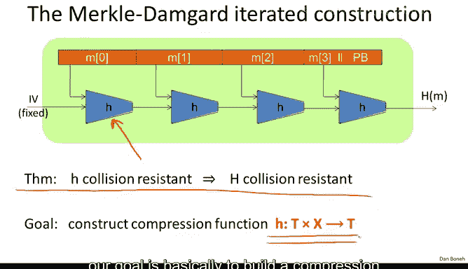

# 斯坦福大学《密码学｜Cryptography 1》中英字幕 - P32：32_03_02_构造压缩函数.zh_en - GPT中英字幕课程资源 - BV1Rf421o79E

So our goal for this segment is to build secure compression functions。

 so compression functions that are collision resistant， so just to remind you where we are。

 we looked at this Merkel damguard construction which takes a little compression function and makes and builds from it a hash function for much。

 much larger inputs。

When we proved this Q theorem that says that in fact。

 if the little compression function H is collision resistant。

 then plugging it into the Mer downguard construction gives us a collision resistant hash function for larger input so now in this segment our goal is basically to build a compression function that is collision resistance so we're going to see a couple of constructions。

😊。

And so the first question comes to mind is， well can we build compression functions from primitives that we already have in particular。

 we spent a lot of work to build block ciphers and the question is can we build compression functions from block ciifphers and the answer is yes。

 and let me show you how to do it。So assume we have a certain block cipher here。

 it operates on endbit blocks， so the input is in n bits， output is endbits。

And then there's this classic construction called the D myer Con， which I wrote down in symbols here。

 basically says that what you would do is given the message block and the chaining variable。

 all we do is we encrypt the chaining variable using the message block as a key。

 and then we kind of do one more X or on the output。😊。

So this might seem a little bizarre because remember the message block is something that's completely under the control of the adversary。

 he's trying to find a collision so he can choose the message blocks however he wants。

And yet we're using this message block as a key into a block cipher。

 but nevertheless we can argue that this construction。

 at least when E is what's called an ideal cipher， we can argue that this construction。

 in fact is as collision resistant as possible。So let me state the theorem。

 the theorem states that as I said， if E is an ideal block cipher。

 meaning thats a random collection of k random permutations from 01 to the n to 01 to the n。

 then under that assumption that E' is an ideal block cipher in fact finding a collision for this compression function H takes time two to the n over2 in particular we can show that anyone who's finding collisions has to evaluate the encryption decryption functions at least two to the in over two times。

And if you think about what that means， since the output of this compression function is only in bits long。

 we know that there's always a generic birthday attack that finds collisions in time2 to the N over2。

 so basically the theorem says that this collision resistant function is as collision resistant as possible。

We can find the collision in time 2 to the N over two using the birthday attack。

 but there is no algorithm that will do better than2 to the N over2。

So das mayer is actually a very common compression function used in collision resistant hashing。

 In fact， the shah functions all use das Mayer。 It turns out there's something special about the das maer construction that makes collision resistant If you just try to guess a construction Very likely you'll end up with something that's not collision resistant And so let me ask you the following puzzle。

 So we actually define the compression function as follows namely all we do is we encrypt the chainning variable H using the current message block as the key So the difference is that we dropped this X or H in das Mayer we simply ignored it So it's not there and the puzzle for you is show me that this compression function then is actually not collision resistant So let's see so we're trying to build a collision namely a distinct pair of HM and H prime M prime that happened to collide under this little function H and my question to you is how would you do it So I'm already going to tell you that you're going to choose HM and M prime arbitrarily the only requirement is that M。

M prime are distinct， and then my question is， how would you construct an H prime that would cause a collision to pop out？

So the answer is the first choice and the easy way to see it is if we apply the encryption function using M prime to both sides。

 then we get that this is basically E of M prime applied to H prime right this is what we get by applying encryption using M prime to the lefthand side and if we apply encryption using M prime to the right-hand side。

 the encryption operator cancels out and we simply are left with the encryption of M comma H。

 which is exactly the collision that we want to find。

So there you can see that it's basically by using the decryption function D。

 it's very easy to build collisions for this compression function。

Now I should tell you that in fact Das my is not unique there are other ways to build collision resistance compression functions from block ciphers for example here's a method called Migucci perial Miyagucci perial actually is used in willpool hash function that we saw earlier here's another method that happens to result in a collision resistance compression function and there are 12 variants like this playing with XOs and placing the variables in different slots that would actually give a collision resistant mechanism but there are also many。

 many variants of this like we saw in the previous puzzle that are not collision resistant so here's another example that's not collision resistant and I'm going to leave it as a homework problem to figure out a collision for this construction。

So now basically we have all the ingredients to describe the Sha 256 hash function。

 I'll tell you that it's a Merkel downguard construction exactly as the one that we saw before。

 it uses a davies Myer compression function and so the only question is what's the underlying block cipher for Davies Mayer and that block cipher is called chacal2 and I'll just tell you its parameters it uses a 512 bit key and remember the key is taken from the message block so this is really what the message block is and it so happens to be 512 bit which means that shot to 56 will process its input message 512 bit at a time and then the block size for this block cipher is 256 Bs and these are a chain variable so this would be H minus-1 and this would be a successive chain variable。

So now you have a complete understanding of how Sha 256 works， modo。

 this block cipher shotcal2 that I'm not going to describe here。So as I said。

 one class of compression functions is built from block ciphers。

 it turns out there's another class of compression functions that's built using hard problems for number theory。

 and I want to very briefly show you one example。And we call these compression functions provable because if you can find a collision on this compression function。

 then you're going to be able to solve a very hard number theoretic problem。

 which is believed to be intractable， and as a result if the number theoretic problem is intractable。

 the resulting compression function is provably a collision resistance。

So here's how this compression function works， basically we're going to choose a large prime P so this is a gigantic prime。

 something like 700 digits， 2000 bits， and then we're going to choose two random values U and V between 1 and P。

And now let's define the compression function as follows。

 it takes two numbers between0 and p minus-1 and it's going to output one number between0 and p minus-1。

 so its compression ratio is 2 to1 it takes two numbers and outputs one number in the range0 to p minus-1 and it does it basically by computing this double exponiciation。

 it computes u to dh times vta the n。And the theorem which right now I'm just going to state as a fact。

 this fact actually turns out to be fairly straightforward to prove and we're going to do it later on when we get to the number theoretical part of the course。

 the fact is that if you can find the collision for this compression function。

 then you can solve a standard heart problem in number theory called a discrete log problem everyone believes discrete log is hard and as a result this compression function is provably collision resistant。

So you might ask me why do people not use this compression function in practice why would we not use this for shot 256 and the answer is that this gives very slow performance in comparison to what you get from a block cipher。

 so this is not really used for any compression functions。

 however for some reason you really only want to say Mac or sign just one long message and you have a whole day to do it。

 and then certainly you can use this type of compression function and even though it's slow you'll get something that's provably collision resistance。

Okay， so that's the end of the segment and now we're finally ready to talk about HMac。

 which we're going to do in the next segment。

