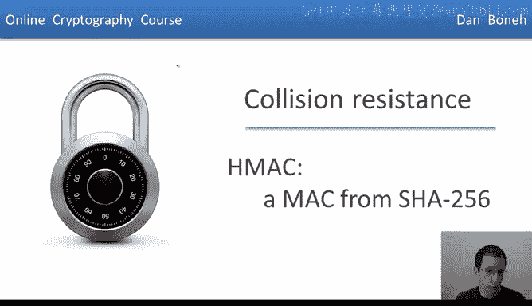
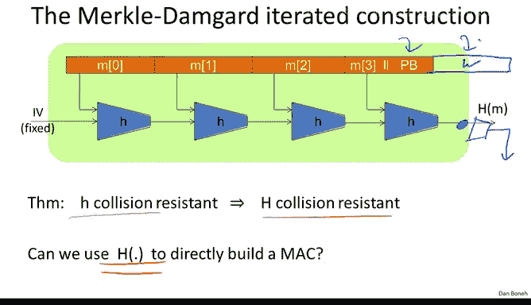

# 斯坦福大学《密码学｜Cryptography 1》中英字幕 - P33：33_03_01_HMAC.zh_en - GPT中英字幕课程资源 - BV1Rf421o79E

So now that we understand what collision resistant hash functions are and we know how to construct them。

 we're ready to describe very popular Mac called HMAC。

 so let me remind you what the Merkel damguard construction is basically we have a small compression function H from which we build a large hash function which is collision resistant。

 assuming the compression function is collision resistance。

The question we're going to ask this segment is， can we use a large hash function to construct a Mac directly without having to rely on a PRf？

So here's the first thing that comes to mind。 Supp I give you a Merkel down guard hash function。

 so you notice it map， it hashees large messages into small digests。

And we want to convert that directly into a Mac， so the first thing that comes to mind is， well。

 why don't we just hash the concatenation of the Mac key along with the message that we're trying to Mac and it turns out this is completely insecure and so let me ask you why this is insecure。

The answer is the standard extension attack。 And if you think back to the Merkel Damguard construction。

 you realize that if I tell you to tag for a particular message。 In other words。

 I tell you the value at this point， it's very easy for the attacker to just add another block。

And then compute one more application of the compression function H。

 and now they would be able to get the tag for the original message， concatenated the padding block。

 concatenated their wordW that they added themselves and as a result this is an existential forgery。

Yeah， so basically this is exactly what we get here where after concatetnating the padding block。

 the attacker can actually concatenate whatever he wants and he would get the tag on this combined message。

So this is totally insecure and I cannot tell you how many products have actually made this mistake where they assume that this is a secure Mac。

 this is completely insecure and should never， ever， ever be used。Instead。

 there is a standardized method to convert a collision resistant hash function into a Mac and that method is called HM。

 So in particular we could use the shot to 56 a hash function to build this Mac。

 The output is going to be 256 bits and in fact HM is believed to be a pseudo random function so in fact out of shot to 56。

 we get a pseudoran function that outputs 256 bit outputs。

So let me show you the construction here's the construction and symbols and it works as follows first we take our keyK and we concatennate what's called an internal pad to it an iPadad to it。

 this makes it into one block of the Merrkkel Damguard construction so for example this would be 512 bits in the case of shot 256。

We pre this to the message M and then we hash。Now this by itself we just said is completely insecure。

 however what HMap does in addition， it takes the output which is 256 bits。

 it's prepensed that the key again exhored with what's called the outer pad， the Oad。

 this also becomes 512 bits， it's one block， and then it hashees the combination of these two to finally obtain the resulting tag on the message M。

So it's more rather than looking at this in symbols。

 it's more instructive to look at HMac in pictures， and so you can see here the two keys K X or Inpa。

 which is then fed into the Merkel Damguard chain and then the resulting output of this chain is fed into another Merkle Damguard chain and finally the final output is produced。

Okay， so this is how HMac works in pictures。And now I want to argue that we've already seen something very similar to this。

In particular， if you can think of the compression function H as a PRf where the key is the first the top input。

Then what we're actually doing here is we're evaluating this PRFH at a fixed IV。

 and therefore the result here is a random value， which we're going to call K1。

And then we apply the Merkel down guard chain and we can do the same thing on the outer pad if you think of little H as a PRF where the key is the upper input。

 again， we're applying this PRF using a different key to a fixed value IV and as a result we're going to get another random value K2。

So now when we compute HMac using these keys K1 and K2， this should actually look very familiar。

 this is basically Nmac it's identical to NMac that we discussed in a previous segment and notice to argue that this is an NMac construction we have to assume that the compression function。

 little H is a PRf where the key is actually the lower input to the function Now let me say that these pads。

 the iPad in the Oad these are fixed constants that are specified in the HMac standard so these are literally just 512 bit constants that never change。

And so when we go back to look at the complete HMac construction。

 you realize that the main difference between this and NMac is that these keys here since they're dependent。

 you notice they're both just the same key Xor with different constants。

 essentially the keys K1 and K2 are also somewhat dependent because they're computed by applying a PRF to the same fixed value。

 namely IV， but with dependent keys。

And so to argue that K1 and K2 are pseudorandom and independent of one another。

 one has to argue that the compression function not only is a PRF where when the input。

 the top input is the key input， but it's also a PRF when dependent keys are used。

But under those assumptions， basically the exact same analysis at NMac would apply to HMac and we would get a security argument that HMAC is a secure Mac and so as I said HMAC can be proven secure under these PRF assumptions about the compression function H。

The security bounds are just as they are for Nmac in other words。

 you should not have to change the key as long as the number of messages you're mac is smaller than the size of the output tag to the one half but for Hmac shot256 output spaces2 to the 256 square root of that would put us a2 to the 128 which means that basically you can use Hmac shot 256 for as many outputs as you want and you always maintain security and as the last point about Hmac I'll tell you that TlS standard actually requires that one support Hmac shot 196 which means Hmac built from the Shah 1 function and truncated to 96 bit Shah1 remember outputs 160 bits and we truncated to the most significant 96 bit Now you might be wondering remember we said before the Sha 1 is no longer considered a secure hash function So how come we're using Sha1 and Hmac Well it turns out it's actually fine because Hmac the analysis of Hm。

Need Sha 1 to be collision resistant All it needs is that the compression function of Shah 1 be a PRF when either input is allowed to be the key and as far as we know that's still correct for the underlying compression function for Shah 1 even though it might not be collision resistant as far as we know it's still fine to use it inside of HMac so this is the end of our discussion of HMac and in the mix segment。

 we're going to look at timing attacks on HMac。

