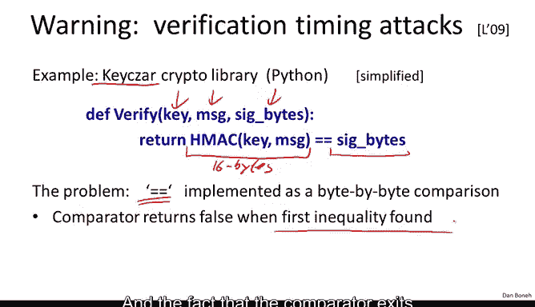

# 斯坦福大学《密码学｜Cryptography 1》中英字幕 - P34：34_03_02_MAC验证的时序攻击.zh_en - GPT中英字幕课程资源 - BV1Rf421o79E

In the last segment in this module， I want to show you a general attack that affects many implementations of Mac algorithms。

 and there's a nice lesson to be learned from an attack like this。

 So let's look at a particular implementation of Hm verification。

 This happens to be an implementation from the keysar library that happens to be written in Python。

 So here's the code that's used to verify a tag generated by H Macac。

 This code is actually simplified。 I just wanted to kind of simplify as much as I can to get the point across。

 So basically， what the inputs are the key， the message and the tag bytes。

The way we verify it is we recompute the HMac on the message， and then we compare。

 say the resulting 16 bytes。Two the actual given signature bytes。So this looks perfectly fine。

 in fact anyone might implement it like this， and in fact many people have implemented it like this。

The problem is that if you look at how the comparison is done。

 the comparison as you might expect is done byte by byte。

 there's a loop inside of the Python interpreter that loops over all 16 bytes。

 and it so happens that the first time it finds an inequality。

 the loop terminates and says the strings are not equal。

 and the fact that the comparator exits when the first inequality is found。

 introduces a significant timing attack on this library。

So let me show you how one might attack it。So imagine you're the attacker and you have a message M for which you want to obtain a valid tag Now your goal is to attack a server that has an HMAC secret key stored in it。

 and the server exposes an interface that basically takes message Mac pairs。

 checks that the Mac is valid if the Mac is valid it does something with the message and if the Mac is not valid。

 it says reject。Okay， it send back to the originator， the message reject。

So now this attacker has an opportunity to basically submit lots of message tag pairs and see if it can deduce the tag for the particular message for which it wants a tag and here's how we might use the broken implementation from the previous slide to do just that so what the attacker is going to do is submit many message tag queries where the message is always the same but with the tag it's going to experiment with lots and lots and lots of different tags。

So in the first query， what he's going to do is just submit a random tag along with the target message and he's going to measure how long the server took to respond。

 The next query that he's going to submit is he's going to try all possible first bytes for the tag。

 So let me explain what I mean by that。 So the remaining bytes of the tag that he submits are just arbitrary。

 it doesn't really matter what they are。 But for the first byte。

 what he'll do is he'll submit a tag starting with a byte 0。

 And then he's going to see whether the server took a little bit longer to verify the tag than before。

 If the server took exactly the same amount of time to verify the tag as a step 1。

 then he's going to try again this time with byte set to1。

 It still the server responded very quickly， he's going to try with a byte set to2 if the server responded quickly is going to sp with the byte set to 3 and so on。

 until finally， let's say when the byte is set to3， the server takes a little bit longer to respond。

 What that means is actually when it did the comparison between the correct Mac and the Mac submitted by the attacker。

The two matched on this bite and the rejection happened on the second by。

AhaSo now the attacker knows that the first byte of the tag is set to three。

 and now it can mount exactly the same attack on the second by。😊。

So here it's going to submit a tag with the second byte here， let me use a different color。

So he's going to submit a tag when the second byte is set to zero and it's going to measure whether this took a little bit longer then in step2 If not。

 he's going to change this to be set to one and he's going to measure if the server's response time is a little longer than before eventually let's say when he sets this to I don't know when the byte is set to 53 say all of a sudden the server takes a little bit longer to respond which means that now the comparator matched on the first two bytes and now the attacker learned that the first two bytes of the Mac are 3 and 53 and now he can move on and do the exact same thing on the third byte and then on the fourth byte and so on and so forth until finally the server says yes I accept you actually gave me the right Mac and then it will go ahead and act on this bogus message that the attacker supplied。

So this is a beautiful example of how a timing attack can reveal the value of a Mac。

 the correct value of the Mac， kind of byte by byte。

 until eventually the attacker obtains all the correct bytes of the tag。

 and then he's able to fool the server into accepting this message tag pair。

 The reason I like this example is this is a perfectly reasonable way of implementing a Mac verification routine and yet if you write it this way。

 it'll be completely broken。😊，So what do we do So let me show you two defenses。

 the first defense I'll write it then again in Python is as as follows and in fact。

 the keys our library exactly implemented this defense。

 this code is actually taken out of the updated version of the library the first thing we do is we test if the signature bytes submitted by the attacker are of the correct length。

 say for H Mac this would be say 96 bits or 128 bits and if not we reject that as an invalid Mac but now if the signature bytes really do have the correct length。

 what we do is we implement our own comparator that always takes the same amount of time to compare the two strings。

 So in particular this uses the zip function in Python which will essentially if you are giving it two 16 byte strings。

It will create 16 pairs of bytes， so it'll just create a list of 16 elements where each element is a pair of bytes。

 one taken from the left and one taken from the right。

And then you loop you loop through this list of pairs。

 you compute the Xer of the first pair and you or that into the result。

 then you compute the Xer of the second pair and you or that into the result。

 and you notice that if at any point in this loop， two bytes happen to be not equal。

 then the Xor will evaluate to something that's non-zero。

 and therefore when we ore it into the result， the result will also become non-zero and then we'll return false at the end of the comparison。

So the point here is that now the comparator always takes the same amount of time。

 even if it finds difference in byte number three， it will continue running down both strings until the very end and only then will it return the results so now the timing attack supposedly is impossible however this can be quite problematic because compilers try to be too helpful here so I optimize the compiler might look at this code and say。

 hey wait a minute I can actually improve this code by making the for loop end as soon as an incompatible set of bytes as discovered。

And so an optimizing compiler could be your kind of Aquila's heal when it comes to making programs always take the same amount of time and so a different defense which is not as widely implemented is to try and hide from the adversary what strings are actually being compared so let me show you what I mean by that so again here we have our verification algorithm so it takes those inputs a key message and a candidate Mac from the adversary。

And then the way we do the comparison is we first of all compute the correct Mac on the message。

 but then instead of directly comparing the Mac and the signature bytes from the adversary。

 what we're going to do is we're going to hash one more time so we compute a hash here of the Mac we compute a hash of the signature bytes。

 of course if these two happen to be the same then the resulting H Macs will also be the same so the comparison will actually succeed。

 but the point is now if sig bytes happen to equal Mac on the first byte but not on the remaining bytes。

 then when we do this additional hash layer， it's likely that the two resulting values are completely different and as a result the byte by byte comparator will just output on the first iteration。

The point here is that the adversary doesn't actually know what strings are being compared。

 and as a result he can't mount a timing attack that we discussed earlier。Okay。

 so this is another defense， at least now you're not at the mercy of an optimizing compiler。

The main lesson from all of this is that you realize that people who even are experts at implementing crypto libraries get this stuff wrong and the write code that works perfectly fine and yet is completely vulnerable to a timing attack that completely undo all security of the system so the lesson here is of course you should not be inventing your own crypto but you shouldn't even be implementing your own crypto because most likely it'll be vulnerable to the side channelnel attacks just use the standard libraries like Open SSL Keysar as actually a fine library to use that would reduce the chances that you're vulnerable to these types of attacks。

