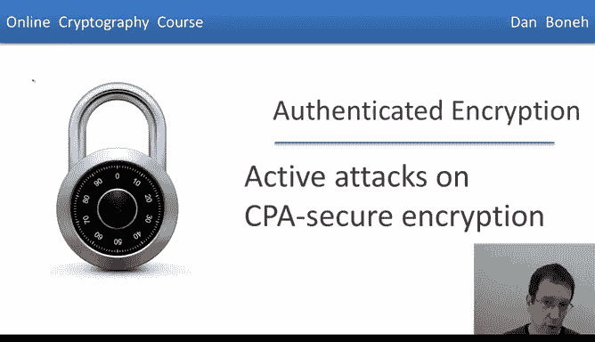
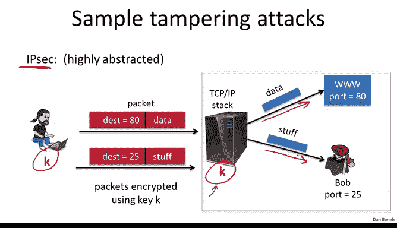
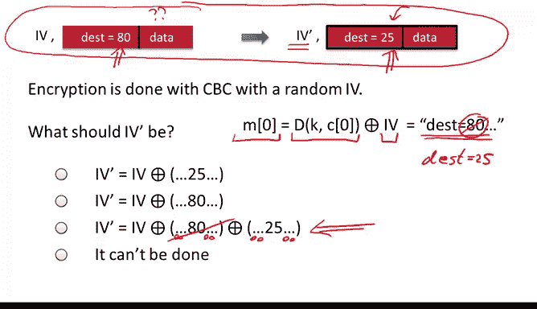
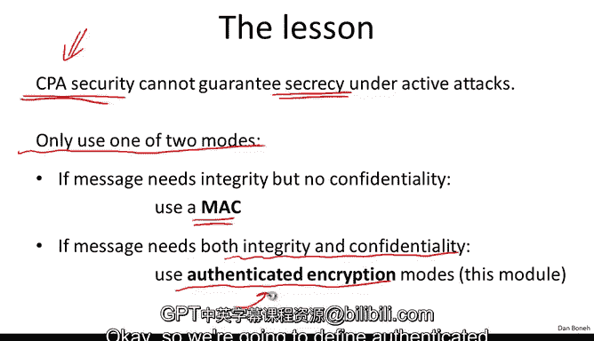

# 斯坦福大学《密码学｜Cryptography 1》中英字幕 - P35：35_04_01_对CPA安全加密的主动攻击.zh_en - GPT中英字幕课程资源 - BV1Rf421o79E

Now that we're done with message integrity， we're going to go back and talk about encryption and we're going to show how to construct encryption schemes that provide much stronger security guarantees than what we had before。

 but first let's do a recap of where we are。

So in previous segments we talked about confidentiality in particular how to encrypt messages such that we achieve semantic security against what's called a chosen plain text attack Now I kept mentioning again and again that security against chosen plain text attacks only provides security against eavesdropping in other words。

 this only provides security against adversaries that listen to network traffic but don't actually change any packets or don't inject their own packets and so on。

In this module， our goal is actually to design encryption schemes that are secure against adversaries that can tamper with traffic by blocking certain packets and injecting other packets and so on。

And then we also looked at how to provide message integrity where the message itself is not confidential。

 we just want to make sure that the message is not modified while's and routes and so we talked about message authentication codes。

 Mac algorithms that provide existential unfordgeability against the chosen message attack in other words。

 even though the attacker is able to obtain the Mac on arbitrary messages of his choice。

 he can't build Mac for any other messages and we looked at a number of Mac constructions in particular a CBC Mac。

 HM， a parallel Mac construction and a fastmac construction called a Carwaagman Mac in this module we're going to show how to combine these confidentiality and integrity mechanisms to obtain encryption schemes that are secure against a much much stronger adversary。

 namely an adversary that can tamper with traffic while it's in the network inject its own packets。

 block certain packets and so on and our goal is basically to ensure that even against such powerful adversaries。

 we maintain。

Finciiality， in other words the adversary can't learn what the plain text is and the adversary can't even modify the Cyphertext and cause the recipient to think that a different plain textex was actually sent so before we do that。

 I want to give you a few examples of adversaries that can tam with traffic and as a result。

 completely break security of CPA secure encryption。

This will show you that actually without providing integrity， confidentiality can also be destroyed。

 in other words the two must go together integrity and confidentiality if we're going to achieve security against active adversaries。

So let's look at an example from the world of networking in particular， let's look at TCPI。

 I'm going to use a highly simplified version of TCPI just so we can quickly focus on the attack and not get bogged down by the details。

So here we have two machines communicating with one another。

 a user sits at one machine and the other machine is a server now the server of course has a TCPIP stack that's receiving packets and then based on the destination field in those packets it forwards the packet to the appropriate place so here we have for example two processes listening to these packets。

 a web server say over here and another user will call him Bob over here the web server listens on port 80 and here this user Bob listens on port 25。

Now when a packet comes in， the TCPIP stack looks at the destination port。

 in this case it would be destination 80 and as a result the stack forwards the packets over to the web server。

 if the destination port said port 25， the TCPIP stack would forward the packet over to Bob who's listening on port 25。

Now a fairly wellknown security protocol called IPS encrypts these IP packets between the sender and the recipient。

 so here the sender and the recipients basically have a shared key and when the sender sends IP packets。

 those IP packets are encrypted using the secret keyK Now when a packet arrives at the destination emimulator arrives at the server the TCPI stack will go ahead and decrypt the packet and then look at the destination port and send it to the appropriate place decrypted you notice the data here is decrypted so in this case it would send it to the web server because the destination port is port 80。

If the destination port happens to be port 25， the TCPIP stack will decrypt the packet。

 look at the destination port and send the data in the clear to the process who's listening on Po 25。

 So now I want to show you that without integrity in this setup we can't possibly achieve any form of confidentiality and let's see why。

So imagine the attacker intercepts a certain packet that's intended for the web server。

 in other words it's an encrypted packet intended for port 80 remember that the attacker can actually receive the decryption of any packets that's intended for port 25 because the TCP stack will happily decrypt packets for port 25 and send them over to Bob who's listening over here。

So what Bob is going to do， Bob here is the attacker。

 what he's going to do is he's going to intercept this packet and route。

 prevent the packet from reaching the server as is。

 and instead he's going to modify the packet so now the destination port is going to read like port 25 this is done on the Cyphertex and we're going to see how to do that in just a minute。

When this packet now arrives at the server， the destination port says 25。

 the server will decrypt the packet， see that the destination is 25 and forward the data over to Bob。

So now Bob was simply by changing the destination port。

 Bob was able to read data that was not intended for himself。

 but rather was intended for the web server。So if the data is encrypted using CBC encryption with a random IV。

 remember this is a CPA secure scheme。Nevertheless， if that's the case。

 I'm going to show you that it's trivial for the attacker to change the ciphertext so that now he can obtain new ciphertext where the destination port is 25 instead of 80。

The only thing that's going to change is just the IV fields， in fact。

 everything else is going to remain the same。

So let's see how to do it so here just remind yourself that in fact。

 what the attacker captured is a CBC encrypted packet where he knows the destination port is port 80 but he doesn't know what the data is。

 The attacker has no clue what the data is， but he doesn' know what this packet is intended for the web server His goal is to build a new encrypted packet where now the destination port is port 25。

So the way he's going to do it as we said is just by changing the IV and let me remind you that the way you decrypt CDC encrypted data is essentially the first plain text block is simply theryption of the first Cyphertex block Xord with IV and we know that in the original packet this is going to readD equals 80 because in the original packet the destination port is port 80 so now my question to you is how will the attacker change the IV so now the destination port will read dust equals 25。

So it's pretty easy to see that if the attacker simply takes the original IV， exors it with here。

 there are a bunch of zeros over here and a bunch of zeros over here。

 he excs it with the zeros and then 80 exs with zeros and then 25 in the appropriate place。

 namely in the port bytes in the encrypted packets。

Then it's easy to see that when this new IV prime is sent along with the original Cyphertext。

 when the attacker decrypts， you can see that the original Cyphertex would decrypt to port 80。

 but now the new IV will cancel out this 80， this 80 here cancels out the 80 that would be obtained in the original plain text and then by xing with 25 essentially the destination now becomes 25。

So this is a nice example where with a simple change to the IV field。

 the attacker was able to divert the packet so that now after decryption the packet goes to the attacker instead of the actual web server and as a result now the attacker can read the plain text data that was intended for the server so this nice example shows that without integrity it's simply impossible for a CPA secure encryption to provide confidentiality when the attacker can modify packets and route CP secure encryption only provides confidentiality if the attacker is only eavesdropping on data but can't actually modify Cyphertex and route whereas as you see if you can modify Cyphertex a simple modification completely reveal the plain text。

I want to show you another tampering attack that only requires network access to traffic。

 it doesn't actually require the attacker to be present on the decryption machine。

So let's look at an example where there's a remote terminal application where every time the user hits a keystroke。

 basically an encrypted keystroke is sent over to the server and let's pretend that the encrypted keystroke is encrypted using counter mode so here you have the TCPI packet D here corresponds to the one by keystroke and as we said it's encrypted using counter mode and as you probably know every TCP packet actually contains a checkum。

 this is a 16 bit checkum that's just used to detect transmission errors so the server。

 if it receives a packet that has the wrong checkum it simply drops it on the floor and ignores it Now the TCP header including the checkum and the keystroke all or encrypted using counter mode Now the attacker wants to learn what the keystroke was and let me show you what he can do The attacker is going to intercept this packet and he's not actually going to modify it。

 he's going to send it over to the server， but he's going to record the packet。

Later on he's going to modify the packet and send the modified packet over to the server。

 what he's going to do is he's going to exhort the encrypted Chsum field with a value T and he's going to exhort the encrypted data field with a value S and he's going to do this for lots and lots of T's and Ss。

Now， remember a property of counter mode is that if you exhort the ciphertex with T after decryption。

 the resulting plain text is also exhort with T， similar to if you exhort the encrypted data with S after decryption。

 the resulting decrypted data will also be encrypted with S。

Now the server is going to decrypt this modified packet and the resulting packet is going to have the check sum x with T and the data xor with S。

Now what happens if the modified checkum is correct for this modified packet。

 the server will send an act back， if the modified checkum is incorrect for this modified packet。

 the server will just drop the packet on the floor and do nothing。So the attacker can simply observe。

 look for an act packet or not， and in doing so， he learns whether this particular x or of T and X or of s pairs corresponds to a valid check sum or not。

Now the attacker is going to do this for lots and lots of Ts and Ss and you notice what he learns is if I modify the data by xoring it with this particular value S that changes the checkum by a particular value T and he learns for lots of T and S pairs So it turns out for certain check sums by looking at a sequence of equations of this type。

 you can actually figure out what the value D is I should point out that for the TCP checkum this actually might not be true。

 but certainly there are easy checkums for which this is actually absolutely true。

 So again by looking at a lot of equations of this type。

 the attacker can recover D and this is a really nice example of what's called a chosen cphertext attack。

 the attacker basically submitted ciphertext of his choice that was derived from the ciphertex that he wanted to decrypt and then by looking at how the server responded。

 he was able to learn something about the resulting plain text and by repeating this for many different values of T andS he was actually eventually able to recover what the actual full plane。

text is。So in this segment we're going to look at many more examples of attacks of this type。

 these are called active attacks where the attacker is actually modifying traffic in route。

 and I hope that these two simple examples convinces you that all you provide is CPA security。

 in other words security against eavdropping， you can't even guarantee secrecy against an active attacker。

 not only does your ciphertna have integrity， in other words。

 the recipients might obtain a message different from the one sent by the sender。

But you don't even have confidentiality， and I showed you two examples where without that integrity。

 the attacker can simply decrypt the packet using the recipient as an oracle for decrypting certain parts of the data。

And so the lesson that I'm going to repeat again and again and again throughout this module is that if your message needs integrity。

 but no confidentiality， just use a Mac。But if your message needs integrity and confidentiality。

 you have to use what's called an authenticated encryption mode。

 which is precisely the topic of this module， so the next thing we're going to do is define what authenticated encryption means and we're going to build authenticated encryption systems but the point I want you to remember is that the CPA security mode we discussed before should never actually be used to encrypt data by themselves so CBC with a random IV is a building block towards authenticated encryption but should never be used on its own。

Okay， so we're going to define authenticated encryption in the next segment。

