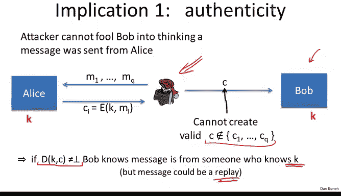
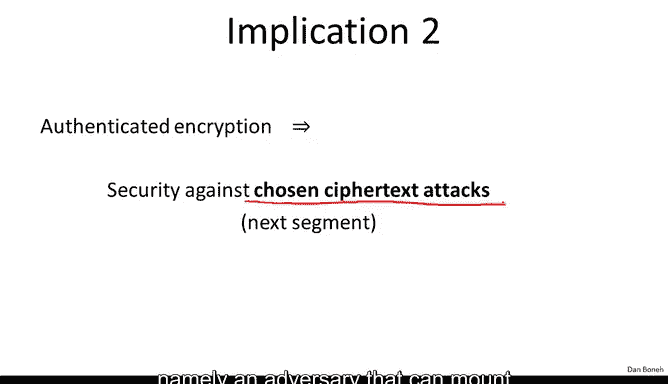

# 斯坦福大学《密码学｜Cryptography 1》中英字幕 - P36：36_04_02_定义.zh_en - GPT中英字幕课程资源 - BV1Rf421o79E

In the last segment， we saw two active attacks that can completely destroy the security of CPA secure encryption。

In this segment， we're going to define a new concept called authenticated encryption that remains secure in the presence of an active adversary。

In later segments， we'll construct encryption schemes that satisfy this new authenticated encryption concept。

So what is authenticated encryption authenticated encryption is a cipher where as usual the encryption algorithm takes a key a message and obs an and outputs a ciphertext The decryption algorithm as usual outputs a message however here the decryption algorithm is allowed to output a special symbol called bottom when the decryption algorithm outputs the symbol bottom basically it says that the cphertex is invalid and should be ignored the only requirement is that this bottom is not in the message space so that in fact it is a unique symbol that indicates that the cphertex should be rejected Now what is mean for an authenticated encryption system to be secure well the system has to satisfy two properties。

 The first property is that it has to be semantically secure under a chosen plans attack just as before。

 but now there's a second property which says that the system also has to satisfy what's called ciphertext integrity What that means is that even though the attacker gets to see a number of ciphertexts it should not be able to produce another ciphertex that decrypts properly。

In other words that decry is something other than bottom more precisely。

 let's look at the ciphertext integrity game So here ED is a cipher with messagespace M as usual the challenger begins by choosing a random keyK and at the adversary can submit messages of his choice and receive the encryptions of those messages so here C1 is the encryption of M1 where M1 was chosen by the adversary and the adversary can do this repeatedly in other words he submits M2 and obtains the encryption of M2 and so on and so forth。

 he submits many more messages up until NQ and obtains the encryptions of all those messages。

So here the adversary obtained Q ciphertexts for messages of his choice and then his goal is to produce some new ciphertext that's valid。

 so we'll say that the adversary wins the game if basically this new Cyphert that the adversary created decrypts correctly in other words decrypt is something other than bottom and it's a new ciphert in other words it's not one of the ciphertexs that was given to the adversary as part of his chosen plain text attack and then as usual we define the adversary's advantage in the Cyphertext integrity game as the probability that the challenger outputs one at the end of the game and we'll say that the cipher has Cyphertext integrity if in fact for all efficient adversaries the advantage in winning this game is negligible so in other we understand what Cyphertext integrity is we can define authenticated encryption and basically we say that the cipher has authenticated encryption if as we said it semantically secure under a chosen plain text attack and it also has ciphertext integrity。

So just is a bad example。 let me mention that CBC with a random IV does not provide authenticated encryption because it's very easy for the adversary to win the Cyphertext integrity game。

 The adversary simply submits a random ciphertex and says the decryption algorithm for CBC encryption never outputs bottom it always outputs some message the adversary just easily wins the game any old random ciphertext will decry to something other than bottom and therefore the adversary directly wins the Cyphertext integrity game So this is just a trivial example of a CP secure cipher that does not provide authenticated encryption So I want to mention two implications of authenticated encryption。

 The first I'll call authenticity which means that basically an attacker cannot fool the recipient Bob into thinking that Alice sent a certain message that she didn't actually send So let's see what I mean by that while here the attacker basically gets to interact with Alice and get her to encrypt arbitrary messages of his choice So this is a chosen。

Text attack。And then the attacker's goal is to produce some Cyphertext that was not actually created by Alice and because the attacker can't win the Cyphertex integrity game。

 he can't do this。 And what this means is when Bob receives the Cyphertext that decrypts correctly under the decryption algorithm。

 he knows that the message must have come from someone who knows the secret keyK in particular。

 if Alice is the only one who knows K then he knows the Cyphertext really did come from Alice and it's not some modification that was sent by the attacker Now the only caveat to that is that authenticated encryption doesn't defend against replay attack in particular the attacker could have intercepted some Cyphertex from Alice to Bob and could have replayed it and both Cyphertext would look valid to Bob So for example。

 Alice might send a message to Bob saying transfer $100 to Charlie then Charlie could replay that ciphertext and as a result Bob would transfer another 100 to Charlie So in fact。

 any encryption protocol has to defend against。Play attacks。

 and this is not something that's directly prevented by authenticated encryption。

 and we'll come back and talk about replay attacks in two segments。

The second implication of authenticated encryption is that it defends against a very powerful type of adversary。

 namely an adversary that can mount what's called a chosen Cypherticex attack。

 and we're going to talk about that actually in the next segment。😊。

