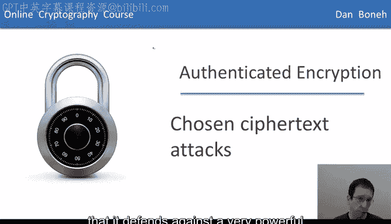
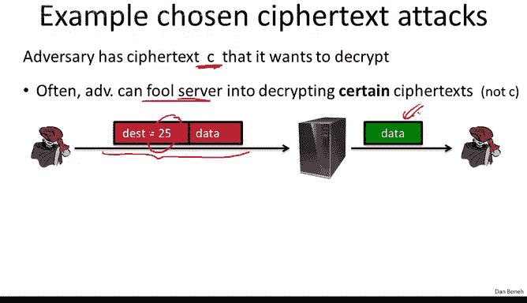
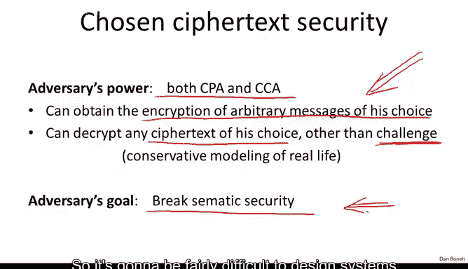

# 斯坦福大学《密码学｜Cryptography 1》中英字幕 - P37：37_04_03_选择密文攻击.zh_en - GPT中英字幕课程资源 - BV1Rf421o79E

In the last segment， we defined authenticated encryption。

 but I didn't really show you why authenticated encryption is the right notion of security。

In this segment， I want to show you that authenticated encryption， in fact。

 is a very natural notion of security。 and I'll do it by showing you that it defends against a very powerful attack called a chosen Cyphertex attack。

 So in fact， we already saw a number of examples of a chosen Cyphertex attack。

 So imagine the adversary has some Cyphert C that it wants to decrypt。

 And what it can do is for example， fool the decryption server into decrypting some cphertex。

 but not actually a Cyphert C。 So we already saw some examples of that。

 If you remember in the first segment we looked at an adversary that can submit arbitrary Cyphertex。

 And if the plain text happened to start with destination equals 25。

 then the adversary is actually given the plain text in the clear。😊。

So that's an example of an adversary that can obtain the decryption of certain cipherts。

 but not all ciphertexts。

Another example we saw is an adversary that can learn something about the plain text by submitting Cyphertext to the decryptor。

 so we had this example where the adversary submits encrypted DCCPIP packets to the decryption server and if the decryption server sends back an act。

 the adversary learns that the decrypted plain text had a valid checkum and otherwise the decrypted plain text didn't have a valid checkum So this is again an example of a chosen Cyphertext attack where the attacker submits Cyphertext and learns something about the decryption of that ciphertext。

So to address this type of threat， we're going to define a very general notion of security called chosen Cypherte security。

So here we're going to give the adversary a lot of power。

 okay so he can do both chosen plain text attack and a chosen Cypherex attack in other words。

 he can obtain the encryption of arbitrary messages of his choice。

And he can decrypt any Cyphertex of his choice other than some challenge ciphertex。

And as I showed you before， this is actually a fairly conservative modeling of real life。

 in real life often the attacker can fool the decryptor into decrypting certain cphertexs for the attacker。

 but not all cipherts。So the model here is that the attacker has a certain Cyphertex that it wants to decrypt。

 it can interact with the decryptor by issuing these chosen Cyphertex query to the decryptor。

 namely to decrypt various Cyphertext other than the challenge Cyphertext。

 and then the adversary's goal is to break semantic security of the Cha Cyphertext。😊。

So you notice that we're giving the adversary a lot of power and all we're asking you to do is break semantic security so it's going to be fairly difficult to design systems that are secure against such adversaries and nevertheless we're going to do it so let's define the chosen Cyphertex security model more precisely so as usual we have a cipheredD and we're going to define two experiments experiment zero and experiment1 so this should look somewhat familiar by now the challenger is going to start off by choosing a random key and now the adversary is going to submit queries to this challenger Every query can be one of two types it can be a chosen plain test query or it can be a chosen Cypherex query。

So chosen plan text squares we already know， basically the adversary submits two messages， M0 and M1。

 they have to be the same length and the adversary receives the encryption of either M0 if we're an experiment 0 or M1 if we're in experiment1。

So he received the encryption of the left or the right。

 depending on whether we were in experiment zero or an experiment one。

The second type of query is the more interesting one。

 This is where the adversary submits an arbitrary ciphertext of his choice and what he gets back is the decryption of that ciphertext。

 So you notice the adversary is allowed to decrypt arbitrary ciphertext of his choice。

The only restriction is that the Cyphertex is not one of the ciphertexts that were obtained as a result of a CPA query。

And of course this wouldn't be fair otherwise， because the attacker can simply take one ciphertext that was obtained from a CPA query that's going to be either the encryption of M0 or the encryption of M1。

 if he could submit a CCA query for that particular ciphertext he will in response either obtain M0 or M1。

 and then he'll know whether he's an experiment0 or experiment1。So this wouldn't be fair。

 so we say that the CPA Cyphertexts that he received are the challenged ciphertexts。

 and he's allowed to decrypt any ciphertex of his choice other than these challenged ciphertexts。

And as usual， his goal is to determine whether he is an experiment zero or an experiment one。

So I'm going to emphasize again that this is an extremely powerful adversary。

 one that can decrypt any Cyphertext of this choice other than the challenge Cyphertext。

 and still he can't distinguish whether he's an experiment zero or an experiment one。

So as usual， we say that the cipher is CCA secure， chosen Cypher tick secure。

 if the adversary behaves the same in experiment  zero as it does in experiment1。

 namely cannot distinguish the two experiments。So let's start with a simple example and show that in fact CBC with a random IV is not CCA secure。

 is not secure against chosen Cyt attacks， so let's see why that's the case。

 so what the adversary is going to start by doing he's going to simply submit two distinct messages M0 and M1 and let's just pretend that these messages are one block messages。

And what he's going to get back is the CBC encryption of either N0 or M1。

 you notice the sphert only has one block because the plain texts were only one block long。

Now what is the attacker going to do， Well， he's going to modify the Cyphertext C that he was given into C prime simply by changing the IV Okay so he just takes the IV and xors it with one。

 That's it。This gives a new Cyphertext C prime， which is different from C。

 and as a result it's perfectly valid for the adversary to submit C prime as a chosen Cyphertex query。

So he asked the challenger， please decrypt this C prime for me。The challenger。

 because C prime is not equal to C， must decrypt C prime。

 and now let's see what happens when you decrypt C prime， Well what's the decryption of C prime。

 let me ask you。

So you probably remember from the first segment that if we Xor the IV by one that simply xor the plain text by1。

 so now the adversary received M0 x or1 or M1 X or1 and now he can perfectly tell whether he's an experiment 0 or an experiment1。

 so the advantage of this adversary is basically one because he can very easily tell which experiment he's in and as a result he can win the chosen Cypherex security game。

So if you think about it for a second， you'll see that this attack game exactly captured the first active attack that we saw where the adversary slightly changed the Cypherex that he was given。

 and then he got a decryptor to decrypt it for him and therefore he was able to eavesrop on messages that were not intended for the adversary。

So I want to emphasize again that this chosen Cyphertext game really does come up in real life。

 where the adversary can submit Cyphertext to the decryptor and the decryptor can reveal information about the plain text or can give the plain text outright to the adversary for certain Cyphertext。

 but not others。So this is a very natural notion of security and the question is how do we design cryptoyems that are CCA secure？

So I claim that this authenticated encryption notion that we defined before actually implies chosen Cyphertex security and this is why authenticated encryption is such a natural concept so the theorem basically says。

 well if you give me a cipher that provides authenticated encryption the cipher can withstand chosen Cyphertex attacks and more precisely the theorem says the following if we have an adversary that issues Q queries。

 in other words at most QCPA queries and Q chosen Cyphertex queries。

 then there are two efficient adversaries B1 and B2 that satisfy this inequality here。

So since the scheme has authenticated encryption， we know that this quantity is negligible because it's CPA secure and we know that this quantity is negligible because the encryption scheme has Cyphert integrity。

 and as a result since both terms are negligible， we know that adversial advantage in winning the CCA game is also negligible。

So let's prove this theorem， it's actually a very simple theorem to prove。

 and so let's just do it as proof by pictures okay so here we have two copies of the CCA game。

 so this would be experiment zero。😊，And the bottom one is experiment1。

 you can see the adversary is issuing CPA queries and he's issuing CCA queries and at the end he outputs a certain guess B。

 let's call a B prime and our goal is to show that this B prime is indistinguishable in both cases。

 in other words， probability that B prime is equal to1 in the top game is the same as the probability that B prime is equal to 1 and the bottom game。

Okay， so the way we're going to do it is the following。 Well， first of all。

 we're going to change the challenger a little bit so that instead of actually outputting the decryption of CCA queries。

 the challenger is just going to always output bottom。

 So every time the adversary submits a CCA query， the challenger says bottom。

And I claim that these two games are in fact indistinguishable， in other words。

 the adversary can't distinguish these two games for the simple reason that because the scheme has Cyphertext integrity。

 the adversary simply cannot create a ciphertext that's not in C1 to C I minus1。

That decryptps to anything other than bottom。 That is the definition of Cyphertex integrity。

And as a result， again， because of Cyphertex integrity。

 it must be the case that every chosen Cyphertex query that the adversary issues results in bottom。

 if the adversary in fact could distinguish between the left game and the right game。

 that would mean that at some point he issued a query that decrypted to something other than bottom and that we could use to then break Cyphertex integrity of the scheme and since the scheme has Cyphertex integrity these left and right games are indistinguishable so that's kind of a acute cute argument that shows that it's very easy to respond to chosen Cyphertex queries when you have Cyphertex integrity。

😊，And the same thing exactly applies on the bottom where we can simply replace the chosen sex responses by just always saying bottom。

Okay， very good。 But now since the chosen sidepherex queries always respond in the same way。

 they're not giving the adversary any information。 The adversary always knows that we're always going to just respond with bottom。

 so we might as well just remove these queries because they don't contribute any information to the adversary。

But now once we remove these queries， the resulting game should look fairly familiar。

 the top right game and the top bottom game are basically the two games that come up in the definition of CPA security。

And as a result， because the scheme is CPA secure， we know that the adversary can't distinguish the top from the bottom。

And so now by this chain of reasoning we've proven that all these games are equivalent and in particular。

 the original two games that we started with are also equivalent and therefore the adversary can't distinguish the top left from the bottom left。

And therefore， the scheme is CCA secure。So this gives you the intuition as to why authenticated encryption is such a cool concept because primarily it implies security against chosen Cyphertext attacks so as we said。

 authenticity encryption ensures confidentiality， even if the adversary can decrypt a subset of the ciphertex and more generally even if he can mount a general chosen Cyphertext attack he still is not going to be able to break semantic security of the system however it is important to remember the tool limitations first of all it does not prevent replay attacks on its own we're going to have to do something in addition to defend against replay attacks we're going to see several examples where if the decryption engine reveals more information about why a Cyphertex is rejected。

 it doesn't just output bottom but it actually outputs more information say by timing attacks and that explains why the Cyphertex is rejected then in fact that can completely destroy security of the authenticated encryption system so we'll see some cute attacks like this in a later segment。

Okay， so in the next segment， we're going to turn to constructing authenticated encryption systems。

