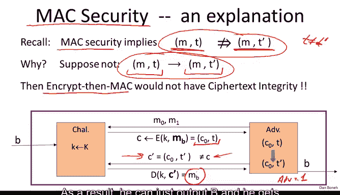
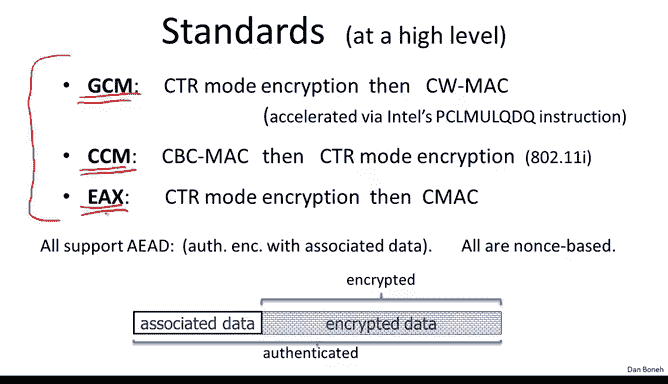
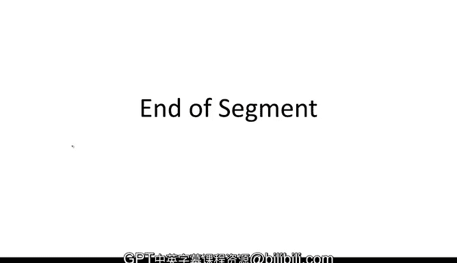

# 斯坦福大学《密码学｜Cryptography 1》中英字幕 - P38：38_04_01_基于密码和MAC的构造.zh_en - GPT中英字幕课程资源 - BV1Rf421o79E

In this segment we're going to construct authenticated encryption systems since we already have CPA secure encryption and we have secure Macs。

 the natural question is whether we can combine the two somehow in order to get authenticated encryption and if that's exactly what we're going to do in this segment authenticated encryption was introduced in the year 2000 in two independent papers that I point to at the end of this module。

 but before then many crypto libraries provided an API that separately supported CP secure encryption and Mac。

So there was one function for implementing CPA secure encryption， for example。

 CBC with a random IV and another function for implementing a Mac。

And then every developer that wanted to implement encryption had to himself called separately the CPA secure encryptncion scheme and the Mac scheme。

In particular， every developer had to invent his own way of combining encryption and Mac to provide some sort of authenticated encryption。

 but since the goals of combining encryption and Mac wasn't well understood since authenticated encryption hasn't yet been defined。

 it wasn't really clear which combinations of encryption and Mac are correct and which aren't。

And so every project as I said， had to invent its own combination and in fact not all combinations were correct。

 and I can tell you that the most common mistake in software projects were basically incorrectly combining the encryption and integrity mechanisms。

😊，So hopefully by the end of this module， you will know how to combine them correctly and you won't be making these mistakes yourself。

So let's look at some combinations of CPA secure encryption and Mac that were introduced by different projects。

So here are three examples so first of all in all three examples there's a separate key for encryption and a separate key for Mac These two keys are independent of one another and both are generated at session setup time and we're going to see how to generate these two keys later on in the course。

 So the first example is the SSL protocol So the way SSL combines encryption and Mac in the hope of achieving authenticated encryption is the following Basically you take the plain text M and then you compute a Mac on the plain text M so you use your Mac key KI to compute tag for this message M and then you cancatenate the tag to the message and then you encrypt the concatetnation of the message in the tag and what comes out is the actual finalcipher text。

So that's option number one。The second option is what IP S does， so here you take the message。

 the first thing you do is you encrypt the message。

And then you compute a tag on the resulting Cyphertex so you notice the tag itself is computed on the resulting Cyphertext the third option is what the SSH protocol does。

 so here the SSH takes the message and encrypts it using a CPA secure encryption scheme and then to it it concatennates a tag of the message the difference between IPse and SSH is that in IPC the tag is computed over the Cyphertex whereas an SSH the tag is computed over the message。

And so these are three completely different ways of combining encryptions and Mac。

 and the question is which one of these is secure？So I will let you think about this for a second and then when we continue。

 we'll do the analysis together Okay， so let's start with the SSH method so in the SSH method you notice that the tag is computed on the message and then concatenated in the clear to the Cyphertex。

Now this is actually quite a problem because Macs themselves are not designed to provide confidentiality。

 Macs are only designed for integrity， and in fact there's nothing wrong with a Mac that as part of the tag outputs a few bits of the plain text。

 outputs a few bits of the message M that would be a perfectly fine tag。

 and yet if we did that that would completely break CPA security here。

 because some bits of the message are leaked in the Cyphertext。And so the SSH approach。

 even though the specifics of SSH are fine and the protocol itself is not compromised by this specific combination。

 generally it's advisable not to use this approach。

 simply because the output of the Mac signing algorithm might leak bits of the message So now let's look at SSL and IP S as it turns out the recommended method actually is the IP S method because it turns out no matter what CPA secure system and Mac key you use the combination is always going to provide authenticated encryption let me very briefly explain why basically what happens is once we encrypt the message。

 well the message contents now is hidden inside the cipher text。

And now when we compute a tag of the Cyphertext， basically we're locking this tag。

 locks the ciphertext and makes sure no one can produce a different ciphertext that would look valid。

And as a result， this approach ensures that any modifications to the Cyphertext will be detected by the decryor simply because the Mac isn't going to verify as it turns out that the SSL approach。

 there actually are kind of pathological examples where you combine CP secure encryption system with a secure Mac and the result is vulnerable to a chosen Cyphertext attack so that it does not actually provide authenticated encryption and basically the reason that could happen is that there is some sort of bad interaction between the encryption scheme and the Mac algorithm such that in fact there will be a chosen Cyphertext attack So if you're designing a new project。

 the recommendation now is to always use encrypt than Mac because that is secure no matter which CP secure encryption and secure Mac algorithm you're combining Now just to set the terminology the SSL method is sometimes called Mac then encrypt。

And the IP S method is called encrypt， then。Mac。The SS method。

 even though you're not supposed to use it， is called encrypt and Mac。Okay。

 so I'll often refer to encrypt and Mac and Mac and encrypt to differentiate SSL and IPS。

Okay so just to repeat what I've just said the IPec method encrypt and Mac always provides authenticated encryption If you start from a CP secure cipher and a secure Mac。

 you will always get authenticated encryption as I said Mac that encrypt in fact there are pathological cases where the result is vulnerable to CCA attacks and therefore does not provide authenticated encryption however the story is a little bit more interesting than that in that it turns out if you're actually using randomized counter mode or randomized CBC then it turns out for those particular CP secure encryption schemes Mac that encrypt actually does provide authenticated encryption and therefore it is secure In fact there's even a more interesting twist here in that if you're using randomized counter mode。

 then it's enough that your Mac algorithm just be one time secure it doesn't have to be a fully secure Mac it just has to be secure when a key is used to encrypt a single message and when we talked about message integrity we saw that there are actually much faster Macs that are。

One time secure， then master are fully secure。As a result， if you're using randomized counter mode。

 Mac then encrypt could actually result in a more efficient encryption mechanism。 However。

 I'm going to repeat this again。 The recommendation is to use encryptpt than Mac and we're going to see a number of attacks on systems that didn't use encrypt than Mac and so just make sure things are secure without you having to think too hard about this again。

 I'm going recommend that you always use encrypt than Mac Now once the concept of authenticated encryption became more popular。

 a number of standardized approaches for combining encryption and Mac turned up and those were even standardized by the National Institute of standards。

 So I'm just going to mention three of these standards two of these were standardized by a NIST。

And these are called Galua counter modede and CBC counter mode and so let me explain what they do。

 Galua counter mode basically uses counter modeode encryption or randomized counter mode with a Carter wagonagman Mac so a very fast Carterterwagman Mac the way the Carter Wagman Mac works in GM is basically a hash function of the message that's being maced。

And then the result is encrypted using a PRF Now this hash function in GM is already quite fast to the point where the bulk of the running time of GCM is dominated by the counter remoteote encryption。

 and it's even made more so in that Intel introduced a special instruction PCLM UL QDQ specifically designed for the purpose of making the hash function in GCM run as fast as possible Now CCM counter mode is another new standard it uses a CBC Mac。

And then counter remoteote encryption。 So this mechanism you notice uses Mac that encrypt like SSL does。

 so this is actually not the recommended way of doing things。

 but because countermote encryption is used， this is actually a perfectly fine encryption mechanism。

 One thing that I'd like to point out about CCM is that everything is based on AES。

 you notice it's using AES for the CBC Mac and it's using AES for the countermote encryption and as a result。

 CCM can be implemented with relatively little code because all you need is an AES engine and nothing else。

😊，And because of this CCM actually was adopted by the Wi-fi alliance and in fact you're probably using CCM on a daily basis。

 if you're using encrypted Wi-fi 80211 I then you're basically using CCM to encrypt traffic between your laptop and the access point There's another mode called a EAX that uses counter modeode encryption and then CMAC So again you notice encrypt and Mac and that's another fine mode to use we'll do a comparison of all these modes in just a minute Now I wanted to mention that first of all。

 all these modes are nons based in other words， they don't use any randomness but they do take as input on Nonce and the Nos has to be unique per key In other words as you remember the pair key common Nos should never ever。

 ever repeat but the Nos itself need not be random so it's perfectly fine to use a counter for example as a nonce。

And the other important point is that in fact all these modes are what's called authenticated encryption with associated data。

 this is an extension of authenticated encryption that comes up very often in networking protocols。

 so the idea behind AEAD is that in fact the message that's provided to the encryption mode is not intended to be fully encrypted only part of the message is intended to be encrypted。

 but all of the message is intended to be authenticated， a good example of this is a network packet。

 think of like an IP packet where there's a header。And then there's a payload。

And typically the header is not going to be encrypted， for example。

 the header might contain the destination of the packet。

 but then the header had better not be encrypted， otherwise routers along the way wouldn't know where to route the packet。

And so typically the header is sent in the clear that that payload， of course， is always encrypted。

 but what you'd like to do is have the header be authenticated。😊，Not encrypted by authenticated。

 So this is exactly what these A EA modes do。 They would authenticate the header and then encrypt the payload。

 but the header and the payload are bound together in the authentication。

 So it can't actually be separated。 So this is not difficult to do。

 What happens is in these three modes。 GCM， CCM and EAX。

 Basically the Mac is applied to the entire data。 But the encryption is only applied to the part of the data that needs to be encrypted。

 So I wanted to show you what an API to these authenticated encryption with associated data encryption schemes look like。

 So here's what it looks like in open SSL。 For example， just is an API for GCM。

 So what you do is you call theni function to initialize the encryption mode。

 And you notice you give it a key and the nonnce。 the nonce， again doesn't have to be random。

 but it has to be unique。And after initialization， you would call this encrypt function where you see that you give it the associated data that's going to be authenticated but not encrypted。

 you give it a data that's going to be both authenticated and encrypted。

 and it gives you back the full ciphertext， which is an encryption of the data。

 but of course does not include the AED because the AED is going to be sent in the clear。

So now that we understand this mode of encrypt then Mac。

 we can go back to the definition of Mac security， and I can explain to you something that might have been a little obscure when we looked at that definition。

So if you remember， one of the requirements that followed from our definition of secure Mac meant that given a message Mac pair on a message M。

 the attacker cannot produce another tag on the same message M。In other words。

 even though the attacker already has a tag for the messageM。

 he shouldn't be able to produce a new tag for the same messageM。

 and it's really not clear why does that matter， who cares if the adversary already has a tag on the message M。

 who cares if he can produce another tag？Well， it turns out if the Mac didn't have this property。

 in other words， given a message Mac pair， you can produce another Mac on the same message。

 then that Mac would result in an insecure encryptend Mac mode。

And so if we want our encrypt and Mac to have Cyphertex integrity。

 it's crucial that our Mac security would imply this strong notion of security。

 which of course it does because we defined it correctly。So let's see what would go wrong if。

 in fact， it was easy to produce this type of forgery。

So what I'll do is I'll show you a chosen Cyphertex attack on the resulting encrypted then Mac system。

 and since the system has a chosen Cyphertex attack on it。

 it necessarily means that it doesn't provide authenticated encryption。So let's see。

 so the atmospheredversary is going to start by sending two messages M0 and M1。

And he's going to receive， as usual the encryption of one of them。

 either the encryption of M0 or the encryption of M1。 and since we're using encrypt then Mac。

 the adversary receives a Cyphertex we'll call a C0 and a Mac on the Cypherex C0。Well。

 now we said that given the Mac and a message， the adversary can produce another Mac on the same message。

 So what he's going to do is he's going to produce another Mac on the message C0。

 Now he has a new Cyphertex C 0 comma T prime， which is a perfectly valid Cyphertex T prime is a valid Mac of C0。

Therefore， the adversary now can submit a chosen Cyphertex query on C prime and this is a valid chosen Cyphertex query because it's different from C。

 It's a new Cyphertext。 The poor challenger now is forced to decrypt this Cyphertex C prime so he's going to send back the decryption of C prime it's a valid Cyphertex therefore the decryption of C prime is the message M and now the attacker just learn the value of B because he can test whether M is equal to M0 or M is equal to M1 as a result he can just outputs B and he gets advantage1 and defeating the scheme and so again。

 if our Mac security did not imply this property here。

 then there would be a chosen Cyphertex attack on encrypt and Mac and therefore it would not be secure so the fact that we define Mac security correctly means that encrypt and Mac really does provide authenticated encryption and throughout all the Mac that we discussed actually do satisfy this strong notion of affordability。

So interestingly， this is not the end of the story。

 so as we said before the concept of authenticated encryption was introduced。

 everyone was just combining Macs and encryption in various ways in the hope of achieving some authenticated encryption。

After the notion of authenticated encryption became formalized and rigorous。

 people kind of started scratching their heads and said，" hey， wait a minute。

 maybe we can achieve authenticated encryption more efficiently than by combining a Mac in an encryption scheme。

In fact， if you think about how this combination of Mac and encryption works。

 let's say we combine counter mode with CMMAC。Then for every block of plain text。

 you first of all have to use your block cipher for counter mode。

 and then you have to use your block cipher again for the CBC Mac。

This means that if you're combining CPA secure encryption with a Mac for every block of plain text。

 you have to evaluate your block cipher twice， ones for the Mac and ones for the encryption scheme。

So the natural question was， can we construct an authenticated encryption scheme directly from a PRP such that we would have to only evaluate the PRP one spur block？

And it turns out the answer is yes， and there's this beautiful construction called OCB that pretty much does everything you want and is much faster than constructions that are separately built from an encryption and a Mac。

 So I wrote down kind of a schematic of OCB I don't want to explain it in detail。

 I'll just kind of explain it at a high level。 So here we have our input plain text here at the top。

 And you notice that first of all， OCB is paralyizzable， completely parallelizzable。

 So every block can be encrypted separately of every other block。😊。

The other thing to notice is that as I promised you only evaluate your block cipher once per plain text block and then you evaluated it one more time at the end to build your authentication tag and then the overhead of OCD beyond just a block cipher is minimal all you have to do is evaluate a certain very simple function P the nonce goes into this P you notice the key goes into this P and then there is a block counter that goes into this P So you just evaluate this function P twice for every block and you x the result before and after encryption using the block cipher and that's it。

That's all you have to do and then you get a very fast and efficient authenticated encryption scheme built from a blockla。

 so OCB actually has a nice security theorem associated with it and I'm going to point to a paper on OCB when we get to the end of this module where I list some further reading papers that you can take a look at。

So you might be wondering if OCB is so much better than everything we've seen so far。

 all these three standards， CCM， GCM and EAX， why isn't OCB being used or why isn't OCB the standard？

And the answer is a little sad， the primary answer that OCB is not being used is actually because of various patents and I'll just leave it at that so to conclude this section I wanted to show you some performance numbers so here on the right I listed performance numbers for modes that you shouldn't be using so this is for randomized counter modes and this is for randomized CBC and you can see also the performance of CBC Mac is basically the same as the performance of CBC encryption。

Okay now here are the authenticated encryption modes。

 so these are the ones that you're supposed to be using these you're not supposed to be using on their own right these two you should never ever use these two because they only provide CPA security they don't actually provide security against active attacks you're only supposed to use authenticated encryption for encryption and so a list of performance numbers for the three standards let me remind you that GCM basically uses a very fast hash and then it uses counter mode for actual encryption and you can see that the overhead of GCM over counter mode is relatively small。

CCM and EAX both use a block cipher based encryption and a block cipher based Mac。And as a result。

 they're about twice as slow as counter mode。And you see that OCB is actually the fastest of these primarily because it only uses a block size for once per message block So based on these performance numbers。

 you would think that GCM is exactly the right mode to always use。

 it turns out if you're on the space constrained hardware GCM is not ideal primarily because itss implementation requires larger code than the other two modes however。

 as I said Intel specifically added instructions to speed up GCM mode and as a result。

 implementing GCM on an Intel architecture takes very little code but on other hardware platforms say in smart cards or other constrained environments。

 the code size for implementing GM would be considerably larger than for the other two modes but if code size is not a constraint then GCM is the right mode to use So to summarize the segment I want to say one more time then when you one encrypt messages you have to use an authenticated encryption mode。

And the recommended way to do it is to use one of the standards namely one of these three modes for providing authenticated encryption。

 don't implement the encryption scheme yourself in other words don't implement encrypt and Mac yourself just use one of these three standards many crypto libraries now provide standard APIs for these three modes and these are the ones you should be using and nothing else。

In the next segment， we're going to see what else can go wrong when you try to implement authenticated encryption by yourself。

