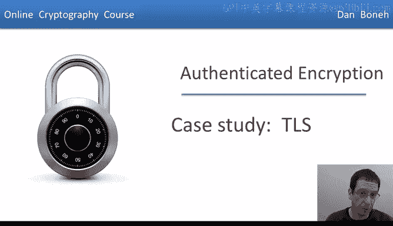
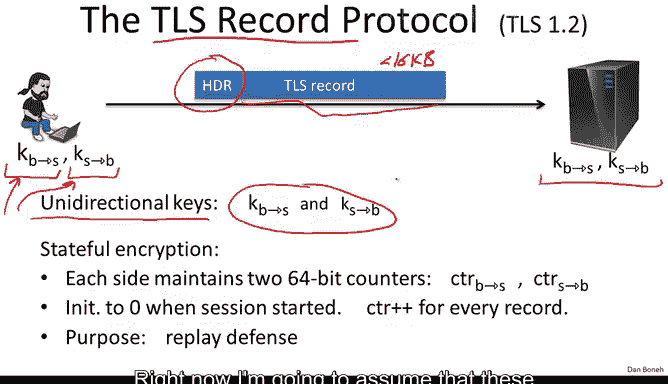
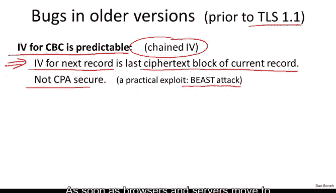
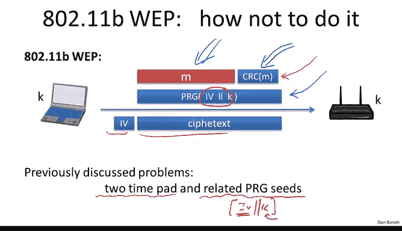

# 斯坦福大学《密码学｜Cryptography 1》中英字幕 - P39：39_04_01_案例研究：TLS 1.2.zh_en - GPT中英字幕课程资源 - BV1Rf421o79E

So I want to show you how authenticated encryption is used in the real world。

 so let's use TlS as an example and see how TlS works。

 So data encryption in TlS is done using a protocol called a TlS record protocol。

In this protocol， every TLS record starts with a header。

 we'll see the structure of the header in just a minute。

 followed by encrypted data that descend send from one side to the other in TLS it so happens that the records are at most 16 kilobytes and if more data than 16 kilobytes needs to be sent。

 then basically the record is fragmented into multiple records。

Now TLS uses what's called unidirectional keys， meaning that there' is one key from browser to server and there's a separate key from server to browser。

 so one key is used for sending messages from a browser to the server and the other key is used from sending messages from the server to the browser and of course both sides。

 both the server and the browser know both of these keys。And just to be clear。

 I'll say the browser will use this key to send data to the server and we use this key to read data from the server and the server basically does exactly the same thing just with the opposite keys。

 Now these keys， both of these keys are actually generated by the TlS key exchange protocol。

 which we're going to talk about in the second part of the course Right now I'm going to assume that these keys have already been established。

 they're known to both the server and the browser and now the browser and server when exchange information using those keys。

 So the TlS record protocol uses what's called stateful encryption。

 which means that the encryption of every packet is done using certain state that's maintained inside of the browser and the server In particular the state that's of interest to us are these 64 bit counters Again。

 there are two64 bit counters one for traffic from browser to server and one from traffic from the server to the browser。

These counters are initialized to zero when the session is first initialized and they're incremented every time a record is sent so every time the browser sends a record to the server。

 the browser will go ahead and increment this counter when the server receives that record itll go ahead and increment counter on its side and when the server sends a record to the browser itll go ahead and increment the second counter and again when the browser receives this record it will go ahead and increment its copy of this counter so the state these two counters basically the state exists both on the browser and on the server and it's updated appropriately as records are sent from one to the other and receive by the appropriate side Now the purpose of these counters as we'll see in just a minute is to prevent replay attacks so that an attacker can't simply record a record and then replay it at a later time because by then the counters would have to be incremented so let's look at the details of how the record protocol works in particular I'll show you kind of the mandatory cipher suiteite which is encryption using AE。

BC and Mac using H Mac Sha 1。 Okay， so remember， TlS uses a Mac then encrypt where the Mac algorithm is Hm Sha 1 and the encryption algorithm is aS 128 in CBC mode。

 Okay， so let's look at how the browser sends data to the server， which as I said。

 is done using the browser to server key。 Now the browser to server key itself is made up of a Mac key and an encryption key two separate keys that are。

 again， as I said， negotiated during session setup。And again。

 I want to be absolutely clear there is a separate key from browser to server and a separate key from server to browser so that overall there are four keys。

 two Macs and two encryption keys， each one used in the appropriate direction。Okay。

 so here I wrote down the diagram of what a TLS packet looks like。

 it begins with a header that contains the type of the packet， the version number for the protocol。

 and the length of the packet notice the length of the packet is sent to clear。Now。

 when encrypting data a certain record， the encryption procedure works as follows， of course。

 it takes he as input and it takes the current state as input。

And then it works as follows。 What it will do is， first of all。

 is it would mac the following data while here is the actual payload that's markeded。

 but the header is also markeded。 In addition， the counter。

 the current value of the counter is also markeded and of course it's all the counter is incremented to indicate the fact that one more record has been sent。

Now the interesting thing here is that even though the value of the counter is included in the tag。

 you notice the value of the counter is actually never sent in the record and the reason it doesn't need to be sent in the record is that the server on the other side already knows what the value of the counter needs to be so it doesn't need to be told in the record what the value of the counter is it implicitly already knows what it is and when it's going to verify the Mac it could just use the value that it thinks the counter should be and verify the Mac in that fashion so this is kind of an interesting approach where even though the two sides maintain these counters that function as nonsenses。

 there's no reason to send the nonsenses in the record because both sides actually already know what counters to expect in every record that they receive。

Okay so that's the tag。 the tag is computed， as we said of it is triple of data。

 The next thing that happens is that the tag is concatenated to the data。

 remember this is Mac then encrypt So here we compute the Mac。

 Now we're going to encrypt the data along with the tag so the header the data and the tag are pad added to the AES block and I think we already said that this pad if the pad length is 5 then the pad is done by simply writing the byte 55 times So if the pad length needs to be5 the pad will just be 55555。

And then we CBC encrypt using the encryption key， we CBC encrypt the data and the tag。

 and we do that using a fresh random IV， which is later embedded in the Cyphertext。

And then we prepend the header， the type， the version and the length。

 and that gives us the entire TlS record， which is then sent over to the server。

So the grayed out fields in these diagram correspond to encrypted data and the white fields correspond to plain text data so you can see that this is TLS's implementation of Mac then encrypt the only difference from basic Mac that encrypt is the fact that there is a state namely this counter is being included in the value of the Mac and again as I said that's done to prevent replays so let's see why that prevents replays in particular let's see how the record protocol decrypts and incoming record so here comes an incoming encrypted record。

And again， the server is going to use its own key that it corresponds to data from browser to server and its own browser to server counter and the first thing it's going to do is it's going to decrypt the record using the encryption key after encryption。

 it's going to check the format of the pad， in other words。

 if the pad length is 5 bytes is going to check that it really is 55555。And if it's not。

 it's going to send a bad record Mac alert message and terminate the connection so that a new session key would have to be negotiated if more records need to be sent。

If the pad format is correct， then removing the pad is really easy。

 all the server does is it looks at the last byte of the pad， say the last byte is equal to 5。

 and then it removes the last five bytes of the record by doing that it strips off the pad。

The next thing it's going to do is it's going to extract the tag from the record so this would be the subsequent bytes inside of the record。

 so this would be the trailing bytes in the record after we remove the pad and then it's going to verify the tag on the header。

 the data and its value of the counter。And if the Mac doesn't verify again。

 it's going to send an alert， bad record Mac and tear down the connection。

And if the path does verify， that it's going to remove the tag， remove the header。

 and the remaining part of the record is the plain text data that's given to the application。

Now you can see that if a record is ever replayed in other words。

 if an attacker records a particular record and then replays it to the server at a later time。

 then by then the value of the counter would have changed and as a result the tag on the replayed record would simply not verify because the tag was computed using one value of the counter but when the replay record is received at the server。

 the value of the counter the server is different from the value that was used to compute the tag and as a result the tag would not verify so these counters are a very elegant and simple way for preventing replays and the nice thing about this is because both sides no the value of the counter implicitly there's never a need to send the counter in the record itself so the counter itself doesn't increase the length of the ciphertex at all。

Now we already mentioned that this particular approach to authenticated encryption namely magden encrypt using CBC encryption is in fact authenticated encryption。

 however it's only authenticated encryption if no other information is leaked during decryption and we're going to see some cute attacks on TLS if there is information being leaked during decryption。

I should say that this bad record Mac alert basically corresponds to the decryption algorithm outputting this reject symbol。

 the bottom symbol， meaning that the deciphertex is invalid。

And as long as there's no way to differentiate between why the Cyphertex was rejected。

 in other words， a decryor only exposes the fact that a rejection took place。

 but it doesn't say why the rejection happened， this is in fact an authenticated encryption system。

 however， if you differentiate and expose why the Cyphertex was rejected。

 whether it was because of a bad pad or because of a bad Mac。

 then it turns out there's a very cute attack which we're going to see in the next segment。

What I showed you so far is called TLS version 1。1。

 it turns out that earlier versions of TLS actually had significant mistakes in it and as a result the earlier B protocol is vulnerable to a number of attacks。

The first mistake is that the IV used in CBC encryption is predictable and we said earlier that in CBC if the IV is predictable then the resulting CBC encryption is not CP secure well in this older version of TlS Tls 1。

0 and earlier the IV for the next record is simply the last Cyphoex block of the current record and as a result if the adversary can observe the current record he knows the IV for the next record and that will allow him to break semantic security of the next record so the resulting scheme is not CP secure。

 but not only is it not CP secure in fact there' is a very cute attack called a beast attack that's able to decrypt the initial part of a TlS record simply based on the fact that this scheme is not semantically secure so I should say that this method of choosing the IV to be the last block of the previous record is called chained IVs and you should remember that this actually should not be used in practice because it always always leads to an attack because of this Tls 1。

1。Move to what's called explicit IVs where every TLS record has its own random unpredictable IV and that's fixed the problem as soon as browsers and servers move to TLS 1。

1， this will no longer be an issue。

Now， another mistake that was done in Tls 1。0 and earlier enabled what's called a padding oracle。

 which is something that we're going to talk about in the next segment。

 where what happened was that if the Cyphertex was rejected due to an invalid pad。

 the server would send back an alert message saying decryption failed。

 whereasas if the cphertex was rejected due to a bad Mac。

 the server would send back a bad record Mac alert。 as a result。

 an adversary who observes the alert sent back from the server。

 can tell whether the pad in the Cyphertex was valid or invalid。

 And this introduces a very significant attack called a padding attack。

 which we're going to talk about in the next segment， the solution to this in Tls 1。

1 was basically to say that instead of reporting decryption failed here。

 we're going to report a bad record Mac， even if the pad is incorrect。 And as a result。

 simply looking at which alert is sent back from the server。

 an attacker can't tell if the Cyphertex is rejected because of a bad pad or a bad Mac。

So this tries to mask this information。Now the lesson from this is that when decryption fails。

 you should never ever explain why I guess this is something that comes out of networking protocols where there's a failure you want to tell the peer why the failure occurred well in cryptography if you explain why the failure occurred。

 that very often leads them to an attack In other words， when decryption fails just output reject。

And don't explain why the reject actually happens， just reject the cipherext。

Okay so now that we've seen Tls1。1， let's see a broken protocol。

 So of course I always like to pick on82211b web which pretty much got everything wrong。

 So let's see how not to provide authenticated encryption So let me remind you how8211b web works Basically theres a message that the laptop wants to send to the access point The first thing that happens is the laptop computes of cyclic redundancy checkum on the message and concatease the CRC checkum to the message then the result is encrypted using a stream cipher in particular RC4 if you recall the key that's used is the concatenation of an initial value IV that changes per packet and the long-term key K and then the IV along with the ciphertex are transmitted to the other side Now we already saw two problems with this approach one was if the IV is ever repeated and in fact it is gonna to be repeated then you get a two time pad attack and the other problem is that web uses very closely related keys In other words the key is。

IV concatenated K and the only thing that changes is the IV so the key is always fixed which means that these PRG keys are very closely related to one another and as we said the PRG that's used here RC4 is not designed for this type of use and it completely breaks if you use it with related keys and as a result web has no security at all。

What I want to show you is that even the CRC mechanism that's used here in an attempt to provide integrity and prevent an adversary from tampering with the ciphertext。

 even that mechanism is completely broken and it's actually very easy to tamper with ciphertexts unroot。

 so let's see how that's done。

The attack uses a particular property of the CRC checkum namely the CRCs linear what that means is if I give you CRC of M and I ask you to compute CRC of Mx or P。

 then it's very easy to do basically will just compute some wellknown and public function of FP you exort these two together and that in fact will give you CRC of Mx or P so in some sense the Xor just comes out of the parentheses and that basically means the CRCs linear。

Now here's how the attack works。 Suppose the adversary intercepts a particular packet that's destined to the access point Now the packet say says it's destined for destination port 80 and the attacker knows that it's intended for destination port 80 and what he wants to do is modify the ciphertext such that now the destination port will say 25 instead of 80 and maybe the attacker can read messages for port 25 and that's how he actually obtains the actual data in the packet So recall that the CRC checksum is there to make sure that exactly the attacker cannot change data inside of the Cyphertext but I want to show you that in fact it's really easy to modify data in the Cyphert and the CRC basically provides no security against tampering at all。

So let's see how to do it Well what the attacker will do is he would basically exhort some a certain value xx into the byte that represents the 80 in the ciphertex。

😊，Now what he x or R will basically be the string 25 x or80。

 and you remember that if I exor a certain string X X into the cphert。

That was created using a stream cipher when that ciphert is decrypted。

 the planex at this position will also be xored by xx and as a result after decryption。

 the plan text at this position basically will be the original 80 xor 25 x or 80 which gives us 25 okay so after decryption。

 the plan text at this position will now be 25。The problem is that if that's all we did。

 then this attack would fail because the CRC checkum would not validate the CRC checkum was built with 80 as a plain text。

 but 25 is a different plain text and needs a different CRC。

But it's not a problem because what we can do is we can easily correct the checkum， the CRC checkum。

 even though the CRC checksum is encrypted， what we do is we exhor F of xx into the ciphertex at the place where the CRC is supposed to be and as a result when the ciphertex is decrypted what will happen is we'll get the correct CRC checkum after decryption。

So the interesting thing that happened here is even though the attacker doesn't know what the CRC value is。

 he's able to correct it using this linearity property， such that when the Cyphertex is decrypted。

 the correct CRC value appears in the plain text。Okay。

 so the linearity property of CRC plays a critical role in making this attack works。

The end conclusion here is basically that a CRC checkum provides absolutely no integrity at all against active attacks。

 and it should never， ever， ever be used as an integrity mechanism。

 and instead if you want to provide integrity， you're supposed to use a cryptographic Mac。

 not an ad hoc mechanism like CRC so now we've seen how authenticated encryption is implemented in a real worldor protocol like TlS in the next segment we're going to look at real worldord attacks on authenticated encryption implementations that happen to implement authenticated encryption incorrectly。

