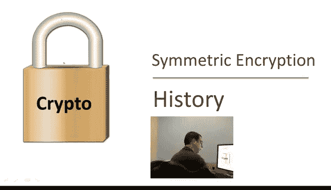

# 斯坦福大学《密码学｜Cryptography 1》中英字幕 - P3：03_01_05_密码学历史.zh_en - GPT中英字幕课程资源 - BV1Rf421o79E

Before we start with the technical material， I want to tell you a little bit about the history of cryptography。

There's a beautiful book on this topic by David Khan called the Code Bakers that covers the history of cryptography all the way from the Babylonian era to the present here I'm just going to give you a few examples of historical ciphers。

 all of which are badly broken。So to talk about ciphers。

 the first thing I'm going to do is introduce our friends Alice and Bob who are going to be with us for the rest of the quarter。

 so Alice and Bob are trying to communicate securely and there is an attacker who's trying to eavdrop under their conversation so to communicate securely they're going to share a secret key which I'll denote by K。

 they both know this secret key that the attacker does not know anything about this key K。

So now they're going to use a cipher， which is a pair of algorithms in the encryption algorithm denoted by E in a decryption algorithm D。

These algorithms work as follows， the encryption algorithm E takes the message M as inputs。

 and it takes its inputs the keyK。 I'm going to put a wedge above the key input just to denote the fact that this input is really the key input。

And then it outputs a ciphertex， which is the encryption of the message M using the keyK。

 I'm always going to write the key first and when I write colon equals。

 what I mean is that the expression defines what the variable C stands for。

Now the Cyphertex is transmitted over the internet to Bob somehow。

 actually it could be transmitted over the internet。😊。

Could be transmitted using an encrypted file system， it doesn't really matter。

 but when the Cyphertex reaches Bob， he can plug it into the decryption algorithm and give the decryption algorithm the same keyK again I'm going to put a wedge here as well to denote the key input and the decryption algorithm outputs the original plain text message。

Now the reason we say that these are symmetric ciphers is that both the encrypter and decryer actually use the same keyK。

As we'll see later in the course， there are ciphers where the encryptor uses one key and the decor uses a different key。

 but here we're just going to focus on symmetric cipher where both sides use the same key。

Okay so let me give you a few historic examples of ciphers。 The first example。

 the simplest one is called a substitution cipher， I'm sure all of you played with substitution ciphers when you were in kindergarten basically a key for a substitution cipher is a substitution table that basically says how to map letters So here for example the letter A would be mapped to C。

 the letter B would be mapped to W the letter C would be mapped to N so on and so forth and then the letter Z would be mapped say to a。

 so this is one example of a key for a substitution cipher。

 so just to practice the notation we introduced before。

 the encryption of a certain message using this key。

 let's say the message is B C Z A the encryption of this message using this key here would be is done by substituting one letter at a time so B becomes W C becomes N Z becomes a and A becomes C so the encryption of B。

ZA is WNAC and this defines the Cyphertext Similarlyly。

 we can decrypt the ciphertext using the same key and of course we'll get back the original message。

😊，Okay， so just for historical reasons， there is one example of something that's related to the substitution cipher called a Caesar cipher。

 The Caessar cipher actually is not really a cipher at all。

 And the reason is that it doesn't have a key。 What a Caesar cipher is。

 is basically a substitution cipher where the substitution is fixed， namely it's a shift by3。

 So A becomes D， B becomes E， C becomes F。 and so on and so forth。 What is it。

 Y becomes B and Z becomes C。 It's a fixed substitution that's applied to all plain text messages。

So again， this is not a cipher because there is no key， the key is fixed。

 so if an attacker knows how our encryption scheme works， he can easily decrypt the message。

 the key is not random and therefore decryption is very easy once you understand how the scheme actually works。

😊，Okay， so now let's go back to the substitution cipher where the keys really are chosen a random。

 the substitution tables are chosen a random。 and let's see how we break this substitution cipher。

 turns out to be very easy to break。 The first question is how big is the key space。

 How many different keys are there， assuming we have 26 letters。

So I hope all of you said that the number of keys is 26 factorial because a key。

 a substitution key is simply a table， a permutation of all 26 letters。

 the number of permutations of 26 letters is 26 factorial if you calculate this out 26 factorial is about2 to the 88。

 which means that describing a key in a substitution cipher takes about 88 bits。

 So each key is represented by about 88 bits。 Now this is a perfectly fine size for a key space In fact。

 we're going to be seeing ciphers that are perfectly secure or know there are are adequately secure with key spaces that are roughly of this size。

 however， even though the substitution cipher has a large key space of size 2 to the 88 it's still terribly insecure。

 So let's see how to break it and to break it we're going to be using letter frequencies。😊。

So the first question is what is the most frequent letter in English text。

 So I imagine all of you know that in fact， E is the most common letter and that is going if we make that quantitative。

 that's going to help us break a substitution cipher。 So just given the cipher text。

 we can already recover the plain text。😊，So the way we do that is first of all。

 using frequencies of English letters。 So here's how this works。

 So you give me an encrypted message using the substitution cipher。

 What I know is all I know is that the message is in English the plain text is in English and I know that the letter E is the most frequent letter in English and in fact it appears 12。

7% of the time in standard English text。 So what I'll do is I look at the cipher textex you gave me and I'm going to count how many times every letter appears。

 Now the most common letter in the cipher textex is going to be the encryption of the letter E with very high probability。

 So now I'm able to recover one entry in the key table。😊，Namely the letter。

 namely now I know what the letter E maps to。 The next most common letter in English is the letter T that appears about 9。

1% of the time。So now again， I count how many times each letter appears in the ciphertext and the second most frequent letter is very likely to be the encryption of the letter T。

😊，So now I've recovered the second entry in the key table。 and I can continue this way。 In fact。

 the letter A is the next most common letter。 It appears 8。1% of the time。

 So now I can guess that the third most common letter in the Cyphertext is the encryption of the letter A。

 And now I've recovered three entries in the key table。 Well so now what do I do。

 The remaining letters in English appear roughly same amount of time。

 other than some rare letters like Q and X。But we're kind of stuck at this point。

 we figured out three entries in the key table， but what do we do next？😊。

So the next idea is to use frequencies of pairs of letters， sometimes these are called diagrams。

 so what I'll do is I'll count how many times each pair of letters appears in the ciphertext and I know that in English the most common pairs of letters are things like H E AN IN I guess TH is another common pair of letters and so I know that the most common pair of letters in the ciphertext is likely to be the encryption of one of these four pairs。

And so by trial and error， I can sort of figure out more elements in the key table and again by more trial and error this way by looking at trigrams。

 I can actually figure out the entire key table。😊，So the bottom line here is that in fact。

 this substitution cipher is vulnerable to the worst possible type of attack。

 namely a ciphertext only attack， just given the ciphertext。

 the attacker can recover the decryption key and therefore recover the original plain text。

So there's really no point in encrypting anything using a substitution cipher because the attacker can easily decrypt it all。

 you might as well send your plain text completely in the clear。😊。

So now we're going to fast forward to the Renaissance and I guess we're moving from the Roman era to the Renaissance and look at a cipher designed by a fellow named Vire who lived in the 16th century。

 he designed a couple of ciphers here I'm going to show you a variant of one of his ciphers。

 This is called a visioner cipher。 So in a visionre cipher， the key is a word in this case。

 the word is crypto。 It's got six letters in it and then to encrypt a message。

 what you do is you write the message under the key。😊，So in this case。

 the message is what a nice day today day， and then you replicate the key as many times as needed to cover the message。

And then the way you encrypt is basically you add the key letters to the message letters modular 26。

 So just to give you an example here， for example， if you add y in a， you get Z。If you add T and A。

 you get U and you do this for all the letters。 And remember whenever you add， you add modular 26。

 So if you go past Z， you go back to a。So that's the visioner cipher and in fact decption is just as easy as encryption。

 basically the way you would decrypt is again you would write the ciphertex under the key。

 you would replicate the key， and then you would subtract the key from the cipher textex to get the original plain text message。

😊，So breaking a vigencipher is actually quite easy。 let me show you how you do it。

 The first thing we need to do is we need to assume that we know the length of the key So let's just assume we know that in this case the length of the key is6 and then what we do is we break the cipher text into groups of six letters each so we're going to get a bunch a bunch of groups like this each one contains six letters。

😊，And then we're going to look at the first letter in each group。 Okay， so in this case， yes。

 we're looking at the first letter， every six characters。Now。

 what do we know about these six letters， We know that， in fact。

 they're all encrypted using the same letter in the Cyphertext。

 All of these are encrypted using the letter C， in other words。

ZLW is a shift by three of the plain text letters。So if we collect all these letters。

 then the most common letter among the set。It is likely to be the encryption of E right E is the most common letter in English。

 Therefore， if I look at every six letter， the most common letter in that set is likely to be the encryption of the letter E a So let's just suppose that in fact。

 the most common letter every6 letter happens to be the letter H。

Then we know that E plus the first letter of the key is equal to H。

 That says that the first letter of the key is equal to H minus E。 and in fact， that is the letter C。

 So now we've recovered the first letter of the key。

 And now we can continue doing this with the second letter。

 So we look at the second letter in every group of six characters。 and again。

 we repeat the same exercise。 we find the most common letter among the set。

 and we know that the this most common letter is likely the encryption of E。😊，And therefore。

 whatever this letter whatever this most common letter is if we subtract E from it。

 we're going to get the second letter of the key and so on and so forth with the third letter every six characters and this way we recover the entire key and that allows us to decrypt the message。

 Now the only caveat is that I had to assume ahead of time that I know the length of the key which in this case is6。

 but if I don't load the length of the key ahead of time， that's not a problem either。

 what I would do is I would run this decryption procedure assuming the key length is one。

 then I'd run it assuming the key length is2。 then I would run it assuming the key length is three。

 and so on and so on and so on until finally I get a message I get a decryption that makes sense that's sensical。

 And once I do that I know that I've kind of recovered the right length of the key。

And I know that I've also recovered the right key and therefore the right message。Okay， so very。

 very quickly， you can recover you can decrypt Vier cphers。 Again， this is a Cyphertex only attack。

 The interesting thing is that visionre had a good idea here。

 This addition Mo 26 is actually a good idea， and we'll see that later。

 except it's executed very poorly here。 And so we'll correct that a little bit later。😊。

Okay， we're going to fast forward now from the Renaissance to the 19th century where everything became electric。

 and so people wanted to design ciphers that use electric motors in particular。

 these ciphers are called rotor machines because they use rotors。

 So an early example is called the Heburn machine， which uses a single rotor here you have a picture of this machine。

 the motor， I guess the rotor is over here。😊，And the secret key is captured by this disk here。

 It's embedded inside of this disk， which rotate by one notch every time you press a key on the typewriter。

 so every time you hit a key， the disc rotate by one notch。 Now what does this key do。

 Well the key actually encodes the substitution table。

 and therefore the disk actually is the secret key and as I said。

 this disc encodes a substitution table in this case。

 if you happen to press C as the first letter output would be the letter T and then the disc would rotate by one notch after rotating by one notch。

 the new substitution table becomes the one shown here。

 you see that E basically moves up and then the remaining letters moves down。

 So imagine the disc is basically a two dimensionmenal rendering of the disk rotating by one notch。

Then you press the next letter and the disc rotates again， you notice again。

 n moved up and the remaining letters moved down。 So in particular。

 if we hit the letter C three times the first time we would output the output would be t。

 The second time the output would be S。 And the third time the output will be K。

 So this is how these single rotor machine works。 And as it turned out very quickly after it was advertised。

 it was again broken basically using letter frequencies， diagram frequencies and trigram frequencies。

 it's not that hard given enough ciphertext to directly recover the secret key。 and then the message。

 Again， a cphertext only attack。 So to kind of work against these frequency attacks。

 the statistical attacks。 these rotor machines became more and more complicated over time。

 until finally， I'm sure you've all heard of the enigma。

 the enigma is kind of complicated rotor machine， it uses3，4 or5 rotors。

 there are different versions of the enigma machine here youve see an example。

igma machine was three rotors。 the secret key the enigma machine is the initial setting of the rotors Okay so in the case of three rotors there would be 26 cube possible different keys。

😊，When you type on the typewriter basically these rotors here rotate at different rates。

 I forgot to say this is a diagram of an enigma machine using four rotors as you type on the typewriter the rotors rotate and output the appropriate letters of the ciphertext。

 So in this case the number of keys is 26 to the fourth。

 which is 2 to the 18 which is actually relatively a small key space today you can kind of brute force。

Search using a computer through two of the 18 different keys very， very quickly。

 you know my wristwatch can do it in just a few seconds， I guess。

 and so this enigma machine was already was using relatively small key spaces。

 but I'm sure you've all heard that the British cryptographers at Bletchby Park were able to mount ciphertext only attacks on the enigma machine。

 they were able to decrypt German ciphers back in World War I and that played an important role in many different battles during the war。

😊，After the war， I guess that was the end kind of the mechanical age and started the digital age where folks were using computers and as the world kind of migrated to using computers。

 the government realized that it's buying a lot of digital equipment from industry。

And so we wanted industry to use a good cipher so that when it buys equipment from industry。

 it would be getting equipment with a decent cipher。

 and so the government put out this request for proposal for a data encryption standard。

 a federal data encryption standard， and we're going to talk about this effort in more detail later on in the course。

 but in 1974 a group at IDBM put together a cipher that became known as DES data encryption standard。

 which became a federal standard for encrypting data， the key space for DES is due to the 56。

 which is relatively small these days but was large enough back in 1974。

 and another interesting thing about DES is rather than unlike rotor machines which encrypt one character at a time。

 the data encryption standard encrypt 64 bits at a time， namely eight characters at a time。

 and we'll see the significance of this later on in the course。😊。

Because DES uses such a small key space these days it can be broken by a brute for a search and so these days DES is considered insecure and should not be used in projects。

 unfortunately it is used in some legacy systems but it definitely is on its way out and should not be definitely should not be used in new projects today there are new ciphers things like the advanced encryption standard which uses 128 bit keys again we'll talk about the advanced encryption standards in much more detail later on in the course there are many many other types of ciphers I mentioned salsa 20 here we'll see why in just a minute but this is all for the quick historical survey and now we can get into the more technical material。

😊。

