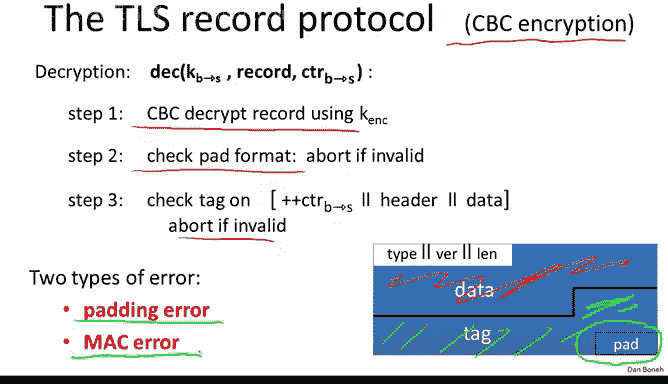
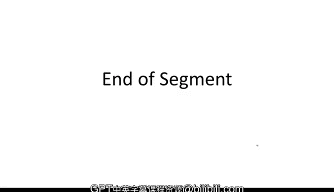

# 斯坦福大学《密码学｜Cryptography 1》中英字幕 - P40：40_04_02_CBC填充攻击.zh_en - GPT中英字幕课程资源 - BV1Rf421o79E

In this segment in the next， I want to show you two very cute attacks on deployed authenticated encryption systems。

 but first let's do a quick recap。

So recall that authenticated encryption means that the system provides CPA security plus Cyphertext integrity and authenticated encryption means that we can preserve confidentiality in the presence of an active adversary and moreover the adversary can't modify the ciphertext in any way without being detected we also showed that authenticated encryption prevents these very powerful chosen cphertext attacks Unfortunately authenticated encryption has a pretty significant limitation in that it simply can't help a bad implementation if you implement authenticated encryption incorrectly then your implementation will be vulnerable to active attacks。

And then we looked at standards construction。 I mentioned these three standards that provide authenticated encryption and I want to point out when you need to use authenticated encryption in practice。

 you should just be using one of these three standards。

 you shouldn't try to implement authenticated encryption by yourself and I hope that the attack that I show you in this segment convinces you that this is not something you should do yourself just use one of GCMccM or AX however it's good for you to know that in general when you want to provide authenticated encryption。

 the correct way to do things is encrypt then Mac because then no matter which encryption and Mac algorithms you combine。

 the result will be authenticated encryption again。

 assuming the encryption and Mac algorithm are implemented correctly so let's look at a very cute attack and the TLS record protocol in particular when CBC encryption is used。

Let me just briefly remind you that the way TlS decryption works is， first of all。

 an incoming Cyphertext E CBC decrypted。Then the next thing that happens is the implementation will check that the pad has the correct format。

 for example， if the pad is of length 5， the format should be 55555 and if it's not of the correct format then the Cypherex is rejected so this basically checks that the ending of the decrypted record contains the correct pad。

 and then if the pad has the correct format， then the next thing that happens is that the Mac is checked。

 the tag is checked and if the tag turns out to be incorrect again， the record is rejected。

 if the tag is valid， then the remaining data is considered to be authentic and is given to the application。

So what I wanted to point out is there are two types of errors in TLS decryption。

 one is a padding error， and one is a Mac error。And it turns out it's very important that the adversary not be told which of these errors occurred。

 and let me briefly explain why。

So suppose an attacker can actually differentiate the two types of errors， in other words。

 he can tell if a pad error occurred or a Mac error occurred。

The result is what we call a padding oracle because now imagine the adversary has a certain ciphertext that it intercepted and it wants to try and decrypt that ciphertext。

What it could do is it could take that ciphert as is in submit it to the server。

 The server is going to decrypt the Cyphertext and then look to see if the pad has the correct format。

 If the pad doesn't have the correct format will get one type of error。

 If the pad has the correct format， it's very likely since this is just some random ciphertext that the adversary concocted himself。

 It's very likely the Mac will be incorrect。 and then the adversary will observe a Mac error。

 So if the pad is invalid， we'll see a pad error whereas the pad is valid， we'll see a Mac error。

 As a result， the adversary after submitting the ciphertext to the server。

 the adversary can tell whether the last bytes in the decrypted ciphertext have a valid pad or not。

 In other words， whether the last bytes in the decrypted cphertext are end with one or 2，2 or 3，3。

3 or 4，4，4，4 and so on。 So the adversary learns something about the decrypted ciphertext just by submitting the ciphertext to the server。

So this is a beautiful example of what's called a chosen Cyphertext attack where again。

 the adversary submits a Cyphertex and then he gets to learn something about the resulting plain text。

 and now the question is whether he can use that information to completely decrypt a given Cyphert。😊。

And I want to show you that a padding oracle can actually be used to completely decrypt a given Cyphertex。

 but before I say that， I want to remind you that older versions of TlS actually leaked the type of error simply in the alert message that was sent back to the peer。

 different types of alerts were sent depending on which type of error occurred As soon as this attack came out。

 SSL implementations simply always reported the same type of error。

 So just looking at the alert type wouldn't tell the adversary which error occurred。 Nevertheless。

 there was still a padding oracle。 let me explain why。

So this was observed by Canval all Canvin and I'll realized that the way Dls decryption is implemented is first of all。

 the records is decrypted。 then the pad is checked， and if the pad is invalid。

 decryption is aborted at an error is generated。 if the pad is valid。

 then the Mac is checked and then if the Mac is invalid。

 decryption is aborted and an error is generated As a result this causes a timing attack。

 you realize that if pad is invalid， then the alert message is sent very quickly。

 and you notice here that in fact you see that within 21 milliseconds， the cpherex is rejected。

 However， if the pad is valid， then now the Mac needs to be checked and when it's discovered to be invalid。

 the alert is only generated at that point。 In other words。

 then in that case it takes a little bit longer until the alert is generated。

 and you see that on average this takes about 23 milliseconds。

 So even though the same alert is sent back to the pi。

 the adversary can simply observed a time until the alert message is generated if the time is short。

 it knows the pad was invalid if the time。long it knows the pad was valid， but the Mac was invalid。

 and as a result， the adversary still has a padding oracle that can tell it whether the pad was valid or invalid。

So now let's see how to use a padding oracle。 So I claim that if the attacker has a certain cphertex C。

 he can completely decrypt that cphertex just using the padding oracle。 So let's see how to do it。

 And just as an example， suppose he wants to obtain M1。 In other words。

 the decryption of the second block of the Cyphertext。 So let's see what he would do。

 So here we have the cphertext that the attacker intercepted。

 And this just happens to be the decryption of that Cyphertex。

 And the reason I wrote this down is I wanted you to remember how cC decryption works。

 So you should keep in mind that one cphertex block is directly exhored into the decryption of the next Cyphertex block。

 so the adversary here wants to basically learn just this part of the plaintt。

So here's what he's going to do。So first of all， he's going to throw away C2 so that the last block really is just C1。

 which is the one that he's interested in decrypting。

 Now let's suppose that he has a certain guess G for the last byte of M1。 In other words。

 he just has a guess for this very， very very last byte G is a value between0 and 2 55。

 What the attacker will do is the following He will exor the value G X or 01 into the last byte of the block C0。

 the previous block。Yes， so all he did is he took the last bitete of the previous block and X or that with his guess。

 X or 01。Now let's think for just a second and see what happens when this two block ciphert is decrypted Well C0 is going to get decrypted to whatever it's decrypted to that's just going to be some garbage that we don't care about。

 but now when C1 is decrypted， the last byte is going to be exored with this modified C0 and the result the last byte of the plain text is going to be also exor with this extra value that we stuck into C0。

So what goes in here is the actual original last byte in the plain text M1。

 but now it gets xor with G xor 0 x01。So now you see where I'm going with this。

 If the guess G for the last byte of M1 is correct， then these two guys will cancel one another。

 Last byte X or G is just 0， and what we'll get is the last byte of the plain text is just 0 x 0，1。

 I should mention， by the way，0 x 01 just means hex notation for 0，1。

 So literally this is just a1 byte representation of the number1。Good， so again。

 what this means is if our guess for the last byte of M1 is correct。

 then we get a pad that's well formed。 It's just the number one， the number one is a well formed pad。

 and therefore the pad is valid and the padding Oracle will say the pad is valid。

If the guess is incorrect， there we'll get unvalue here that's not equal to one。

 And then it's very likely that we have an invalid pad。And as a result。

 the padding oracle will say the pad is invalid。So again。

 you see that if our guess for the last byte of M1 is correct， we learned that G was， in fact。

 a correct guess， whereas if our guess is incorrect， then we learn the G is an incorrect guess。

 So what the attacker is going to do is he's going to create his modified Cyphert。

 You notice he only modifies the second block of the Cyphertext。

 We're going to send this to the padding oracle。 and then based on the result of the padding oracle。

 we learn whether the last bitete is equal to G or not。

Well， now we can simply repeat this again and again for g from 0 to 255。

 This basically requires 256 chosen Cyphertex queries。 Actually， I guess on average。

 we'll only have to do 128 chosen Cyphertex queries until we find the right G and then we learn the last byte of M1。

 Well， so now we know the last bitete of M1。 I claim that we can now use the exact same process to learn the second to last byte of M1。

 Let me ask you what pattern are we going to use to learn the second to last byte of M1。Well。

 it shouldn't be surprising that instead of just using the pad containing the byte one。

 we're going to use a two byte pad containing the byte 22， that's a well formed pad。

And now we can always make sure because we know the last byte of M1， when we do our xoring trick。

 we can always make sure that the last byte of the plain text is in fact 02。

 and now we can guess the second to last byte of M2 by simply trying lots of values on G until we find one that makes the pad in fact be 0202 and by issuing 256 additional queries to the padding Oracle we will get to learn the second to last byte of M1。

And now we can iterate this again and again， and basically since the length of the block is 16 bytes after 16 times 256 queries。

😊，We get to learn all of M1。So this is a pretty significant attack that is able to decrypt blocks of the TLS record。

So those of you who know the inner workings of TlS should complain that this attack isn't gonna to work。

 The problem is that when TlS receives a record with a bad pad or a bad Mac。

 it shuts down the connection and renegotiates a new key。 As a result。

 the attacker is now stuck with a Cyphertex encrypted using an old key and that key is no longer used anywhere so it cannot submit any more queries。

 So with TlS basically it can only submit one query and that's it。

 Even a single query still leaks information about the plain text to the attacker。

 but it doesn't expose the entire plain text block M1。 However。

 this attack is so cute that whenever there is a mistake like this in a protocol。

 there will be some settings in which it comes up and in this case。

 the setting is in the case of an imM server。 So immap is a popular protocol for reading email from an imMap email server and it's very common to protect the imap protocol by running it on top of the TlS protocol。

 Now it turns out an immap every five minutes， the imMap client will connect to the imap server。

And check whether there's new email。 and the way it does it is by first logging in to the IM server by sending this login username password message。

 and then it goes ahead and check if there's new email available。Well。

 what this means is that every five minutes the attacker gets an encryption of exactly the same message in particular。

 it gets an encryption of the password， and so every five minutes it can mount one guess on the block that contains the password。

And so if your password is eight characters long， the attacker simply needs to recover those eight characters and he's going to recover them one by at a time by doing one guess per five minutes。

And so Canvillell and' show that within a few hours， you can basically recover the user's password。

Just by mounting one guess every five minutes。 So this is a pretty significant attack against an implementation of TlS。

 and the defense against this was to always check the Mac。 whether the pad is valid or invalid。

 And as a result， it takes the same amount of time to respond whether the pad is valid or invalid。

 So this removes the timing attack and makes this attack much harder to mount。

So there are two lessons here。 first of all， you notice that if TlS had used encrypt den Mac rather than Mac and encrypt。

 then this whole issue would be completely moot because in encrypted Mac the Mac is checked first and only then does encryption and pad checking take place in encrypt den Mac。

 the Cyphertext is discarded because the Mac is invalid and we never even get to a pad check as a result any tampering or games with a ciphertext will be discarded immediately because the Mac is simply going fail。

 second lesson to remember is that remember I told you that Mac and CVC actually does provide authenticated encryption。

 but only if you don't reveal why decryption failed In this case。

 the padding oracle completely destroyed the authenticated encryption property and basically I showed you an attack that shows that now this mode does not provide authenticated encryption。

So let me ask you the following question， suppose in TLS， instead of using Mac then CBC。

 TLS did Mac then counter mode encryption， would the padding Oracle attack still be possible or not？

The answer is it wouldn't be possible simply because counter mode doesn't use any padding at all。

 so this padding oracle attack only affects CBC encryption modes in TLS。

 TLS also supports countermode encryption and counter modeode encryption modes are simply not affected by these padding attacks。

So that's the end of the segment in the next segment I want to show you another very。

 very clever attack on authenticated encryption systems。

