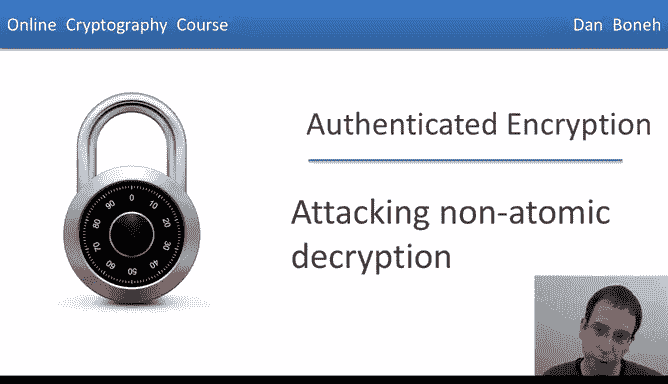

# 斯坦福大学《密码学｜Cryptography 1》中英字幕 - P41：41_04_03_攻击非原子解密.zh_en - GPT中英字幕课程资源 - BV1Rf421o79E

In the last segment we looked at a padding oracle attack that completely breaks an authenticated encryption system。

 I hope this attack convinces you that you shouldn't implement authenticated encryption on your own because you might end up exposing yourself to a padding oracle attack or a timing attack or any other such attack。

 Instead， you should be using standards like GM or any other of the standardized authenticated encryption modes as implemented in many crypto libraries。

In this segment， I'm going to show you another very clever attack on an authenticated encryption system and I hope after you see this attack you'll be completely convinced not to invent and implement your own authenticated encryption systems。

 but instead always use one of the standard schemes like GCM or others。😊。

So this particular attack that I want to show you is an attack on the SSH binary packet protocol。

 so SSH is a standard secure remote shell application that uses a protocol between a client and the server。

 it has a key exchange mechanism and once two sides exchange keys。

 SSH uses what's called the binary packet protocol to send messages back and forth between the client and the server。

Now here's how SSH works。 So recall that SSH uses what we call encrypt and Mac。

 so technically what happens is every SSH packet begins with a sequence number。

 and then the packet contains the packet length。 the length of the CBC pad。

 the actual payload follows then the CBC pad follows Now this whole red block here is CBC encrypted also with a chain I。

 So this is also vulnerable to the CP attack that we discussed before。

 but nevertheless this whole red packet is encrypted using CBC encryption。

 and then the entire cleart packet is maced and the Mac is sent in the clear along with the packet。

 So I want you to remember that the Mac is computed over plain text packet。

 and then the Mac is sent in the clear。 This is what we call encrypt and Mac。

And we said that this is not a good way to do things because Macs have no confidentiality requirements。

 and by sending the Mac of the clear text in the clear。

 you might be exposing information about the clear text。

 but this is not a mistake that I want to show you here。

 I want to show you a much more clever attack。 So first， let's look at how decryption works in SSH。

 So what happens is first of all， the server decryptps the encrypted packet length field only。

 So it only decryptps these particular first Hubittes。

Then it will go ahead and read from the network as many bytes as specified in the packet length field。

 it's going to decrypt the remaining Cyphertex blocks using CBC decryption。

 then once it's recovered the entire SSH packet it will go ahead and check the Mac of the plain text and report an error if the Mac happens to be invalid。

Now the problem here is that the packet length field is decrypted and then used directly to determine the length of the packet before any authentication is taken place。

 in fact， it's not possible to verify the Mac of the packet length field because we haven't recovered the entire packet yet and as a result we cannot check the Mac。

But nevertheless， the protocol uses the packet length before verifying that the Mac is valid。

So it turns out this introduces a very， very cute attack。

 and I'm only going to describe a very simplified version of this attack just to get the idea across。

 So here's the idea。 supposeupp the attacker intercepted a particular Cypherex block。

 namely the direct AES encryption of the message block M。 And now he wants to recover this M。

And I emphasize that this intercept at Cyphertext is only one block length， it's one AES block。

So here's what the attacker is going to do。 Well he's going to send the packet to the server that starts off as normal。

 its basically starts off with a sequence number， and then he's going to inject his capture Cyphertext as the first Cyphertex block that's sent to the server Now what is the server going to do The server is going to decrypt the first few bytes of this first AES block and he's going to interpret the first few bytes as the length field of the packet。

The next thing that's going to happen is the server is going to expect this many bytes before it checks that the Mac is valid。

😡，And so what the attacker is going to do is he's going to feed the server one by at a time。

 so the server will read one byte and then another byte and then another byte。 Eventually。

 the server will read as many bytes as the length field specifies。

 at which point it will check that the Mac is valid。 And， of course。

 the attacker was just feeding a server junk bytes。 And as a result。

 a Mac is not going to verify and the server will send a Mac error。

 But you realize that what happened here， the attacker was counting how many bytes it's sent to the server。

 And so it knows exactly how many bytes were sent at the time that it receives the Mac error from the server。

 So that tells it that the decryption of the first 32 Bs of its Cyphert C are exactly equal to the number of bytes that were sent before it saw Mac error。

 So this is a very clever attack。 So let me say it one more time to make sure this is clear。😊。

So again， the attacker has a one block Cyphert C that it wants to decrypt and let's pretend that when C is decrypted。

 the 32 most significant bits of the plain text happen to be the number5。

 In this case what the attacker will see is the following behavior the server is going to decrypt the challenge block C and he's going to obtain the number5 as the length field So now the attacker is going to feed the server1 by at a time。

 and after the attacker feeds the server 5 by， the server says， hey。

 I've just recovered the entire packet， let me check the Mac the Mac is likely to be false and then it will send bad Mac error So after five by are read off the network the attacker is going to see a bad Mac error and then the attacker learns that the most significant 32 Bs of the decrypted block is equal to the number5 So there So he just learned the 32 most significant bits of C。

So this is a very significant attack because the attacker just learned 32 bits of the decrypted Cyphertex block。

 and since he can apply this attack to any Cyphertex block he wants。

 he can basically learn the first 32 bits of every Cyphertex block in a very long message。

So what just happened here。 Well， there are actually two things that were wrong in this design。

 The first one is that decryption operation is nonatomic。 In other words。

 that decryption algorithm doesn't take a whole packet as input and respond with a whole plain text as output or with the word reject instead the decryption algorithm partially decryptps theciphertex。

 namely to obtain the length field， and then it waits to recover as many bytes as needed and then it completes the decryption process So these non-atomic decryption operations are fairly dangerous and generally they should be avoided in this example this non-atomic decryption happens to break authenticated encryption The other problem that happened is that the length field was used before it was properly authenticated and this is another issue that should never be done。

 So a decryption field should never be used before the field is actually authenticated。

So let me ask you if you had the option of redesigning SSH。

 what is the minimum change you would do to make SSH resist this attack。

 and let me tell you that multiple answers might be correct。

One option is to send a length field in the clear， just as in the case of TlS。In this case。

 there's no opportunity for an attacker to submit chosen Cyphert attack because， well。

 the length field is never decrypted and so there's no decryption taking place that the attacker can abuse。

Replacing encrypted Mac by encrypted den Mac doesn't have any impact because this attack would apply either way。

 The problem is that the length field is used before it's authenticated and that would have to happen either way。

 So a better mode of encryption doesn't actually help Another option is to mac the length field separately so that now the server can read the length field Check that the for just the length field is valid and then it would know how many subsequent bytes to read before checking Mac field on the entire packet。

 The last option is actually one that works but is terribly inefficient。

 It would expose the server to a denial service attack so I'm not going to mark as a valid answer。

So the main lesson to remember is don't implement or design your own authenticated encryption system。

 just use the standards like GCM， but if for some reason you can't use the standards and you have to implement your own authenticated encryption system。

 then use encrypt then Mac。And make sure not to repeat the mistakes of the last few segments。

 namely don't use a length field before the length field is authenticated and more generally don't use any decrypted field before that field is authenticated。

Okay， so this is the end of our discussion of authenticated encryption。

 I wanted to point out a couple of papers on authenticated encryption that you could use as further reading。

 The first one is a very cute one on the order of encryption or authentication。

 that talks about whether one should do encrypt and Mac or Mac than encrypt。

 and it shows that one is correct and one is incorrect。

 It's a good read and is a lot of information in that paper。 The second paper discusses OCB mode。

 which is a very efficient way of building authenticated encryption in particular。

 it looks at a variant of OCB with associated data as we discussed when we described OCB。

The last three papers are attack papers， the first one describes the padding oracle attack that we discussed in the last segment。

This one here describes the length attack that we just described in this segment。

And the last one describes a number of attacks on encryptions that just use CPA security without adding integrity。

So this last paper actually provides a number of good examples for why CPA security by itself should never。

 ever， ever be used for encryption remember the only thing you are allowed to use is authenticated encryption for confidentiality or if all you need is integrity with no confidentiality then you just use a Mac。

