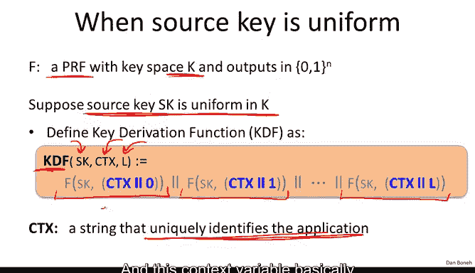
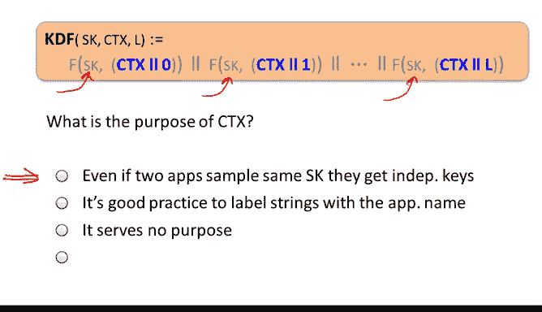

# 斯坦福大学《密码学｜Cryptography 1》中英字幕 - P42：42_04_01_密钥派生.zh_en - GPT中英字幕课程资源 - BV1Rf421o79E

Well， we are almost done with our discussion of symmetric encryption。

 There are just a couple of odds and ends that I'd like to discuss before we move on to the next topic。

 So the first thing I'd like to mention is how we derive many keys from one key。

 And actually this comes up all the time in practice。

 So I'd like to make sure you know how to do this correctly。

So what's the settings that we're looking at， well imagine we have a certain sourcekey that's generated by one of a number of methods。

 imagine the source key is generated by a hardware random number generator or perhaps is generated by a key exchange protocol which we're going to discuss later。

 but anyhow there are a number of ways in which a sourcekey might be generated between Alice and Bob such that the attacker doesn't know what this sourcekey is。

But now as we said in many cases， we actually need many keys to secure a session。

 not just one single source key， for example， if you remember in TLS to where you need directional keys we needed keys in each direction and in fact in each direction we needed multiple keys we needed a Mac key。

 we needed an encryption key， we needed an IV and so on Similarlyly non-space encryption you remember there were multiple keys that were being used and so on and so the question is how do we use the one source key that we just derived either but from a hardware process or by key exchange and generate a bunch of keys from it that we could then use to secure our session。

 the way that's done is using a mechanism called a key derivation function KDf and I want to talk a little bit about how KDfs are constructed。

So first of all， suppose we have a secure PRF that happens to have keyspace aK。

And now suppose that it so happens that our source key SK is uniform in the keyK。In this case。

 the source key is in fact a uniform random key for the secure PRFF and we can use it directly to generate keys。

 all the keys that we need to secure a session so in this case the Kdf is really simple the key erivation function will just work as follows it will take as input the source key it would take an input a parameter context which I'm going to describe in just a minute and then it's going to take a length input as input as well。

 and then what it will do is it will basically evaluate the PRf on0 then it will evaluate the PRf on1 then it will evaluate the PRf on 2 up until L and we'll talk about what this context is in just a second and then basically you would use as many bits of the output as you would need to generate all the keys for the session so if you need uniqueidirectal keys you would generate one key in each direction where each key might include an encryption key in a Mac key and so you would basically generate as many bits as you need and then finally cut off the output at the time when you've generated enough keys to secure your session。

Okay so this is a fairly straightforward mechanism it's basically using the secure PRF as a pseudorandom generator and the only question is what is this context string Well I'll tell you that the context string is basically a unique string that identifies the application so in fact you might have multiple applications on the same system that's trying to establish multiple secure keys maybe you have SSH running as one process you have a web server running is another process IPS as a third process and all three need to have secret keys generated and this context variable basically tries to separate the three of them so let me ask you more precisely what do you think the purpose of this context variable is。

So I guess I've given it away and this context variable is supposed to basically separate applications so that even if。

 for example， the three services that we just talked about， SSH， web serverver and IPC。

 if they all happen to obtain the same source key from the hardware random number generator。

 then the context since it's different for the three apps。

 will make sure that they still get three independent strings that they can then use to secure the sessions。

I just want you to remember that even though this is actually fairly straightforward and we discussed this before。

 the context string is actually important and it does need to be specific to the application so that each application gets its own session keys。

 even if multiple applications happen to sample the same SK The next question is what do we do if the source key actually isn't uniform？

😊。

Well now we've got a problem if the source key is not a uniform key for the pseudo random function。

 then we can no longer assume that the output of the pseudo random function is indistinguishable from random In fact。

 if we just use the KdF that we just described， then the outputs might not look random to the adversary and that he might be able to anticipate some of the session keys they will be using and thereby break the session so then we have a problem。

Now why would this source key not be uniform while there are many reasons why this happened。

 for example， if you use a key exchange protocol， it so happens typically the key exchange protocols will generate a high entropy key。

 but the high entropy key is going to be distributed in some subsetspace of the key space so it's not going to be a uniform string it'll be uniform in some subset of a larger sec and we'll see examples of that as soon as we talk about a key exchange protocols and so KDFs have to kind of accommodate for the fact that key exchange protocols actually don't generate uniform bit strings。

😊。

The other problem is that in fact the hardware random number generator you're using might actually produce biased output。

 we don't want to rely on the nonbias of the hardware random number generator。

 and so all we want to assume is that it generates a high entropy string but one that might be biased in which case we have to somehow clean this bias。

And so this introduces this paradigm for building KDfs。

 this is called the extract then expands paradigm where the first step of the KDf is to extract a pseudorandom key from the actual source key so in a picture you can think about it like this in some sense these are the different possible values of the source key this is the horizontal line and the vertical access is basically the probability of each one of these values and you can see that this is kind of a bumpy function which would say that the source key is not uniformly distributed in the key space。

What we do in this case is we use what's called an extractor。

 so an extractor is something that takes a bumpy distribution and makes it into a uniform distribution over the key space。

In our case， we're actually just going to be using what are called computational extractors。

 namely extractors that don't necessarily produce uniform distribution at the end， but look。

 they generate a distribution that's indistinguishable from uniform。

Now extractors typically take as input， something called a salt， an a just like in a salad。

 it kind of adds flavor to things， what it does is basically kind of jumbles things around so that no matter what the input distribution is。

 the output distribution is still going to be indistinguishable from random。

So assault basically what is it， it's a non secretec string， so it's publicly known。

 it doesn't matter if the adversary knows what the salt is， and it's fixed forever。

 the only point is that when you chose it you chose one at random。

And then the hope is that the funny distribution that you're trying to extract from kind of doesn't inherently depends on the salt that you chose and as a result using your salt you will actually get a distribution that looks indistinguishable from random so essentially the salt you can just bang on the keyboard a couple times when you generate it but it just needs to be something that's random initially but then it's fixed forever and it's fine if the adversary knows what it is and nevertheless the extractor is able to extract the entropy and output a uniformly random string k in some sense the salt is only there to defend against adversarially bad distributions that might mess up our extractor。

Okay， so now that we have extracted a pseudorandom key。

 now we might as well just use it in a Kdf that we just saw using a secure pseudo random function to expand the key into as many bits as we need to actually secure the session。

Okay， so there are these two steps， the first one is we extract a pseudo random key and then once we have a pseudo random key。

 we already know how to extend it into as many keys as we need using a pseudo random function。

So the standardized way of doing this is called HKDf， This is a Kdf。

 a key derivation function that's built from HMac and here HMac is used both as the PRF for expanding and an extractor for extracting the initial pseudorandom key so let me explain how this works so in the extract step we're going to use our salt which you remember as a public value just happened to be generated at random at the beginning of time and we use this salt as the HMac key。

And then the source key we're going to use as the HMAC data。

So we're kind of using a public value as a key， and nevertheless。

 one can argue that HMAC has extraction properties such that when we apply HMAC。

 the resulting key is going to look indistinguishable from random。

 assuming that the source key actually has enough entropy to it。

And now that we have the pseudorandom key， we're simply going to use HMac as a PRf to generate a session key as many bits as we need for the session keys。

Okay so that basically concludes our discussion of HKDF and I just want you to remember that once you obtain a source key either from hardware or from a key exchange protocol。

 the way you convert it into session keys is not by using that sample directly。

 you would never use the source key directly as a session key in a protocol。

 what you would do is you would run the source key through a KDF and the KDF would give you all the keys and output that you need for the randomness for the random keys to be used in your protocol and a typical KDF to use is HKDF which is actually getting quite a bit of traction out there。

Okay the last topic I want to talk about in this segment is how do you extract keys from passwords so these are called passwordbased Kdfs or PB Kdfs。

 The problem here is that passwords have relatively low entropy in fact we're going to talk about passwords later on in the course when we talk about user authentication and so I'm not going to say too much here I'll just say passwords generally have very little entropy estimate is something on the order of 20 bits of entropy say and as a result there's simply not enough entropy to generate session keys out of a password and yet we still need to do it very frequently we still need to derive encryption keys and Macs and so on out of passwords so the question is how to do it。

The first thing is you know for this kind of purpose don't use HKDF。

 that's not what it's designed for What will happen is that the derived keys will actually be vulnerable to something called a dictionary attack。

 which we're going to talk about much later in the course when we talk about user authentication。

So the way PBKDFs defend against this low entropy problem that results in a dictionary attack is by two means。

 first of all， as before they use assault a public random value that's fixed forever。

But in addition they also use what's called a slow hash function and let me describe kind of the standard approach to deriving keys from passwords。

 this is called PKCS5 and in particular the version I'll describe is what's called PBKDF1 and I should say that this mechanism is implemented in most crypto libraries so you shouldn't have to implement this yourself all you would do know you would call a function derive key from password you would give the password in as input and you would get a key as outputs。

But you should be aware， of course， that this key is not going to have high entropy。

 so in fact it will be guessable， what these PBKDs try to do is make the guessing problem as hard as possible。

Okay so the way they work first of all is as we said they basically hash the concatenation of the password and the salt and then the hash itself is designed to be a very slow hash function and the way we build a slow hash function is by taking one particular hash function。

 say shot to 56 and we iterate it many， many times C times so you can imagine a thousand times perhaps even a million times and what do I mean by iterating it so well we take the password and the salt。

And we put them inside of one input to the hash function， and then we apply the hash function， oops。

 let me write it like this。And then we apply the hash function and we get an output and then we apply the hash function again and we get another output and we do this again and again and again。

 maybe a thousand times or a million times depending on how fast your processors are and then finally we get the final output that we actually output as the key output of this key derivation function Now what is the point here iterating a function1000 times or even of a million times is' going to take very little time on a modern CPU and as a result it doesn't really affect the user's experience the user types in its password it gets hashed a million times and then it gets output and maybe that could even take a 1 of a second and the user wouldn't even notice it。

However as the attacker， all he can do is he can try all the passwords in a dictionary because we know people tend to pick passwords and dictionaries and so he could just try them one by one。

 you remember the salt is public so he knows what the salt is and so he can just try this hash one by one however because the hash function is slow each attempt is going to take him a tenth of a second so if you need to run through a dictionary you know with 200 billion passwords in it because the hash function is slow this is going to take quite a while and by doing that we slow down the dictionary attack and we make it harder for the attacker to get our session keys。

 not impossible just harder that's all this is trying to do。Okay。

 so this is basically what I wanted to say about password based Kds， as I said。

 this is not something you would build yourself， all crypto librariesr have an implementation of a PKACS5 mechanism。

 and you would just call the appropriate function to convert a password into key and then use the resulting key。

Okay， in the next segment， we're going to see how to use symmetric encryption in a way that allows us to search on the ciphertexts。

