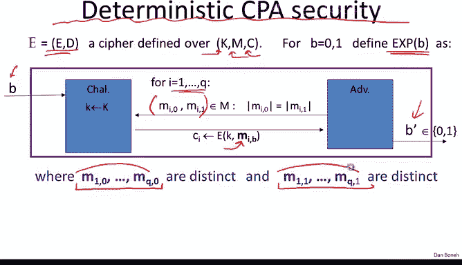
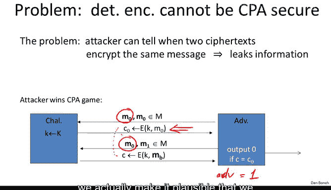
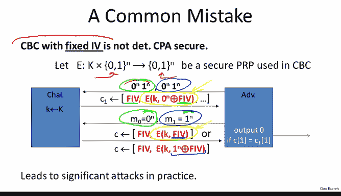
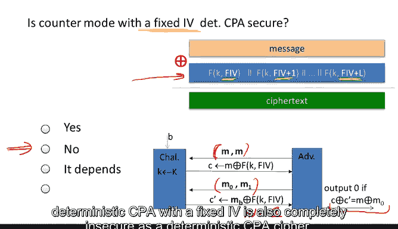

# 斯坦福大学《密码学｜Cryptography 1》中英字幕 - P43：43_04_01_确定性加密.zh_en - GPT中英字幕课程资源 - BV1Rf421o79E

In this segment， we're going to look at the concept of deter deterministic encryption that often comes up in practice。

 When I say theministic encryption system， I mean an encryption system that will always map given message to exactly the same Cyphertext。

 So if we encrypt the same message three times every time will get exactly the same cphertext So there are no nonsense involved here literally this is just a consistent encryption scheme that will always output the same Cyphertex given a particular message so let's see where this comes up in practice and in particular I want to show you the case of lookups into an encrypted database So the settings are imagine we have a server here that is going to store information inside of an encrypted database So what it will store is records and every record has an index and some data that's stored inside of the record Now the first thing the server is going to do is it's going to encrypt this record So here the record became encrypted and you notice that the index became encrypted with K1 and the data is encrypted with K2 and then the encrypted record is sent over to the database and the same thing happens to。

Record so that the database overall holds many， many encrypted records where again。

 you can imagine that the index is encrypted using the key K1 and then the data and the records is encrypted using the key K2。

Now if encryption is deterministic， the nice thing about that is that at a later time when the server wants to retrieve a record from the database。

 all he needs to do is send to the database， an encryption of the index that the server is interested in so here it would send an encryption of the index Alice that again becomes encrypted and the resulting Cyphertex is identical to the Cyphertex that was generated when the record was first written to the database and the database can then find a record that has this encrypted index in it and then send the result back to the server。

The nice thing about this is that now the database is completely in the dark as to what data is stored in the database and it doesn't even know what records are being retrieved by the server since all it sees are basically requests for encrypted indices and so this deterministic encryption mechanism lets us do a quick lookup in the database given an encrypted index and were guaranteed that because of the deterministic encryption property that the index is going to become encrypted in exactly the same way as it was when the record was created and so this should be disturbing to many of you because we previously said the deterministic encryptions simply cannot be chosen playtext secure The problem is that an attacker can look at different cphertexts and if he sees the same cphert twice he knows that the underlying encrypted messages must also be the same so in other words by looking at cphertext he can learn something about the corresponding plaintext because every time he sees the same Cyphertext twice he knows that the underlying messages are equal In practice this leads to significant attacks particularly。

When the message space is small， for example， if we're transmitting single bytes across the network。

 such as keystrokes that are being transmitted one keystroke at a time。

 then in fact an attacker can simply build a dictionary of all possible cphertexs。

 if it's only single bytes， then there will only be 256 possible Cyphertexts。

 and then simply by learning what the decryptions of those cpherts are。

 he can actually figure out all future cphertex simply by looking them up in this dictionary。

 and so there are many cases where the message space is small where this theistic encryption simply is insecure。

Now concretely， in the case of an encrypted database。

 what the attacker would see is if there are two records that happen to have the same ciphertext in the index position。

 then now he knows that those two records correspond to the same index， so again。

 even though he doesn't know what the index is he learned something about the corresponding planex。

I wanted to briefly remind you that formally we say that theistic encryption cannot be CPA secure by describing an adversary that wins the CPA game the chosen Plat attack game。

 and let me quickly remind you how that works， the game starts by the adversary sending two messages M0 and M0 and remember that in this game。

 the adversary is always going to be given the encryption of the left message or the encryption of the right message In this case since he used the same message in both cases both on the left and on the right。

 he's simply going to get the encryption of the message M0。

In the next step he's going to send the messages M0 comma M1 and now he's either going to get the encryption of M0 or the encryption of M1 and his goal is to tell which one he got。

 but because the encryption is deterministic， this is very easy for him to do。

 all he has to do is just test whether C is equal to C0 and if C is equal to C0 then he knows that he got the encryption of M0 if C is not equal to c0 he knows that he got the encryption of M1 so he can output 0 if C is equal to c0 and output1 if C is not equal to C0 and his advantage in in this particular game would be1 so it would be as high an advantage as possible which means that the attacker completely defeats chosen plan text security so this is just a form away of saying that the attacker basically learns more information about the plain text than he should。

So the question is what do we do and it turns out the solution is basically to restrict the type of messages that can be encrypted under a single key And so the idea is to say that suppose the encryptor never。

 ever， ever encrypts the same message under a single key in other words。

 the message key pair is always different and never repeat so that for every single encryption either the message changes or the key changes but or both change but it can't be that we encrypt the same message twice under the same key So why would this ever happen well it turns out they are very natural cases where this happens for example if the message happen to be random。

 say the encryptors encrypting keys and those keys you say our 128 bit keys so they'll never actually with very high probability。

 they'll never repeat in this case when we're encrypting keys in fact it's very likely that all the messages that are encrypted under one master key are always distinct because again these keys are very unlikely to ever repeat。

The other reason why messages would never repeat is simply because of some structure in the message space。

 for example， if all we're encrypting are unique user IDs。

 so imagine in the database example the index corresponds to a unique user ID and if there's exactly one record in the database for each user that says that every encrypted record basically contains an encrypted index where the index is distinct for all records in the database so these are two reasons why messages might never repeat and this is a fairly reasonable thing that actually does happen quite often in practice。

So now if the message is never repeat， now， maybe we can actually define security and actually give constructions that satisfy our definitions。

So this motivates the concept of deterministic chosen plain text attacks and let me explain what they mean so as usual we have a cipher defined as an encryption on an encryption algorithm so we have a key space。

 a message space and a cpher textex space and we're going to define security just as normal using two experiments experiment zero and experiment1 and the game actually looks very similar it's almost an identical game to the standard chosen plan text attack game where basically the attacker issues queries so you can see these queries consists of pairs of messages M0 and M1 they as usual they have to be the same length and for each query at the attacker either gets the encryption of M0 or the encryption of M1 and the attacker can do this again and again he can do this Q times and at the end of the game he's supposed to say whether he got the encryptions of the left messages or the encryptions of the right messages so this is the standard chosen plaintiff attack game and now there's one extra caveat which is to say that if the bit is equal to0 if B is equal to0。

In the attacker always sees the encryption of the left messages。

 then it so happens that the left messages must all be distinct。In other words。

 he will never get to see the encryption of the same message twice because these left messages are always distinct。

 so if the bit B is equal to0， again he'll never see the same message encrypted under the same key because again these zero messages M10。

 the MQ0 are all distinct， similarly we require all the one messages are also distinct and so that again if bit B happens to be equal to1。

 the attacker will never see two messages encrypted under the same key。Okay。

 so this requirement that all these messages are distinct and similarly all these Q messages are distinct basically captures this use case that the encryptor will never encrypt the same message multiple times using one particular key and as a result。

 the attacker simply can't ask for the encryption of the same message multiple times using the same key。

Now I should point out if you go back to the original attack here。

 so here we go back to our CPA attack on deterministic encryption， you noticed that here in fact。

 this is not a deterministic CPA game because here the attacker did ask for the same message m0 to be encrypted twice so in fact this attack would be an illegal attack under the deterministic CPA game and by ruling out this attack we actually make it plausible that we might be able to give constructions that our deterministic CPA secure and so as usual we say if the adversary cannot distinguish experiment zero when he's given the encryption of the left messages from experiment1 when he's given the encryption of the right messages then the scheme is semanically secure under a deterministic CPA attack so as usual we ask for what's the probability that the adversary outputs1 and experiment zero。

 what's the probability that he outputs one experiment1， they if these probabilities are close。

 then his advantage in attacking the scheme is negligible and if that's true for all efficient adversaries then。

We say that the scheme is semanically secure under a tumeristic CPA attack So the first thing I want to do is show you the cipher block training with a fixed IV in fact is not deter deterministic CPA secure and this is a commonly mistake that's used in practice there are many products that should be using a cipher that's the tumeristic CPA secure but instead they just use CBC with a fixed IV and assume that that's a secure mechanism and in fact it's not and I want to show you why so suppose we have a PRp that happens to operate on n bit blocks and we're going to use this PRp in CBC mode so if there are five blocks and the message then this PRP will be called five times to encrypt each one of those blocks。

Okay， so here's how the attacks going work。 Well， the first thing the adversary is going do is he's going to ask for the encryption of the message0 n1 n。

 In other words， the first block is all zeros and the second block is all ones。

 So the left message is equal to the right message here。

 which means that he just wants the encryption of this0 n1 to the N message。

 So let's see what the cphertext looks like。 Well， for completeness I'm going to write the IV the fixed IV as the first element in the Cyphertex。

 And if you think about how CBC works， the second element in the cphertex is going to be basically the encryption of the IV X or the first block of the message。

 Well， in our case， the first block of the message is all zeros。

 So really all encrypting is just a fixed IV。 So the second block of the Cyphertex is simply going be the encryption of this fixed IV。

 So next what the adversary is going to do is now he's going output two messages that are a single block。

 So the first message is going to be the message on the left is going to be the all zeros block and the message in the right is going to be all ones block。

 So observed this is a valid。Qu because messages on the left are all distinct and the messages on the right are also all distinct。

 So these are all valid deterministic CP queries Now what does the attacker get in response。

 Well what he'll get in response is the following。 if he gets the encryption of the message on the left then well what's the encryption of the one block message zero is or the n。

 it's simply the encryption of the fixed IV just as we saw before。 However。

 if he's getting the encryption of the message on the right。

 well that's going to be the encryption of1 x or the fixed IV That's just the definition of cC encryption。

 now you can see basically how the attack is going to proceed。

 you notice if here use a different color here， you notice if these two blocks happen to be the same。

 then we know that he received the encryption of the message on the left In other words B is equal to0。

 if they're not the same then he knows that b is equal to1 so he's going output zero if C of1。

 which is this block is equal to c1 of1 which is this block and he is going。But one， otherwise。

So this basically shows that CBC with a fixed IV is completely insecure basically the first block can be very easily attacked and in fact if the messages are short。

 you can again build dictionaries and completely break systems that kind of use CBC with a fixed IV hoping that it's going to be deteristic CPA secure so don't do that we're actually going to see secure deteristic CPA constructions in the next segment so I'll say one more time if you need to encrypt the database index in a consistent manner don't use CBC with a fixed IV to do it use the schemes that I'm going to show you in the next segment。

And so let me ask you the same question about counter mode with a fixed IV is this going to be a deterministic CPA secure system or not in here I'm reminding you what counter modede with a fixed IV is basically we cancatenate the fixed IV fixed IV plus1 and fixed IV plus L we encrypt all these counters。

 we cancatenate the results we encrypt the message to get the ciphertex so do you think this is going to be deterministic CPA secure。

😊，So I hope everybody said no， because basically this is a one time pad encryption and if we use this one time pad to encrypt distinct messages。

 basically we'll be getting a two time pad。And to see it more precisely here I wrote down the Germanministic CPA game。

 so you notice what the attacker will do is he would start off by asking for the encryption of the message M。

 so he will get here the message M X or the encryption of the fixed IV。

 and then he's going to ask for some two distinct messages。

 M0 and M1 that's different from M so M M0 and M1 or all three are distinct messages。

And then what he'll get is the encryption of M and now he can simply mount the standard kind of two time pad attack。

 and if this equality here of cx or c prime is equal to Mx or M0。

 he knows that c prime is the encryption of M0。And otherwise， he knows that it's an encryption of M1。

 So again， he will completely win this game with advantage as usual， with advantage equals to one。

 Okay， so again， theministic CPA with a fixed IV is also completely insecure as a deterministic CPA cipher。

So don't use any of those schemes instead let's use the schemes that we'm going to describe in the next segment。

