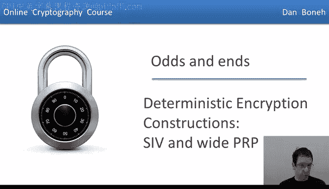
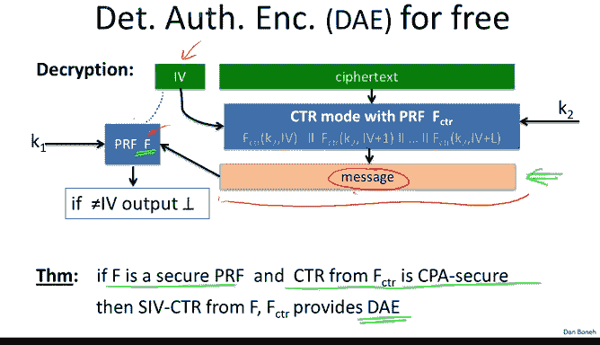
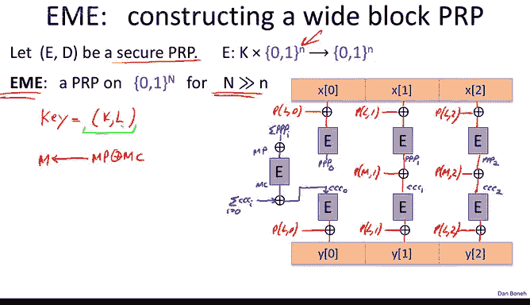
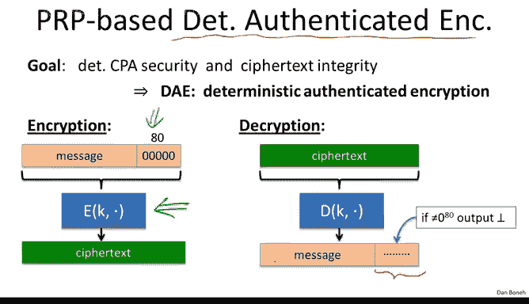

# 斯坦福大学《密码学｜Cryptography 1》中英字幕 - P44：44_04_02_确定性加密：SIV与宽PRP.zh_en - GPT中英字幕课程资源 - BV1Rf421o79E

Now that we understand what is deterministic encryption。

 let's see some constructions that provide security against the deterministic chosen planex attacks So first let me remind you that deterministic encryption is needed。

 for example， when encrypting a database index and later we want to look up records using the encrypted index because the encryption is deterministic we're guaranteed that when we do the lookup the encrypted index is going to be identical to the encrypted index that was sent to the database when the record was written to the database and so this deterministic encryption allows us a very simple and fast way to do lookups based on encrypted indices。

The problem was that we said deterministic encryption can't possibly be secure against a general chosen plaintiff test attack because if the attacker sees two cipherts that are equal。

 it learns that the underlying encrypted messages are the same。

 so then we define this concept of deterministic chosen plaintiff text security。

 which means that we have security as long as the encryptor never encrypts the same message more than once using a given key in particular。

 this key common message pair is only used once for every encryption either the key changes or the message changes。

And then as I said， formally， we defined this CPA deterministic CPA security game and our goal in this segment is to actually give constructions that are deterministic CPA secure。

So the first construction we're going to look at is what's called SIV synthetic IVs and the way this construction works is as follows。

 imagine we have a general CPA secure encryption system。

 so here is the key and heres the message and I'm going to denote by R the randomness that's used by the encryption algorithm remember that a CPA secure system that doesn't use nonsenses has to be randomized and so we're explicitly going to write down this variable R to denote the random string that's used by the encryption algorithm as it's doing the encryption for example。

 if we're using randomized counter mode R would be the random IV this's used by randomized counter mode and of course C is the resulting cphertex。

Now in addition， we're also going to need a pseudoran function F that what it does is it takes arbitrary messages in the message space and outputs。

 strings R that can be used as randomness for the CPA secure encryption scheme。

 so the little R over here is actually a member of the big R set。Okay。

 and we're going to assume this is a F is a pseudo random function that maps messages to random string Now the way SIV works is as follows。

 it's going to use two keys K1 and K2 to encrypt the message M。

 and what it does is the first thing iss going to apply the pseudoran function F to the message M to derive randomness for the CPA secure encryption scheme E and then it's going to encrypt the message M using the randomness that it just arrived and this is going to give us a Cyphertex C and then it's going to output this Cyphertex C。

Okay， so that's how this SIV mode works basically first derives the randomness from the message being encrypted。

And then it uses this derived randomness to actually encrypt the message to obtain the cipher textex。

Now I'd like to point out， for example， if the encryption scheme E happened to be randomized counter mode。

 then the randomness R would just be the random IV。

 which would actually be output along with the Cyphertex so this means that the Cyphertex is a little bit longer than the plain text but the point here isn't to generate a short ciphertex rather the point here is to make sure that the encryption scheme is deterministic so if we encrypt the same message multiple times every time we should obtain the same Cyphertext and indeed every time we'll obtain the same random as R and as a result every time will obtain the same Cyphertex C So it's fairly easy to show that this encryption scheme really is semantically secure under deterministic chosen plan text attack the reason that so is because we apply the pseudoran function F to distinct messages。

 Well if we apply f to distinct messages then the random string that F generates is going to look like just truly random strings a different random string for every message and as a result the CP secure encryption scheme E is always。

applieded using truly random strings， and that's exactly the situation where it is CPA secure。

So because these R's are just random indistinguishable for random strings。

 the resulting system is in fact going to be CPA secure。

 so this is just the intuition for why this works and it's actually fairly straightforward to actually formalize this into a complete proof。

Now I should emphasize that this is actually well suited for messages that are more than one AES block。

 in fact for short messages， we're going to see a slightly different encryption scheme that's actually better suited for these short messages now the really cool thing about SIV is that actually we get Cyphertext integrity for free In fact we don't have to use a special Mac if we want to add integrity in a sense SIV already has a built in integrity mechanism and let me explain what I mean by that first of all our goal is to build what's called deterministic authenticated encryption DE deterministic authenticated encryption which basically means the termministic CPA security and Cyphertext integrity remember Cyphertext integrity means that the attacker gets to ask for the encryptions of messages of his choice and then he shouldn't be able to produce another ciphertext that decrypts to a valid message。

Okay so I want to claim that in fact SIV automatically gives a Cyphert integrity without the need for an embedded Mac or anything else。

 so let's see why in particular let's look at a special case of SIV when the underlying encryption scheme is randomized counterm so we'll call this SV CTR again to denote SV where we're using randomized counter remote。

Allright so let me remind you again how SV works in this case。

 Well so we take our message here we take our message and then we apply a PRf to it and that derives an IV and then that IV is going to be used to encrypt the message using randomized counter mode so in particular we're going to use this PRf FcTR for F counter for randomized counter mode and essentially we evaluate this FTR at IV IV plus1 up to IV plus L and then we ex that with a message and that gives us the final spherdex so this is SV with randomized counter mode。

Now let's see how decryption is going to work and during decryption。

 we're going to add one more check， and that's going to provide Cyphertex integrity。

So let's see how decryption is going to work。 So here we have our input Cyphertext so it contains the IV and the Cyphert。

 Well， the first thing we're going to do is we're going to decrypt the Cyphertex using the given IV and that will give us candidate plain text。

Now we're going to reapply the PRFF from the definition of SV to this message。 Now。

 if the message is valid， we should be getting the same IV that the adversary supplied as part of the Cyphertext。

 if we get a different IV， then we know that this message is not a valid message and we simply reject the ciphertext。

So this is really cute， it's a very simple kind of built- in check to make sure that the Cyphertext is valid。

 right we simply check that after decryption， if we redderiveve the IV。

 we would actually get the correct IV and if not we reject a message and I claim that the simple check during decryption is enough to actually provide Cyphertext integrity and therefore the deterministic authenticated encryption。

So I'll state this in a simple theory and basically to say that if F has a secure PRF and encounter mode that's derived from FTR is CPA secure。

 then the result in fact， is a deterministic authenticated encryption system。

Now the proof for this is not too difficult in two sentences let me just show you the rough intuition for why this is true。

 so all we have to argue is just Cyphertext integrity。

 so we already argued before that the system has the deterministic CPA security all we have to argue is just Cyphertex integrity so to argue that the system has Cyphertext integrity let's think again how the Cyphertext integrity game works adversary asks for the encryption of a bunch of messages of this choice and he gets the result in Cyphertexts and then his goal is to produce a new valid Cyphertext。

Well， if that valid eyephertext upon decryption decrypts to some completely new message。

Then when we plug this new message into the PRFF， we're just going to get some random IV and very unlikely to hit the IV that the advers is supplied in the Cyphertext that he output so therefore that says that when the adversary outputs his forged ciphertext。

 the message in that forged ciphertex basically should be equal to one of the messages in his chosen message queries。

Otherwise， again， the IV that we get is simply not going to be equal to the IV in the forged Cyphertex with very high probability。

 but if the message is equal to one of the messages that the adversary queried us on well then the Cyphertext that we're going to get is also going to be equal to one of the Cyphertexts that we supply to the adversary but then his forgery is simply one of the Cyphertexts that we gave to him and therefore this is not a valid forgery。

 he has to give us a new Cyphertext to win the Cyphert integrity game。

 but he gave us one of our old Cypherts。So this is the rough intuition。

 I hope I kind of went through it quickly， I hope it kind of makes sense if it doesn't。

 it's not the end of the world， I'm going to reference the paper that describes SIV at the end of the module and if you want to see this in more detail you can read and take a look instead of that paper but regardless this is a very cute idea that I wanted to show you where kind of the fact that we derive the randomness for deterministic counter remote using a PRF also gives us an integrity check when we actually do the decryption。

Okay so this S is a good mode for doing deterministic encryption when you need to。

 particularly if the messages are long， if the messages are very short。

 say they' are less than 16 bytes， in fact， there's a better way to do it。

 and that's the method that I want to show you now。 So the second construction is actually trivial。

 All we're going to do is we're going to use a PRRP directly。 So here's what we do。

 So suppose ED is a secure PRRP。 so E will encrypt and D will decrypt。

And I claim that if we use E directly， that already gives us deterministic CPA security。😡。

So let me show you very quickly why。 so suppose F is a truly random invertible function from x tox Okay so remember our PRRP is indistinguishable from a truly random invertible function。

 So let's pretend that we actually do have a truly random invertible function。Now in experiment0。

 what the attacker is going to see while he submits a bunch of messages。

 you know the messages on the left and what he's going to see is basically the evaluation of F on the messages on the left that he supplied well in the deterministic CPA game。

 all these messages are distinct and so all he's going to get back are just Q distinct random values in X that's all he sees。

Yes， the cubed distinct random values is in X。Now let's think about experiment1 in experiment 1。

 he gets to see the encryptions of messages on the right， the M11 to MQ1， well again。

 all these messages are all distinct， so all he gets to see are just Q random distinct values in x。

Well these two distributions in experiment 0 and experiment1 therefore are identical。

 basically in both cases what he gets to see are just Q distinct random values in x and as a result。

 he can't distinguish experiment0 from experiment1 and since he can't do this for a truly random function。

 he also can't do this for the PB。Okay so that explains why directly encrypting with a PRP already gives us a CPA secure system very。

 very， very simple to use。

That says that if all we want to do is encrypt short messages， say less than 16 bytes。

 then all we need to do is just directly encrypt them using AES。

 and the result will in fact be deterministic CPA secure。 So if your indices are less than 16 bytes。

 directly using AS is a fine thing to do。Notice， however， that's not going to provide an integrity。

 and we're going to see how to add integrity in just a minute。

 But the question for you is what do we do if we have longer than 16 by messages Well。

 one option is to use SV but what if we wanted to actually use this construction too。

 it's actually an interesting question， can we construct PRPs that have message spaces that are bigger than just 16 bys。

 If you remember in the past we constructed PRfs that had large message spaces from PRfs that had small message spaces here we're going to construct PRpss with large message spaces from PRps with small message spaces。

 So let's see how to do it。So suppose ED is a secure PRP that operates on endbed blocks。

There's a standard mode called EME that actually will construct a PRRP that operates on capital Nbed blocks where capital N is much。

 much bigger than little N。So this wouldn't allow us to do deter termistic encryption on much larger messages than just 16 bytes。

 in fact， it could be as long as we want。So let's see how EME works， it's a bit daunting in first。

 but it's not a difficult construction， so let's see how it works。 So EE uses two keys K and L。

 and in fact， in the real EME L is derived from K， but for our purposes。

 let's just pretend that K and L are two distinct keys。

The first thing we do is we take our message X and we break it up into blocks and then we exhor each block with a certain padding function Okay so we use the secret keyL to derive a pad using this function P that I'm not going to explain here we derive a different pad for each one of the blocks and we exor that pad into the block But the next thing we do is we apply the PP E using the keyK to each of these blocks and we're going to call these outputs PPP0 PPP1 and PPP2 The next thing we do is we exor all these PPPs together and we call the result NP actually this Xor doesn't need to be there。

We call the result of this Xor MP。 The next thing we do is we exO all these PPP together。

 and we call the result MP。 We encrypt this MP using E in the keyK。

 and we call the outputs of this encryption MC。Okay。

 so then we use we exO MP and MC and this gives us another keyM， which we use to derive one more pad。

 and then we exor this output of this pad with all the PPPs to get these CCs Now we exor all these CCs together that gives us a value CC0 which we then encrypt one more time with all these E's。

We do one more padding with all these Ps and that actually finally gives us the output of EME Okay so like I said。

 this may look a little daunting， but in fact there's a theorem that shows that if the underlying block size for E is a secure PRRP then in fact。

 this construction EME is a secure PRRP on this larger block know01 to the capital N the nice thing about this construction is you notice it it's very parallel and actually that's why it's a little complicated kind of every block gets encrypted in parallel so if you have a multicore processor you can use all your cores to encrypt all the blocks at the same time。

 and then there would be one kind of sequential step to compute this check sum on all the outputs and then one more parallel round to encrypt one more time and then finally you get the outputs。

 these function p's， by the way， that generate the pads are very。

 very simple functions they take constant time so we're just going to ignore them in terms of performance。

So the bottom line is performance here， you notice this requires two applications of E per input block。

And it turns out this can actually be slower than SIV if SIV is implemented properly with a very fast PRF to derive the randomness。

 then in fact， SIV can be twice as fast as this particular mode of operation。For this reason。

 I say that the PRB construction is very good for short messages。

 whereas SIV is good if you want to encrypt longer messages in a deterministic fashion。

But now what if we wanted to add integrity to this PRRP based mechanism。

 so can we achieve deterministic authenticated encryption using the PRP mechanism where we directly encrypt the message using a PRP？

And it turns out the answer is yes， and it's actually again a very simple encryption scheme that you should know about。

 basically what we're going to do is we're going to take our message and we're going to append a bunch of zeros to this message and then we're going to apply the PRP and that's it that's going to give us a ciphertext。

😊，Now very， very simple， just the pen zeros and encrypt using a PRP。 When we decrypt。

 we're going to look at these least significant bits of the resulting plain text and if they're not equal to 0。

 we're just going to reject thecipherex and if they are equal to 0。

 we're going to output the messages valid。Okay so that's it， that's the whole system very。

 very simple， simply append zeros during encryptption and then check it the zeros are there when you decrypt and I claim that this very simple mechanism actually provides deterministic authenticated encryption assuming of course that you've appended enough zeros in particular if you append N zeros。

 we need one over two to the end to be negligible and if so。

 then in fact this direct PRRP based encryption in fact provides deterministic authenticated encryption。

😊。

So let me see why。Well， we already argue that the system is CPA secure。

 So all we have to argue is that it provides ciphert integrity。And again that's easy to see。

 let's look at the Cyphertext integrity game， so the adversary is going to choose let's say a truly random permutation。

 so a truly random invertible function on the input space in this case the input space is the message space and the n0 bits and now what does the adversary get to do while he gets to submit Q messages and then he receives the encryption of those Q messages namely he receives the PRRP at his chosen points concatenated with n zeros。

Okay， that's what basically it means to query the CPA challenger。So in case of a random permutation。

 he simply gets to see the value of this permutation at Q points of his choice。

 but only concaten it with n zeros And now what's his goal in the Cyphertext integrity game Well his goal is to produce some new cphertex that's different from the cphertext that he was given that's going to decrypt properly Well。

 what does it mean that it decrypts properly， it means that if when we apply pi inverse。

To the Cypherex C， it had better be the case that the n least significant bits of C are all zeros And the question is how likely is that to happen Well。

 so let's think about this Basically we have a truly random permutation and the adversary got to see the value of this permutation at Q points。

 how likely is he to produce a new point then when inverted happens to have n zeros as the least significant bits。

😊，What we're doing here is basically we're evaluating the permutation pi inverse at the point C。

 and since pi inverse is a random permutation， how likely is it to have its endless least significant bits be equal to zero？

So it isn't hard to see that the answer is is at most the probabilities in most1 over2 to the n。

 because again， basically the permutation is going to output a random element inside of x times01 to the n。

 and that element is going to end with n zeros， but basically with probability 1 over2 to the n。

And as a result， the adversary win the game with negligible probability because this value is negligible。

So that's the end of this segment， I wanted you to see these two very cute deterministic authenticated encryption schemes。

 the first one we called SIV， where I say you would use randomized counter mode and you just derived a randomness for randomized counter mode from a PRF applied to the message and the very cute idea here is that during decryption you can simply recompute the IV from the decrypted message and verify that that IV is what' given to you in the Cyphertext。

And that simple check is actually enough to guarantee authenticated encryption。

 or rather deterministic authenticated encryption。So this mode is the way you would encrypt an index in a database if the index was large。

 if the index happens to be short， maybe say it's 8 bytes if it's an8 byte user ID。

 then you can directly use a PRRP and the way you would do it is you would append zeros to those eight bytes and then those zeros would then be used as an integrity check when you decrypt and again if you append are able to append enough zeros then in fact this also provides a termistic authenticated encryption as an aside I showed you that there's a way to build a wide block PRRP from a narrow PRRP and that particular mode of operation is called EME so we're going to refer to EME actually in the next segment。

