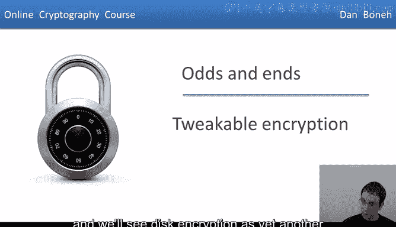
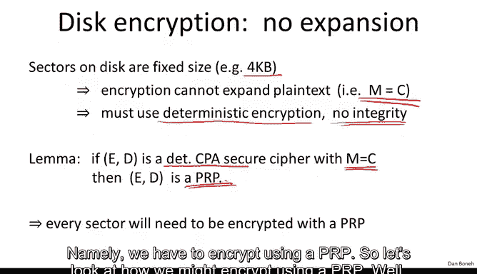
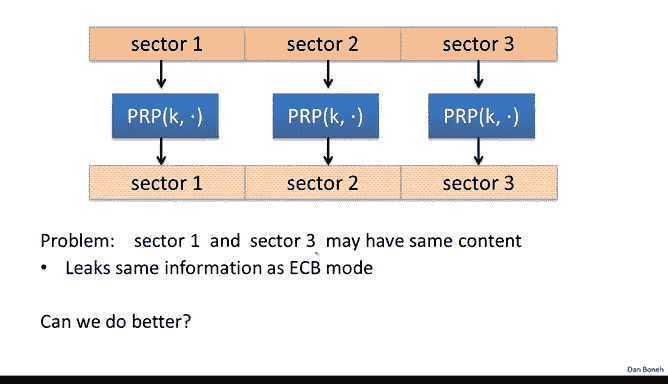
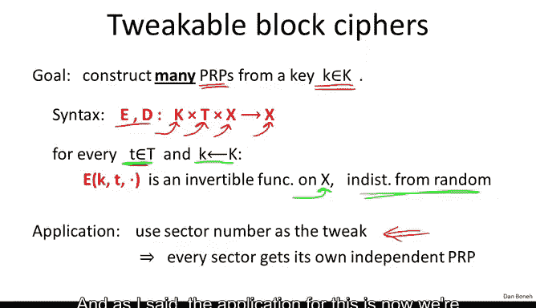
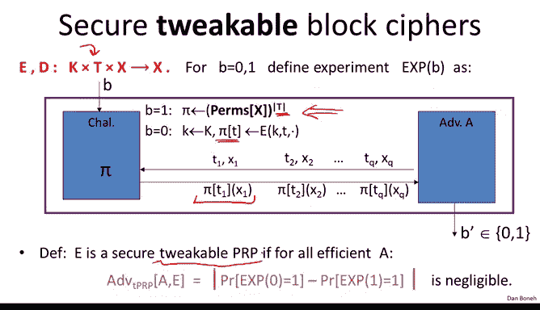
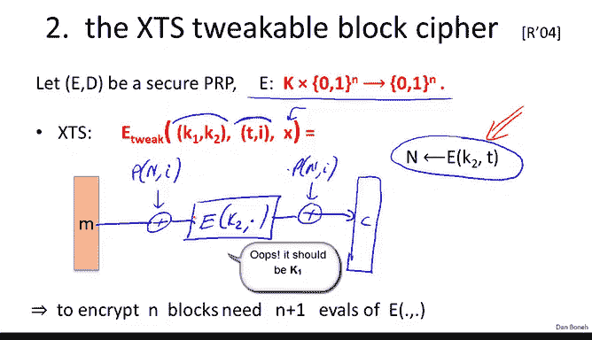

# 斯坦福大学《密码学｜Cryptography 1》中英字幕 - P45：45_04_01_可调加密.zh_en - GPT中英字幕课程资源 - BV1Rf421o79E

In this segment， we're going to look at another form of encryption called tweakable encryption。

 I'm going to motivate tweakable encryption using this encryption as an application。

 and we'll see this encryption is yet another application for deterministic encryption。

 So the disc encryption problem is that we want to encrypt sectors on disks。

 say each sector is 4 kiloB long。 And the problem is that there is no space to expand。

 In other words， if the sector size is 4 kilo。 The cphertex size also has to be exactly 4 kilo。

 because there's no word to right the extra bit。 If the cphertex was bigger than the plain text。

And so our goal is basically to build a non expanding encryption where the Cyphotex size is identical exactly equal to the plain text size。

So what does it mean that encryption can't expand well technically we're saying basically the message space is equal to the Cyphertex space。

 so the message space would be 4 kilote messages and the Cyex space would be also 4 kilobyte messages。

In this case， clearly we have to use deterinistic encryption because if encryption was randomized。

 there would be no place to store randomness。And similarly。

 we have no room for integrity because we can't expand the Cyphertext and add any integrity bits。

 So the most we can achieve is deter deterministic CPA security。 And that's going to be our goal。

 Now， it turns out there's a really simple Emma to prove that basically says that if you give me a deterministically CP secure cipher where the message space is equal to the Cyphertex space。

 so no expansion， then in fact， the cipher is a PRP。

 so really all we're saying here is if we want no expansion at all。

 our only option for encrypting is what we called construction number two in the previous segment。

 namely we have to encrypt using a PRP。

So let's look at how we might encrypt using a PRP Well we take our disk and we break it into sectors and now if we encrypted every sector using a PRP under the same key。

 we kind of run into our standard problem with the tumeristic encryption namely if sector1 and sector 3 happened to have the same plain text。

 then the encrypted sector one would be equal to the encrypted sector3 and the attacker would learn that the corresponding in plain text are the same Now this actually is a real problem for example。

 if some of your sectors are empty they're all set to zero that in fact the encrypted sectors would be identical and as a result the attacker would know exactly which sectors on your disk are empty and which sectors are not So this is actually quite problematic and the question is can we do any better。

And so the answer is yes， and the first idea that comes to mind is well why don't we use a different key for every sector So you can see sector number one gets encrypted with K1 sector number two gets encrypted with K2 and so on and so forth。

 So now even if the content of sector number one is equal to sector number3 the ciphertex of sector1 and sector3 will be different because they're encrypted under different keys。

 So this actually avoids the leakage that we talked about before。

 although I do want to point out that is still a little bit of leakage with this mode， for example。

 if the user happened to change one bit in sector1 and then that sector gets encrypted into a different ciphertext so this will be garbled all completely because this is a pseudo random immutation the sector will be even if one bit of the plainex changes the sector will be just mapped to a completely new random output。

 however if the user then undoes the change and reverts back to the original sector。

 then the encrypted sector will revert back to its original state and the attacker can tell。

That a change was made and then reverted so there's still a little bit of information leakage。

 but that type of information leakage is really nothing we can do without really sacrificing performance so we're just going to ignore that and deem that acceptable。

So the next question is now you realize these our disks are actually getting pretty big and there are lots of sectors。

 so this would mean that we're generating lots and lots of keys here。

 but of course we don't have to store all these keys。

 we can simply generate these keys using a pseudoran function So the way this would work is we would have a master key。

 which we would call K and then the sector number which I'm going to denote by t is going to be encrypted using the master key and the result of that encryption would be the particular sector key which I'll denote by K sub T Now the reason this is secures again because the PRf is indistinguishable from a random function which means that basically if we apply a random function to the sector numbers 1。

2，3，4 up to L they basically get mapped to completely random elements in the key space and as a result we're encrypting every sector using a new random independent key。

So this is a fine construction， however again for every sector we would have to apply this PRF and so the natural question is can we do even better and it turns out we can and this introduces this concept of a tweakup of block cipher where really what we want is basically to have one master key and we want this one master key to derive many many many PRPs so we said one way to do that is simply encrypts the keyK using the PRP number but as we'll see there's a more efficient way to do that。

Now this PRP number is actually what's called a tweak and that introduces this concept of tweakable block cipher。

 so in a tweakable block cipher， the encryption and decryption algorithm basically as usual take a key as input。

 they take a tweak as input， this capital T is what's called the tweak space。

 and of course they take the data as input and the output data in the set X。

The property is for every tweak in a tweak space in a random key。

 basically if we fix the key in the tweak， then we end up with an invertible function a one to one function on the set X and because the key is random where the function is in fact indistinguishable from random。

 in other words， for every setting of the tweak， we basically get a PRRP。

 an independent PRRP from x to X。And as I said， the application for this is now we're going to use the sector number as the tweak and as a result。

 every sector is going to get its own independent PRP。 So let me very。

 very quickly just define more precisely what is a secure tweakable block cipher so as we said there's a tweak space there's a key tweak space in the input space X and as usual we define our two experiments here in experiment1 what's going to happen is we're going to choose a truly random set of permutations so not just one permutation。

 we're going to choose as many permutations as there are tweaks So you notice this is why we raise this to the size of the tweak space if the size of the tweak space is5。

 this says that we're choosing five random permutations on the set X。

And in the other case， basically we're just going to choose a random key and we're going to define our set of permutations as the ones defined by the tweaks in the tweak space and now the adversary basically gets to submit a tweak in an x and he gets to see the value of the permutation defined by the tweak T1 evaluated at the point x1。

And he gets to see this again and again again， he gets to see the value of the permutation defined by the tweak T2 evaluated at the point x2 and so on and so forth。

 and then his goal is to say whether he interacted with truly random permutations or pseudoran permutations and if he can't do it。

 we say that this tweak of a blockcipher is secure。😊。

So the difference from a regular blockciphere is in a regular blockciphere you only get to interact with one permutation。

 and then your goal is to tell whether you're interacting with a pseudoran permutation or a truly random permutation。

 here you get to interact with T random permutations and again your goal is to tell whether the T random permutations are truly random or pseudoran。

😊，So as usual， if you can't distinguish if the adversary behaves the same in both experiments。

 we say that this PRP is a secure tweakable PRP。

Okay， very good。 So let's look at some examples。 So we already looked at the trivial example in a trivial example。

 what we do， we just and we're going to assume that the key space is equal to the input space。

 So this PRRP really acts on you know x times x to x。😊，So think of A yes， for example。

 where the key space is 128 bits， the data space is 128 bits， and of course the output is 128 bits。

And then the way that we define a tweakable blockcipher， again， there's a key。

 a tweak and data as input is basically we encrypt the tweak using our master key。

 and then we encrypt the data using the resulting random key。

Now you realize that if we wanted to encrypt n blocks with this tweak of a block cipher。

 this would require two n evaluations of the block cipher。

 n evaluation is to encrypt the given tweaks and more evaluations to encrypt the actual given data。

So I want to show you a nice example that shows that we can actually do better。

 This is called the XDS construction。 It's actually originally based on a mode called Xx do fillraway and it works as follows So suppose you give me a regular block cipher that operates on end bit blocks。

 so not a tweakable block cipher just a regular block cipher We're going to define a tweakable block cipher。

 So again this tweakable block cipher is going to take two keys as input the tweak space for convenience。

 which we're going to see in just a minute， we're going assume this tweak space is made up of two values T and I T is going to be some some tweak value。

 which we'll see in a minute and I is going to be some index and then x is going to be an end bit string。

 which we're going to apply the tweakable block cipher2 So the way XDS works is as follows The first thing we're going to do is we're going encrypt the left half of the tweak namely T using the key K2 and we're going to call the result n So now what we're going to do is we're going to x or the message M。

Some padding function applied to this value N that we just arrived at the index I。

 and this padding function is extremely fast。 We can pretty much ignore it in the running time。

 The next thing we do is we're going to encrypt using the key K2。

And then we're going to X or again using the same pad。

 So we're going to x or again using the pad of n apply to I。

 and the result is going to be the ciphertex。Wwhich will denote by c Okay so again， as I said。

 the function P is a very， very simple function， it's just a multiplication in the finite field。

 which I'm not going to explain here very， very fast。

 so the running time is really dominated by the running time of the block cipher E。And that's it。

 that's XTS。And the nice thing about this construction is now if we wanted to encrypt n plus one blocks。

 all we do is we compute the value n once， and then for the indices 1，2，3，4。

 basically we just need to evaluate the PRPE once per block。

 so we would need to encrypt n blocks using the tweaks t comma 1 t comma 2 tcoma 3 t comma 4 and so on we would just need n plus1 evaluations of the block cipher E。

 so it's twice as fast as the trivial construction。

So I want to stare for just a minute at this XTS construction so my question to you is it really necessary to encrypt the tweak before using it that is the following construction a secure tweakable PRRP so you can see in this construction the tweak is used directly as input to the padding function for the XorR and my question to you is if we did that would that be a secure tweakable PRP let me remind you again that this is the key。

 this is the tweak and this is the data。

I hope everybody said that this is the correct answer， basically if we set the data to be PT comma 1。

Then when we exOate with the corresponding tweak， which is also PT comma 1， we're going to get here0。

 And so what's going to get encrypted is actually 0。 So whatever that comes out to be。

 let's say that's some value C 0。 And then the actual output is going to be C 0 x or P 1。

Now when we do the same thing with PT2， we're going to get C0 x or PT2。

 and when we exO these two things together， we just get PT1， x or PT2。

So the fact that this is true means that an attacker can simply query the challenger at this tweak and this data this week and that data and then just compute the Xer of the two responses and compare to the Xer of the appropriate padding values and if the holds we're interacting with a pseudoran function otherwise we're interacting with a truly random function So this would allow the attacker to defeat this construction with advantage one So just to summarize the way XtS is used for this encryption。

 What we do is we look at sector number T and we break it into block 16 byte blocks and then block number one gets encrypted with a tweak T1 block number two gets encrypted with a tweak T2 and so on and so forth。

 and so every block gets its own PRP and the whole sector as a result is encrypted using a collection of PRP。

 Now you notice this is a block level PRp， it's not a sector level PRp So in fact it's not true that each sector gets encrypted with its own PRP。

 it's just each block gets encrypted with its own PRP。

The distinction between the sector and a block is somewhat artificial and this XS mode actually provides deterministic CPA encryption at the block level。

 at the 160 byte level， that's the goal。And this mode actually is fairly popular in this encryption products。

 I just wrote a couple of examples here that actually support XDS。

 so I wanted you to know that this in fact is how this encryption is commonly done in practice。

So to summarize tweakable encryption is a useful concept to note when you need many independent PRPs all derived from a single key。

 one important thing to remember is in fact the trivial construction is not the most efficient。

 there are constructions like XS are actually more efficient where you can kind of reuse encryptions from one tweak to get many encryptions for many different tweaks and so those are the better ways to use them。

 both the trivial construction and the XDS construction are what are called narrow block constructions。

 namely they provide a tweakable block ciphers for 16 by block。But as we said。

 we looked at the EME construction in the last segment which provided a PRP for larger。

 much larger blocks， and in fact EME is a tweakable mode of operation。

 so if you need PRPs for larger blocks or tweakable PRPs for larger blocks。

 then you would just use EME， but you notice there in EME。

 you have to apply the block size for twice per input block and as a result it's twice as low as XTS and is not very often used。

So that's what I wanted to say about weekable encryption and in the next segment we'll talk about format preserving encryption。

