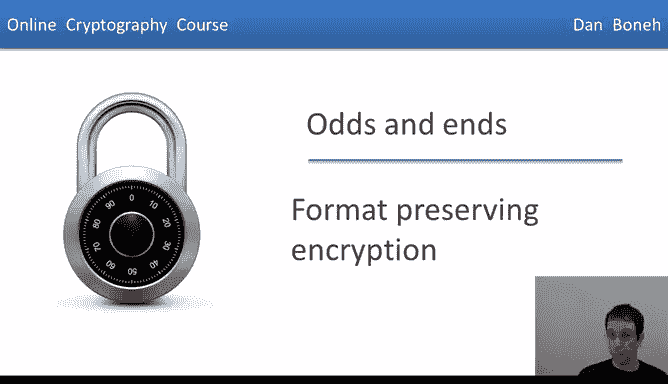
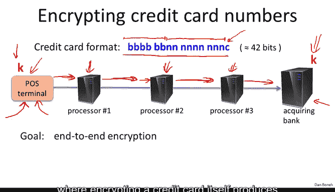
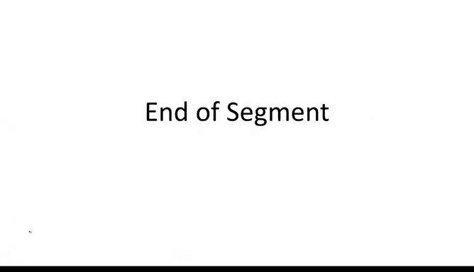

# 斯坦福大学《密码学｜Cryptography 1》中英字幕 - P46：46_04_02_格式保留加密.zh_en - GPT中英字幕课程资源 - BV1Rf421o79E

In this segment I want to tell you about another form of encryption called format preserving encryption。

 This is again something that comes up in practice quite often。

 especially when it comes to encrypting credit card numbers and so let's see how it works。

 remember that a typical credit card number is 16 digits broken into four blocks of four digits each you've probably heard before that the first six digits are what's called the bin number which represent the issue ID For example。

 all credit cards issued by Vi always start with the digit 4 All credit cards issued by mastercard start with digits 51 to 55 and so on and so forth。

The next nine digits are actually the account number that is specific to the particular customer。

 and the last digits is a checkum that's computed from the previous 15 digits。So there are about 20。

000 bid numbers and so if you do the calculation， it turns out there are about2 to 42 possible credit card numbers which corresponds to about 42 bits of information that you need to encode if you want to represent a credit card number compactly。

Now the problem is this suppose we wanted to encrypt credit card numbers so that when the user swipes the credit card number at the point of cell terminal。

 namely at the merchant's cash register， the cash register is called a point of cell terminal goes ahead and encrypt the credit card number using a keyK and it's encrypted all the way until it goes to the acquiring bank or maybe even beyond that maybe even all the way when it goes to Vi Now the problem is that these credit card number actually passed through many processing points。

 all of them expect to basically get something that looks like a credit card number as a result。

 so if we simply wanted to encrypt something at the endpoint at one endpoint and decryed at the other endpoint it's actually not that easy because if all we did was encrypted using A yes even if we just use the termministic A yes the output of the encrypted credit card number would be 128 bit block16 bytes would need to be sent from one system to the next until it reaches this destination but each one of these。

Processors then would have to be changed because they're all expecting to get credit card numbers。

And so the question is， can we encrypt at the cash register such that the resulting encryption itself looks like a credit card number and as a result none of these intermediate systems would have to be changed。

 only the endpoints would have to be changed in doing so we would actually obtain end to end encryption without actually having to change a lot of software along the way。

So the question then is， again， can we have this mechanism called format preserving encryption。

 where encrypting a credit card itself produces something that looks like a credit card？

So that's our goal The encrypted credit card number should look like a regular valid credit card number。

 so this is the goal of format preserving encryption more abstractly。

 what it is we're trying to do is basically build a pseudo random permutation on the sets 0 to S minus1 for any given S。

So for the set of credit card numbers S will be roughly2 to the 42 in fact it's going to be not exactly2 to the 42 it's going to be some funny numbers that's around 2 to the 42 and our goal is to build a PRRP that acts exactly on the interval0 to S minus-1 and what we're given is input is some PRf say something like AES that acts on much larger blocks。

 say acts on 16 byte blocks So we're trying to in some sense shrink the domain of the PRf to make it fit the data that were given and the question is basically how to do that。

Well， once we had such a construction， we can easily use it to encrypt credit card numbers。

 what we would do is we would take a given credit card number。

 we would encode it such that now it's represented as a number between zero and the total number of credit card numbers。

Then we would apply our PRP so that we would encrypt this credit card number using construction number two from the deterministic encryption segment。

And then we would map the final number back to be a regular to look like a regular valid credit card number and then send this along the way。

Since this is again non- expandingpanding encryption， the best we can do， as we said before。

 is to encrypt using a PRP， except again， the technical challenge is we need a PRP that acts on this particular funny looking set from 0 to S minus1 for this prespecified value of S。

So my goal is to show you how to construct this and once we see how to do it。

 you will also know how to encrypt credit card numbers so that the resulting Cyphertex is itself a credit card number。

So the construction works in two steps So the first thing we do is we shrink our PRF from the set 01 to the n。

 say 01 to the 128 in the case of AES to 01 to the T where T is the closest power of 2 to the value S so say S is some crazy number around 2 to the 41 T would basically be then 42 because that's the closest power of 2 that's just above the value of S so the construction is basically going to use the luby rockoff construction what we need is a PRFf prime that acts on blocks of size2 over 2 so imagine for example in the credit card case T would be 42 because 2 to the 42 we said is the closest power of 2 that's bigger than S S is the number of total number of credit cards。

Then we would need a PRF now that acts on 21 bit inputs。

So one way to do that is simply take the AES block cipher treated as a PRf on 128 B inputs and then simply truncate the output to the least significant 21 bits Okay so we would given a 21 bit value。

 we would append zeros to it so that we get 128 bits as a result。

 we would apply AES to that and then we would truncate back to 21 bits。

Now I should tell you that that's actually a simple way to do it。

 but it's actually not the best way to do it。 There are actually better ways to truncate a PRf on endbits to a PRF on two over two bits。

 but for the purposes of this segment， the truncation method I just said is good enough。

 so let's just use that particular method。Okay so now we've converted our AES block cipher into a PRF on two over two bits。

 say on 21 bits， but what we really want is a PRP and so what we'll do is we'll plug our new PRFF prime directly into the Luby Raov construction if you remember this is basically a fiveyle construction we saw this when we talked about Des it's Luby Raoff used three rounds and we know that this converts a secure PRF into a secure PRP on twice the block size in other words we started from a secure PRF on 21 bits and that will give us and Lubyakoff will give us a secure PRF on 42 bits which is what we wanted。

Now I should tell you that the error parameters in the Lubiakkov construction are not as good as they could be。

 and in fact， a better thing to do is to use seven rounds of Fistal。 So in other words。

 we'll do this seven times every time will use a different key so you notice here we are only using three keys we should be using we should be doing the seven times using seven different keys and then there's a nice result due to patran that shows that the seven round construction basically has as good error terms as possible So the error terms in a security here and we'll basically be2 to the T。

 so now we have a pseudo random permutation that operates on close power of2 to the value of s but that's not good enough we actually want to get a pseudoran permutation on the set0 to S minus-1。

So step two will take us down from01 to the t to the actual set0 to the S minus1 that we're interested in。

And this construction is again really， really cute so let me show you how it works。

 so again we're given this PRP that operates on a power of two and we want to go down to a PRRP that operates on something slightly smaller。

Okay so here's how the construction works Basically we're given input x in the sets0 to S minus1 that we want and what we're going to do is we're going to iterate the following procedure again and again so first of all we map x into this temporary variable Y and now we're just going to encrypt the input X and put the result into Y if y is inside of our target set。

 we stop and we output y if not we iterate this again and again and again and again and again until finally y falls into our target set and then we output that value。

So in a picture let me explain how this works， so we start from a point in our target set and now we applied the function E and we might be mapped into this point outside our target set so we're not going to stop so now we apply the function E again and we might be mapped into this point and now we apply the function E again and now all of a sudden we mapped into this point and then we stop and that's our output。

Okay， so that's how we map points between from0 to S minus-1 to other points in0 to S minus-1。

It should be pretty clear that this is invertible to invert all I'll do is I'll just decrypt and walk kind of in the opposite direction。

 so I'll decrypt and then decrypt and then decrypt until finally I fall into the set 0 to S -1。

 and that gives me the inverse of the point that I wanted to。So this is in fact a PRRP。

 the question is whether it's a secure PRRP and we'll see that in just a minute。

 but before that let me ask you how many iterations do you expect that we're going to need and I want to remind you again before I ask you that question that in fact S is less than2 to the t but is more than 2 to the t minus1。

😊，So in particular， S is greater than 2 to the T over 2。

And my question to you now is how many iterations are we going to need on average until this process converges？

So the answer is we're going to need two iterations， so really just a small。

 constant number of iterations， and so this will give us a very。

 very efficient mechanism that will move us down from 01 to the T to 0 to the S minus1。

So now when we talk about security， it turns out the step here is tight， in other words。

 there is really no additional security cost to going down from2 to the t to 0 to S minus-1。

 and the reason that's true it's actually again a very cute theorem to prove。

 but I won' do here or maybe I'll leave it as an exercise for you guys to argue。

 which says that if you give me any two sets y and x where y is contained inside of x。

 then applying the transformation that we just saw to a random permutation from x to X。

 actually gives a random permutation from y to Y。So this means that if we started with a truly random permutation on X。

 you'll end up with a truly random permutation in y and since well the permutation we're starting with is indistinguishable for random on x will end up with a permutation that's indistinguishable for random on Y so this is a very tight construction and as I said the first step actually is basically the analysis is the same as the lubiakov analysis in fact it's better to use as I said the patternin analysis using seven rounds and so actually here there's a bit of cost in security but overall we get a construction that is secure PRp for actually not such good security parameters but nevertheless this is a good secure PRp that we can construct that actually will operate on the range0 to s minus1 and this in turn will allow us to encrypt credit card numbers such that the Cypherex looks like our credit card number and again I want to emphasize is there's no integrity here the best we can achieve here is just the deterministic CPA security no cphertex integrity and no randomness at all。

Okay so this concludes this module and as usual I want to point to a few reading materials that you can take a look at if you're interested in learning more about anything that we discussed in this module So first of all。

 the HKDF construction that we talked about for key derivation is described in a paper from 2010 by Hugo Kcheck。

Theterministic encryption， the SIV mode that we described is discussed in this paper over here。

 the EME mode that we described that allows us to build a wide block pseudo random permutation is described in this paper here by Olivviian Raaway。

 tweakable block ciphers that actually led to the XDS mode of operation it' used for this encryption is described in this paper here and finally format reserving encryption is described in this last paper that I point to over here。

Okay， so this concludes this module and in the next module。

 we're going to start looking at how to do key exchange。

