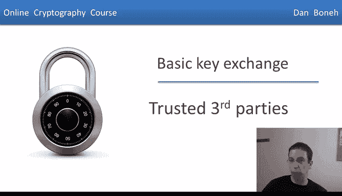
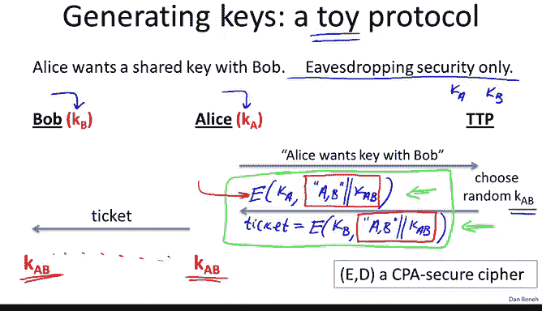

# 斯坦福大学《密码学｜Cryptography 1》中英字幕 - P47：47_05_01_可信第三方.zh_en - GPT中英字幕课程资源 - BV1Rf421o79E

Now that we know how two users can protect data using a shared secret key。

 the next question is how do these two users generate a shared secret key to begin with This question will take us into the world of public key cryptography In this module。

 we will look at a few toy key exchange protocols as a way to introduce the main ideas of public key cryptography We're going to come back and talk about key exchange and design secure key exchange protocols after we build a few more public key tools。

So imagine for a second that there are in users in the world。

 and the question is how do these users manage these secret keys that they're going to use to communicate with one another？

So for example， let's assume n equals 4 and there are four users in the world One option is that basically every pair of users will share a shared secret key。

 so for example U1 and U3 will share a shared secret key I'll call it K13。

 U1 in U2 will share a shared secret key we'll call it K12 and so on and so forth， K24， K34。

 and so on and so forth。K 1，4， and finally， K23。The problem with this approach is that now there are many。

 many shared keys that users have to manage， and in particular。

 every user has to store on the order of N keys if he's going to talk to N other parties in this world。

So the question is can we do any better than storing M keys per user And the answer is yes。

 and one way to do that is what's called an online trusted third party。

 I'll use TTP to denote a trusted third party So the way we're going to use a trusted third party is every user will now share a single key with this trusted third party so user one will share a secret key user two will share a secret key and here are our friends。

 Alice and Bob let's call their secret keys K set A and K set B so now the nice thing about this design is that now every user only has to remember one secret key。

The question is now what happens when Alice wants to talk to Bob somehow the two of them have to engage in a certain protocol such that at the end of this protocol。

 they will have a shared secret key， KAB that the attacker wouldn't be able to know。

And so the question is how do Alice and Bob generate this shared secret key KAB。

 So let's look at an example toy protocols for doing that。

So here we have our friends， Alice and Bob， as usual， Bob has his key KB。

 which is shared with a trusted third party。 Alice has her secret key K。

 which is also shared with a trusted third party So here the trusted third party has both K and KB And the question is how did they generate a shared key that they both agree on but the attacker would have no idea what the shared key is So here we're only going to look at a toy protocol in particular this protocol is only going be secure against eavdropping is's not going to be secure against more tampering or active attacks。

 as I said we're going to come back and design secure key exchange protocols later on in the course。

 but for now just to introduce this idea of key exchange。

 let's look at the simplest simplest mechanism that's only secure against eavdropping So in other words。

 adversary that listen to the conversation won't know what the shared key KAB is going to be。

And so the protocol works as follows。 Alice is going to start by sending a message to the trusted third party saying。

 hey， I want a secret key that's going to be shared with Bob。

 What the trusted third party will do is it will actually go ahead and choose a random secret key KB So the trusted third party is the one who's going to generate their shared secret key and what it will do with this key is the following。

 It's going to send one message back to Alice， but this message consists of two parts。

 the first part of the message is an encryption using Alice's secret key using the key K of the message this key is supposed to be used between parties。

 Alice and Bob and she includes the secret key KAB inside of this message so just to be clear what's happening here is that the message that gets encrypted is the key KAB plus the fact that this key is supposed to be a shared key between Alice and Bob and this whole message is encrypted using Alice's secret key。

The other part of the message that the TTP sends to Alice is what's called a ticket。

And this ticket is basically a message that's encrypted for Bob。 So in other words。

 the ticket is going to be an encryption under the key KB of again。

 the fact that this key is supposed to be used between Alice and Bob and she cancate to that the secret key KAB Okay so again。

 the message that's encrypted inside of the ticket is the fact that this key is to be used by Alice and Bob and the secret key KAB is included in the ticket as well。

Okay， so these two messages here， let me circle them。

 these two messages are sent from the Trust of third party to Alice。

Now I should mention that the encryption system E that's actually being used here is a CPA secure cipher and we'll see why that's needed in just a minute。

 So this is the end of the conversation between Alice and the trustedted third party Basically。

 as we said at the end of this conversation， Alice receives one message that's encrypted for her and another message called a ticket that's encrypted for Bob。

Now at a later time when Alice wants to communicate securely with Bob。

 what she will do is of course she will decrypt her part of the message， in other words。

 she will decrypt the Cypher textex that was encrypted using the key KA and now she has the key KAB and then to Bob she's going to send over this ticket Bob is going to receive the ticket and he's going to use his own secret key KB to decrypt and then he himself will also recover the secret key KAB so now they have this shared secret key KAB that they can use to communicate securely with one another。

And the first question to ask is why is this protocol secure even if we only consider eavesdropping adversaries。

 so let's think about that for a minute。

So at the moment all we care about is just security against an eavesdroppper so let's think what is an eavesdroppper C in this protocol well basically he sees these two Cyphertexs right he sees the Cyphertex that's encrypted for Alice and then he sees the ticket that's encrypted for Bob and in fact he might see many instances of these messages in particular if Alice and Bob continuously exchange keys in this way he's going to see many messages of this type and our goal is to say that he has no information about the exchange key KAB so this fall directly from the CPA security of the cipher ED because the eavdroppper can't really distinguish between encryptions of the secret key KAB from encryption of just random junk that's the definition of CPA security and as a result he can't distinguish the key KabB from random junk which means that he learns nothing about KAB this is kind of a very highlel argument for why this is eavesdropping security but it's enough for our purposes here。

So the bottom line is that in this protocol， the eavesdroppper would actually have no information about what KAB is。

 and therefore it's okay to use KAB as a secret key to exchange messages between Alice and Bob。

Now let's think about the TTP for a minute， so first of all you notice that the TTP is needed for every single key exchange。

 basically Alice and Bob simply cannot do key exchange unless the TTP is online and available to help them do that and the other property of this protocol is that in fact the TTP knows all the session keys so if somehow the TTP is corrupt or maybe it's broken into then an attacker can very easily steal all the secret keys that have been exchanged between every user of the system。

This is why this TTP is called a trusted third party because essentially it knows all the session keys that have been generated in the system。

Nevertheless the beauty of this mechanism is that it only uses symmetrically cryptography。

 nothing beyond what we've already seen and as a result is very fast and efficient。

 the only issue is that you have to use this online trusted party and it's not immediately clear if for example we wanted to use this in the worldwide web who would function as this online trusted third party however in a corporate settings this might actually make sense if you have a single company with a single point of trust it might make sense to actually designate a machine as a trusted third party and in fact a mechanism like this not quite as the way I described it but a mechanism like this is the basis of the Kboorau system。

So this is our first example of a key exchange protocols that allow Alice and Bob to set up shared keys。

 However， I really want to point out that this is just a toy protocol very。

 very simple and is only secure against eavdropping attack It's actually completely insecure against an active attacker and here's a very simple example of how an active attacker might destroy this protocol and so let's just look at replay attacks So here imagine the attacker records the conversation between Alice and some online merchants let's call a merchant Bob So for example。

 imagine Alice orders a book from the merchant Bob and the transaction completes and Bob accepts payment for this book it actually sends Alice a copy of this book。

What an attacker can do now he can completely record the conversation and simply replay the conversation to merchant Bob at a later time。

 Bob will think that Alice just reordered another copy of the book and he'll charge her again for it and send her this copy again so essentially by replaying a conversation you can cause quite a bit of harm to Alice and as a result this is a simple example of why this protocol is completely insecure against active attacks and should never be used in the real world as I said we're going to come back in a few weeks and talk about secure versions of this protocol and you'll see how to make this work in the real world。

Nevertheless， you see that this very simple protocol already raises a very interesting question and the question is can we basically design key exchange protocols。

 whether they're secure against eavesdropping or secure against active attackers。

 the question is can we design key exchange protocols that are secure but work without an online trusted third party so we don't want to rely on any online trusted party that's necessary to complete the key exchange protocol。

😊，And so the amazing answer is that in fact this is possible we can do key exchange without a trusted third party and this is in fact a starting point of public key cryptography。

 so I'm going to show you three ideas for making this happen and we're going to talk about them in much more detail in the coming modules。

So the first idea is actually due to Ralph Merkel back in 1974。

 this was when he was just an undergraduate student and already he came up with this really nice idea for key exchange without an online trusted third party so that's one example that we're going to look at another example is due to D and Heman back in 1976 they both actually working here at Stanford University came up with this idea that launched the world of modern key cryptography and the third idea is due to Reve Shamir and Adelman working at MIT and we're going to look in detail exactly how each of these ideas work but I do want to mention that the work on public key management hasn't stopped in the late 70s in fact there have been many ideas over the years and here I'll just mention too from the last decade one is called identity-based encryption which is another way for managing public keys and another is called functional encryption which is a way of giving secret keys that only partially decrypt a given Cyphertext。

And so we're going to talk about the core of public key crypto in this in the next week。

 and we'll talk about these more advanced ideas later on in the course。

