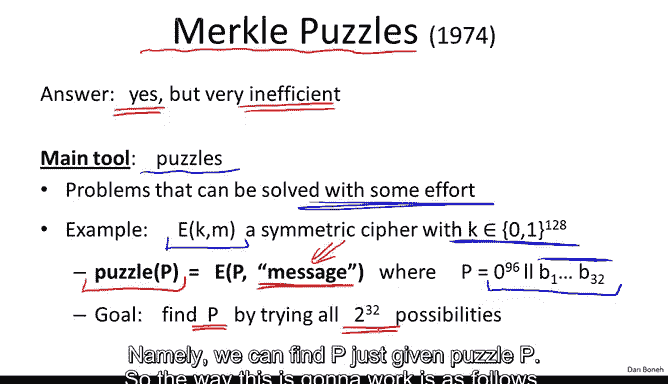
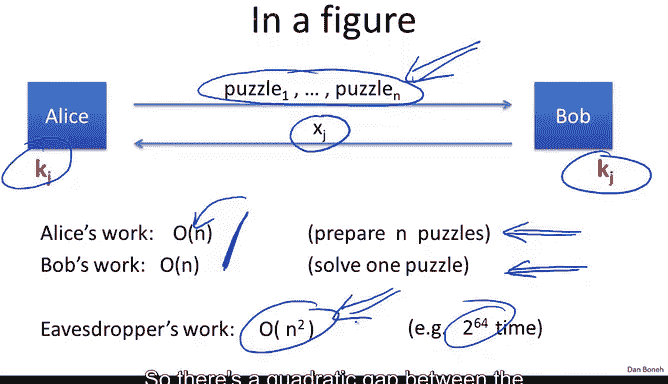
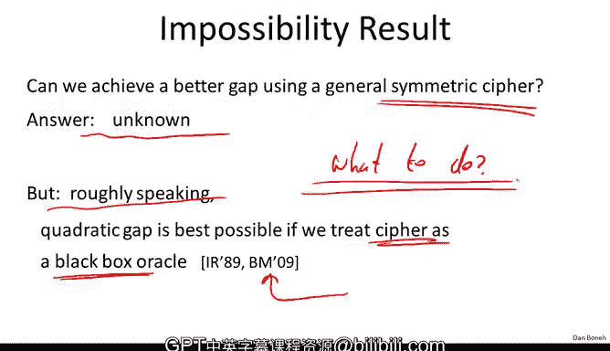

# 斯坦福大学《密码学｜Cryptography 1》中英字幕 - P48：48_05_02_默克尔谜题.zh_en - GPT中英字幕课程资源 - BV1Rf421o79E

In this segment， we're going to look at our first key exchange protocol without a trust of third party。

So the settings are we have our friends， Alice and Bob as usual。

 and these friends have never met before， but somehow they want to generate a shared key。

 So what they're going to do is they're going to send messages to one another back and forth。

 and this time there's no trust in the third party that they can communicate with and at the end of this protocol somehow they should have a shared key that they both know it is a secret key K that they both know。

 but an eavesdroppper who listens in on this traffic has absolutely no idea what this secret key K is。

Now for now we're just going to worry about attackers that only eavesdrop on the conversation。

 In other words we don't allow any tampering with traffic All we allow is just eavesdropping and yet the eavesdroppers should have no idea what the secret key key is and so we're going to look at a number of key exchange protocols in these settings namely when the attackers only eavesdropping on the conversation but cannot change traffic and we're going to see three protocols that achieve this goal and the first question though for this segment is can this be done only using symmetric crypos so can this only be done using block ciphers or hash functions or any of the tools that we've seen in the last four weeks。

And so very surprisingly the answer is yes， in fact。

 we can do key exchange just using block ciphers or hash functions without a trusted third party。

 but unfortunately the resulting protocols are very inefficient and are actually never used in practice Nevertheless these are very simple protocols and so I want to show you how they work and then we'll move on to the more efficient protocols that we'll discuss this week in the next。

So the simple protocol I want to show you is what's called a Merkel puzzleuzzs protocol。

 this protocol was invented by Ralph Merkel back in 1974 when he was just an undergraduate。

Interestingly， he invented this protocol as part of a seminar that he took。

 but apparently the professor didn't quite understand the significance of the contribution。

 and as a result， Ralph Merkel actually graduated and then moved to Stanford where he became Marty Hemans student and they've done a lot of good things in public e cryptography since then。

😊，So let me show you how Merrkel puzzles work。 The main tool for this protocol is what's called a puzzle and let me explain what I mean by a puzzle Well a puzzle is a problem that's difficult to solve but can be solved with some effort。

 In other words if you really put your mind to it you can solve it and so let me give you an example so suppose we have a symmetric cipher that uses keys that are 128 Bs long so just think of AE for example and suppose what I do is I choose an AE key such that the first 96 bits are all0 and only the remaining 32 bits are non-zero and just chosen at random so only 32 bit of this 128 key are random the rest are all zero。

And now what I do is I encrypt a fixed plain text， for example。

 simply the plain text message using this 128 bit key that happens to be mostly zero。

 The result is what I would call a puzzle and the reason I call it a puzzle is because it's actually not that hard to find the secret keyP simply by trying all2 to the 32 possibilities remember these are the first 96 bits are all zero so theyre really only2 to the 32 possible keys to try and for each key we'll try to decrypt this puzzle and see if we get the plain text message and if so we know that we've recovered the right solution P。

So within 2 to the 32 work， we can actually solve this puzzle namely we can find P just given puzzle P so the way this is going to work is as follows Alice is going to start by generating a large number of puzzles in particular she's going to generate2 to the 32 different puzzles。

Now each of these puzzles， the way she generates it is as follows。

 what she'll do is she'll choose a 32 bit random puzzle P okay she does this for I equals 1 to 2 to the 32。

 and then she's going to choose two more values， X and KI then happen to be 128 bits each。

Now what you'll do is she'll use the puzzle P as an AES secret key。

 okay so she'll create 128 bit key where 96 of the bits are set to0 and only the 32 less significant bits happen to be random okay so this is a key that only has 32 bits of entropy if you like and there are only two to the 32 such keys。

😊，Now the plain text that she'll encrypt using this key is this message that I wrote over here。

 basically it starts off with a word puzzle。That puzzle is identified by the identifier Xi。

 which happens to be 128 bits， and to that we can calculate the value KI。

 which also happens to be 128 bits。 Okay， so she does this for all2 to the 32 puzzles and as a result she gets2 to the 32 different puzzles。

😊，She then goes ahead and sends these2 to 32 puzzles to Bob Now what does Bob do while Bob receives this flood of2 to 32 different puzzles。

 he's just going to choose one of them， he doesn't even have to remember any of them。

 he just randomly lets most of them go by and he happens to choose one of them。

 let's say he chose puzzle number J。Then he spends time 2 to the 32 and solves this puzzle well what does it mean to solve this puzzle he's going to try all possible values of PI。

 he's going to decrypt the puzzle that he chose and he's going to check whether the first part of the plain text starts with the word puzzle and if it does he knows that he's correctly solved that puzzle and then he basically obtains the data embedded in the puzzle namely Xj and KJ so remember Xj is this value that identifies the puzzle and Kj is going to be a secret that they use。

So now he solved the puzzle， he knows that he solved the puzzle correctly and he obtained this Xj and KJ。

 what he'll do is he'll send Xj back to Alice just to value Xj Kj he keeps for himself and keeps it the secrets and then Alice is simply going to look up in her database of puzzles。

 she's going to look up puzzle number XJ and then she knows that Bob chose the key KJ and now they have this shared key so KJ is going to be the shared key that they use to communicate securely with one another。

So in a diagram， the way this protocol works is as follows。

 Alice starts off by sending2 to the 32 puzzles to Bob so we can generalize this。

 let's say that she sends n puzzles to Bob and let's say that each puzzle takes work proportional to n to solve。

 Bob solves one of these puzzles and then he sends back Xj to Alice。Okay， so so far。

 each one of them spent work N。And then Alice basically looks up puzzle Xj and recovers the key that corresponds to this puzzle and as a result。

 both of them now have a shared key that they can use to communicate with one another。

 Okay so let's look at the work that they did。 So what the work that Alice did is he had to prepare n puzzles while preparing the puzzle takes constant time she had to prepare n puzzle So her work is roughly order n。

 Bob chose one puzzle and solved it So his work is also proportional to order n so linear in n。

 So now let's see what the eavesdroppper has to do。 Well。

 the poor eavesdroppper sees these n puzzles go by and then he sees this Xj come back and he doesn't really know which puzzle Bob actually solved all he sees is this random value inside of the puzzle and so to break this protocol。

 the eavesdroppper would actually have to solve all puzzles until he finds the right puzzle that has the value Xj in it and then he will recover Kj。

So my question to you is what does the attacker' work。

 how much work did the eavesdroppper have to spend to break this protocol？So the answer is of course。

 order n squared， you know quadratic time and n， he had to solve n puzzles。

 each puzzle takes time n to solve， and as a result he had to spend time order n squared In our example。

 we said that there were two to the 32 puzzles and each one took2 to the 32 time to solve so overall the attacker's work is roughly two to the 64 steps。

So you can see the problem with this protocol first of all the participants。

 Alice and Bob had to do quite a bit of work themselves if we think about it Alice basically had to send two to the 32 puzzles to Bob that's many。

 many gigabytes that she had to send to Bob like 16 or 32 gigabytes depending on how big each puzzle is。

Bob had to spend time 2 to the 32 to solve one of these puzzles。

 so that would take a few seconds too。But then all the security they got is that the attacker can break this protocol in time2 to the 64。

 so2 to 64 is still not considered particularly secure as a result， the attacker really。

 if you really wanted to break this protocol， he could。😊，So to make the security。

 the participants would have to increase the parameter n， and they would have to send。

 say2 to the 64 puzzles to one another and then spend time2 to the 64 to solve each puzzle。

 and then the attacker's work would be 2 to the 128， which is considered secure。

 but having the participants spend time 2 to the 64 to set up a secure session is a little bit too much to ask each of these participants。

So this is why this protocol is not particularly used in practice。

 but nevertheless there's a really nice idea here in that the participants had to spend linear time where the attacker had to spend quadratic time。

 so there's a quadratic gap between the amount of work that the participants had to do versus what the attacker had to do to break the protocol。

😊。

So a natural question is， can we actually do better than a quadratic app。

 just using symmetric ciphers， in other words， just using tools that we developed in the first four weeks of the class？

And the answer really is that this is unknown。 we don't know whether a quadratic gap is the best that we can do。

 you might even try to think about this of bit。 How would you use AS or shot 2 56 to do key exchange that achieves better than a quadratic gap。

 but I can tell you that we believe that quadratic is the best we can do and there are even some negative results along those lines so roughly speaking there is a result that says that in fact if we treat the block cipher or the hash function that we use as a black box oracle。

 in other words， all the participants can do is just query the block cipher or query the hash function at certain points and receive the results。

 if that's all they're allowed to do in other words they're not allowed to actually use the implementation of the cipher or the hash function。

 then in fact there is a result that says that if the participants only query the block cipher end points there will always be an attack that runs in time and squared。

So again， this suggests that if all you do is use the block cipher as a black box that you query。

 then whatever key exchange you come up with， there will always be a quadratic attack on this key exchange。

And in fact at the end of this module I point to this paper it's a fairly recent paper from 2009 just shows that quadratic is the best we can do So if you want to read more about this impossibility result you know go ahead and take a look at this paper it's actually a very readable paper and you should be able to understand it and so the question is what to do next and now we're kind of stuck we said that with blog ciphers we really can't do better than a quadratic app and so what do we do。

So this was kind of the starting point of public eptography and the realization is that we need more than just generic block ciphers and generic hash functions。

 we actually need functions that have very， very special properties and to build these functions we actually have to rely on some algebra。

😊，So in the next few segments， we're going to look at some algebra constructions and then we'll see how to use those for key exchange and for many other things in public e cryptography。

