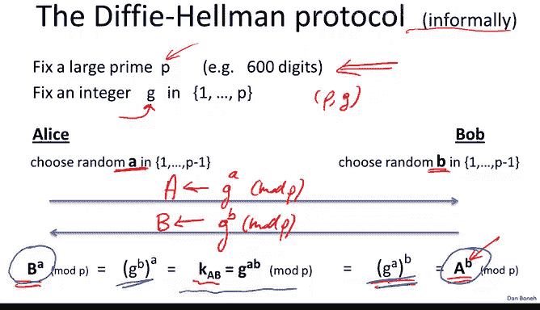
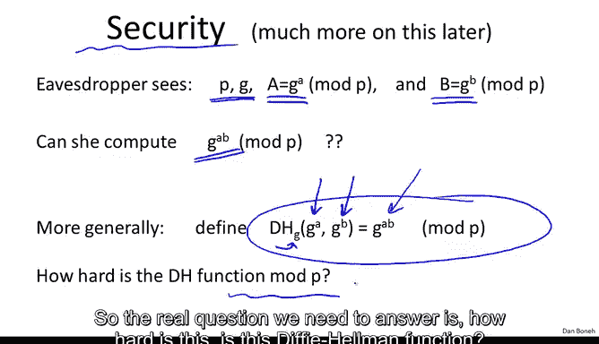
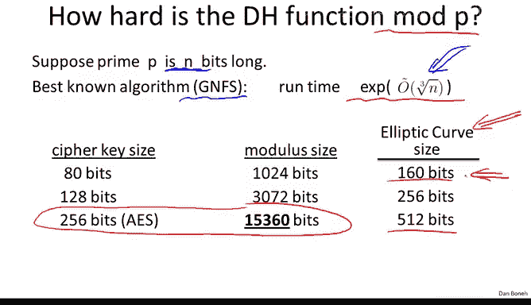
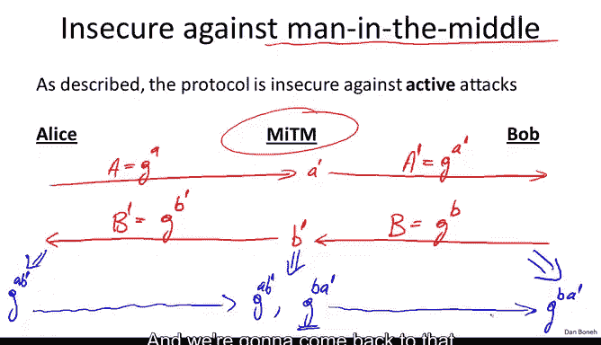

# 斯坦福大学《密码学｜Cryptography 1》中英字幕 - P49：49_05_01_迪菲-赫尔曼协议.zh_en - GPT中英字幕课程资源 - BV1Rf421o79E

In this segment， we're going to look at the Dy Hemon protocol。

 which is our first practical key exchange mechanism。

So let me remind you of the settings our friends here， Alice and Bob。

 have never met and yet they want to exchange a shared secret key that they can then use to communicate securely with one another。

In this segment in the next we're only going to be looking at eavesdropping security。

 In other words we only care about eavesdroppers。 the attackers are actually not allowed to tamper with data in the network。

 they're not allowed to inject packets， they're not allowed to change packets in any way all they do is to use just eavesdrop on the traffic and at the end of the protocol。

 the key exchange protocol， our friends， Alice and Bob should have a shared secret key。

 but the attacker namely the eavdroppper has no idea what that key is going to be。

In the previous segment we looked at a key exchange mechanism called Merkel puzzles that's just using blockafs or hash functions and I showed you that there the attacker basically has a quadratic gap compared to the participants。

 in other words， if the participants spend time proportional to N the attacker can break the protocol and time proportional to n squared and as a result that protocol is too insecure to be considered practical In this segment we're going to ask whether we can do the same thing。

 but now we'd like to achieve an exponential gap between the attacker's work and the participants' work In other words。

 Alice and Bob might do work proportional to N but to break the protocol。

 the attacker is going to have to do work proportional to some exponential and N。 So other。

 an exponential gap between the participants work and the attacker's work。

So as I said in the previous segment， we can't achieve this exponential gap from block ciphers like AAS or shot 256。

 we have to use hard problems that have more structure than just those symmetric primitives。

And so instead， what we're going to do is use a little bit of algebra。In this segment。

 I'm going to describe the Dfi Heman protocol very concretely and somewhat informally。

 We're going to come back to Dfi Heman next week， and we're going to describe the protocol more abstractly。

 and we're going to do a much more rigorous security analysis of this protocol。Okay。

 so how does D3 hub work What we're going to do is first of all。

 we're going to fix some large prime which I'm going to call P actually P usually used to the nose primes and you should be thinking of really gigantic primes like primes that are made up of 600 digits or so And just for those of you who like to think in binary a 600 digit prime roughly corresponds to about 2000 Bs。

 So just writing down the prime takes about 2 kilobits of data。

And then we're also going to fix an integer G that happens to live in the range1 to P。

 So these values， P and G are parameters of the Dy Heman protocol they're chosen once and they're fixed forever。

Now the protocol works as follows， so here are our friends， Alice and Bob。

 So what Alice is going to do is she's going to start off by choosing some random number A in the range1 to P minus1。

 and then she's going to compute the number G to the power of a modo P。Okay。

 so she computes this exponentation and reduces the result modular the prime P。

 And we're actually going to see how to compute this sufficiently in the next module。 So for now。

 just believe me that this computationplication can be done efficiently。 Now let's call capital A。

 the result of this value。 So what Alice will do is she'll send capital A over to Bob。 Now。

 Bob is going to do the same thing。 He's going to choose a random number B in the range1 to P minus1。

 He's going to compute G to the B modo P。And let's call this number B。

 and he's going to send this number B over to Alice。 So Alice sends a to Bob。 Bob sends a B to Alice。

 And now I claim that they can generate a shared secret key。 So what's the shared secret key。 Well。

 it's defined as let's call it K A B， and it's basically defined as the value G to the power of A times B。

Now the amazing observation that Dion Heman had back in 1976 is that in fact both parties can compute this value G to the AB。

 so let's see so Alice can compute this value because she can take her value B that she received from Bob。

 she can take this value B raise it to the power of A。

 and let's see what she'll get is G to the B to the power of A and by the rules of exponunciation G to the power of B to the power of A is equal to G to the AB。

😊，Bob turns out can do something similar， so his goal is to compute G to the A to the B。

 which again is G to the AB。 So both Alice and Bob will have computed K AB， and let me ask you。

 how does Bob actually compute this quantity G to the AB。Well。

 so all he does is he takes the value A that he received from Alice and he raises it to his own secret B。

 and that gives him the shared secret G to the AB。So you can see now that both parties。

 even though they've seemingly computed different values， in fact。

 they both end up with the same value， namely G to the AB， modlo P。I should mention。

 by the way that Marty Heman and Whit Diffy came up with this protocol back in 1976。

 Marty Helman was a professor here at Stanford and with Diffy was his graduate students。

 they came up with this protocol and this protocol really changed the world and that it introduced this new age in cryptography where now it's not just about designing lo ciphers but it's actually about designing algebraic protocols that have properties like the one we see here。

😊，So you notice that what makes this protocol works is basically properties of exponiciation。

 namely that G to the B to the power of a is the same as G to the A to the power of B。

 these are just properties of exponiiations。

Now when I describe a protocol like the one I just showed you。

 the real question that should be in your mind is not why the protocol works。 In other words。

 it's very easy to verify that in fact， both Alice and Bob end up with the same secret key。

 The bigger question is why is this protocol secure In other words。

 why is it that an eavesdroppper cannot figure out the same shared key G to the AB that both Alice and Bob computed by themselves。

 So let's analyze this a little bit。 and like I said。

 we're going to do a much more indth analysis next week。

 but let's for now just see intuitively why this protocol is going to be secure。

 Well what does the eavesdroppper C Well he sees the prime in the generator。

 these are just fixed forever and everybody knows who they are He also sees the value that Alice sent to Bob namely this capital A and he sees the value that Bob sent to Alice namely this capital a B And the question is can the eavesdroppper compute G to the AB just given these four values。

So more generally what we can do is we can define this Dyalman function。

 and so we'll say that the Dyalman function is defined based some value G。

 and the question is given G to the A and G to the B， can you compute G to the AB？

And what we're asking is how hard is it to compute this function， mod a very large prime P。

 remember P was something like 600 digits。So the real question we need to answer is。

 how hard is this defeat album function？

So let me show you what's known about this。So suppose the prime happens to be n bits long， okay。

 so in our case， say n is 2000 bits。It turns out the best known algorithm for computing a Dfialmon function is actually a more general algorithm that computes the discrete log function。

 which we're going to talk about next week， but for now let's just say that this algorithm computes a Dfialmon function。

 the algorithm is called a general number field sve， I'm not going to describe how it works。

 although if you'd want to hear how it works let me know and that could be one of the special topics that we cover at the end of the course but the interesting thing is it is running time is exponential in roughly the cube root of n。

 In other words， the running time is roughly E to the power of O of cube rootot of n。😊，So in fact。

 the exact expression for the running time of this algorithm is much more complicated than this。

 I'm deliberately simplifying it here just to kind of get the point across point that I wanted to emphasize is that in fact this is not quite an exponential time algorithm。

 exponential would be E to the power of n， this is sometimes called a sub exponential algorithm because the exponent is really just proportional to the cube of n as it opposed to linear in n。

What this says is that even though this problem is quite difficult。

 it's not really an exponential time problem， the running time and the exponent is going to be just proportional to the cube root n。

So let's look at some examples， supposed they happened to be looking at a modulus that happens to be about 1000 bits long。

 What this algorithm says is that we can solve the Dy he problem in time that's approximately e to the Q root of 1024 Now this is not really correct in fact there are more constants in the exponent but again just to get the point across we can say that the running time would be roughly e to the cube root of about 1024。

 which is actually very small， roughly e to the 10。

So the simple example shows you that if you have a subexent algorithm。

 you see that even if the problem is quite large， like 100 bits because of the cube root effect。

 the exponent actually is not that big overall Now to be honest I'm actually lying here。

 General number field S actually has many other constants in the exponent So in fact this is not going to be 10 at all it's going to be actually something like 80 because a various constants in the exponent。

 but nevertheless you see that the problem is much harder than say two to the1 thousand。

 So this is even though describing the problem takes 1000 bits。

 solving it does not take time 2 to the 1000。So here I wrote down a table that kind of shows you the rough difficulty of breaking the difihama protocol compared to the difficulty of breaking a cipher with an appropriate number of bits。

 So for example， if your cipher has 80 bit keys， that will be roughly comparable to using 1000 bit modulus。

 in other words， breaking a cipher with 80 bit keys takes time roughly2 to the 80。

 which means that breaking the difihamman function with 100 bit modulus would take roughly time2 to the 80。

If your cipher uses 128 bit keys like AES， you should be really using a 3000 bit modulus。

 even though nobody really does this in reality， people would use 2000 bit modulus and then if your key is very large。

 like if you're using a 256 bit AES key， then in fact your modulus needs to be very。

 very large again you can really see the cube root effect here。

 we double the size of our key and because of the cube root effect what that means is we have to increase the size of our modulus by a factor of two cubed namely a factor of 8。

 which is where this 15，000 comes from。And again， as you mentioned。

 it is not exactly a factor rate because of the extra constants in the exponent。😊。

So this is a nice table that shows you that if you're going to be using By Heman to exchange a session key and that session key is going to be used for a block cipher with a certain key size。

 this table shows you what modular size you need to use so that the security of the key exchange protocol is comparable to the security of the block cipher you're going to be using after。

Now， this last girl should really be disturbing to you。

 I should tell you that working with such a large modulus is very problematic。

 This is actually going to be quite slow。 And so the question is whether there's anything better that we can do。

And it turns out there is， in fact， the way I describe the Dfffi Heman function is I described it at the way Dfi and Heman described it back in 1976 using arithmetic modular primes。

😊，The problem with arithmetic modular primes is that the diyhelmon function is hard to compute。

 but it's not as hard as you'd like。 There's this cube root effect that makes it a little easier than what you'd really like。

 And so the question is can we run the diyhemon protocol in other settings。

 and it turns out the answer is yes， In fact we can literally translate the defihelmon protocol from arithmetic modular primes to a different type of algebraic object and solving the deyhelmon problem on that other algebraic object is much much harder。

 This other algebraic object is what's called an elliptic curve And as I said。

 computing the diyhemon function on these elliptic curves is much harder than computing diyhelman modular primes because the problem is so much harder now we can use much smaller object in particular you we'd be using primes that are only 160 bits for 80 bit keys or only 512 bits for 256 bit keys。

 So because these mods don't grow as fast on elliptic curves。

 there's generally a slow transition away from using modular。

To using elliptic curves I'm not going to describe elliptic curves right now for you。

 but if this is something you'd like to learn about。

 I can do that in the very last week of the course when we discuss more advanced topics。But in fact。

 when we come back to Dyhelman next week， I'm going to describe it more abstractly so that it really doesn't matter which algebraic structure you use。

 whether you use arithmetic mod primes or whether you use elliptic curves。

 we can kind of abstract that whole issue away and then use the Dyhelman concept for key exchange and for other things as well。

 and as I said again， we'll see that more abstractly next week。So as usual。

 I want to show that this beautiful protocol that I just showed you the Dy Heman protocol is as is is actually completely insecure against an active attack。

 namely is completely insecure against what's called a man in the middle attack We need to do something more to this protocol to make it secure against man in the middle and again we're going to come back to Dfi Heman and make it secure against man in the middle next week。

😊，Okay， so let's see why the protocol that I just showed you is insecure against active attacks。

 Well suppose we have this man in the middle that's trying to eavesdrop on the conversation between Alice and Bob。

 Well， so the protocol starts with Alice sending G to the A over to Bob。Well。

 so the man in the middle is going to intercept that。

 And he's going to take the message that Alice sent。

 and he's going to replace it with his own message。 So let's call this a prime。

 And let's write that as G to the a prime。 Okay， so the man in the middle， chooses his own a prime。

 And what he sends to Bob is actually G to the a prime。 Now。

 Po Bob doesn't know that the man in the middle actually did anything to this traffic。

 All he sees is he got the value， A prime as far as he knows that value came from Alice。

 So what is he going to do in response。 Well， he's going to send back his value B。

 which is G to the B back to Alice。Well， again， the man in the middle is going to intercept this B。

 he's going to generate his own B prime and what he actually sends back to Alice is B prime。

 which is G to the B prime。Okay， now what happens。 Well。

 Alice is going to compute her part of the secret key and she's going to get G to the A B prime。

 Bob is going to compute his part of the secret key， and he's going to get G to the B times a prime。

 these now you notice these are not the same keys。 and the man in the middle because he knows both a prime and B prime。

 he can compute both G to the A B prime and G to the B A prime。 Yeah。

 it's not difficult to see the man in the middle knows both values。 And as a result。

 now he can basically play this man in the middle。 And when Alice sends an encrypted message to Bob。

 the man in the middle can simply decrypt this message because he knows the secret key that Alice encrypted the message with reencryed using Bob's key。

And then send the message on over to Bob。 In this way， Alice sent a message to Bob。

 Bob received that message。 he thinks that the message is secure， but in fact。

 that message went through the man in the middle， the man in the middle decrypted it。

 reencrypted it for Bob。 and at the same time， he was able to completely read it。

 modify it if he wants to and so on。 So the protocol becomes completely insecure。

 given a man in the middle。And so as I said， we're going to have to enhance the protocol somehow to defend against men in the middle。

 but it turns out it's actually not that difficult to enhance and prevent men in the middle attacks。

And we're going to come back to that and see that in a week or two。

The last thing I want to do is show you an interesting property of the VP Heman protocol。In fact。

 I want to assure show you that this protocol can be viewed as a non interactive protocol。

 so what do I mean by that？So imagine we have a whole bunch of users， you know millions of users。

 let's call them Alice， Bob， Charlie David and so on and so forth。

 Each one of them is going to choose a random secret value， and then on their Facebook profiles。

 they're going to write down their contribution to the Dyham protocol Okay so everybody just writes down you know G to the A。

 G to the B， G to the C and so on。Now the interesting thing about this is if。

 say Alice and Charlie want to set up a shared key， they don't need to communicate at all。

 basically Alice would go and read Charlie's public profile。

Charlie would go and read Alice's public profile and now boom， they immediately have a secret key。

 namely now Alice knows G to the C and a， Charlie knows G to the A and C。

 and as a result both of them can compute G to the AC so in some sense。

 once they've posted their contributions to the Dfiham protocol to their public profiles。

 they don't need to communicate with each other at all to set up a shared key。

They immediately have a shared key， and now they can start communicating securely through Facebook or not with one another。

And notice that this is true for any Facebook user。 So as soon as I read somebody's public profile。

 I immediately have a shared key with them without ever communicating with them。

 This property is sometimes called a non interactive property of thefiman。

So now let me show you an open problem， this is an open problem that's been open for ages and ages and ages。

 so it'd be really cool if one of you can actually solve it。

The question is can we do this for more than two parties， in other words， say we have four parties。

 all of them post their values to their Facebook profiles？

And I would like to make it that just by reading Facebook profiles。

 all of them can set up a shared secret key In other words。

 Alice is what you'll do is she'll only read the public profiles of the three friends， Bob。

 Charlie and David and already she can compute a shared key with them and similarly David is just going to read the public profile of Charlie。

 Bob and Alice and already he has a shared key with all four of them。😊，Okay。

 so the question is whether we can kind of set up nonintractly these shared keys for groups that are larger than just two people。

 So as I said for n equals 2， this is just a Dfi humanman protocol。 In other words。

 if just two parties want to set up a shared key without communicating with another。

 that's just Dfi humanman。 It turns out for n equals3， we also know how to do it。

 there's a known protocol It's called a protocol do to z， it already uses very。

 very fancy mathematics， much more complicated mathematics than what I just showed you。😊。

And for n equals4，5， or anything above this， above four， this problem is completely open。

nameamely the case where four people post something to the public profiles and then everybody else reads the public profiles and then they have a joint shared key。

 this is something we don't know how to do even for four people and this is a problem that's been open for ages and ages it's kind of a fun problem to think about and so see if you can solve it if you will。

 it's instant fame in the crypto world。

Okay， so I'll stop here and we'll continue with another key exchange mechanism in the next segment。

