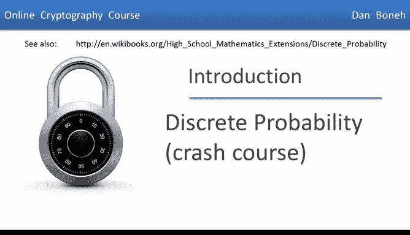
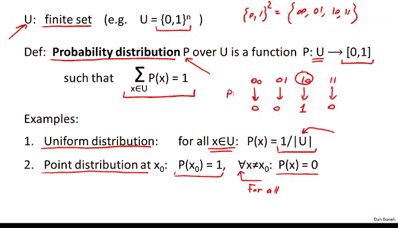
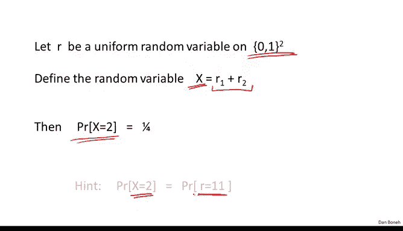
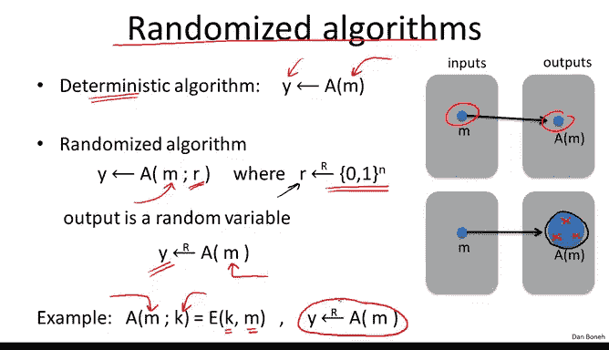

# 斯坦福大学《密码学｜Cryptography 1》中英字幕 - P4：04_01_01_离散概率速成课程.zh_en - GPT中英字幕课程资源 - BV1Rf421o79E

Over the years， many natural cryptographic constructions were found to be insecure。 In response。

 modern cryptography was developed as a rigorous science where constructions are always accompanied by a proof of security。

The language used to describe security relies on discrete probability in this segment and the next I'll give a quick overview of discrete probability and I pointed this WikiBooks article over here for a longer introduction。

Dre probability is always defined over a universe， which I'll denote by U。

 In this universe in our case is always going to be a finite set。 In fact， very commonly。

 our universe is going to be simply the set of all n bit strings， which here is denoted by 0。

1 to the n。 So， for example， the sets 0，1 squared， is the set of all2 bit strings。

 which happens to be the strings 0，0，0，1，1，0 and 1，1。 So there are four elements in the set。

 and more generally in the sets 0，1 to the n。 there are2 to the n elements。😊。

Now a probability distribution over this universe U is simply a function which I'll denote by P。

 and this function what it does is it assigns to every element in the universe。

 a number between 0 and 1， and this number is what I'll call the weight or the probability of that particular element in the universe。

Now there's only one requirement on this function P。

 and that is that a sum of all the weights sum up to one。

That is if I sum the probability of all elements x in the universe what I end up with is the number one。

 So let's look at a very simple example looking back to our two bit universe。

 so 000110 and 11 and you can consider the following probability distribution which for example assigns to the element 0。

0 the probability 12 the elements 01 we assign the probability 18 to 10 we assign the probability 1 quarter and to 11 we assign the probability 18 and you can see that if we sum up these numbers in fact we get1 which means that this probability P is in fact the probability distribution Now what these numbers mean is if I sample from this probability distribution I'll get the string 00 with probability 12 I'll get the string 01 with probability 18 and so on and so forth。

So now that we understand what our probability distribution is。

 let's look at two classic examples of probability distributions。

 the first one is what's called a uniform distribution。

 the uniform distribution assigns to every element in the universe exactly the same weight。😊。

I'm going to use between two bars to denote the size of the universe U that is the number of elements in the universe and since we want the sum of all the weights to sum up to one and we want all these weights to be equal what this means is that for every element X in the universe we assign a probability of one over U So in particular。

 if we look at our example， the uniform distribution and the set of two bit strings would simply assign one quarter。

 the weight one quarter to each one of these strings and clearly that the sum of all the weights sums up to one What again。

 what this means is that if I sample at random from this distribution I'll get a uniform sample across all two bit strings So all of these four bit strings are equally likely to be sampled by this distribution。

Another distribution that's very common is what's called a point distribution at the point x0 and what this point distribution does is basically it puts all the weight on a single point namely x0。

 So here we assign to the point x0 all the weight1 and then to all other points in the universe we assign the weight0 and by the way I want to point out that this inverted a here should be read as for all so all this says is that for all x that are not equal to x0 the probability of that x is equal to0 so again going back to our example。

 a point distribution for example that would put all its mass on the string 10 would assign the probability1 to the string 10 and0 to all other strings so now if I sample from this distribution pretty much I'm always guaranteed to always sample the string10 and never sample any of the other strings。

So now we know what a distribution is and I just want to make one last point and that is that because this universe U is always going to be a finite set for us。

 we can actually write down the weights that the distribution assigns to every element in U and represent the entire distribution as a vector so here for example。

 if we look at the universe of all three bit strings we can literally write down the weights that the distribution assigns to the string 000 then the weight that the distribution assigns to the string 001 and so on and so forth and you can see that we can write this as a vector in this case it'll be a vector of dimension8 there will be there are eight strings of 3 bits and as a result basically the entire distribution is captured by this vector of eight real numbers in the interval 0 to 1。

The next thing I want to do is define the concept of an event。

 so consider a subset a of our universe， and I'll define the probability of the subset to be simply the sum of the weights of all the elements in the set A。

 In other words， I'm summing over all x and a， the weight of these elements X in the set A。Now。

 because the sum over the entire universe of all weights needs to be one， this means that if we sum。

 well， if we look at the probability of the entire universe。

 basically we get one and if we look at the probability of a subset of the universe we're going to get sum number in the interval 0 to1 and we say that a probability of the set a is the sum which is a number between0 and1 and I'll tell you that a subset a of the universe is called an event and the probability of the set a is called a probability of that event so let's look at a simple example。

So suppose we look at the universe U， which consists of all eight bit strings right so the size of these universe U is 256 because there are 256。

8 bit strings， essentially we're looking at all byte values， all 256 possible byte values。

Now let's define the following event， basically the event is going to contain all bytes。

 so all eight bit strings in our universe such that the two least significant bits of the byte happens to be 11。

 so for example， if we look at 01011010 that's an element in the universe that's not in the set A。

 but if we change this 0201， then that's an element in the universe which is in our set A。

And now let's look at the uniform distribution over the universe U。

 and let me ask you what is the probability of the event A？

So what is the probability that when we choose a random byte。

 the two significant bits of that byte happens to be 11？Well。

 the answer is one fourth and the reason that's true is because it's not too difficult to convince yourself that of the 2568 bit strings。

 exactly 64 of them， one quarter of them and in one1 and the probability of each string since we're looking at the uniform distribution。

 the probability of each string is exactly one over the size of the universe， namely one over 256。

 and the product of these 64 elements， each one has weight1 over 256， is exactly one fourth。

 which is the probability of the event A that we were looking at。😊。

So a very simple bound on the probability of events is called the union bound。

 So imagine we have two events A1 and a2 so these are both subsets of some universe U and we want to know what is the probability that either a1 occurs or a2 occurs In other words what is the probability of the union of these two events this little u here denotes the union of the two sets So the union bound tells us that the probability that either a1 occurs or a2 occurs is basically less than the sum of the two probabilities and that's actually quite easy to see So simply look at this picture here you can see that when we look at the sum of the two probabilities were basically summing the probability of all the elements in a1 all the elements in a2 and you realize we kind of double summed these elements in the intersection they get summed twice here on the right-hand side and as a result the sum of the two probabilities is actually going to be larger or larger than or equal to the actual probability of the union。

UF A1 and A2。So that's the classic union bound and in fact I'll tell you that if the two events are disjo。

 in other words their intersection is empty in that case if we look at a sum at the probability that either a1 happens or a2 happens。

 that's exactly equal to the sum of the two probabilities so we'll use these facts here and there throughout the course。

So just to be clear， the inequality holds always， but when the two events are disjoint。

 then in fact we get inequality over here。

So let's look at a simple example。 supposeupp our event a1 is the set of all n bit strings that happen to end in11 and suppose a2 is the set of all n bit strings that happened to begin with 11 so N think of it as8 or some large number and I'm asking now what is the probability that either a1 happens or a2 happens in other words。

 if I sample uniformly from the universe U， what is the probability that either the least significant bits are 11 or the most significant bits are 11 Well。

 as we said that's basically the probability of the union of a1 and a2 we know that the probability of each one of these events is one quarter by what we just did on the previous slide and therefore but the union bound。

 the probability of the or is a quarter， the probability of a1 plus the probability of a2 which is a quarter plus a quarter and we just proved that the probability of seeing11 and the most significant bit or11 and the least。

Significant bit is less than one half。So that's a simple example of how we might go about using the union bound to bound the probability that one of two events might happen。

 The next concept we need to define is what's called a random variable。

 Now random variables are fairly intuitive objects。

 but unfortunately the formal definition of a random variable can be a little confusing So what I'll do is I'll give an example and hopefully that will be clear enough。

So formally， a random variable in order say by x is a function from the universe into some set V and we say that this set V is where the random variable takes its values。

 So let's look at a particular example。 So suppose we have a random variable X and this random variable maps into the set 01。

 So the values of this random variable are going to be either 0 or1 so1 bit basically。😊，Now。

 this random variable maps our universe， which is the set of all n bit binary strings，01 to the n。

 And how does it do it， Well， given a particular sample in the universe， a particular n bit string。

 Y， what the random variable will do is simply output the least significant bit of y。 and that's it。

 That's the whole random variable。😊，So now let me ask you。

 suppose we look at the uniform distribution on the set 01 to the n。

 Let me ask you what is the probability that this random variable output 0 and what is the probability that the random variable outputs 1。

 Well you can see the answers are half and half， but let's the reason through white that's the case。

 So here we have a picture showing the universe and the possible output space。 And so in this case。

 the variable can output either0 or1。 Well， when does the variable output 0， the variable outputs 0。

 when the sample in the universe happens to be to have its least significant bits be set to 0。

 and the variable one outputs1， when the sample in the universe happens to have its least significant bits set to one Well。

 if we choose strings uniformly random， the probability that we choose a string that has its least significant bit set to 0。

 is exactly one half， which is why the random variable outputs 0 with probability exactly one half。

 Similarlyly， if we choose a random n bit string。😊。

Pro that the least significant bit is equal to one is also one half。

 And so we say that the random variable outputs  one also with exactly probability  one half。

Now， more generally， if we have a random variable taking values in a certain set V。

 then this random variable actually induces a distribution on the set V。

 And here I just wrote a kind of in symbols， what this distribution means。

 but it's actually very easy to explain。 essentially what it says is that the variable outputs V basically with the same probability that if we sample a random element in the universe and and then we apply a function X。

 we ask how likely is it that the output is actually equal to V。 So formally。

 we say that the probability that x outputs V is the same as the probability of the event that when we sample a random element in the universe。

 we fall into the preimage of V under the function X。 And again。

 if this wasn't clear it's not that important all you need to know is that a random variable takes values in a particular set V and induces a distribution on that set V。

😊，Now there's a particularly important random variable called a uniform random variable and it's basically defined as you would expect。

 so let's say that u is some finite set， for example the set of all n bit binary strings。

 and we're going to denote a random variable R that's basically samples uniformly from the set U by this little funny arrow with a little R on top of it and this again denote that the random variable R is literally a uniform random variable sampled over the set U。

😊，So in symbols， what this means is that for all elements a in the universe。

 the probability that r is equal to a is simply 1 over U。😊。

And if you want to stick to the formal definition of a uniform variable。

 it's actually not that important， but I'll just say that formally the uniform random variable is just an identity function。

 namely Rx is equal to x for all x in the universe。😊。

So just to see that this is clear， let me ask you a simple puzzle。

 suppose we have a uniform random variable over two bit strings， so over the set 0，0，0，1，1，0， and 11。

And now let's define a new random of variable x to basically sum the first and second bits of R。

That is x simply is the sum of r1 and r2， the first and second bits of r treating those bits as integers。

So for example， if r happens to be 00， then x will be 0 plus 0， which is0。

 So let me ask you what is the probability that x is equal to 2？

So it's not difficult to see that the answer is exactly one fourth because basically the only way that x is equal to2 is if r happens to be 11。

 but the probability that r is equal to 11 is basically one fourth because r is uniform over the set of all two bit strings。

The last concept I want to define in this segment is what's called a randomized algorithm。

 So I'm sure you're all familiar with deterministic algorithms。

 These are algorithms that basically take a particular input data as input and they always produce the same output say y。

 So if we run the algorithm 100 times and the same input will always get the same output。

 So you can think of a deterministic algorithm as a function that given the particular input data M will always produce exactly the same output A of M。

😊，A randomized algorithm is a little different in that it as before it takes the input data M as input。

 but it also has an implicit argument called R where this R is sampled anew every time the algorithm is run and in particular。

 this R is sampled uniformly at random from the set of all n bit strings for some arbitrary n。😊。

Now what happens is every time we run the algorithm on a particular input M。

 we're going to get a different output because a different R is generated every time。

 so the first time we run the algorithm we get one output， the second time we run the algorithm。

 a new r is generated and we get a different output， the third time we run the algorithm。

 a new r is generated and we get a third output and so on。😊，So really。

 the way to think about a randomized algorithm is it's actually defining a random variable right So given a particular input message M。

 it's defining a random variable， which is defining a distribution over the set of all possible outputs of this algorithm。

 given the input M。 So the thing to remember is that the output of a randomized algorithm changes every time you run it。

 And in fact， the algorithm defines a distribution and the set of all possible outputs。

 So let's look at a particular example。 So suppose we have a randomized algorithm and that takes as input a message M。

 And of course， it also takes an implicit input， which is this random string that is used to randomize its operation。

😊，So now what the algorithm will do is simply will encrypt the message M using the random string as input。

 so this basically defines a random variable， this random variable takes values that are encryptions of the message M and really what this random variable is it's a distribution over the set of all possible encryptions of the message M under a uniform key。

😊，So the main point to remember is that even though the input to a randomized algorithm might always be the same。

 every time you run the randomized algorithm， you're going to get a different output。

Okay， so that concludes this segment and we'll see a bit more discrete probability in the next segment。

