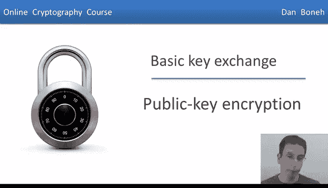
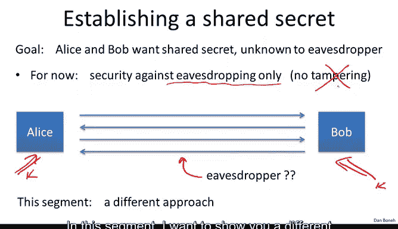
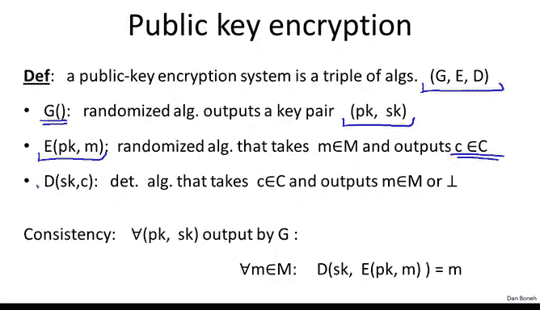
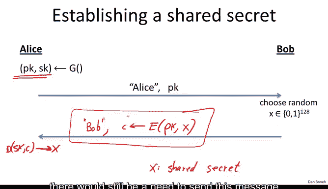

# 斯坦福大学《密码学｜Cryptography 1》中英字幕 - P50：50_05_02_公钥加密.zh_en - GPT中英字幕课程资源 - BV1Rf421o79E

In this module I want to show you another approach to key exchange based on the concept of public key encryption So again。

 just to remind you of the settings， we have our friends。

 Alice and Bob as usual and their goal is to exchange a secret keyK the eavdroppper gets to see the messages they send to one another but even though he shouldn't learn anything about the keyK that they exchanged and as usual in this module we're only going to be looking at eavesdropping security that is we don't allow the attackers to tamper with data or to mount any other form of active attack so just to remind you earlier in this module we saw an inefficient mechanism based on generic w ciphers in the previous segment we saw the Dfihelman key exchange mechanism which has an exponential gap between the work that the participants have to do versus the work that the attacker has to do and in fact as Dfihelmand protocolcol is used all over the web very frequently in this segment they want to show you a different approach based on public key encryption。

So what is public key encryption so just as in the case of symmetric encryption。

 there's an encryption algorithm and a decryption algorithm however here the encryption algorithm is given one key。

 which we're going to call a public key， let's call this the public key that belongs to Bob and the decryption algorithm is given a different key we'll call it a secret key that also belongs to Bob。

So these two keys are sometimes called a key pair。One half of the pair is the public key and the other half of the pair is the secret key。

Now the way you encrypt this as usual， a message would come in。

 the encryption algorithm will generate a ciphertex that is the encryption of this message using the given public key。

And then when the Cyphertex is given to the decryption algorithm。

 the decryption algorithm basically outputs that corresponding message。 So as I said。

 PK is called the public key and SK is called the secret key。So more precisely。

 what is public key encryption， Well public key encryption is actually made up of three algorithms at G E and D algorithm G is what's called a key generation algorithm when you run algorithm G。

 it will output two keys， the public key and the secret key。

 the encryption algorithm basically given the public key and message will outputs the corresponding ciphertext。

And the decryption algorithm， given the secret key in the Cyphertext。

 will output the message or it will output bottom if an error occurred。

And as usual， we have the usual consistency properties that say that for any public key and secret key that could have been output by the key generation algorithm。

 if we encrypt the message using the public key and then decrypt using the secret key。

 we should get the original message back。😊，Now what does it mean for a public key system to be secure Well we use the same concept of semantic security that we used before except the games now are a little bit different。

 so let me explain how we define semantic security for a public key system so here the challenger is going to run the key generation algorithm to generate a public key in a secret key pair and he's going to give the public key to the adversary。

The challenger keeps the secret key to himself。What the adversary will do is he will output two equal length messages M0 and M1 as before。

 and then the challenger will give him the encryption of M0 or M1 as usual we defined to experiment experiment 0 and experiment1 in experiment0 the adversary is given the encryption of M0 in experiment1 the adversary is given the encryption of M1 and then the adversary's goal is to guess which encryption he was given was he given the encryption of M0 or was he given the encryption of M1。

And we refer to his guess as the output of experiment zero or experiment 1。

One thing I want to emphasize is that in the case of publicly encryption。

 there's no need to give the attacker the ability to mount a chosen plaintiff attack。Why is that？

 Well， in the case of a symmetric key system， the attacker had to request the encryption of messages of his choice In the case of a public key system。

 the attacker has the public key， and therefore， he can by himself encrypt for himself any message that he wants。

 He doesn't need the challenges help to create encryptions of messages of his choice。

 And as a result in a public key settings a chosen plaintiff attack is inherent。

 There's no reason to give the attacker extra power to mount a chosen plaintiff's attack。

And that's why we never discussed chosen plain text queries in the context of defining semantic security for public key systems。

Now that we define the game， we're going to say that a public key system GED is semantically secure if basically the attacker cannot distinguish experiment 0 from experiment 1。

 In other words， the adversary's probability of opening 1 in experiment0 is about the same as this probability of opening1 in experiment1 So again the attacker can't tell whether he was given the encryption of M0 or the encryption of M1 Now that we understand what public key encryption is let's see how to use it to establish a shared secret So here are our friends。

 Alice and Bob Alice will start off by generating a random public key secret key pair for herself using the keygen algorithm and then she's going to send to Bob the public key Pk and she also says hey this message is from Alice。

😊。

What Bob will do is he will generate a random 128 bit value X， and he will send back to Alice saying。

 hey， this message is from Bob and he'll send back the encryption of X under Alice's public key。

Alice will receive thecipher textext， she'll decrypt it using her secret key and that will give her the value X。

 and now this value X can be used basically as a shared secret between the two of them。

I want to emphasize that this protocol is very different from the Dey Human protocol that we signed in the last segment in the sense that here the parties have to take turns in the sense that Bob cannot send his message until he receives the message from Alice。

In other words， Bob cannot encrypt X to Alice's public key until he receives the public key from Alice in a Dfihelman protocol。

 however， the two parties could send their messages at arbitrary times and there was no ordering enforced on those messages。

As a result， we had this nice application of Dfi Heman where everybody could post their messages to Facebook for example。

 and then just by looking at Facebook profiles， any pair would already have a shared key without any need for additional communication here this is not quite true even if everybody posts their public keys to Facebook。

 there would still be a need to send this message before a shared key can be established。

So now that we understand the protocol， the first question we need to ask is why is this protocol secure and as usual we're only going to look at eavdropping security。

So in this protocol， the attacker gets to see the public key and the encryption of x under the public key。

 and what he wants to get is basically this value x。😊，Now we know that the system。

 the public key system that we used is semantically secure。

 what that means is that the attacker cannot distinguish the encryption of x from the encryption of something random。

In other words， just given encryption of x， the attacker can't tell whether the plain text is X or just some random junk that was chosen from M。

And because of that， that basically says that just by looking at messages in this protocol。

 the value of x is indistinguishable in the attacker's view from a random element in M。

 and as a result， x can be used as a session key between the two parties。

 it's just a random value which the attacker can actually guess other than by trying all possible values in M。

😊，And I should say that showing that these two distributions are indistinguishable follows directly from semantic security。

 and in fact it's a simple exercise to show that if the attacker could distinguish this distribution from that distribution。

 then the attacker could also break semantic security。And as usual。

 even though this protocol is secure against eavesdropping。

 it's completely insecure against the man in the middle attack。

So let's see a simple man in the middle attack well so here we have Alice generating her public key secret key pair at the same time the man in the middle is also going to generate his own public key secret key pair and now when Alice sends her public key over to Bob。

 the man in the middle will intercept that and instead he'll say yeah this is a message from Alice but Alice's public key really is PK prime。

So now Bob receives this message， he thinks he got a message from Alice， what he'll send back is。

 well， he's going to choose his random X and he'll send back the encryption of X under PK prime。

The man in the middle is going to intercept this message and he's going to replace it with something else。

 So his goal is to make sure that the key exchange succeeds。 In other words。

 Alice thinks that she got a message from Bob， and yet the man in the middle should know exactly what the exchange secret is。

 So what should the man in the middle send to Alice in this case。So here， let's call the Cyphertex C。

 What the man in the middle will do is he will decrypt the Cyphertex C using his own secret key。

 and that will reveal x to the man in the middle。 And then he's going to go ahead and encrypt X under Alice's public key。

 send the value back to Alice， Alice will obtain this X。 And as far as she's concerned。

 she just did a key exchange with Bob， where both of them learn the value X。 But the problem。

 of course， is that the man in the middle also knows the value X。

So this protocol becomes completely insecure once the man in the middle can tamper with messages from Alice to Bob and from Bob to Alice。

So again， we have to do something to this protocol to make it secure。

 and we're going to see how to do that actually in two weeks after we introduced digital signatures。

So now that I've shown you that public key encryption implies key exchange secure against eavesdropping。

 the next question is how do we construct public key encryption systems and it turns out that these constructions generally rely on number theory and some algebra and just like the Dfi Hu protocol relied on some algebra and so before we go into these protocols in more detail what I'd like to do is kind of take a quick detour in the next module we're going to look at the relevant number theoretic background we'll just do one module on this and then we'll come back and talk about these public keycons and more constructions for key exchange。

So this is the end of this module。 And as further reading。

 I just wanted to point to this paper that shows that if， in fact。

 all we do is rely on symmetric ciphers and hash functions。

 then Merel puzzles are optimal for key exchange。 And in fact。

 we cannot achieve more than a quadratic app as long as we treat the primitives were given as a black box。

 So basically this shows that a quadratic app as the best possible。

 And also I wanted to point to another paper that kind of summarizes some of these key exchange mechanisms that we talked about key exchange using public key cryptography a key exchange using difielman。

 you can take a look at this paper and it kind of we'll give you a look ahead into what's coming and how to make these key exchange protocols secure against men in the middle and not just secure against eavdropping。

Okay， so that's the end of this module and the next module will take a brief detour and do a kind of a brief overview of algebra and number theory。

