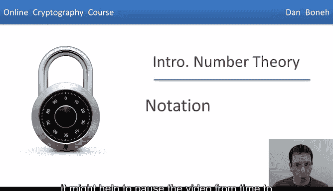
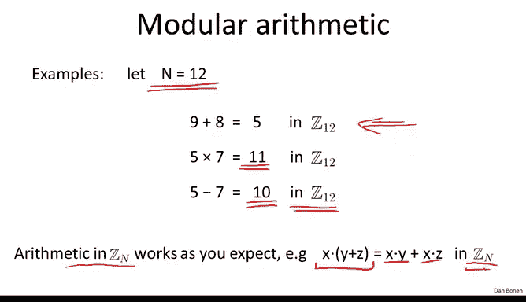
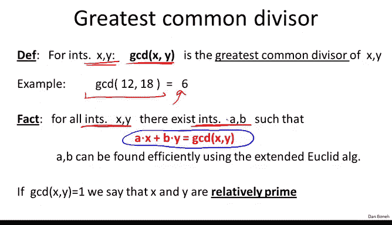
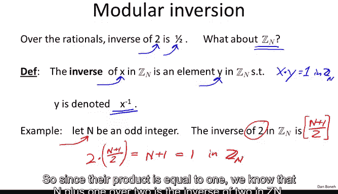

# 斯坦福大学《密码学｜Cryptography 1》中英字幕 - P51：51_05_01_符号表示.zh_en - GPT中英字幕课程资源 - BV1Rf421o79E

In the last module we saw that number theory can be useful for key exchange in this module we will review some basic facts from number theory that will help us build many public key systems next week as we go through the material in this module it might help to pause the video from time to time to make sure all the examples are clear。

So as I said， we're going to use number theory to build key exchange protocols。

 we're going to use number theory to build digital signatures， public key encryption， and many。

 many other things。But before we can do all that， we have to review some basic facts or number theory and in fact in this module we're going to do a quick course on the relevant concept。

 if you'd like to review some of the material discussed in this module offline。

 I reference at the end of the module a free textbook by Victor Sup and I point to some specific chapters in this book that will explain the material that we will cover here。

So from here on I'm going to use the following notation。

 I'm going to use capital n to always denote a positive integer。

 and I'm going to use lowercase P to always denote a positive prime number。

Now I'd like to introduce the following notation， there's this funny Z that's written like two diagonal lines here with a subscript N。

 I'm going to use that to denote the sets as0，12 up to n minus1。

This is actually very common notation is's used in crypto and so I'll stick to that here so again z sub n denotes the set of integers as 01 up to n minus1 and in fact this is not just a set of integers we can do addition and multiplication in the set as long as we always multiply module the number N。

For those of you who know a little bit of algebra， I'll just say that Z sub n denotes a ring where addition and multiplication are done modular n。

This is very common notation in crypto， although in modern mathematics。

 Z sub n sometimes denotes something else， but as I said I'm going to keep on using Z sub n to denote the set of integers0 to n minus-1 with addition and multiplication modular n。

So I want to make sure everybody is comfortable with modular arithmetic and so let's just look at the number。

 say n equals 12 and let's just see some basic facts about modular arithmetic。

 so I'm going to say that 9 plus 8 is 17， 17 is5 modular 12。

 so I'm going to write that 9 plus 8 is equal to 5 in Z12。

Now can someone tell me how much is 5 times 7 in Z12 in other words。

 how much is 5 times 7 modular 12？Well，5 times 7 is 35， and if you recall 36 is divisible by 12。

 so  five times 7 is really1 module 12， 35 is minus1 moduleular 12。

 but minus1 moduleular 12 is basically the same as 11 because I just add 12 to minus-1 and I get 11。

And the next question is， how much is 5 minus7 in Z12？Well， 5 minus7 is2， minus2 modular 12。

 while I just add 12 to minus2 and I get 10 as a result we say that 5 minus7 is equal to 10。So again。

 this is just to make sure everybody's comfortable with this notation of working in Z12。

In other words， working Modular 12。Now I just like to make a general statement that in fact arithmetic in ZN。

 in other words arithmetic modular n works just as you would expect， so for example。

 all the laws that you know about addition or multiplication work equally well in ZN for example。

 the distributed law x times y plus Z is still going to be equal to x times y plus x times Z so many of the things that you know about arithmetic when working over the integers or in the realels will translate to working in ZN namely working modo n。

😊。

So the next concept we need is what's called the greatest common divisor or a GCD and so suppose I give you two integers x and y。

 we say that the GCD of x and y is basically the greatest common divisor， it's the largest number。

 the largest integer that divides both x and y So for example what is the GCD of 12 and 18。Well。

 the GCD is6 because6 divides both 12 and 18 and it's the largest number that divides both 12 and 18。

Now there's an important fact about GCDs in particular if I give you two numbers。

 two integers X and y， there will always exist two other integers I'll call them A and B。

 such that if I look at a times x plus b times y what I get is the GCD of x and Y in other words。

 the GCD of x and y is a linear combination of x and Y using the integers A and B so let's just look at a simple example here let's look at our GCD from before so the integers for this GD would be  two times 12 minus 1 times 18 that's 24 minus 18 which is equal to 6 so the integers A and B in this case would be 2 and minus1。

But this is just an example that in fact， these integers， A and B will exist for any integers。

 x and Y。😡，Now not only do A and B exist， in fact there's a very simple and efficient algorithm to find these integers to find A and B。

 the algorithm is what's called the extended Euclidean algorithm。

 this is actually one of the prettiest algorithms from ancient Greek times due to Euclid of course。

 I'm not going to show you how this algorithm works here。

 it's a fairly simple algorithm I'll just tell you that in fact given X and Y this algorithm will find A and B in time roughly quadratic in the logarithms of x and y and we'll come back to that and discuss the performance of Euclid' algorithm in a bit more detail in just a minute。

😊，But for now， all we need to know is that A and B can actually be found efficiently。

Now if the GCD of x and y happens to be1， in other words。

1 is the largest integer that divides both x and y， then we say that x and y are relatively prime。

 for example， the GCD of3 and 5， it's not difficult to see that that happens to be1 because both3 and 5 are prime。

The next topic we need to talk about is modular inversion。So over therations。

 we know what the inverse of a number is， in other words， if I give you the number two。

 the inverse of two is simply the fraction1 half。The question is。

 what about inverses when we work modo n？Well， so the inverse of an element X in the N is simply another element y in the N such that x times y is equal to1 in the N。

 In other words， x times y is equal to1 modulo n and this number y is denoted by x inverse and it's not difficult to see that if if y exists then in fact it's unique and as I said。

 we'll use x inverse to denote the inverse of x。 So let's look at a quick example。

 suppose n is some odd integer。 and I ask you what is the inverse of2 in the N。😊。

So it's not so difficult to see that the inverse of 2 in the n in fact， is n plus 1 over 2。

 and you can see that this is an integer because n is odd， therefore n plus1 is even。

 and therefore n plus1 over 2 is in fact an integer in the range 1 to n as required。

Now why is n plus1 over 2 the inverse of two Well let's just multiply the two So we do two times n plus1 over2 and what do we get well that's simply equal to n plus 1 and n plus1 is simply equal to1 in Z N。

 So since their product is equal to 1， we know that n plus1 over 2 is the inverse of 2 in the N。

 Now that we understand what a modular inverse is the question is which element actually have an inverse in the N and so there's a very simple M that says that if for an element x in the n。

 that element has an inverse， if and only if it is relatively prime to the modulus n up to the number n。

So I'll say that again x and Z n is invertible if and only if x is relatively prime to n and let's quickly prove that it's actually fairly simple to c so suppose the GCD of x and n happens to be equal to 1 so x is relatively prime to n while by this property of GCDs we know that there exist integers A and B such that a times x plus b times n is equal to the GCD of x and n which happens to be 1 so a times x plus b times n is equal to 1。

😊，Now we can actually take this equation here and reduce it modo n。

 so what this means is that a times x is equal to1 in the n once we reduce this equation modular n。

 this term simply falls off because B times n is divisible by n and therefore is0 modulo n。

But what we just showed is that， in fact， x inverse is simply a in then。

So because x is relatively prime to n， we were able to show that x is invertible by actually building the inverse of x modular n。

Now what about the other direction， What happens if the GCD is greater than one。

 then we want to show that there is no inverse， but that's actually very easy to see because in this case。

 if you claim that a happens to be the inverse of x modular n。

 well let's look at a times x a times x we know should be equal to1 modular n。

 but if the GCD of x and n is bigger than1， then the GCD of a times x and n is bigger than1。

 but if the GCD of a times x and n is bigger than1。

 then it's not possible that a times x is equal to1 so a times x must also be bigger than1 and therefore a cannot be the inverse of x modular n。

So this proves that in fact， when the GCD is greater than1 x cannot have an inverse because there is no a such that a times x is equal to1 modern。

 and this might be a bit confusing so it might be best just to do an example so let's look at let's suppose that the GCD of x and n happens to be equal to 2 I claim that x is therefore is not invertible module n Well why is that true Well for all a we know that a times x is going to be even is even and the reason we know that is because well2 divides x and 2 divides n well since2 divide x 2 is also going to divide a times x and therefore a times x must be even。

But what that means is that there's no way that a times x is equal to1 mod n in particular。

 there's no way that a times x is equal to b times n plus1， this simply can't happen。

 this equality must not hold because this side happens to be even as we said B times n for exactly the same reason is also even n is divisible by 2。

 therefore B times n is also divisible by2， but therefore b times n plus1 is odd。

 and since even can't equal to odd， it's not possible that a times x is equal to some multiple of n plus1。

And in particular， this means that a cannot be the universeverse of x because a times x cannot be1 mod。

 so x is not invertible modo n。So now we have a complete understanding of what are the invertible elements basically we know that an element is invertible。

 if and only if it's relatively prime to n and what I like about this proof is I would say this is what's called a computer science proof in the sense that not only does it prove to you that the inverse exists。

 it also shows you how to efficiently calculate the inverse and the way we calculate the inverse is basically by using this extended Eucldan algorithm to find the numbers A and B and once we found the numbers A and B we're done because a is the inverse of x and the numbers A and B can be found very efficiently。

😊，So along the way， I've also shown new algorithm for inverting elements modulo n。Okay。

 so bear with me and let's introduce this a little bit more invitation。

 so we're going to denote by ZN star as the set of invertible elements in ZN。In other words。

 Zn stars instead of all elements in Zn， such that GCD of x and n is equal to 1 but I want you again to think of Zn star as basically those elements in Zn that have an inverse。

 so let's look at a few examples。 So let's start with a prime P。

 We know that of the integer is from 0 to p minus-1 all of them are going to be relatively prime to p except one integer namely the integer 00 is not relatively prime to p because the GCD of p and0 is0。

 not1。😊，So therefore， if p is a prime， the set ZP star is simply Zp minus0。

 which means that everything in ZP star is invertible except for0。So if you like the size of ZP star。

 it's simply P minus1。Now let's look at our favorite integer again。

 so why don't you tell me what is the12 star， what is a set of invertible elementss module 12？

And the answer of course， is all the numbers that are relatively prime to 12， namely1，5，7， and 11。

 so for example，3，4，6， all of those are not invertible because they all have a nontrivial GD with 12。

And as we said before， if I give you an element X and z n star。

 you can find its inverse using the extended Euclidean algorithm。

 you can find it inverse very efficiently， in fact， using this algorithm。

 So what we just learned is basically how to solve modular linear equations。 In other words。

 if I give you a linear equation and I ask you to solve at mod N。

 it's actually very easy to do all you do is you move B to the other side So you have a minus B and then you multiply by a inverse。

 So the answer is minus B times a inverse and you can find a inverse using the Euclidean algorithm And once you have a inverse you simply multiplied by minus B modular n and that gives you the solution to this linear equation。

 Now the Euclidean algorithm actually takes time that's quadratic in logarithm of N。

 So it takes time proportional to log squared N。And as a result。

 we say that this is a quadratic algorithm for solving linear equations， modular n， and in fact。

 this is the best known algorithm。And so if you think back to your high school algebra days。

 after you learned how to solve linear equations， the next question was。

 well what about quadratic equations and that problem is actually quite interesting and we're going to see that in the next few segments。

