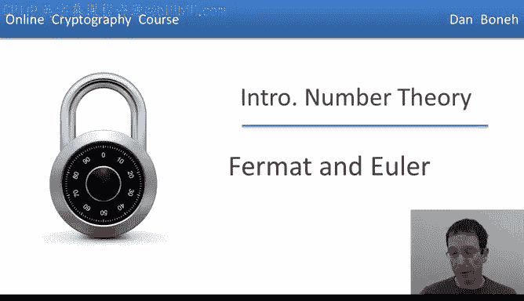
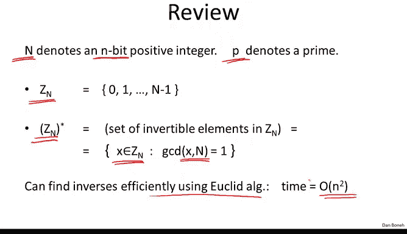
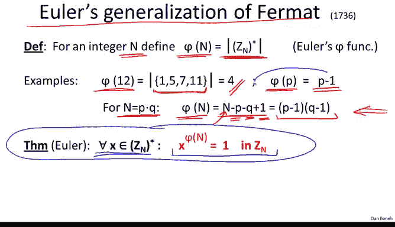

# 斯坦福大学《密码学｜Cryptography 1》中英字幕 - P52：52_05_02_费马与欧拉定理.zh_en - GPT中英字幕课程资源 - BV1Rf421o79E

In the previous segment， we talked about modular inversion。

 and we said that Euclid's algorithm gives us an efficient way to find the inverse of an element。

 modular n。In this segment， we're going to forward through time and we're going to move to the 17th and 18th century。

 and we're going to talk about Fairmont's and Euler's contributions。

Before that， let's do a quick review of what we discussed in the previous segment。

 so as usual we're going to let n theote a positive integer and let's just say that n happens to be an n bit integer In other words it's between2 to the n and 2 to the n plus1 as usual we're going to let P the note a prime。

😊，Now we said that z sub n is the set of integers from 0 to n minus-1。

 and we said that we can add and multiply elements in the set modular n We also said that Zn star is basically the set of invertible elements in ZN and we prove the simple element to say that x is invertible if and only if x is relatively prime to n。

And not only that do we completely understand which elements are invertible and which aren't。

 we also showed a very efficient algorithm based on Euclid's extended algorithm to the inverse of an element x in theN。

 and we said that the running time of this algorithm is basically order n squared where again n is the number of bits of the number of capital n。

😊。

So as I said， now we're going to move from Greek times all the way to the 17th century and talk about Fmon。

So for our stated a number of important theorems， the one that I want to show you here says the following。

 so suppose I give you a prime P then in fact for any element x in Zp star。

 it so happens that if I look at x and raise it to the power of p minus-1， I'm going to get 1 in Zp。

😊，So let's look at a quick example， suppose I set the number p to be 5 and I look at3 to the power of p minus-1。

 in other words，3 to the power of 4，3 to the power of 4 is 81。

 which in fact is one module of 5 This example satisfies Vermat's theoremInterestinglyly Fma actually didn't prove this theorem himself proof actually waited until Euler who proved it almost 100 years later and in fact he proved a much more general version of the theorem。

So let's look at a simple application of foras Theorem， suppose I look at an element x in ZP star。

 and I want to remind you here that P must be a prime。😊，Well。

 then what do we know we know that x to the p minus1 is equal to1 Well we can write x to the p minus1 as x times x to the power of p minus2 Well so now we know that x times x to the power p minus2 happens to be equal to1 and what that says is that really the inverse of x mod P is simply x to the p minus2 so this gives us another algorithm for finding the inverse of x mod a prime simply raise x to the power of p minus2 and that will give us the inverse of x It turns out actually this is a fine way to compute inverses mod over prime but it has two deficiencies compared to euclid's algorithm first of all。

 it only works modular primes whereas euclid's algorithm work modular composites as well and second of all it turns out this algorithm is actually less efficient when we talk about how to do modular exponiationations we're going to do that in the last segment in this module you'll see that the running time to compute this exponiciation is actually cubic in the size。

P， so this will take roughly log cube of P， whereas if you remember a eucliot algorithm was able to compute the inverse in quadratic time in the representation of P。

So not only is this algorithm less general， it only works for primes， it's also less efficient。

So score one for Euclid， but nevertheless， this fact about primes is extremely important and we're going to be making extensive use of it in the next couple of weeks。

So let me show you a quick and simple application of Vermont's theorem。

 Supp we wanted to generate a large random prime， say our prime needed to be 1000 bits or so。

So the prime we're looking for is on the order of2 to the 1024。

So here's a very simple probabilistic algorithm。 What we would do is we would choose a random integer in the interval that was specified。

And then we would test whether this integer satisfies from math theorem， in other words。

 we would test， for example， using the base 2， we would test whether 2 to the power of p minus-1 equals 1 in Zp。

 If the answer is no， then if this equality doesn't hold。

 then we know for sure that the number P that we chose is not a prime。And if that happens。

 all we do is we go back to step one and we try another prime and we do this again and again and again until finally we find an integer that satisfies this condition and once we find an integer that satisfies this condition。

 we simply output it and stop。Now it turns out this is actually a fairly difficult statement to prove。

 but it turns out if a random number passes this test。

 then it's extremely likely to be a prime in particular。

 the probability that p is not a prime is very small。

 it's like less than 2 to the minus- 60 for the range of 1024 bit numbers as the number gets bigger and bigger。

 the probability that it passes this test here but is not a prime drops to  zero very quickly。😊。

So this is actually quite an interesting algorithm。

 you realize we're not guaranteed that the output is in fact a prime， all we know is that it's very。

 very likely to be a prime in other words， the only way that it's not a prime is that we got extremely unlucky。

 in fact so unlucky that an negligible probability event just happened。😊。

Another way to say this is that if you look at a set of all 10，24 bit integers。Then， well。

 there's a set of primes， let me write prime here。And then there is a small number of composites that actually will falsify the test。

 Let's call them F for false primes， let's call them FP for false primes。

 There is a very small number of composites that are not prime and yet well pass this test。

 but as we choose random integers， you know， we choose one here， one here， one here and so on。

 as we choose random integers， the probability that we fall into the set of false primes is so small that it's essentially a negligible event that we can ignore。

In other words， one can prove that a set of false primes is extremely small and a random choice is unlikely to pick such a false prime。

Now I should mention in fact this is a very simple algorithm it's for generating primes。

 it's actually by far not the best algorithm， we have much better algorithms now and in fact once you have a candidate prime we now have very efficient algorithms that will actually prove beyond a doubt that this candidate prime really is a prime。

 so we don't even have to rely on provolistic statements and nevertheless this fermon test is so simple that I just wanted to show you that it's an easy way to generate primes。

 although in reality this is not how primes are generated。😊。

It's the last point I'll say that you might be wondering how many times this iteration has to repeat until we actually find a prime。

 and that's actually a classic result， it's called a prime number theorem。

 which says that after a few hundred iterations， in fact we'll find a prime with high probability。

So in expectation， one would expect a few hundred iterations and no more。

Now that we understand from a theem the next thing I want to talk about is what's called the structure of ZP star so here we're going to move 100 years into the future into the 18th century and look at the work of Euler and one of the first things Euler showed is in modern language is that ZP star is what's called a cyclic group so what does it mean that ZP star as a cyclic group what it means is there exists some element G in ZP star such that if we take G and raise it to a bunch of powers G G squared G cube G to the fourth and so on and so forth up until we reach G to the P minus-2。

😊，Notice there's no point going beyond g to the p -2 because g to the p -1 by from a theorem is equal to1。

 So then we will cycle back to1， if we go back to g to the p -1。

 then G to the P will be equal to G G to the p plus1 will be equal to g squared and so on and so forth。

 So we'll actually get a cycle。 if we keep raising to higher and higher powers of G。

 So we might as well stop at the power of G to the p -2。And what Euler showed is that in fact。

 there is an element G such that if you look at all of its powers。

 all of its powers span the entire group ZP star。Powers of G give us all the elements in ZP star element of this type is called a generator。

 so G would be set to be a generator of ZP star so let's look at a quick example。

 so let's look for example at p equals 7， and let's look at all the powers of three。

 so three squared cube3 to fourth，3 to fifth，3 to the6。

 already we know is equal to one mod of7 by firmma theorem so there's no point in looking at3 to6 we know we would just get1。

So here I calculated all these powers for you and I wrote it out。

 and you see that in fact we get all the numbers in Z7 stars， in other words， we get one， two， three。

 four，5， and6。😊，So we would say that3 is a generator of z7 star now I should point out that not every element is a generator。

 for example， if we look at all the powers of two， well that's not going to generate the entire group in particular if we look at2 to the0 we get12 to the1 we get2。

 two squared is4 and2 cubed is8 which is one mod7 so we cycled back and then two to the fourth would be 2。

2 to the fifth would be4 and so on and so forth so if we look at the powers of2 we just get1。

2 and4 we don't get the whole group and therefore we say that two is not a generator of z7 star。😊。

Now again， something that we'll use very often is given an element G of ZP star。

If we look at the set of all powers of G， the resulting set is going to be called the group generated by G。

 Okay， so these are all the powers of G。 They give us what's called a multiupplicative group。 Again。

 the technical term doesn't matter。 The point is we're going to call all these powers of G。

 The group generated by G。In fact， there's this notation which I won't use very often， angle。

 G angle to denote this group that's generated by G。And then we call the order of G and ZP star。

 we simply let that be the size of the group that's generated by G。 so in other words。

 the order of G in ZP star is the size of this group。

 but another way to think about that is basically it's the smallest integer A such that G to the A is equal to 1 in ZP。

Okay， it's basically the smallest power that causes a power of G to be equal to 1。

And it's very easy to see that there' equality here basically if we look at all the powers of G。

 then we look at 1 g， G squared， the G cubed， and so on and so forth。

 up until we get to the G to the order of G minus1， and then if we look order at G to the order of G。

😊，This thing is simply going to be equal to one by definition。Okay。

 so there's no point in looking at any higher powers。

 we might as well just stop raising two powers here and as a result， the size of the sets。In fact。

 is the order of G， and you can see that the order is the smallest power such that raising G to that power gives us1 in ZP。

So I hope this is clear， although it might take a little bit of thinking to absorb all this notation。

 but in the meantime， let's look at a few examples。So again。

 let's fix our prime to be 7 and let's look at the order of a number of elements so what is the order of three modular 7 Well we're asking what is the size of the group the3 generates modular 7 Well we said that three is the generator of the z7 star so it generates all of Z7 star there are six elements in z7 star and therefore we say that the order of3 is equal to 6。

Similarly， I can ask well what is the order of2 module 7 and in fact we already saw the answer。

 so I'll ask you what is the order of2 module 7 and see if you can figure out what this answer is。

So the answer is three。 and again， the reason is if we look at the set of powers of two modular 7。

 well we have one，2，2 squared， and then two cubed is already equal to one。

 So this is the entire set of powers of two modular 7， there are only three of them。And therefore。

 the order of two modular 7 is exactly three。 Now， let me ask you a trick question。

 what's the order of one modular 7？

Well， the answer is one because if you look at the group that's generated by one， well。

 there is only one number in that group， namely the number one。

 if I raise one to a whole bunch of powers， I'm always going to get one and therefore the order of one modular 7。

 in fact the order of one modular any prime is always going to be one。

Now there's an important theorem of Lagrange that actually this is a very， very special case of it。

 what I'm st here， but Lagrange's theorem basically implies that if you look at the order of G module O P。

 the order is always going to divide p minus-1 so in our two example you see6 divides7 minus-16 divides 6 and similarly 3 divide 7 minus-1 namely again3 divide 6。

 but this is very general， the order is always going to be a factor of p -1。In fact。

 I'll tell you maybe as a puzzle for you to think about。

 it's actually very easy to deduce feros theorem directly from this fact from this Lagrangous theorem fact。

 and so ferostorem really in some sense follows directly from Lagrangous theorem。😊，LaGrange。

 by the way， did his work in the 19th century so you can already see how we're making progress through time。

 we started in Greek times and already we ended up in the 19th century。

And I can tell you that more advanced crypto actually uses 20th century math very extensively。

Now that we understand the structure of ZP star， let's generalize that to composites and look at the structure of ZN star so what I want to show you here is what's called Eulers theorem。

 which is a direct generalization of fermats theorem so Euler defined the following function so given an integer N he defined what's called the phi function phi of n to be basically the size of the set ZN star this is sometimes called Euler's phi function。

 the size of the set ZN star。So for example， we already looked at Z12 star。

 we said that Z12 star contains these four elements， 1，5，7， and 11。

 and therefore we say that5 of 12 is simply the number four。So let me ask you as a puzzle。

 what is phi of P， it'll basically be the size of ZP star。And so in fact。

 we said that the ZP star contains all of Zp except for the number 0。

 and therefore5 of P for any prime P is going to be p minus1。

Now there's a special case which I'm going to state here and we're going to use later for the RSA system。

 if n happens to be a product of two primes， then phi of n is simply n minus p minus q plus 1 and let me just show you why that's true。

 but basically n is the size of ZN。And now we need to remove all the elements that are not relatively prime to n Well how can an element not be relatively prime to n it's got to be divisible by p or it's got to be divisible by  Q Well how many elements between 0 and n minus1 are there that are divisible by p while they're exactly  Q of them how many elements are there that are divisible by  Q while they are exactly p of them so we subtract p to get rid of those divisible by  Q we subtract  Q to get rid of those divisible by p and you notice we subtracted 0 twice because 0 is divisible both by p and  Q and therefore we add one just to make sure we subtract 0 only once。

 and so it's not difficult to see that5 n is n minus p minus  Q plus1 and another way of writing that is simply p minus1 times q minus1。

Okay， so this is a fact that we will use later on when we come back and talk about the RSA system。

So far， this is just defining this phi function of Euler。

 but now Euler put this phi function to really good use and what he proved is this amazing fact here that basically says that if you give me any element x in ZN star。

 in fact， it so happens that x to the power of 5n is equal to 1 in ZN。

So you can see that this is a generalization of fermat theorem in particular format theorem only applied to primes for primes we know that p of p is equal to p minus-1。

 and in other words if n were prime we would simply write p minus-1 here and then we would get exactly formats theorem The beauty of Oer theorem is it applies to composites and not just primes。

😊。

So let's look at some examples so let's look at5 to the power of phi of 12 so5 is an element of z12 star。

 if we raise it to the power of phi of 12， we should be getting one Well we know that phi 12 is4 so we're raising 5 to the power of45 to the power of 4 is 625 and it's a simple calculation to show that that's equal to1 module 12 so this is proof by example。

 but of course it's not a proof at all， it's just an example。

 but in fact it's not difficult to prove oil theem and in fact I'll tell you that oilest theem is also a very special case of Lagrange's general theorem。

😊，Okay， so we said that this is a generalization of fromossterorem and in fact as we'll see。

 this Euler theorem is the basis of the RSA crypto system。😊。

So I'll stop here and we'll continue with modular quadratic equations in the next segment。

