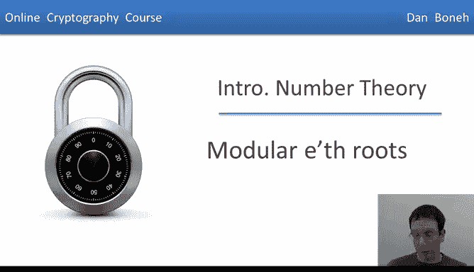
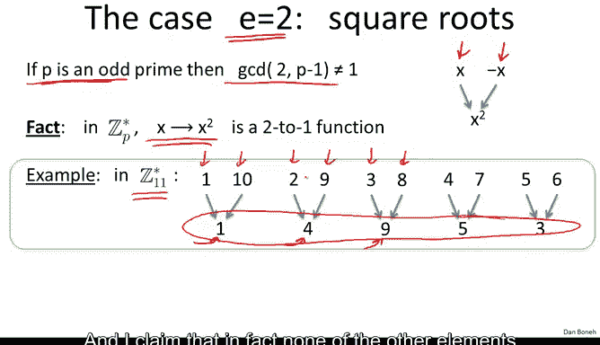
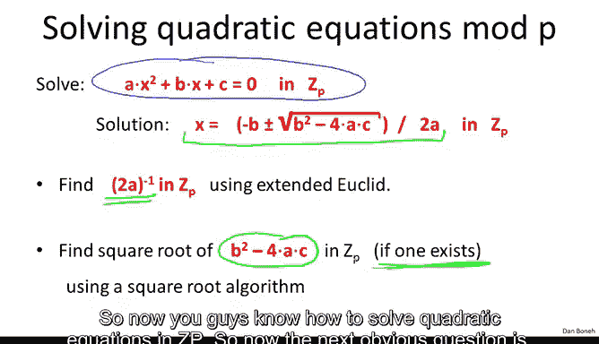

# 斯坦福大学《密码学｜Cryptography 1》中英字幕 - P53：53_05_03_模e次根.zh_en - GPT中英字幕课程资源 - BV1Rf421o79E

In a previous segment we talked about how to solve modular linear equations in this segment we're going to talk about how to solve modular quadratic equations and more generally we're going to look at how to compute modular E roots。

So as I said now we know how to solve linear equations simply by using an inversion algorithm to compute a inverse and then multiplying the results by minus B so the question is what about higher degree polynomials and in particular we are interested in solving polynomials modulo primes。

 so solving polynomials in ZP by polynomials particularly of the form x squared minus C or y cube minus C or z to the 37 minus E all in ZP。

So solving this polynomial， for example， involves computing the square root of C。

 solving this polynomial involves computing the cube root of C。

 solving this polynomial involves computing the 37th root of C and so on。So again。

 let's fix a primes P， and let's say that C is some element in ZP。

We'll say that x in Zp that satisfies x to the E is equal to C， well call such an x。

 the modular e root of C。So let's look at an example。

 we say that the cube root of 7 in Z 11 is equal to 6 because6。Cubed is equal to 216。

 which happens to be 7 modulo 11。And therefore， the cube root of 7 modo 11 is equal to 6。

 So let me ask you， what is the square root of 3 in Z 11？😊。

So the answer is five because5 squared is equal to 25， which is 3 modo 11。And similarly。

 let me ask you， what is the cube root of 1， modular 11？Well。

 the cube root of1 is simply one because one cube is equal to 1 in Z11。 In fact。

 that's true in a modlo any prime。One thing I'd like to point out is that these e roots don't always exist。

 for example， if I asked you to compute a square root of 2 modular 11。

 you'd have a problem because a square root of 2 simply doesn't exist modular 11。

So now that we understand what an E root is， the next question is。

 when do these E roots exist and when we know that they do exist。

 can we actually compute them efficiently？So let's start with the easy case。

 the easy case is when we want to compute an e through root of something and it so happens that E is relatively prime to p minus1 in this case C or the1 River E always exists and there's a very easy algorithm to actually compute the E through root of C in ZP。

So let's see how this works。So first， since E is relatively prime to P -1。

 we know that E has an inverse modular P -1。 So let's compute this inverse and let's call it D。

 So let's let D be the inverse of E modular P -1。Then I claim that in fact。

 C to the1 over e is simply C to the D modlo P。So if this equation holds， then first of all。

 it proves that for all C and ZP star， the E root of C actually exists。And moreover。

 it gives a very efficient algorithm to compute this e through of C simply by computing the inverse of E mod of p minus1 and then raising C to the power of that inverse so we kill two birds in one stone。

😊，So let's see why this equation holds。So first of all。

 the fact that d times e is equal to1 mod p minus1， what that means is there exists some integer k。

 such that if I look at d times E， that's basically going to be k times p minus1 plus1 that's basically what it means that d times e is equal to1 modular p minus1。

But now what does that mean Well， so now we can actually confirm that C to the D is an e root of C。

 Well， how do we confirm that？ Well， let's take C to the D and raise it to the power of E。 If。

 in fact， C to the D is an e root of C， when we raise it to the power of E。

 we're supposed to get C back。

So let's see why that's true， Well that's simply equal to c times d to the E and c times d to the E。

 well by definition is equal to C to the power of k times p minus1 plus 1。Well。

 using the laws of exponiation， we can write this as C to the power of P minus1。

To the power of K times C。All I did is I distributed the exponiation using the standard laws of exponiciation Now what do we know about c to the P minus1 since C lives in Zp star by fromox theorem we notice c to the p minus1 is equal to 1 in Zp1 to the K is also equal to 1 and as a result this is simply equal to C in ZP。

😊，Which is exactly what we needed to prove that C to the D is an e root of C。Okay。

 so this is what I call the easy case， in fact the e root always exists when e is relatively prime to P minus1 and it's very easy to compute it simply by using this formula here。

Now let's turn to the less easy case， So the less easy case is when E is not relatively prime to p minus-1 and the canonical example here is when e is equal to 2。

 So now suppose we want to compute square roots of C and ZP。

So if P is an odd prime and in fact we're going to focus on odd primes from now on。

 then in fact p minus-1 is going to be even， which means that two divides p minus-1 and indeed the GCD of 2 and p minus-1 is not equal to 1。

 so this is not the easy case。😡，So the algorithm that we just saw in the previous slide is not going to work when we want to compute square roots。

 modo and odd prime。So when we work on odd primery。

 the squaring function is actually a  two to one function。

 namely it maps x and minus x to the same value， it maps both of them to x squared。And as a result。

 we say that this function is a two to one function。So here's a simple example。

 let's look at what happens when we compute squares modular 11， so you can see that1 and minus1。

 modular 11 both mapped1。2 and minus-2， both map to4，3 and minus-3。

 both map to9 and so on and so forth。 so you can see that it's a2 to1 map。 So in fact。

 these elements here， 14，9，53 all are going to have square roots， for example。

 the square root of 4 is simply going to be 2 and9 and I clean and in fact none of the other elements of z11 star are going to have a square root。

And that motivates this definition to say that an element x in Zp。

 we're going to say is called a quadratic residue， if in fact it has a square root in ZP。

 okay and if it doesn't have a square root， we'll say that it's a non quadratic residue。😊。

So for example， module 11，4 is going to be a quadratic residue nine is going to be a quadratic residue。

 five is a quadratic residue， three is a quadratic residue， and of course one is a quadratic residue。

So let me ask you if P is an odd prime， what do you think is the number of quadratic residues in ZP。

 and I'll give you a hint the squaring function is a two to one map。

Which means that half the elements in Zp can't have a pre image under this map。

So the number of quadratic residues is simply p minus1 over2 plus1 and the reason that's true is because we know that exactly half the elements in Zp star are going to be quadratic residues because of the fact that the squareing function is a two to1 map so there can be at most p minus1 over two elements in the image of that map so half the elements in Zp star quadratic residues and then in Zp there's also zero we also have to account for00 is always a quadratic residue because 0 squared is equal to0 so overall we get p minus1 over2 quadratic residues in Zp star plus1。

 the0 element which is a quadratic residue in Zp so overall in Zp there are p minus1 over 2 plus1 quadratic residues。

Okay， so the main point to remember is that roughly half the elements have a square root and the other half does not have a square root。

I want to emphasize that this is very different from the easy case where E was relatively primeed to P minus-1。

 if you remember in the easy case。Every element in ZP star had an e root。

When e is not relatively prime to P minus1， that's no longer the case。

 and in particular in the case of e equals 2， only half the elements in ZP star have a square roots。

Well， so the natural question then is， can we given an element x and Zp star。

 can we tell whether it has a square root or not？So Euler did some important work on that too and in fact he came up with a very clean criteria to test exactly which elements are quadratic residues and which are not。

 and in particular he said that x in ZP star is a quadratic residue if and only if x to the power of p minus1 over 2 is equal to1 mod P。

😊，Okay， very， very elegant and very simple condition。

Let's see a simple example in Z11 so when we work mod 11 so here I computed the fifth power of all the elements in 11 for you and you can see that this symbol this x to the p minus1 over2 is always either1 or minus-1 and it's one precisely at the quadratic residues so 1。

3，4，5 and 9 those are the quadratic residues and the other elements are not quadratic residues here I'll circle them in green these are the elements that do not have a square root when we work modular 11。

😊，One thing I'd like to point out is in fact， if we take an x that's not equal to0 and we look at x to the p minus1 over2。

 well we can write that as the square root of x to the p minus1 the kind of the half bubbles out and this is simply the square root of x to the p -1 while x to the p minus-1 by thermoostorem is1 so x to the p minus1 over  two is simply a square root of1 which must be1 or minus1 So what this proves is that really this exponiation here must output1 or minus-1 and we actually saw that happening here it outputs1 when x is a quadratic residue and it outputs minus1 when x is not a quadratic residue。

This is not a particularly difficult proof， but I'm not going to show it to you here。

 it's in the reference that I point you at the end of the module。

And just for completeness， I'll mention that this value x to the p minus1 over 2 has a name it's called a legendgender symbol of x over p。

 and as we said this four elements in ZP star， this symbol is either 1 or minus1 depending on the quadratic residualosity of x。

Now the sad thing about Euler's theorem is that it's not constructive， even though it's a very。

 very Q theorem， it tells us exactly which elements are quadratic residues and which aren't。

 the theorem doesn't do it constructively in the sense that if we want to compute the square root of a quadratic residue。

 the theorem doesn't actually tell us how to do that and in fact， even if you look at the proof。

 the proof is by an existential argument， so it proves that the square root exists。

 but it doesn't show us how to compute the square root when we want it。😊。

So the next question is then how do we compute square roots modular primes？

So it turns out that's actually not so hard and again it breaks up into two cases。

 The first case is when p is equal to 3 modular 4， in which case it's really easy to compute a square root。

 and I'll just tell you there's a simple formula， the square root of c in this case is simply C to the power of p plus1 over 4 You notice that because p is equal to 3 modular 4 p plus 1 is necessarily p plus1 is equal to 0 modular 4 which means that p plus1 is divisible by4 and therefore p plus1 over 4 is an integer。

And that's exactly what allows us to compute this exponiation。

 and I claim that that actually gives us the square root of C。

 very simple formula that directly gives us the square root of C。😊。

So let's verify that that's actually true。 Well， I'll take C to the power of p plus 1 over4 and square that。

And if in fact， if c to the p plus 1 over4 is the square root of C， when it square it。

 I should get C。So let's see what happens。 So first of all， by laws of exponiation。

 this is simply equal to c to the power of p plus1 over 2 and that I can write as C to the power of p minus1 over2 times C。

Okay， again， this is basically I took one half and moved it out of the exponiation。

Now what do we know about C to the power of p minus 1 over 2 since c is a quadratic residue we know that c to the power of p minus 1 over 2 is 1。

 and therefore this is really equal to1 times C， which is C and Zp as we wanted to show。

 so this basically proves that C to the power p plus 1 over 4 is the square root of C。

 at least in the case when p' is equal to 3 mod 4。Now you should ask me well。

 what about the case when p' is equal to 1 mod 4， in that case this formula doesn't even make sense because p plus1 over 4。

 this exponent here， p plus1 over 4 is going to be a rational fraction and I don't know how to raise C to the power of a rational fraction。

Nevertheless， it turns out that even in the case when p is equal to 1 mod 4 we can efficiently find square roots。

 although it's a little bit harder， and in particular we don't have a deterministic algorithm to do it。

 we have to use a randomized algorithm to do it。But this randomized algorithm will actually find the square root of x smart P very efficiently。

I guess I should mention that if someone can prove that the extended Riman hypothesis。

 this is some D hypothesis and analytic number theory。

 if someone can prove that that hypothesis is true，In fact。

 it would give a deterministic algorithm for computing square roots even when p is equal to one module of4。

So the reason I like to mention that is because you notice that as soon as you put the computational lens on something。

 for example， I ask you to compute the square roots of a number x mod P。

 coming up with an algorithm already requires extremely， extremely deep results in mathematics。

 some of which are not even known to be true today。So as things stand today。

 we simply don't have a deterministic algorithm to compute square roots where p is1 mod4。

 but as I said we have good randomized algorithms and this problem is considered easy。

 essentially it boils down to a few exponiations and as a result as we'll see the running time of computing square roots essentially is cubic in the number of bits of P。

😊，So excellent now we know how to compute square roots mod P and so now we can talk about solving quadratic equations module of P。

 so suppose I give you a quadratic equation and I ask you to find a solution of this quadratic equation in Zp well so now I claim that you know how to solve it the way you would solve it is basically you would use the high school formula for solving quadratic equations so the solution is minus B plus minus square root of b squared minus4AC over 2 a and I claim that you know how to compute all the elements in this formula so you know how to compute the inverse of 2a so you can divide by 2 a that's done using the extended declding algorithm and we know how to compute a square root of B squared minus4AC using one of the square root algorithms from the previous slide。

😊，And of course， the formula will only be solvable if this square root actually exists in ZP。

So that's cool。 So now you guys know how to solve quadratic equations in Z P。

So now the next obvious question is， what about computing eros。

 modular composites rather than modulular primes？So we can ask exactly the same questions that we asked before。

 so when does the Es modo N exist and if we know that it exists can we actually compute it efficiently and here the problem is much。

 much， much harder and in fact it turns out that for all we know computing e roots modular composites in fact is as hard as factoring that composite。

Now for general E， this is actually not known to be true。

 but the best algorithm that we have for computing e roots modular N requires us to factor the modulus。

 and once we factor the modulus， then it's actually easy to compute e roots mod each of the prime factors and we can combine all the E roots together to get an e roots modular the composite n。

So it's a very interesting case where computing E roots modular prime was very easy。

 in fact for many Es it was very easy， but computing E roots modular composites is much， much。

 much harder and in fact requires the factorization of N。

So that's all I wanted to tell you about eros in the next segment we're going to turn to modular algorithms and we're going to talk about addition and multiplication and exponiation algorithms。

 modo primes and composites。

