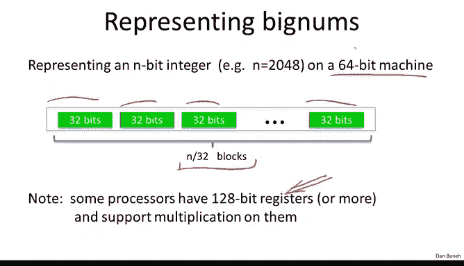
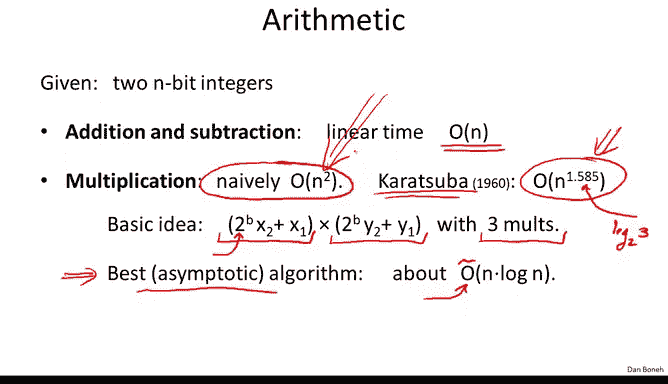
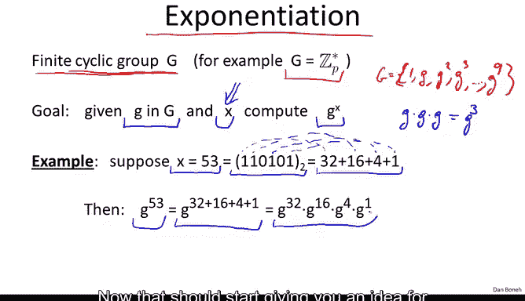

# 斯坦福大学《密码学｜Cryptography 1》中英字幕 - P54：54_05_01_算术算法.zh_en - GPT中英字幕课程资源 - BV1Rf421o79E

The next thing we're going to look at is how to compute mod or large integers。

So the first question is how do we represent large integers in a computer？

So that's actually fairly straightforward。 So imagine we're on a 64 bit machine what we would do is we would break the number we want to represent into 32 bit buckets and then we would basically have these in over 32 bit buckets and together they would represent the number that we want to store on the computer Now as you mentioned and I'm only giving 64 bit registers as an example。

 in fact， many modern processors have 128 bit registers and more and you can even do multiplications on them so normally you would actually use much larger blocks than just 32 bits。

 The reason by the way， you want to limit yourself to 32 bits is so that you can multiply two blocks together and the result will still be less than 64 bits less than the word size on the machine。

So now let's look at the particular arithmetic operations to see how long each one takes So addition and subtraction basically what you would do is as addition with carry or subtraction with Brow and those are basically linear time operations In other words。

 if you want to add or subtract to n bit integers， the running time is basically linear in n。😊。

Multulipplication naively will take quadratic time。

 in fact this is what's called the high school algorithm。

 this is what you kind of learn in school where if you think about this for a minute you'll see that that algorithm basically is quadratic in the length of the numbers that are being multiplied so a big surprise in the 1960s was an algorithm due to Karatsba that actually achieved much better than quadratic time in fact it achieved a running time of N of the 1。

585。And there's actually no point to me showing you how the algorithm actually work。

 I'll just mention the main idea， what Karaubba realized is that in fact when you want to multiply two numbers。

 you can write them as you can take the first number x and write it as2 to the b times x2 plus x1。

 where x2 and x1 are roughly the size of the square root of x。Okay。

 so you can kind of break the number x into the left part of x and the right part of x。

And basically you're writing x as if it was written base 2 to the B。

 So it's got two digits base 2 to the B， and you do the same thing with Y you write y base 2 to the B。

 Again， you would write it as at the sum of the left half plus the right half。And then normally。

 if you try to reduce multiplication when you open up the parentheses。

You see that this would require four multiplications， right， It would require x2 times y2。

 x2 times y 1， X Y times y2 and X Y times y1。What Kratuba realized is there's a way to do this multiplication of x by y using only three multiplications of x1。

 x2，1， y1 y2。Since if the big multiplication of x times y only takes three little multiplications。

 you can now recursively apply exactly the same procedure to multiplying x2 by y2 and x2 by y1 and so on and so forth。

 and you will get this recursive algorithm and if you do the recursive analysis。

 you'll see that basically you get a running time of n to the 1。585。This number is basically the 1。

585 is basically log of3 base 2。Surprisingly it turns out that Karasubba using even the best multiplication algorithm out there。

 it turns out that in fact you can do multiplication in about and log n time。

 so you can do multiplication in almost linear time。

 however this is an extremely asymptootic results， the big O here hides very big constants as a result this algorithm only becomes practical when the numbers are absolutely enormous and so this algorithm is actually not used very often。

 but Karasubba's algorithm is very practical and in fact most crypto libraries implement Karasuba's algorithm for multiplication。

😊，However， for simplicity here I'm just going to ignore Karaubba's algorithm and just for simplicity I'm going to assume that multiplication runs in quadratic time。

 but in your mind you should always be thinking， oh。

 multiplication really is a little bit faster than quadratic。

And then the next question after we do multiplication。

 the question is what about division with remainder and it turns out that's also a quadratic time algorithm。

So the main operation that remains and one that we've used many times so far。

 and I've actually never， ever told you how to actually compute it is this question of exponunciation。

So let's solve this exponitation problem a bit more abstractly。

 so imagine we have a finitecyclric group G。 All this means is that this group is generated from the powers of some generator little G So for example。

 think of this group as simply Zp star and think of little G as some generator of big G。😊。

The reason I'm sitting at this way is I want you to start getting used to this abstraction where we deal with a generic group G and ZP star really is just one example of such a group。

 but in fact， there are many other examples of finitecycl groups。And again。

 I want to emphasize basically the group G， all it is is simply this powers of this generator up to the order of the group。

 I'll write it as G to the Q。So our goal now is given this element G and some exponent x。

 our goal is to compute the value of G to the x。Now， normally what you would say is you would think。

 well， know x x is equal to  three and I'm want to compute G cubed。Well。

 there's really nothing to do。 all I do is I just do G times G times G and I get Gq。

 which is what I wanted。 So that's actually pretty easy。 but in fact。

 that's not the case that we're interested in。 in our case。

 our exponents are going to be enormous And so if you try think of like a 500 bit number And so if you try to compute G to the power of a 500 bit number。

 simply by multiplying g by g by g by g this is going to take quite a while。

 in fact it'll take exponential time which is not something that we want to do So the question is whether even though x is enormous can we still compute g to the x we're relatively fast。

 and the answer is yes， and the algorithm that does that is called a repeated squing algorithm。😊。

And so let me show you how repeated scoringing works So let's take as an example 53 naively you would have to do 53 multiplications of g by g by g by g by g until you get g to the 53。

 but I want to show you how you can do it very quickly so what we'll do is we'll write 53 in binary so here this is the binary of the presentation of 53 on all that means is you notice this one corresponds to 32 this one corresponds to 16 this one corresponds to 4 and this one corresponds to 1 so really 53 is 32 plus 16 plus 4 plus1。

😊，But what that means is that G to the power of 53 is g to the power of 32 plus 16 plus 4 plus1。

 and we can break that up using again the rules of exponiation。

 we can break that up as g to the 32 times G to the 16 times G to the 4 times G to the 1 Now that should start giving you an idea for how to compute G to the 53 very quickly。

What we'll do is simply we'll take G and we'll start squaring it。

 So what square G wants to get G squared。 we squared again to get g to the fourth Gen G to the H Gen G to the 16th G to the 32。

 So we've computed all these squares of G and now what we're going to do is we're simply going to multiply the appropriate powers to give us the G to the 53。

 So this is G to the 1 times G to the fourth times G to the 16th times G to the 32 is basically going to give us the value that we want which is g to the 53。

So here you see that all we had to do was just compute， let's see， we had to do one， two， three。

 four， five squarings。Plus， four more multiplications。 So with nine multiplications。We computed。

G to the 53。Okay so that's pretty interesting。 And it turns out this is a general phenomena that allows us to raise G to very。

 very high powers and do it very quickly。 So let me show you the algorithm， as I said。

 this is called a repeated scoringing algorithm。 So the input to the algorithm is the element G and the exponent x and the output is G to the x。

😊，So what we're going to do is we're going to write x in binary notation。

 so let's say that x has n bits， and this is the actual bit representation of x as a binary number。

And then what we'll do is the following we'll have these two registers。

 Y is going to be a registered that's constantly squared。

 and then z is going to be an accumulator that multiplies in the appropriate powers of G as needed。

 So all we do is the following we loop through the bits of x starting from the least significant bits。

And then we do the following at every iteration， we're simply going squared y。

 so y just keeps on squaring at every iteration。 And then whenever the corresponding bits of the exponent x happens to be one。

 we simply accumulate the current value of y into this accumulator Z。 And then at the end。

 we simply output Z。 That's it。 That's the whole algorithm and that's the repeated squaring algorithm。

 So let's see an example was G to the 53， So you can see the two columns。

 Y is one column as it evolves through iterations and z is another column again。

 as it evolves through the iterations。 So y is not very interesting。 Basically。

 all that happens to y is that at every iteration， it simply gets squared。😊。

And so it just walks through the powers of two and the exponent and that's it Z is the more interesting register where what it does is it accumulates the appropriate powers of G whenever the corresponding bits of the exponent is1 so for example the first bit of the exponent is 1 therefore at the end of the first iteration the value of z is simply equal to G。

The second bit of the exponent is0， so the value of z doesn't change at the end of the second iteration。

But at the end of the third iteration， well， the third bit of exponent is1。

 so we accumulate G to the fourth into z， the next bit of the exponent is0， so z doesn't change。

The next bit of the exponent is one。 and so now we're supposed to accumulate the previous value of y into the accumulator Z。

 So let me ask you so what's going to be the value of z。

Well we simply accumulate G to the 16 into Z and so we simply compute the sum of 16 and 5。

 we get G to the 21。 Finally the last bit is also set to 1， so we accumulate it into Z。

 we do 32 plus 21 and we get a final output G to the 53。

Okay so this gives you an idea of how this repeated querying algorithm works。

 it's quite an interesting algorithm， and it allows us to compute enormous powers of G very， very。

 very quickly。😊，So the number of iterations here essentially would be log base 2 of x。Okay。

 you notice the number of iterations simply depends on the number of digits of x。

 which is basically the log base2 of x。So even if x is a 500 bit number in 500 multiplications。

 well in 500 iterations， really 100 multiplications because we have to square and we have to accumulate。

 so in 100 multiplications we'll be able to raise G to the power of a 500 bit exponent。

Okay so now we can summarize of the running times So suppose we have an n bit modulus capital n as we said addition and subtraction in Zn takes linear time multiplication I'm just as I said Ktsubba actually makes this more efficient but for simplicity will just say that it takes quadratic time and then exponunciation as I said basically takes log of x iterations and in each iteration we basically do two multiplications so it's o of log of x times the time to multiply let's say that the time to multiply is quadraex so the running time would be really n squared log x and since x is always going to be less than n by fairmatts theorem there's no point in raising G to a power that's larger than the modulus So x is going to be less than n let's suppose that x is also an n bit integer then really exponiciiation is a cubic time algorithm so that's what I wanted you to remember that exponiciation is actually a relatively slow。

😊，These days it actually takes a few microseconds on a modern computer but still microseconds for say a 4 gigahHtz processor is quite a bit of work。

 and so just keep in mind that all the exponuniation operations we talked about， for example。

 for determining if a number is a quadratic residue or not。

 all those exponiations basically take cubic time。Okay。

 so that completes our discussion of ourrithmetic algorithms。

 and then in the next segment we'll start talking about hard problems， modo， primes and composites。

