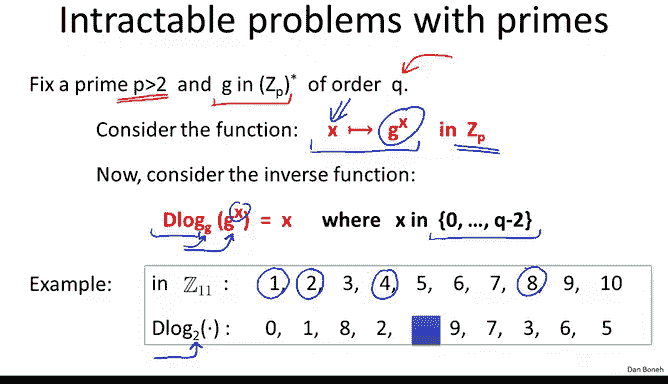
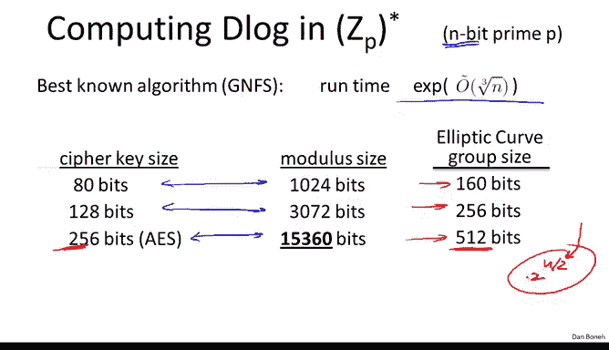
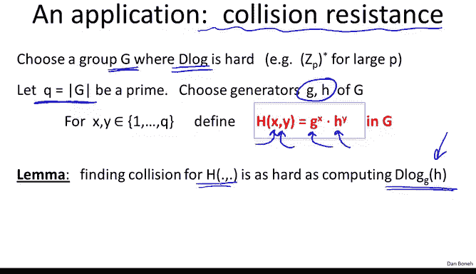
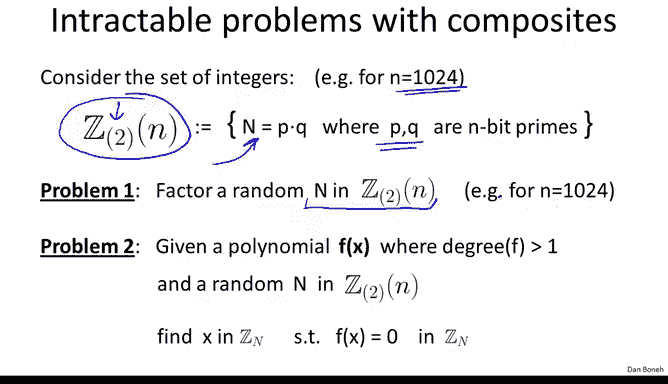

# 斯坦福大学《密码学｜Cryptography 1》中英字幕 - P55：55_05_02_难解问题.zh_en - GPT中英字幕课程资源 - BV1Rf421o79E

In this module we're going to look at some hard problems that come up in the context of modular arithmetic。

 These problems are going to be the basis of the cryptoystems that we build next week。

 So first I'd like to mention that there are many easy problems in modular arithmetic。 for example。

 if you give me an integer N and you give me an element X in Z N finding the inverse of x is actually very easy using the Euclan algorithm Similarlyly if you give me a prime P and you give me some polynomial f then finding an element in Zp that's a root of this polynomial is also relatively easy and in fact there's an efficient algorithm that can do it in linear time in the degree of the polynomial So at least for low degree polynomials finding root of these polynomials modular primes is actually quite easy。

However， many problems in modular arithmetic are actually quite difficult。

 and as I say the difficult， these difficult problems form the basis of many public key crypto systemsems。

😊。

So let's look at some classic hard problems， module O primes， so fix some large prime P。

 so think of P as some 600 digit prime and let's fix some element G in ZP star and let's assume that the order of this element G happens to be a number Q。

Now consider the exponuniation function that simply maps a number x to the element G to the x。

We showed in the last segment that this function is easy to compute using the repeated squaring algorithm。

 so in fact computing G to the x can be done quite efficiently。

 but now let's look at the inverse question， so the inverse problem is basically given G to the x now I want you to find its logarithm namely the value x。

As I said over the reals， over the real numbers， given G to the x find x is exactly the definition of the logarithm function。

 but here I ask you to find the logarithm modo a prime P。

 so this problem is called the discrete logarithm problem D log and I'll say that the discrete logarithm of G to the x based G。

😊，Is basically the exponent x so the discrete logarithm of G to the x is x。

 So our goal is to output some exponent x in 0 to q minus2 that happens to be the logarithm of G to the x。

😊，So let's look at an example， suppose we look at the integer's modular 11 and here I wrote down the discrete log function in Z11 base 2。

 so let's look at how this function behaves。 so first of all the discrete logarithm of1 is 0 because2 to the0 is equal to1。

Similarly， discrete logarithm of 2 is one because2 to the1 is equal to2。

 the discrete logarithm of 4 is2 because2 squared is equal to 4。

 the discrete logarithm of 8 is 3 because 2 cubed is equal to8 and so on and so forth。

So here I wrote down the discrete logarithm values for you and let me ask you a puzzle。

 what's the discrete logarithm of 5 modular 11， see if you can calculate it yourself。

And so the answer is four because two to the four is equal to 16 and 16 is equal to 5 modo 11。Okay。

 so this says that the discrete logarithm base two of5 is this number four。

Now I can tell you that the discrete log function in general is actually quite difficult to compute。

 of course for small primes it's quite easy， you can just make a table and you can read off the discrete log values。

 but if the prime P happens to be a large number say a 2000 bit number。

 then in fact computing discrete log is quite difficult and we don't have good algorithms to do it。😊。

So let's define the discrete log problem more generically。

Instead of just focusing on the group ZP star， let's abstract and look at a generic group G。

 so we have a financially group with a generator G。

 all that means is that this group just consists of all the powers of G so we take all the powers up to the order in this case the order of G happens to be Q。

 so we take all the powers of G and those powers actually make up the group capital G。

Now we're going to say that the discrete log problem is hard in the group G if in fact no efficient algorithm can compute the discrete log function。

 So what do we mean by that what we mean is if you choose a random element G in the group capital G and you choose a random exponent x if I give the algorithm G and G to the x of course I also have to give it the description of the group so I give it the description of the group G and the order of the group。

 but the primary elements are G and G to the x， the probability that the algorithm will actually compute a discrete log is negligible so this if this is true for all efficient algorithms then we say that the discrete log problem is hard in this group capital G。

And again， the reason we say that is because no efficient algorithm is able to compute discrete log with non negligible probability。

So as I mentioned there we have a couple of candidate examples for groups where discrete log is hard。

 the canonical example is ZP star， this is actually the example that Diffkin Elman came up with in 1974。

 but it turns out there are other candidate groups where the discrete log problem happens to be hard and I think I already mentioned that one candidate is what's called the elliptic curve group or rather the set of points on an elliptic curve。

 I'm not going to define that here， but as I said if you'd like me to talk about elliptic curve cryptography I can do that actually in the very last week of the class。

😊，So these are two groups where the discrete log problem is in fact believed to be hard。

 but it so happens that the discrete log problem actually is harder as far as we know on elliptic curves than it is in ZP star in other words。

 if you give me equal size problems one set in the group ZP star and one set in an elliptic curve group。

 the problem set in the elliptic curve group is going to be much harder than the problem in ZP star again assuming these two problems are of the same size and because the elliptic curve problem。

 the discrete log elliptic curve problem is harder than in ZP star。

 this means that we can use smaller parameters when using elliptic curves than we can for ZP star and as a result the result of systems with elliptic curves are going to be more efficient because the parameters are smaller and yet the attacker's job is as hard as for a much larger prime in ZP star。

So to make that concrete I'll tell you that in ZP star there's what's called a subexential algorithm for discrete log。

 so I think I already mentioned this if you have an n bit prime。

 this algorithm will run in a roughly Q root of n time。

 in fact there are many other terms in the exact running time of this algorithm。

 but the dominant term is Q roots of the number of bits in the prime so Q root of n and because of this algorithm you see that if we want the discrete log problem to be hard。

 as hard as it is to break a corresponding symmetric key， we have to use relatively large modized P。

Now in contrast， if you look at an elliptic curve group。

 the numbers look much better and then in fact on an elliptic curve group。

 the best algorithm for discrete screen log that we have runs in time E to the n over 2。

 so this is what we would call a proper exponential time algorithm because for a problem of size n。

 the running time is roughly e to the n， it's an exponential in n。

 not an exponential and cube root of n。And because the problem is so much harder， again。

 the best algorithm we have actually takes exponential time， you notice that on elliptic curves。

 we can use much smaller parameters and still remain secure， by the way。

 the reason the ellipto curve size is exactly twice the symmetric key size is exactly because of this factor of  two in the exponent here。

 so we have to double the size of the ellipto curve for the problem to actually take e to the end time。

And actually， I made a small typo here in that this is actually supposed to be2 to the n over  two。

 but the exact base of the logarithm doesn't really matter。

So I think I mentioned before that because the parameters are smaller with elliptic curves than they are with ZP star。

 there's a slow transition from doing crypto modlo P to doing crypto over elliptic curves。And again。

 I'll mention that if you want me to describe aiptic curves in more detail。

 I can do that in the last week of the class。So now way understand what the discrete log problem is。

 let me give you a direct application of the hardness of discrete log。

 and in particular let's build a collision resistant hash function from the discrete log problem。

So let's choose some group capital G where the discrete log problem is hard。

 so if you like you can think of capital G as the group Zp star and let's assume that the group capital G has prime order Q。

 so Q is some prime number that happens to be the order of G。

 the number of elements in group capital G。Now to define our hash function。

 what we'll do is we'll choose two elements in the group capital G， let's call them G and H。

 and then we'll define the hash function as follows。

 the hash function on input X and y will output an element in G defined as G to the x times H to the y。

 that's it。Okay， very， very， very simple a hash function。

 and if you recall we even talked about this hash function when we talked about compression functions before。

😊，I want to show you that this function capital H is in fact collision resistant in the sense that finding a collision for capital H is as hard as computing discrete log in the group capital G Okay。

 so in particular， if you can find the collision for capital H。

 you can compute a discrete log of H based G。😊，And since we said that discrete log in the group capital G is hard。

 computing the discrete log should be difficult and therefore finding collisions for capital H is going to be difficult。

 Okay so let's see how we do this。 it's actually a very cute proof。

 What we' do is we'll do the following supposeupp we're given a collision on the function capital H So we're given two distinct pairs x0 y0 and x1 y1 that happen to collide on the function capital H What does it mean that they collide on the function capital H What it means is if I evaluate the function capital H at x0 y0 and x1 y1。

 I'll get a collision namely I'll get on equality。

Well， so now I can just do a little bit of manipulation and you see that this means I just move all the Gs to one side and all the h is to the other side。

 so this means that g to the x0 minus x1 is equal to H to the y1 minus y0 this is just a simple manipulation Now I can raise both sides to the power of y1 minus y0 In other words。

 I'm taking a y1 minus y0 root of both sides。So one side will become simply H and the other side will become G to the power of this fraction x0 minus x1 divided by y1 minus y0。

 but now look at what we just got basically we expressed H as G to some known power basically all we did is just division and boom we've done we've just expressed H as G to some known power so we've computed the discrete log of H based G。

So you might be wondering what does this division in the exponent mean。

 what does it mean to divide by y1 minus y0 and the exponent。

 well what it means is basically we compute the inverse of y1 minus y0 modular Q。

And then we multiply the result by x0 minus x1， and that gives us the exponent in the clear。

 and so we've just learned the discrete log of H based G。

So this also shows you why we wanted Q to be prime because we need to make sure that y1 minus y0 is always invertible so in fact we know that when we work mod O prime。

 everything is invertible except for0。So that actually raises a several points。

 what happens if y1 minus y0 actually happens to be equal to0， if that's the case。

 then we're not going to be able to get to discrete log because we won't be able to divide by zero。

But if you think about this for a minute， you realize， well， let's see here， if y1 minus y0 equals 0。

 that means that y1 is equal to y0。But if y1 is equal to y0， just look at this equation here。

 that means that， well， that necessarily means that x0 is also equal to x1。Yeah。

 this takes a minute to convince yourself if y0 is equal to y1。

 basically these two terms simply cancel out。And then we get that x0 is equal to x1。

But then if x0 is equal to x1 and y0 is equal to y1， what you gave me is not a collision。

 you simply gave me the same pair twice， so that's cheating。

 so that's not considered a collision and therefore you know I don't need to find discrete log but if you give me a collision necessarily y0 is not going to be equal to y1 and then as a result I'm going to get the discrete log of G base H。

And as we said， since discrete log is believed to be hard in the group capital G。

 this means that this very， very simple function capital H must be collision resistance。

So this is a very elegant example of a reduction from finding collisions to computing discrete log。

I should tell you， by the way， that this function is not really used。

 even although though this function has a nice proof of collision resistance。

 it's not really used because it's relatively slow。

 essentially on every hash you have to compute two exponiations and that's much， much。

 much slower than say functions like shot to 56 and other kind of ad hoc collision resistant hash functions。

😊，Okay， so that's what I wanted to say about intractable problems， modulular primes。

 now let's look at some intractable problems， modular composites。So here we're going to say， again。

 let's look at say 1024 bit numbers and let's define the set as Z sub2 n。

 this is going to be the set of all integers that happen to be a product of two primes where those two primes are n bit primes。

Okay， so the two here corresponds to the fact that the numbers in this set basically have two prime factors and those two prime factors are roughly the same size。

 they're both n bit primes。So there are two classic intractable problems in the set。

 the first problem is if I choose a random integer in the set Z2N， the problem is factor it。

And already this is quite a difficult problem for 1024 bits， although it hasn't been done yet。

 it's very likely that numbers of this magnitude will be factored soon。

 and so the recommended value these days is actually to use 2048 bit numbers that's still beyond our reach and those are numbers that we still cannot factor。

Another example of intractable problem modo composites is if I give you some polynomial that's non nonlinearar。

 its degrees bigger than1， and I give you some random composite in the said DQN。

 your goal is to find a root of this polynomial， find an x that happens to be a root of this polynomial and again we don't know how to do that。

 of course at the degrees is equal to1 that just amounts the solving linear of equations and we already know that that's easy。

 but the minute the degree becomes non nonlinearar。

 we don't know how to solve this modo N without actually first factoring the modulus and then computing groups。

So there are some systems， for example， RSA that depend on the hardness of this particular problem for specific polynomials。

 which we're going to see next week。And just as an example， I should mention that， for example。

 taking square roots or cube roots modlo at random composite than Z2N is believed to be difficult。

So there's actually quite a bit known about the factoring problem。 It's actually a very old problem。

 Al the Greeks were interested in factoring， but Gaus actually has a wonderful。

 wonderful quote that talks about the problem of factoring and the problem of primality testing。

 So in his famous dissertation from 1805， he writes the problem of distinguishing prime numbers from composite numbers。

 this is what's called primality testing。 and the problem of resolving the ladder namely composites into their prime factors is known to be one of the most important and useful and arithmetic。

 So he had the foresight to realize that these are extremely interesting problems。

 These are computer science problems， essentially， how do we test a number as prime。

 how do we factor a number if it's not a prime， if it's a composites and already Gaus realized that these are extremely extremely important and interesting problems and now these days these problems are actually used on the web all over the place。

 So let's see So in fact， testing if a number is prime has been completely solved。 we now know。😊。

Clearly how to do it， using efficiently using a randomized algorithm。

 and we even know how to do it using a deterministic algorithm。

Factoring numbers factoring composite into their prime factors。

 this is still believed to be a difficult problem。 I would encourage you actually to think about it。

 It's a wonderful problem to think about if any of you can solve it。

 if any of you can come up with an algorithm to factor composites into prime factors again as I said it's instant fame in the crypto worldd and it would have tremendous impact on security of the web in general so it's a fun problem to think about let me tell you what's known about the problem of factoring so the best algorithm that we have is called a number field sve again it's running time is one of these exponentials by the cube root of an exponential which is why the composites has to be quite large for the problem to be difficult although the current world record is really just factoring 768 bit number this is called the RSA 768 number it's a challenge number that was recently factored the number is about 200 digits and already factoring this number took an enormous amount of work it took about two years on hundreds of machines。

😊，And finally they were able to factor this number and the estimate is that actually factoring a 1024 bit number is about 1000 times harder than factoring RSA 768。

 so instead of two years it will take 2，000 years but of course computers are getting faster。

 we have more cores at our disposal， we have more computers and so this factor of 1000 assuming Moore's law and so on really just means a decade。

 computers get faster by about a factor of 1000 every decade so it's very likely that within the next decade will see a factorization of 1024 bit number which would be the end of 1024 bits being used for public e cryptography。

So that's the state of the art in the factoring world and this concludes this module。

 I'll mention that if you want to read more about any of the topics that we discussed。

 there is a good book on the internet， it's a free book that you can download written by Victor Schuppin in particular。

 the topics that we discussed are covered in chapters 1 to 4。

 11 and 12 so I would encourage you to take a look at that and hopefully that will help with understanding the material。

And next week we'll start building cryptoyem using the topics we just learned about。

