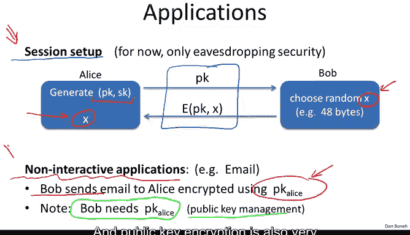
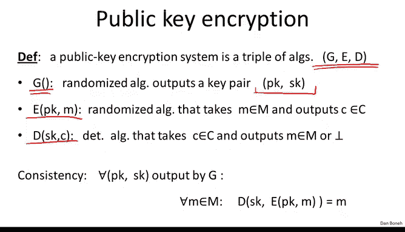
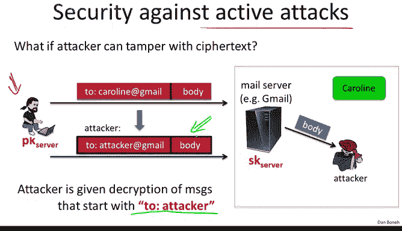
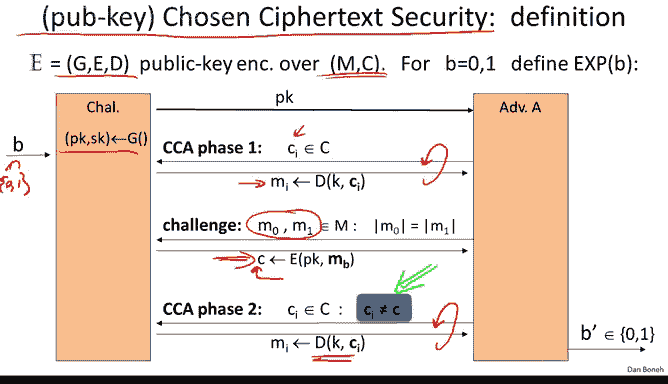

# 斯坦福大学《密码学｜Cryptography 1》中英字幕 - P56：56_06_01_定义与安全性.zh_en - GPT中英字幕课程资源 - BV1Rf421o79E

Last week we learned a number of theories that's needed for public key encryption this week we're going to put this knowledge to work and we're going to construct a number of secure public key encryption schemes。

 but first we need to define what is public key encryption and what does it mean for public key encryption to be secure so let me remind you that in a public key encryption scheme there is an encryption algorithm which we as usual denote by E and there's a decryption algorithm which we denote by D however here the encryption algorithm takes a public key while the decryption algorithm takes a secret key。

This pair is called a key pair， and the public key is used for encrypting messages while the secret key is used for decrypting messages。

So in this case， a message M is encrypted using the public key and what comes out of that is the Cyphertt C。

And similarly， the ciphertext is fed into the decryption algorithm and using the secret key。

 what comes out of the decryption algorithm is the original message M。😊。

Now public key encryption has many applications last week we saw the classic application which is session setup namely key exchange and for now we're just looking at key exchange that is secure against eavesdropping only and if you remember the way the protocol works basically Alice what she would do is she would generate a public key secret key pair she would send the public key to Bob Bob will generate a random X which is going to serve as their shared secret and then he sends x encrypted to Alice encrypted under her public key。

 Alice can decrypt recover X and now both of them have this shared secret X which they can use to communicate securely with one another the attacker of course all he gets to see is just the public key and the encryption of x under the public key from which he should not be able to get any information about X and we're going to define that more precisely to understand what it means to not be able to learn anything about X。

Public key encryption actually has many other applications。 for example。

 it's very useful in noninteractive applications。 So think of an email system for example。

 So here Bob wants to send mail to Alice and as Bob sends the email the email passes from mail relay to mail relay until finally it reaches Alice at which point Alice should decrypt the way the email system is set up is designed for kind of non-interactive settings where Bob sends the email and then Alice is supposed to receive it and Alice should not need to communicate with Bob in order to decrypt the email So in this case because of the non-interactiveivity。

 there's no opportunity for setting up a shared secret between Alice and Bob So in this case what would happen is Bob basically would send the email encrypted using Alice's public key So he sends the email anyone in the world can send the email encrypted to Alice encrypted using her public key when Alice receives this email she uses her secret key to decpt the ciphertext and recover the plain text message。

 Of course the one caveat in a system like this is that。😊。

Bob needs to somehow obtain Alice's public key。So for now we're just going to assume Bob already has Alice's public key。

 but later on actually when we talk about digital signatures we're going to see how this can actually be done very efficiently using what's called public key management and as I said we'll actually get back to that at a later time but the main thing I want you to remember is that public key encryption is used for a session setup this is very common on the web where public key encryption is used to set up a secure key between a web browser and a web server。

And public key encryption is also very useful for noninactive applications where anyone in the world non interactiveactively needs to send a message to Alice。

 they can encrypt the message using Alice's public key。

 and Alice can decrypt and recover the plain text。😊。

So let me remind you in a bit more detail what a public key encryption system is。

 well it's made up of three algorithms， G E and D， G is called a key generation algorithm。

 basically what it will do is it will generate this key pair， the public key and the secret key。

 as written here G takes no argument， but in real life G actually does take an argument called the security parameter。

 which specifies the size of the keys that are generated by this key generation algorithm。

Then there are these encryption algorithms， as usual。

 they take a public key and a message and produce a ciphertext and a decryption algorithm that takes the corresponding secret key and a ciphertext and produces their corresponding message and as usual for consistency we say that if we encrypt a message under a given public key and then decpt with a corresponding secret key。

 we should get the original message back。😊。

Now what does it mean for a public key encryption to be secure。

 I'm going to start off by defining security against eavesdropping and then we're going to define security against active attacks。

So the way to define security against eavesdropping is very similar to the symmetric case we've already seen this last week so I'm going to go through this quickly just as a review basically the attack game is defined as follows we define these two experiments experiment0 and experiment1 in either experiment the challenger is going to generate a public key in a secret key pair is's going to give the public key to the adversary the adversary is going to output two messages M0 and M1 of equal length and then what he gets back is either the encryption of M0 or the encryption of M1 experiment0 he gets the encryption of M0 in experiment1 he gets the encryption of M1 and then the adversary is supposed to say which one did he get did he get the encryption of M0 or did he get the encryption of M1。

So in this game， the attacker only gets one ciphertext。

 this corresponds to an eavdropping attack where he simply eavesdroroppped on that Cyphertex C。

 and now his goal is to tell whether the Cypherex C is the encryption of M0 or M1 no tampering on the Cyphert C is allowed just yet。

And as usual， we say that a public key encryption scheme is semantically secure if the attacker cannot distinguish experiment 0 from experiment1。

 in other words， he cannot tell whether he got the encryption of M0 or the encryption of M1。😊。

Before we move on to active attacks， I wanted to mention a quick relation between the definition that we just saw and the definition of eavesdropping security for symmetric ciphers if you remember when we talked about eavdropping security for symmetric ciphers we distinguished between the case where the key is used once and the case when the key is used multiple times and in fact we saw that there's a clear separation for example the one-time pad is secure if the key is used to encrypt a single message but is's completely insecure if the key is used to encrypt multiple messages and in fact we had two different definitions if you remember we had a definition for one time security and then we had a separate definition which was stronger when the key was used multiple times。

😊。

The definition that I showed you on the previous slide is very similar to the definition of one time security for symmetric ciphers and in fact it turns out that for public key encryption。

 if a system is secure under one time key in a sense it's also secure for a manytime key so in other words。

 we don't have to explicitly give the attacker the ability to request encryptions or messages of his choice because he could just create those encryptions all by himself。

 he is given the public key and therefore he can by himself encrypt any message he likes。😊。

As a result， any public key secret key pair in some sense inherently is used to encrypt multiple messages because the attacker could have just encrypted many。

 many messages of his choice using the given public key that we just gave him in the first step。😊。

And so as a result， in fact， the definition of one time security is enough to imply manytime security。

 and that's why we refer to the concept as indistinguishability under a chosen plaintiff attack。😊。

So this is just a minor point to explain why in the settings of public encryption。

 we don't need a more complicated definition to capture eavesdropping security。

Now that we understand eavdropping security， let's look at more powerful adversaries that can actually mount active attacks。

So in particular let's look at the email example， so here we have our friend Bob who wants to send mail to his friend Caroline and Caroline happens to have an account of Gmail and the way this works is basically the email is sent to the Gmail server。

 encrypted， the Gmail server decryptps the email looks at the intended recipients。

 and then if the intended recipient is Caroline it forwards the email to Caroline。

 if the intended recipient to the attacker， it forwards the email to the attacker。

This is similar to how Gmail actually works because the sender would send the email encrypted over SSL to the Gmail server。

 the Gmail server would terminate the SSL and then forward the email to the appropriate recipients。

Now suppose Bob encrypts the email using a system that allows the adversary to tamper with a ciphertext without being detected。

 for example， imagine this email is encrypted using counter mode or something like that。

Then when the attacker intercepts this email he can change the recipient so that now the recipient says attacker atgmail。

com and we know that for counter mode for example， this is quite easy to do。

 the attacker knows that the email is intended for Caroline。

 he's just interested in the email body so he can easily change the email recipient to be attacker at Gmail。

com and now when the server receives the email he will decrypt it。

 see that the recipient is supposed to be attacker and for the body to the attacker and now the attacker was able to read the body of the email that was intended for Caroline。

So this is the classic example of an active attack。

 and you notice what the attacker could do here is it could decrypt any ciphertext where the intended recipient is two colon attackers。

 so any ciphertext where the plain text begins with the words2 colon attacker。😊。

So our goal is to design public key systems that are secure。

 even if the attacker can tamper with Cyphertext and possibly decrypt certain ciphertexts。And again。

 when to emphasizephas that here the attacker's goal was to get the message body。

 the attacker already knew that the email is intended for Caroline and all he had to do was just change the intended recipient。

So the stampering attack motivates the definition of chosen Cypherex security。

 and in fact this is the standard notion of security for public key encryption。

So let me explain how the attack the game proceeds and as I said。

 our goal is to build systems that are secure under this very very conservative notion of encryption so here we have an encryption scheme GED and let's say thats defined over a message space and a Cyphertext m comma C and as usual we're going to define two experiments experiment zero and experiment1 so B here says whether the challenger is implementing experiment zero or experiment1 the challenger begins by generating a public key in a secret key and then he gives the public key to the adversary。

😊，Now the adversary can say well here are a bunch of Cyphertexts。

 please decrypt them for me so here the adversary submits Cyphertext C1 and he gets the decryption of Cyphertex C1 namely M1 and he gets to do this again and again so he submits Cyphertex C2 and he gets the decryption which is M2 Cyphert C3 and he gets an decryption M3 and so on and so forth finally the adversary says this querying phases over and now he submits basically two equal length messages M0 and M1 is normal and he receives in response the challenge Cyphertext C which is the encryption of M0 or the encryption of M1 depending on whether we're an experiment 0 and experiment 1。

Now the adversary can continue to issue the Cyphertex queries so he can continue to issue decryption request so he submits a Cyphertext and he gets a decryption of that Cyphertext。

 but of course now there has to be a caveat if the attacker could submit arbitrary Cyphertex of his choice。

 of course he could break the challenge what he would do is he would submit a challenge Cyphertex C as a decryption query and then he would be told whether in the challenge phase he was given the encryption of M0 or the encryption of M1 as a result we put this limitation here that says that he can in fact submit any Cyphertex of this choice except for the challenge Cyphertext。

So the attacker could ask for the decryption of any Cyphertex of his choice other than the challenge Cyphertext。

 and even though he was given all these decryptions。

 he still shouldn't be able to tell whether he was given the encryption of M0 or the encryption of M1。

So you notice this is a very conservative definition。

 it gives the attacker more power than what we saw on the previous slide and the previous slide the attacker could only decrypt messages where the plaintiff textex began with the words two colon attacker here we're saying the attacker can decrypt any Cypherticus of this choice as long as it's different from the challenge Cyphert at sea。

And then his goal is to say whether the challenge Cyphertex is the encryption of M0 or the encryption of M1 and as usual if he can't do that。

 in other words， his behavior in experiment 0 is basically the same is behavior and experiment1。

 so he wasn't able to distinguish the encryption of M0 from the encryption of M1 even though he had all this power。

 then we say that the system is chosen Cytex secure， CCA secure， and sometimes there's an acronym。

 the acronym for this is indistinguishability under a chosen Cytex attack。

 but I'm just going to say CCA security。😊。

So let's see how this captures the email example we saw before。

 so suppose the encryption system being used is such that just given the encryption of a message。

 the attacker can change the intended recipient from to Alice， say to to Charlie。

Then here's how we would win the CCA game， while in the first step he's given the public key。

 of course。

And then what the attacker will do is you would issue two equal length messages。

 namely in the first message， the body is zero in the second message， the body is one。

 but both messages are intended for Alice。And in response， he would be given the challenge At C。Okay。

 so now here we have our channel Cypher X C。Now what the attacker is going to do is he's going to use his ability here to modify the intended recipient。

 and he's going to send back a ciphertext C prime， where C prime is the encryption of the message to Charlie with body being the challenge body B。

So be remember is' either zero or one。Now because the plaintiffex is different。

 we know that the Cyphertex must also be different so in particular C prime must be different from the challenge Cyphertex C yeah so the C prime here must be different from C and as a result。

 the poor challenger now has to decrypt by definition of the CCA game。

 the challenger must decrypt any Cyphertex that's not equal to the challenge Cyphertex so the challenger decrypt give the adversary M prime basically he gave the adversary B and now the adversary can output the challenge B and he wins the game with advantage1 so he is advantage with this particular scheme is one so simply because the attacker was able to change the challenge Cyphertext from one recipient to another that allows him to win the CCA game with advantage one。

So as I said， Joseph's F security turns out actually is the correct notion of security for public key encryption systems。

 and it's a very， very interesting concept right basically somehow even though the attacker has this ability to decrypt anything he wants。

😊，Other than the challenge Hyphertex， still， he can't learn what the challenge hyperphertex is。

And so our goal for the remainder of this module and actually the next module as well is to construct CCA secure systems。

 it's actually quite remarkable that this is achievable and I'm going to show you exactly how to do it and in fact those CCA secure systems that we build are the ones that are used in the real world and every time a system has tried to deploy public encryption mechanism that's not CCA secure。

 someone has come up with an attack and was able to break it and we're going to actually see some of these example attacks actually in the next few segments。

😊。

