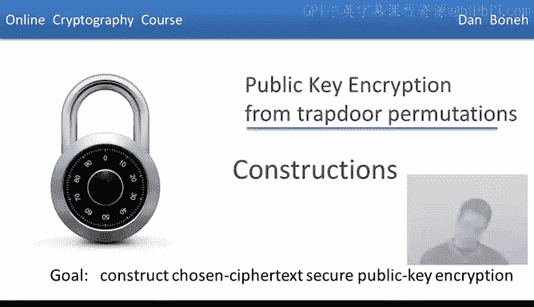
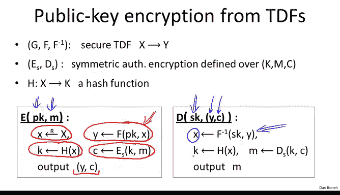
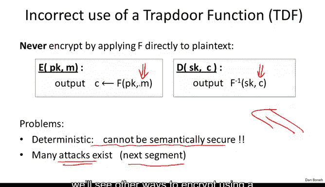

# 斯坦福大学《密码学｜Cryptography 1》中英字幕 - P57：57_06_02_构造方法.zh_en - GPT中英字幕课程资源 - BV1Rf421o79E

In the last segment， we explained what is a public key encryption system。

 and we define what it means for a public key encryption system to be secure。

If you remember we required security against active attacks and in particular we defined chosen Cyte security as our goal this week we're going to construct two families of public encryption systems that are chosen Cyte secure and in this segment we're going to start by constructing public key encryptions from a concept called a trapor permutation。

So let's start by defining a general concept called a trapor function So what is a trapor function Well a trapor function basically is a function that goes from some set X to some set y and it's really defined by a triple of algorithms。

 there's a generation algorithm the function F and the inverse of the function F so the generation algorithm。

 basically what it does when you run it it will generate a key pair， a public key in a secret key。

 the public key is going to define a specific function from the set X to the set Y and then the secret key is going to define the inverse function now from the set y to the set X。

 So the idea is that you can evaluate the function at any point using a public key PK and then you can invert that function using the secret key SK。

So what do I mean by inversion more precisely if we look at any public key and secret key pair generated by the key generation algorithm G。

 then it so happens that if I evaluate the function at the point X and then I evaluate the inverse at the resulting point I should get the original point x back so the picture you should have in your mind is there's this big set X and this big set Y。

😊。

And then this function will map any point in x to a point in y。

 and this can be done using the public key， so again， any point in x can be mapped to a point in y。

 and then if someone has the secret key， then basically they can go in the reverse direction by applying this secret key SK。

So now that we understand what a trapor function is。

 let's define what it means for a trapor function to be secure and so we'll say that this triple GFF inverse is secure。

 if in fact this function FPK is what's called a one- way function let me explain what is a one- way function the idea is that basically the function can be evaluated at any point but inverting it is difficult without a secret key asK So let's define that more precisely as usual we define that using a game So here we have our game between the challenger and the adversary and the game proceeds as follows basically the challenger will generate a public key in a secret key and then it will generate a random X。

😊，It will send a public key over to the adversary and then it will evaluate the function at the point X and send the resulting y also to the adversary。

 So all the adversary gets to see is just a public key which defines what the function is。

 and then it gets to see the image of this function on a random point X and his goal is basically to invert a function at this point y so he outputs some x prime and we say that the trapor function is secure。

 if the probability that the adversary inverts the given point Y is negligible in other words。

 given y the probability that the adversary able to output a pre-im of y is in fact a negligible probability and if that's true for all efficient algorithms。

 then we say that the trapor function is secure。😊，So again， abstractly。

 it's a really interesting concept in that you can evaluate the function in the forward direction very easily。

 but then no one can evaluate the function in the reverse direction unless they have this trapor。

 the secret keySK， which then all of a sudden lets them invert the function very， very easily。😊。

So using the concept of a trapor function， it's not too difficult to build a public encryption system and let me show you how to do it。

So here we have our traptor function， Gf and F inverse。

 the other tool we're going to need is a symmetric encryption scheme and I'm going to assume that this encryption scheme is actually secure against active attacks。

 so in particular I needed to provide authenticated encryption。😊。

Notice that the symmetric encryption system takes keys in K and the trapor function takes inputs in x。

 those are two different sets and so we're also going to need a hash function that goes from x to K in other words it maps elements in the set x into keys for the symmetric encryption system。

And now once we have these three components， we can actually construct the public key encryption system as follows。

 so the key generation for the public encryption system is basically exactly the same as the key generation for the trapor function。

 so we run G for the trapor function， we get a public key in a secret key and those are going to be the public key in secret keys for the public encryption system。

Now how to encrypt and decrypt， let's start with encryption。

 so the encryption algorithm takes a public key and a message is input。

So what it will do is it will generate a random x from the set capital X。

 it will then apply the trapor function to this random x to obtain y。

 so y is the image of x under the trapor function and it will go ahead and generate a symmetric key by hashing X so this is a symmetric key for the symmetric key system and then finally it encrypts the plain X message M using this key that it just generated and then it outputs the value Y that it just computed which is the image of X along with the encryption under the symmetric system of the message M。

So that's how encryption works， and I want to emphasize again that the trapor function is only applied to this random value X。

 whereas the message itself is encrypted using a symmetric key system using a key that was derived from the value X that we chose at random。

So now that we understand encryption， let's see how to decrypt。

 well the decryption algorithm takes a secret key as inputs， and the Cyphertex。

 the Cyphertex itself contains two components， the value Y and the value C。

So the first step we're going to do is we're going to apply the inverse transformation。

 the inverse trapor function to the value Y， and that'll give us back the original x that was chosen during encryption。

So now let me ask you， how do we derive the symmetric decryption key K from this x that we just obtained？

Well， so that's an easy question， we basically hash X again that gives us k just as during encryption。

 and now we have the symmetric encryption key we can apply the symmetric decryption algorithm to decrypttocipher X C。

 we get the original message M and that's what we output。

So that's how the public key encryption system works where this trap door function is only used for encrypting some sort of a random value X。

 and the actual message is encrypted using the symmetric system。

So in pictures here we have the message M obviously the plain text could be quite large。

 so here we have the body of the Cyphertex which can be quite long。

 is actually encrypted using the symmetric system and again I emphasize that the key for the symmetric system is simply the hash of x and then the header of the cphertex is simply this application of the trappedor function to this random X that we picked。

😊，And so during decryption， what happens is we first decrypt the header to get x。

 and then we decrypt the body using the symmetric system to actually get the original plain X M。😊。

So as usual when I show you a system like this， obviously you want to verify that encryption in fact is the inverse of encryption。

 but more importantly you want to ask why is this system secure and in fact there's a nice security theorem here that says that if the trapor function that we started with is secure。

 in other words it's a one-way function， if the adversary doesn't have the secret key。

 the symmetric encryption system provides authenticated encryption and the hash function is a random oracle which simply means that it's a random function from the set X to the set of keys K so a random oracle is some sort of an idealization of what a hash function is supposed to be in practice of course when you come to implement a system like this you would just use shot 256 or any of the other hash functions that we discussed in class。

So under those three conditions， in fact the system that we just described is chosen Cyteex secure。

 so it is CCA secure， the little RO here just den notes the fact that security is set in what's called a random oracle model but that's a detail that's actually not so important for our discussion here。

 what I want you to remember is if the trapor function is in fact a secure trapor function。

 the symmetric encryption system is secure against tampering it provides authenticicated encryption and H is in some sense a good hash function it's a random function which in practice you would just use shot 56。

 then in fact the system that we just showed is CCA secure is chosen Cyex secure。😊。

I should tell you that there is actually an ISO standard that defines this mode of encryption of public encryption。

 ISO stands for international standards organization。

 so in fact this particular system has actually been standardized and this is a fine thing to you。

 so I'll refer to this as the ISO encryption in the next few segments。

To conclude this segment， I want to warn you about an incorrect way of using a trapor function to build a public encryption system and in fact。

 this method might be the first thing that comes to mind。

 and yet it completely insecure So let me show you how not to encrypt using a trapor function Well the first thing that might come to mind is well let's apply the trapor function directly to the message M。

 So we encrypt simply by applying the function to the message M。

 and then we decrypt simply by applying f inverse to the Cypher Xc to recover the original message M so functionally this is in fact。

 the encryption is the inverse of encryption。 and yet this is completely insecure for many。

 many different reasons， the easiest way to see that this is insecure is that its simply this is deterministic encryption。

 in notice there's no randomness being used here when we encrypt the message M and since it is deterministic。

 it cannot possibly be semanically secure but in fact， as I said。

 when we instantiate this trapor function with particular implementations for example。

 with the RSA trapor function then there。an many attacks that are possible on this particular construction and so you should never ever。

 ever use it and I'm going to repeat this throughout this module and in fact in the next segment I'll show you a number of attacks on this particular implementation。

😊，Okay， so what I would like you to remember is that you should be using an encryption system like the ISO standard and you should never apply the trapor function directly to the messageM。

 although in the next segment we'll see other ways to encrypt using a trapor function that are also correct。

 but this particular method is clearly clearly incorrect。

Okay， so now that we understand how to build public key encryption given a trapor function。

 the next question is how to construct trapor functions and we're going to do that in the next segment。

