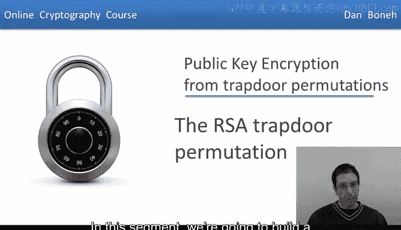
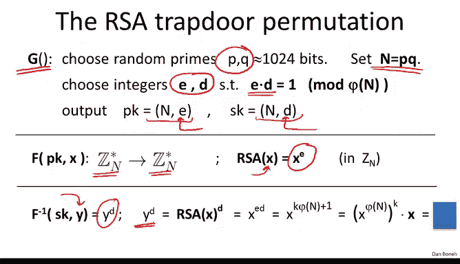
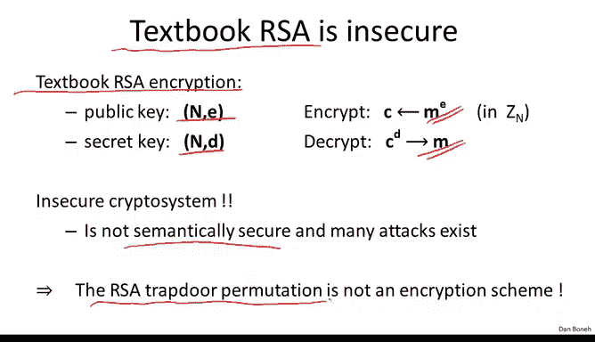

# 斯坦福大学《密码学｜Cryptography 1》中英字幕 - P58：58_06_01_RSA陷门置换.zh_en - GPT中英字幕课程资源 - BV1Rf421o79E

In the previous segment we saw how to build public key encryption from trapor functions。

 in this segment we're going to build a classic trap door function called RSA。

But first let's quickly review what a trapor function is so we recall recall that a trapor function is made up of three algorithms。

 there's a key generation algorithm， the function itself and the inverse of the function。

 the key generation algorithm outputs a public key in a secret key and in this case in this lecture the public key is going to define a function that maps the set x onto itself。

 which is why I call these things trapor permutations as opposed to trapor functions simply because the function maps x onto itself whereas a trapor function might map the set x to some arbitrary set y。

Now， given the public key， the function， as we say。

 basically defines this function from the set x to the set X。

 and then given the secret key we can invert this function。😊。

So this function F evaluates the function in the forward direction and this function F inverse。

 which means the secret keySK， computes f in the reverse direction。

Now we say that the trapor permutation is secure if the function defined by the public key is in fact a one way function。

 which means that it's easy to evaluate， but without a trap， the secret trap door。

 it's difficult to invert。

Before we look at our first example of a trapor permutation I want to do a quick review of some necessary arithmetic facts that we're going to need and in particular let's look at some arithmetic facts modular composites so here we have our modulus n which happens to be a product of two primes and you should be thinking of p andq is roughly equal size numbers so in particular P andq are both roughly on the size of square root of n so both are roughly the same size recall that we dennoted it by Zn the set of integers from0 to n minus-1 and we said that we can do addition and multiplication modular n we dennoted by Zn star instead of invertible elements in Zn so these are all the elements which have a modular inverse。

And we said that actually x is invertible if and only if it's relatively prime to n。Moreover。

 I also told you that the number of invertible elements in Zn star is denoted by this function phi of n。

 so phi of n is the number of invertible elements in Zn star and I told you that when n is a product of two distinct primes then in fact phi of n is equal to p minus1 times q minus1 and if you expand it out you see that this is really equal to n minus p minus q plus1 Now remember that I said that p andq are on the order of square root of n。

 which means that p plus q is also on the order of square root of n。

 which means that really phi of n is on the order of n minus two square root of n So in other words it's very。

 very close to n， basically subtracting square root of n from a number。

 this is from n is going to be a huge number in our case like 600 digits and so subtracting from a 600 digit number the square root of that 600 digit number namely a 300 digit number hardly affects the size of the number which means that p of n is really really really close to n and I want you to remember that because we'll actually be using this now。

And so the fact that5 n is really close to n means that if we choose a random element modo n。

 it's very， very， very likely to be in ZN star， so it's very unlikely that by choosing a random element in ZN will end up choosing an element that's not invertible so just remember that then in fact almost all elements in ZN are actually invertible。

😊，And the last thing that we'll need is oiler steerum， which we covered last week。

 which basically says that for any element x in Zn star， if I raise x to the power of 5n。

 I get 1 in Zn。So in other words， I get one modo n。

I'll say it one more time because this is going to be critical for what's coming again。

 x to the 5 of n is equal to one mod n。So now that we have the necessary background we can actually describe the RSA Traor permutation。

 This is a classic classic classic construction in cryptography it was first published in Scientific American back in 1977 this is a very well-known article in cryptography and ever since then this was 35 years ago the RSA Traor permutation has been used extensively in cryptographic applications for example SSL and TlS use RSA both for certificates and Fque exchange there are many secure email systems in secure file systems that use RSA to encrypt emails and encrypt files in the file system and there are many many。

 many other applications of the system so this is a very very classic cryptto construction and I'll show you how it works。

😊，I should say that RSA is named for its inventors， Ron Reves， Adi Shamir， and Lan Adelman。

 who were all at MIT at the time they made this important discovery。

So now we're ready to describe the RSA chapter permutation to do that。

 I have to describe the key generation algorithm， the function F and the function F inverse。

So let's see， so the way the key generation algorithm works is as follows。

 what we do is we generate two primes P and Q， each would be stay on the order of 1，000 bits。

 so roughly 300 digits。And then the RSA modulus is simply going to be the product of those two primes。

The next thing we do is we pick two exponents E and D such that e times d is1 modular 5 n what this means is that E and D first of all are relatively prime to5hi n and second of all theyre actually modular inverses of one another modular 5 n。

And then we output the public key as the pair N comma E and the secret key is the pair N comm D I should mention that the exponent E that the number E is sometimes called the encryption exponent and the exponent D is sometimes called the decryption exponent。

And you'll see why I keep referring to these as exponentialonents in just a second。

Now the way the RSC function itself is defined is really simple。

 for simplicity I'm going to define it as a function from Zn star to Zn star and the way the function is defined is simply given an input X。

 all we do is we simply take x and raise it to the power of E in ZN。

 so we just compute x to the E mod n， that's it。😊，And then to decrypt what we do is we simply given an input y。

 we simply raise y to the power of d modo n， and that's it so now you can see y I refer to E and D as exponents。

 they are the things that x and y are being raised to so let's quickly verify that f inverse really does invert the function f。

 so let's see what happens when we compute y to the D。

 so suppose y itself happens to be the RSA function of some value X。

In which case， what y to the d is is really Ra of x to the power of d Well x by itself is simply going to be x to the e modo n and therefore y to the D is simply x to the e times d modulular n again just using rules of exponation the exponents multiply so we get x to the E times d but what do we know about e times d e times d we said is one modo 5hi of n and what that means is there exist some integer such that e times d is equal to k times5 n plus1 This is what it means that e times d is1 modo5hi of n。

So we can simply replace e times d by k times 5 n plus 1。 so that's what I wrote here。

 So we have x to the power of k times 5 n plus 1。 but now again just using rules of exponiation。

 we can rewrite this as x to the power of 5 n to the power of k times x。

 this is really the same thing as k times 5 n plus 1 and the exponent I just kind of separated the exponent into its different components Now x to the5 of n by oiluler stem we know that x to the5 of n is equal to1。

 So what is this whole product here equal to。Well since x to the 5 of n is equal to 1。

1 to the k is also equal to 1 so this whole thing over here is simply equal to1 and what we're left with is x。

 so what we just proved is that if I take the output of the RSA function and raise it to the power of D。

 I get back x， which means that raising to the power of D basically inverts the RSA function。

 which is what we wanted to show。So that's it that's the whole description of the function we describe the key generation。

 the function itself which is simply raising things to the power of E modular n and the inversion function which is simply raising things to the power of D also modular n The next question is why is this function secure in other words。

 why is this function one way if all I have is just a public key but I don't have the secret key？😊。

And so to argue that this function is one way， we basically state the RSA assumption。

 which basically says that the RSA function is a one way permutation。

 and formerly the way we state that is that basically for all efficient algorithms a。

 it so happens that if I generate two primes P and Q， random primes P and Q。

 I multiply them to get the modulus n， and then I choose a random y in z and star。

 and now I give the modulus the exponent and this y to algorithm A。

 the probability that I'll get the inverse of RSA at the point y。

 namely I'll get y to the power of1 over E， that's really what the inverse is this probability is negligible。

So this assumption is called the RSA assumption， it basically states that RSA is a one rate permutation just given the public key。

 and therefore it is a trap door permutation because it has a trap door and makes this easy to invert for anyone who knows the trap door。

So now that we have a secure traptor permutation， we can simply plug that into our construction for public key encryption and get our first real worldorld public key encryption system and so what we'll do is we'll simply plug the RSA Traor permutation into the ISO standard construction that we saw in the previous segment so if you recall that construction was based on a symmetric encryption system that had to provide authenticated encryption and it was also based on a hash function that mapped while transfering it to the world of RSA it maps elements in theN into secret keys for the symmetric key system。

😊，And now the way the encryption scheme works is really easy to describe。

 basically algorithm G just runs the RSA key generation algorithm and produces a public key and a secret key。

 just as before。So you notice the public key contains the encryption exponent and the secret key contains a decryption exponent and the way we encrypt is as follows。

 well we're going to choose a random x in the N， we're going to apply the RSA function to this x。

 we're going to deduce a symmetric key from this x by hashing it so we compute H of x to obtain the keyK。

 and then we output this y along with the encryption of the message under the symmetric keyK。

And in practice， the hash function H would be just implemented using shot 256。

 and you would use the output of shot 2 56 to generate a symmetric key that could then be used for the symmetric encryption system。

So that's how we would encrypt and then the way we would decrypt is pretty much as we saw in the previous segment。

 where the first thing we would do is we would use the secret key to invert the header of the Cyphertex so we would compute RA inverse of y that would give us the value X then we would apply the hash function to X so that this would give us the key K。

 and then we would run the decryption algorithm for the symmetric system on the Cyphertext and that would produce the original message M。

And then we stated a theorem in the previous segment to say that if the RSC tractor permutation is secure。

 ES and DSS， the symmetric encryption scheme provides authenticated encryption and as we said H is this random oracle。

 it's kind of a random function from ZN to the keyspace。

 then in fact this system is chosen sphertex secure， and is's a good public key system to use。😊。

So now that we have our first example of a good public key system to use。

 I want to quickly warn you about how not to use RSA for encryption and this is again something that we said in the previous segment and I'm going to repeat it here except I'm going to make it specific to RSA。

😊，So I like to call this textbook RSA， which basically is the first thing that comes to mind when you think about encrypting using RSA。

 namely the secret key in the public key would be as before。

 but now instead of running through a hash function to generate a symmetric key。

 what we would do is we would directly use RSA to encrypt the given message M。

 and then we would directly use the decryption exponent to decrypt thecipher text and obtain the plain text M。

😊，I'm going to call this textbook RSA because there are many textbooks that describe RSA encryption in this way and this is completely wrong。

 This is not how RSA encryption works， it's an insecure system in particular it's a tumormeristic encryption and so it can't possibly be semantically secure。

 but in fact there are many attacks exist and I'm going to show you an attack in just a minute but the message that I want to make clear here is that RSA all it is is a trapped or permutation。

 by itself it's not an encryption system， you have to embellish it with this ISO standard for example to make it into an encryption system by itself all it is is just a function。

So let's see what goes wrong if you try to use textbook RSA， in other words。

 if you try to encrypt a message using RSA directly。

And I'll give you an example attack from the world of the web， so imagine we have a web server。

 the web server has an RSA secret key here it's denoted by N and D。

And here we have a web browser who's trying to establish a secure session。

 a secure SSL session with a web server， so the way SSL works is that the web browser starts off by sending this client Hello message saying。

 hey， I want to set up a secure session with you， the web server responds with a server hellello message that contains the server's public key。

And then the web browser will go ahead and generate a random what's called a premaster secret K。

 It will encrypt the premaster secret using k and send the resulting Cyphertext over to the web server。

 the web server would decrypt and then the web server would also get k So now that two have a shared key that they can use to then secure a session between them。

 So I want to show you what goes wrong， if we directly use the RSa function for encrypting K。

 In other words， if directly k is encrypted as k to the E modular n。

 So just for the sake of the argument， let's suppose that k is a 64 bit key。

 We're going to treat k as an integer in the range as 0 to2 to the 64 or more precisely 2 to the 64 minus1。

 And now what we're gonna to do is the following。 First of all。

 suppose it so happens the k factors into a product of roughly equal size numbers So we can write as K1 times k2 where K1 and K to our integers and both are say less than 2 to the 34。

And it turns out this happens with probability roughly 20%。

 so1 in five times k can actually be written in this way。

 but now if we plug this k k equals k1 times k2， if we plug that into the equation that defines the cpherex。

 you see that we can simply substitute k by K1 times K2 and then we can move K1 to the other side。

 so then we end up with this equation here， namely c over K1 to the E is equal to K2 to the。

 you notice if I multiply both sides by K1 to the E， I get that C is equal to K1 times K2 to the E。

 which is precisely this equation here。Okay， so all I did is I just replaced k by k1 times k2 and then divided by K1 to the E。

So by now this should look familiar to you， so now we have two variables in this equation。

 of course C is known to the attacker E is known to the attacker and n is known to the attacker the two variables in this equation are K1 and K2 and we've separated them into different side of the equation and as a result we can do now a meet in the middle attack on this equation so let's do the E in the middle attack what we would do is we would build a table of all possible values of the lefthand side so all possible values of C over K1 to the E there are 2 to the 34 of them。

😊。

And then for all possible values of the right hand side， name for all possible values of K2 to the E。

 we're going to check whether this value here lives in the table that we constructed in step1。😊。

And if it is， then we found a collision， and basically we have a solution to this equation。

So as soon as we find an element of the form K2 to the E that lives in the table that we built in step1。

 weve solved this equation and we found K1 and K2 and of course once we found K1 and K2。

 we can easily recover k simply by multiplying them so then we multiply K1 and K2 and we get at the secret keyK so we've broken basically this encryption system and how long did it take Well by brute force we could have broken it in time 2 to the 64 simply by trying all possible keys but this attack you notice it took2 to the 34 time for step number1 well it took a little bit more than 2 to the 34 because we had to do these exponiations it took 2 to the 34 time first step2 again slightly more than 2 to the 34 because of the exponiations so let's say that the whole algorithm took time 2 to the 40 the point is that this is much much less time than2 to the 64 So here you have an example where if you encrypt using RA directly in other words you directly compute K to the E mod n instead。

Going through the ISO standard for example， then you get an attack that runs much faster than exhaustive search。

 you get an attack that runs in time2 to the 40 rather than time2 to the 64 so this is a cute example of how things can break if you use the RSA trap or permutation directly to encrypt a message so the message to remember here is never ever。

 ever used RSA directly to encrypt you have to use to go through an encryption mechanism for example like the ISO standard and in fact in the next segment we're going to see other ways of using RSA to build public key encryption。

