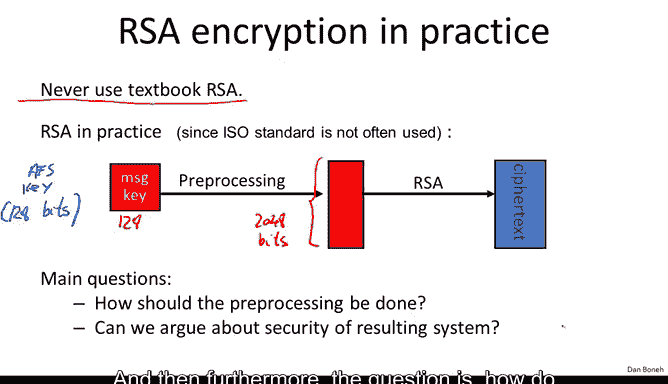
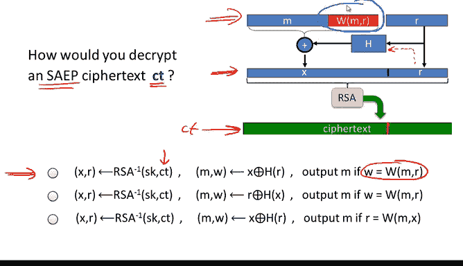
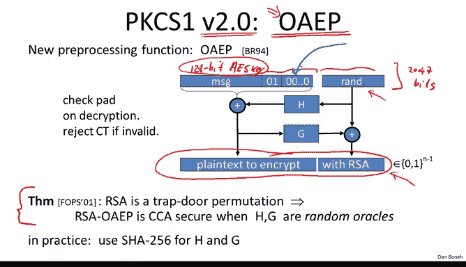

# 斯坦福大学《密码学｜Cryptography 1》中英字幕 - P59：59_06_02_PKCS-1.zh_en - GPT中英字幕课程资源 - BV1Rf421o79E

In this segment， I want to show you how RSA is used in practice。

 and in particular I want to tell you about a standard called a public key cryptography standard number one。

 BKCS1。

So I've already told you a couple of times that you should never use what's called textexbook RSA。

 you should never directly encrypt a message using RSA because that's insecure。

 you always have to do something to the message before you actually apply the RSA function。

 we saw the ISO standard in a previous segment where what we did is we generated a random X encrypted X using RSA and then from this X we derived a symmetric encryption key。

But that's actually not how RSA is used in practice。

 in practice things work a little differently in that typically what happens is the system generates a symmetric encryption key。

 and then RSA is asked to encrypt the given symmetric encryption key rather than generating the symmetric key as part of RSA encryption。

So in practice， as I say， what happens the RSC system is given as input a symmetric encryption key to encrypt。

 for example this could be an AES key that would be like 128 bits and then the way these key is actually encrypted is first we take these 128 bits and we expand them into the full modular size。

 for example this would be 2048 bits。😊，And then we apply the RSA function。

And so the question is how should this preproces be done。

 how should we expand the 128 bit AES key that was given to us into a 2048 bit value that can then be applied with RSA and then furthermore the question is how do we argue that the resulting system is secure？

So an old way of doing it which is actually very widely deployed in practice is what's called PKCS1 version 1。

5 public key cryptography standards， that's what PKS stands for。

 so I want to show you how this mechanism works and in particular I'll show you what's called PKCS1 mode2 mode2 denotes encryption mode1 denotes signatures so here we're going to just focus on encryption。

😊，So the way PKC1 works is as follows， you take your message。

 this would be the 128 bit AES key for example， and you put it as a least significant bits of the value that you're creating。

The next thing you do is you append 16 bits of one to it。 You know FF， this is 16 Bs of one。

 And then the next thing you do is you append a random pad that actually does not contain FF anywhere inside the random pad。

 So this is basically something like on the order of what is a 1900 random bits。

 except that there are no FFs inside those random bits。 And finally， at the very top。

 you put the number 02。 This indicates that this plain text has been encoded using PkC1 mode2。

And then this whole value here， this whole thing that we just created。

 this is this 2048 bit string is the thing that gets fed into the RSA function and is raised to the power of E modulo n and the resulting thing is the PKCs1 Cyphertext Now the decryptor of course is going to invert the RSA function is's going to get back this blob he's going to look at the most significant bits and he's going to say there's a zero2 in there that means that this is PKcs1 formatted since it's PKcs1 format that it's going to remove those 02 it's going remove all the random pad up until the FF。

😊，And then anything that stays beyond that is the original message。

 which is then used to say dec the actual body of the Cyphertex。And as I said。

 this mechanism is extremely widely deployed， for example， it' used in HPS。Now interestingly。

 this PKCS1 version 1。5 was designed in the late 80s there was really no security proof to argue that this mechanism is in fact secure and as it turns out as is very common when there is no security proof it turns out that actually things break and there's a very very elegant attack due to Blaianbaer back in 1998 Danielelleblianbacher which shows how to attack PKCs1 when it's used for example。

 inside of HDPS so let's see how the attack works so the idea is this suppose the attacker intercepted a certain cphertex so this is a PKCS1 Cyphertex。

 so the plan text is encoded using PKCS1 and then the result is fed into the RSA function and we call the Cyphertext。

 the output of the RSA function The attacker wants to basically decrypt the cphert。

So let me show you abstractly what the attacker is going to do。

 We're going to just simplify SSL and just say that the attacker can basically send the ciphertext directly to the web server。

 the web server is going to try and decrypt the Cyphertext using its secret key and then what is it going to do Well the first thing he does after decryption well it's going to ask is the decryption of the ciphertex PKC1 encoded in other words it's going to look at the most significant bits and ask is there a02 in the most significant positions if there are it's going to continue properly decrypting and then continue with the protocol and if there is no02 with those positions it's going to announce an error so if the most significant bits of the plain text are 02 it's going to continue with the protocol as expected。

 if the most significant bits are not 02 it's going to send back an error message and tell the attacker。

 hey you sent being an invalid ciphertext。Now the amazing thing is that this lets the attacker test whether the 16 most significant bits of the decryption of a given Cytext are 02 or not。

 in other words， the attacker can submit whatever Cytext he wants to the web server the web server will invert the RSA function and then tell the attacker whether the inversion started with02 or not so it in some sense gives the attacker an oracle that lets him test whether the inversion of any Cyphertext begins with 02 or not。

😊，And it turns out that's actually enough to completely decrypt any Cyphertexxi attacker once。

 just that little bit of information leakage just by properties of RSA。

 lets the attacker completely decrypt a given Cyphertie。

Well so here's what the attacker is going to do， well he has a Cyphertex that he wants to decryptse。

 so what he'll do is he'll take his Cyphert and of course feed that directly into the web server and ask。

 does it begin with a zero tourout？The next thing he's going to do is he's going to choose a random value R。

 and he's going to build a new sphertext C prime， which is R to the E time C modo n。

Now what does that do if we pull the R into the RSA function。

 really what we just did is we multiplied the RSA plain text， you know the PKCS1 encoding of M。

 we multipied that by R and that that whole thing gets raised to the power of E so that's the effect of multiplying C by r to the E it multiplies the plane text by R a value to the attacker controls and then he's going to send C prime to the web server and the web server is going to say yes this starts with 02 or no。

 this doesn't start with 02。So now we can abstract this problem to something more general。

 which you can think of as the following so I have this number x in my head。

 this is the number I'm trying to get the PKC1 encoding of M。

 I'm thinking of this number x and then what I let you do is for arbitrary R's of your choice I will tell you whether r times x mod n starts with 02 or not。

And it turns out by asking enough questions， it turns out you need about a million questions of this type。

 you can basically recover all of x， just by learning whether r times x begins with02 or not。

 by asking enough questions， you can actually recover x。

So in reality， what this means is that the attacker can capture a given Cyphert。

 this maybe correspond to a ciphertext where the user entered a credit card number or a password。

 and now the attacker wants to decrypt the Cyphertext。

 what he would do is he would send about a million ciphertexts like this。

 the web server for each Cyphertex is going to respond whether the plain text begins with zero2 or not and at the end of the attack。

 the attacker just walks away with the decryption of the Cyphertex C。

So this might seem a little magical to you how are you able to just from learning whether the most significant bits are02 or not。

 how are you able to recover the entire plain text so let me show you a simple example of this I'll call this baby Blaing Baer just to kind of get the idea across for how this attack might work so imagine that the attacker is able to send the Cyphert C the web server is going to use his secret key to decrypt but let's suppose that instead of checking for a02 or not all the web server does is he asks is the most significant bit1。

😊，Or not。😡，If the most significant bit is one， the web server says yes。

 if the most significant bit is not one， the web server is no。Moreover。

 to simplify things let's assume that the RSA modulus n is a power of 2。

 so n is equal to 2 to the little n of course this is not a valid RSA modulus and RSA modulus needs to be a product of two distinct primes。

 but again just to keep things simple， let's pretend for a second that n is actually a power of  two。

So now you realize that by sending the Cyphert C over to the web server。

 the adversary just learned the most significant bits of the plain text X。

Basically the server's behavior completely reveals what the most significant bit is Now what the attacker can do is he can multiply the cphert by 2 to the E now multiplying by 2 to the e has the effect of multiplying the plane text x by 2 simply multiplying x by 2 and because we're working2 to the end。

 multiplying by 2 basically means shift left okay so now when we shift left。

 in fact we get to learn now the most significant bits of 2 x which is really the second most significant bit of x okay so again the most significant bit of 2 x basically we shift x to the left。

😊，And we reduce modo n。 So now the most significant bit of 2 x modo n is basically the second most significant bit of x。

 So now we learned another bit of x。

And now we're going repeat this again， we're going to query at 4 to the E times C that corresponds to querying at 4 x to the power of E querying at 4x basically reveals the most significant bit of 4 x mod n4 x multiplying by four correspond to shifting by two bits。

 which means that now we get to learn the third most significant bit of x and we repeat this again and again and again for different multiples of C。

 and you can see that after just a few queries about 1000 or 2000 queries will recover all of x。

 The reason Labaer needed about a million queries is because he wasn't testing for one。

 he was actually testing for 02 or not02， and that basically means that he needs instead of 2000 queries he needs actually a million queries but that's still enough to recover all of the plain X x so I hope this explains why this attack is possible why just this little bit of information about the most significant bits of the RSA inverse is enough to completely decrypt RSA。

So the bottom line here is that PKCS1， as implemented in web servers up until this attack was discovered。

 was basically insecure because the attacker could essentially decrypt any cpherex he wants just by issuing enough queries to the web server。

So how do we defend against this attack Well， so the SSL community basically wanted the minimum change of their code that would prevent this attack from working and so if you look at at the RFC what they propose is the following well there's a lot of text here but basically what they propose is to say that if after you apply the RSA decryption you get a plain text that's not BKC is1 encoded in other words it doesn't start with  zero2 what you're supposed to do is basically choose some random string R and just pretend that the plain text is this random string R and continues as if nothing happened and of course the protocol will fail later on。

😊，So to be concrete， you see if the PKC1 encoding is not correct what you would do is you would just say the premaster secret is this random string R that we just picked out of thin air and let's continue the protocol and of course the session setup will fail because the client in the server will end up on agreeing on different keys and that will cause the session to terminate so we actually don't tell the attacker whether the plain text begins with02 or not all we do is we just pretend that the plain text is some random value。

😊，So this was a minor code change to many web servers and it was fairly easy to get deployed。

 and in fact， most web servers out there today implement this version of PKSS1。However。

 this kind of raises the question of whether EKCS1 should be changed altogether so that we actually are able to prove chosen Cyteex security。

 and that brings us to a different way of doing encryption using RSA。

 which is called optimal asymmetric encryption padding OAEP。😊，And in fact。

 the PKCS standard was updated and PKCS1 version 2。0 actually has support for OAE。

 which is a better way of doing RSA encryption。So let me explain how OOEP works。

 so OEP is due to Baarara and Rockaway back in 1994 and the way OEP works is as follows。

So you take your message that you want to encrypt， this for example， could be the 128 bit AES key。

And then the first thing you do is you append a short pad to it。 So in this case。

 you put a01 at the beginning and then you app a whole bunch of zeros。

 how many zeros is actually depends on the standard。

 but you know let's suppose that there are like 128 zeros in here and then you also choose a random value so that this whole string is as big as your RSC modulus so let's say this is 2047 bits。

Now before you apply the RSA function， you first of all take the random value that you chose and you feed it into a hash function。

 this hash function produces a value that's as big as the lefthand side of your encoding。

 you exhort the outputs， you feed the result into another hash function which you call G。

 you exort that with a random value， and then finally you get these two values that you can concatenate together。

 so you cancatenate the left side and the right side that gives you something that say is 2047 bits long and that's the thing that you apply the RSA function to and the result is the RSA encryption。

Now there's a theorem that was proved in 2001 due to Fujisaiocommodo Pon Chave in Stern that shows that in fact。

 if all you do is you assume that the RSA function is a trap or permutation。

 a secure trapor permutation， that in fact this mode of encrypting using RSA is in fact chosen typephaex secure。

 but we have to assume that the functions H and G are kind of ideal hash functions and as I said these are called random oracs。

 basically we assume that H and G are just random functions from their domain to their range。

In practice， of course， when OEP is implemented， people just use shot2 56， say for H& G。

Why is this called optimal asymmetric encryption padding， Why is this O。

 Why does it stand for optimal？ Well， the reason is if you look at the ciphert。

 you notice that the ciphertex is basically as short as it can be。

 the cphertex is exactly the length of one RA output。

 there are no trailing values that are appended to the ciphertex。

 whereas for example the isSO standard， if you remember even if you had to encrypt a very short message what you would have to do is you would have to encrypt X using RSA and then append to that X。

 the encryption of the short message under the symmetric encryption system So even if you have just encrypt a 128 AE key with the isSO standard you would get one RSA output plus a symmetric cipher whereas with OEP。

 you just get one RSA output and nothing else。 So in that sense。

 it's optimal optimal in terms of the length of the ciphertex。Interestingly。

 the theorem here really relied on properties of RSA， and in fact。

 the theem is known to be false if you use a general trapor permutation。

 some other permutation that doesn't have the algebraic properties of RSA。

So that left this question of if we have a general trapter permutation what is the correct way to do OEP and it turns out there's a minor modification to OEP which makes the result more general。

 this is a result due to S back in 2001 which shows that if you give me a general trapor permutation F it turns out if you replace the fixed pad that's used in OEP by a hash function。

 this hash function W which happens to be a hash function of the message M and the randomness R that you're encrypting with and then during decryption you actually check that this hash function value is correct so when you decrypt you actually check the W of MR is really what's written in this position in the plain text if you do that then basically this OEP called OEP plus is in fact CCA secure chosen sphert secure for any trapor permutation you don't have to rely on specific properties of RSA。

There's another result called simple asymmetric encryption padding SAE+。

 which basically says that if you are going to rely on properties of RSA。

 then in particular with RSA when the public exponent is equal to 3。

 it turns out you actually don't need a second stage of encryption， the simple padding scheme here。

 again using that function W is actually already enough to guarantee chosen Cypherex security。😊。

So these are variants of OEP but they're not really used。

 I just wanted to mention and so that you know they exist， these are not really used。

 mainly OEP has been standardized is what's used， although again in reality the most common application of RSA for public encryption is in fact this PKS1 that's standardized in the HTPS RFC。

So just to make sure it to clear in your mind how decryption actually works。

 let me ask you how would you decrypt an SAEP Cyphertext CT so here you're given the Cyphertext CT here and the question is which of these three methods is the correct way of decrypting the cphertext。

😊，So the correct answer is the first one and let's see why， well given the Cyphertex。

 the first thing we would need to do is apply the RSA inverse function to Cyphertext。

 and that would give us the RSA plain text which happens to be in this case， x and R。

 so we get these x and R here。The next thing we need to do is we need to hash R using the function H and x or the result with x and that will give us M and WM comma R and the last thing we need to do is to make sure that the pad WMR is correct so we check that in fact W is equal to WMR and if so we output m and if not we output bottom to say that the cpherex is invalid and the decryption algorithm reject it and by the way I'd like to emphasize that this checking of the pad during decryption is crucial in all these schemes that we just saw so for example in both OEP plus and SEP plus it's during decryption it's very important to check that the pad is in fact correct so that the value of w that you get here during encryptption really is the hash under the capital W of M and R and similarly in OEP it's very important to check that during decryption in fact the value of the pad is the constant010000000。

And of course， if it happens to be not 01000， then you output bottom and you say theciphertex is invalid。

The last thing I want to point out is that actually implementing OEEP can be quite tricky and let's see why。

So suppose have you write an OEP decryption routine that takes the Cyphertext as inputs The first thing you would do is you would apply the RSA inverse function to the Cyphertext and you would say。

 well you expect to get an n bit value out， you know 2047 bits in the case of 2048 bit RSC modulus and if you get something that's bigger than two to the 2047 you say reject we say error equals1 and we go to exit。

The next thing we're going to do is we're going to check whether the pad is in fact the correct pad and again。

 if the pad is not the correct pad， then again we're going to reject and go to exit。

The problem with this implementation is well by now I hope you kind of guessed it is it is vulnerable to a timing attack right so essentially by leaking timing information the attacker can now figure out what caused the error was that was there an error because the RSA decryption happened to be too big or was there an error because the pad happened to be too large and if the attacker can distinguish these two errors say by timing。

 then it turns out similar to theblian Baer attack it's possible to completely decrypt any ciphertex of your choice。

 just that very very， very small leak of information would completely allow the attacker to decrypt completely any ciphert he wants to。

😊，So this shows that even if you implement the mathematics of OEP decryption correctly。

 you can very easily mess up and open yourself up to a timing attack which would make your implementation completely insecure so as usual the lesson is don't implement cryrypto yourself in particular RSAOEPs particularly dangerous to implement yourself。

 just use one of the standard libraries for example。

 Open SSL has an OEP implementation and of course what they do is they're very careful to make sure that the running time of OEP decrypt is always the same no matter what causes the error。

😊，Okay， so we'll stop here and then in the next segment we'll talk about the security of the RSA。

They trapped their permutation。