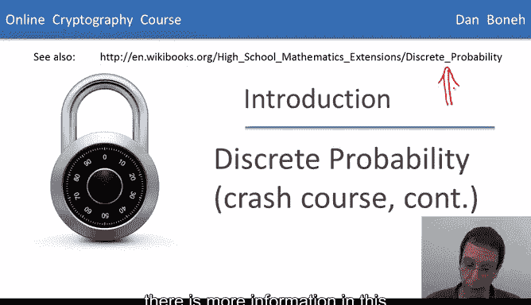
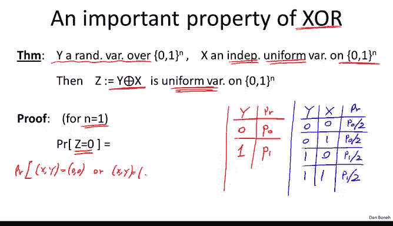

# 斯坦福大学《密码学｜Cryptography 1》中英字幕 - P5：05_01_02_离散概率速成课程续.zh_en - GPT中英字幕课程资源 - BV1Rf421o79E

In this segment， we're going to continue with a few more tools from discrete probability。

 and I want to remind everyone that if you want to read more about this。

 there is more information in this WiikiBook article that is linked over here。

So first let's do a quick recap of where we are。 we said the discrete probability is always defined over a finite set。

 which we're going to denote by u and typically for us u is going to be the set of all n bit binary strings which we denote by01 to the n Now a probability distribution P over this universe U is basically a function that assigns to every element in the universe。

 a weight in the interval 0 to1， such that if we sum the weight of all these elements。

 the sum basically sums up to 1。Now we said that a subset of the universe is what's called an event and we said that the probability of an event is basically the sum of all the weights of the elements in the event。

 and we said that the probability of an event is some real number in the interval0 to1。

 and I want to remind everyone that basically the probability of the entire universe is basically one by the fact that the sum of all the weights sums up to1。

😊，Then we define what a random variable is， formally a random variable as a function from the universe to some other sets。

 but the thing that I want you to remember is that the random variable takes values in some set V。

 and in fact a random variable defines a distribution on the set V。😊。

So the next concept we need is what's called independence and I'm going to very briefly define this if you want to read more about independence。

 please go ahead and look at the WikiBooks article。

 but essentially we say that two events A and B are independent of one another if when you know that event A happens that tells you nothing about whether event B actually happened or not。

😊，Formerally， the way we define independence is to say that the probability of A and B。

 namely that both events happen is actually equal to the probability of event A times the probability of event B。

 so multiplication in some sense the fact that probabilities multiply under conjunction captures the fact that these events are independent and as I said。

 if you want to read more about that please take a look at the background material。😊。

Now the same thing can be said for random variables， so suppose we have two random variables X and y。

 they take values in some set V， then we say that these random variables are independent if the probability that x is equal to a and y is equal to B is equal to the product of these two probabilities basically what this means is even if you know that x is equal to a that tells you nothing about the value of y that's what this multiplication means and again this needs to hold for all A and B in the space of values of these random variables。

😊，So just again， to jog your memory， if you've seen this before， a very quick example。

 suppose we look at a set of two bit strings， So 00，0，1，10 and 11。

 and suppose we choose a random element from this set。 Okay。

 so we randomly choose one of these four elements with equal probability。 Now。

 let's define two random variables。 X is going to be the least significant bit that was generated and y is going to be the most significant bit that's generated。

😊。

So I claim that these random variables X and y are independent of one another and the way to see that intuitively is to realize that choosing R uniformly from the set of four elements is basically the same as flipping a coin and unbiased coin twice the first bit corresponds to the outcome of the first flip and the second bit corresponds to the outcome of the second flip。

 and of course there are four possible outcomes， all four outcomes are equally likely。

 which is why we get the uniform distribution over two bit strings now variables x and y and why are the independent。

 basically if I tell you the result of the first flip。

 namely I tell you the least significantific bit of R。

 so I tell you how the first coin whether it fell on its head or fell on its tail。

 that tells you nothing about the result of the second flip which is why intuitively you might expect these random variables to be independent of one another。

 but formally we would have to prove that for all01 pairs， the probability of x。😊。

0 and y equals 0 x equals 1 y equals 1 and so on。 these probabilitybabilities multiply。

 let's just do it for one of these pairs。 so let's look at the probability that x is equal to0 and y is equal to0。

 Well you see that the probability that x is equal to 0 and y is equal to0 is basically the probability that R is equal to00 and what's the probability that r is equal to00 well by the uniform distribution that's basically equal to one fourth it's one over the size of the set which is one fourth in this case and while lo and behold that's in fact these probability probabilityities multiply because again the probability that x is equal to0。

 the probability that the least significant bit of r is equal to0。

 this probability is exactly one half because there are exactly two elements that have their least significant bit equal to02 out of four elements gives you a probability of one half and similarly the probability that y is equal to 0 is also one so in fact the probabilitybabilities multiply。

Okay so that's this concept of independence。 And the reason I wanted to show you that is because we're going to look at an important property of Xor that we're going to use again and again。

 So before we talk about Xor， let me just do a very quick review of what xor is So of course Xor of two bits means the addition of those bits modo2 so just to kind of make sure everybody's on the same page if we have two bits so000110 and11 their Xor。

 the truth table of the XO is basically just the addition modo2 you can see one plus1 is equal to 2 modular2 that's equal to 0 So this is a truth table for the Xor and I'm always going to denote Xor by the circle with a plus inside And then when I want to apply Xor to bit strings I apply the addition modular2 operation bitwise So for example the X of these two strings would be110 and I guess I'll let you fill out the rest of the Xors just to make sure we're all。

😊，The same page。So of course， it comes out to 1，10，1。

Now we're going to be doing a lot of XOing in this class， in fact。

 there's a classical joke that the only thing crypttographers know how to do is just Xor things together。

 but I want to explain to you why we see XO so frequently in cryptography basically XOR has a very important property and the property is the following supposeuppose we have a random variable Y that's distributed arbitrarily over 01 to the end so we know nothing about the distribution of Y。

😊，But now suppose we have an independent random variable that happens to be uniformly distributed also over 01 to the n。

 So it's very important that x is uniform and that it's independent of y。

 So now let's define the random variable， which is the x or of x and y。

 then I claim that no matter what distribution y started with this z is always going be a uniform random variable。

 So in other words， if I take an arbitrarily malicious distribution and I xort with an independent uniform random variable。

 what I end up with is a uniform random variable。 this is again kind of a key property that makes x or very useful for crypto。

 So this is actually a very simple fact to prove， let's just go ahead and do it let's just prove it for one bit。

 So for n equals1 so the way we'll do it is we'll basically write out the probability distributions for the various random variable。

 So let's see for the random variable Y well， the random variable can be either0 or1。

 and let's say that p0。😊，The probability that it's equal to0 and p1 is the probability that it's equal to 1 Okay so that's one of our tables Similarlyly we're going to have a table for the variable x well the variable x is much easier that's a uniformer and the variable so the probability that it's equal to0 is exactly one half probability that it's equal to 1 is also exactly one half。

😊，Now let's write out the probabilities for the joint distribution。 In other words。

 let's see what the probability is for the various joint values of y and x。 In other words。

 how likely is it that y is 0 and x is 0 y is 0 and x is 1 y is1 and x is 0 and11。

 Well so what we do is basically because we assume the variables are independent。

 All we have to do is multiply the probabilitybabilities。

 So the probability that y is equal to 0 is p0 probability that x is equal to0 is1 half。

 So the probability that we get 00 is exactly p0 over 2。

 Similarlyly for 01 will get p0 over 2 for10 will get p1 over 2。 and for 11， again。

 the probability that y is equal to1 and x is equal to1 well。

 that's p1 times the probability that x is equal to1 which is a half。 So it's p1 over2。

 so those are the four probabilitybabilities for the various options for x and y。

 So now let's analyze what is the probability that z is equal to 0。 Well。

 the probability that z equal to。😊，0 is basically the same as the probability that let's write it this way。

 X Y is equal to 0，0， or X Y is equal to 1，1。 Those are the two possible cases that z is equal to 0 because z is the x or of x and y。

😊。

Now these events are disjoint， so this expression can simply be written as the sum of the two expressions given above。

 so basically it's the probability that xy is equal to 00 plus the probability that Xy is equal to 11。

So now we can simply look up these probabilities in our table so the probability that xy is equal to 00 is simply p0 over 2 and the probability that xy is equal to 11 is simply p1 over 2 So we get p0 over 2 plus p1 over 2 but what do we know about p0 and p1 Well it's a probability distribution therefore p0 plus p1 must equal 1 and therefore this fraction here must equal to p0 plus p1 is equal to 1 so therefore the sum of these two terms must equal2。

And we're done basically we prove that the probability that z is equal to0 is1 half。

 therefore the probability that z is equal to 1 is also one half。

 therefore z is a uniform random variable。😊，So the simple theorem is the main reason why XO is so useful in cryptography。

The last thing I want to show you about discrete probability is what's called the birthday paradox。

 And I'm gonna do it really fast here because we're going to come back later on and talk about this in more detail。

 So the birthday paradox says the following。 supposeupp I choose N random variables in our universe U。

 and it just so happens that these variables are independent of one another。

 they actually don't have to be uniform， all we need to assume is that they're distributed in the same way。

 the most important property though， is that they're independent of one another。

 So the theorem says that if you choose roughly the square root of the size of U elements。

 we're kind of ignoring this 1。2 here， it doesn't really matter。

 but if you choose square root of the size of U elements。

 then basically there's a good chance that there are two elements that are the same。 In other words。

 if you sample about square root of u times， then it's likely that two of your samples will be equal to one another。

 And by the way， I should point out that this inverted E just means exists。😊。

So there exists in the C's I andj such that R I is equal to Rj。

 So here's a concrete example that we'll actually see many， many times。

 So suppose our universe consists of all strings of length 128 bits So the size of U is gigantic。

 It's actually2 to the 128。 Sos very， very large set but it so happens that if you sample。

 say around two to the 64 times from the set， this is about a square root of U。

 then it's very likely that two of your sample messages will actually be the same。

 So why is this called the birthday paradox， well traditionally is described in terms of people's birthday。

 So you would think that each one of these samples would be someone's birthday And so the question is how many people need to get together so that there are two people that have the same birthday So just as a simple calculation you can see there are 365 days in the year So you would need about 1。

2 times the square root of 365 people until the probability that two of them have。😊。

Same birthday is more than a half this if I'm not mistaken is about 24。

 which means that if 24 random people get together in a room it's very likely the two of them will actually have the same birthday。

 this is why it's called a paradox because 24 supposedly the smaller number than you would expect。

Interestingly， people's birthdays are not actually uniform across all 365 days in the year。

 There's actually a bias towards September， but I guess that's not relevant to the discussion here。

 The last thing I wanted to do is just show you the birthday paradox a bit more concretely。

 So suppose we have a universe of about a million samples。

 then you can see that when we sample roughly 1200 times the probability that we get we sample the same number。

 the same element twice is roughly a half。 but the probability of sampling the same number twice actually converges very quickly to one。

 you can see that if we sample about 2200 items， then the probability that two of those items are the same already is 90% and you know a 3000 it's basically one So this converges very quickly to one as soon as you go beyond the square root of the size of the universe So we're gonna come back and study the birthday paradox in more detail later on but I just for now wanted you to know what it is。

So that's the end of the segment， and then in the next segment we'll start with our first example encryption systems。

