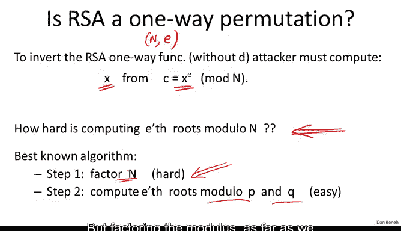

# 斯坦福大学《密码学｜Cryptography 1》中英字幕 - P60：60_06_01_RSA是单向函数吗.zh_en - GPT中英字幕课程资源 - BV1Rf421o79E

The next question we're going to ask is RSA really a one way function， in other words。

 is it really hard to invert RSA without knowing the trap door？

So if an attacker wanted to invert the RSA function。

 well what the attacker has is basically the public key namely he has n and E and now he's given x to the E and his goal is to recover x okay so the question really is given x to the E modular n。

 how hard is it to recover x， so what we're really asking is how hard is it to compute E roots mod a composite？

😊，If this problem turns out to be hard， then RSA is in fact a one way function。

 if this problem turns out to be easy， which of course we don't believe it's easy。

 then RSA would actually be broken。So it turns out the best algorithm for this problem requires us to first factor the modulus n。

 and then once we factor the modulus we've already seen last week that it's easy to compute the e through modular P。

 it's easy to compute the e through modular Q， and then given both those e roots its actually easy to combine them together using what's called a Chinese remainder theorem and actually recover the e through modular n。

So once we're able to factor the modulus， computing e roots modular n becomes easy。

 but factoring the modulus as far as we know is a very， very difficult problem。

But a natural question is， is it true that in order to compute E rootots modular N。

 we have to factor the modulus N as far as we know。

 the best algorithm for computing E root modular N requires factorization of n。

 but who knows maybe there's a shortcut that allows us to compute E rootots modular n without factoring the modulus？

To show that that's not possible， we have to show a reduction that is we have to show that if I give you an efficient algorithm for computing E roots module O N。

 that efficient algorithm can be turned into a factoring algorithm。

 so this is called a reduction namely given an algorithm for E roots module N。

 we obtain a factoring algorithm， and that would show that one cannot compute E roots module N faster than factoring the modules。

😊，If we had such a result， it would show that actually breaking RSA in fact is as hard as factoring。

 but unfortunately this is not really known at the moment。

 and in fact this is one of the oldest problems in public key crypto and so let me just give you a concrete example。

 suppose I give you an algorithm that will compute Q roots mod N。😊，So for any x in ZN。

 the algorithm will compute the cube root of x modular n and my question is。

 can you show that using such an algorithm you can factor the modulus n and even that's not known what is known I'll tell you is for example that for e equals 2 that is if I give you an algorithm for computing square roots modular n。

 then in fact that does imply factoring the modulus and so computing square roots is in fact as hard as factoring the modulus unfortunately if you think back to the definition of RSA that required that e times d be1 modo phi of n and what that means is that E necessarily needs to be relatively prime to phi of n what the first equation says is that e is invertible modo phi of n。

 but if e's invertible modular phi of n necessarily that means that E must be relatively prime to phi of n。

But phi of n， if you remember that's equal to p minus1 times q minus1 and since p and q are both large primes。

 p minus1 times q minus1 is always even and as a result。

 the GCD of 2 and phi of n is equal to 2 because phi of n is even and therefore the public exponent 2 is not relatively prime to phi of n。

 which means that even though we have a reduction from taking square roots to factoring e equals 2 cannot be used as an RA exponent。

So really the smallest RSA exponent that's legal is in fact e equals 3， but for e equals 3。

 the question of whether computing cube roots is as hard as factoring is an open problem。

 it's actually a lot of fun to think about this question。

 so I would encourage you to think about it just a little bit。

 that is if I give you an efficient algorithm for computing Q roots modular N。

 can you use that algorithm to actually factor the modulus N？😊。

I'll tell you that there is a little bit of evidence to say that a reduction like that actually doesn't exist。

 but it's very， very weak evidence， what this evidence says is basically if you give me a reduction of a very particular form。

 in other words if your reduction is what's called algebraic I'm not going to explain what that means here that is if given a cube root oracle you could actually show me an algorithm that would then factor that reduction by itself would actually imply a factoring algorithm so that would say that if factoring is hard a reduction actually doesn't exist but as I say this is very weak evidence because who's to say that the reduction needs to be algebraic。

 maybe there are some other types of reductions that we haven't really considered so I would encourage you to think a little bit about this question it's actually quite interesting how would you use a cube root algorithm to factor the modulus。

😊。

But as I said， as far as we know， RSA is a one way function and in fact， breaking RSA。

 computing e roots that is actually requires factoring the modulus。

 we all believe that's true and that's the state of the art。

But now there's been a lot of work on trying to improve the performance of RSA。

 either RSA encryption， or improve the performance of RSA decryption。

And it turns out there's been a number of false starts in this direction。

 and so I want to show you this wonderful example as a warning。

 and so this basically this is an example of how not to improve the performance of RSA。😊。

So you might think that if I wanted to speed up RSA decryption。

 remember decryption is done by raising the sphertex to the power of D and you remember that the exponuniation algorithm ran in linear time in the size of D linear time and log of D so you might think to yourself。

 well if I wanted to speed up RSA decryption， why don't I just use a small D I'll say a decryption exponent that's on the order of2 to the 128？

So it's clearly big enough so that exhaustive search against D is not possible。

 but normally the decryption exponent in D would be as big as the modulus， say 2，000 bits。

By using a D that's only 128 bits， I basically speed up RA encryptption by a factor of 20 right I went down from 2。

000 bits to 100 bits， so explanationation would run 20 times as fast。😊。

It turns out this is a terrible idea， terrible， terrible idea in the following sense there's an attack by Michael Wiener that shows that in fact。

 as soon as the private exponent D is less than the fourth root of the modulus。

 let's see if the modulus is around 2048 bits， that means that if D is less than 2 to the 512。

 then RSA is completely completely insecure， and it's insecure in the worst possible way。

 namely just give in a public key N and E， you can very quickly recover the private keyD。Well。

 so some folks said， well this attack works up to 512 bits。

 so why don't we make the mods say you know 530 bits， then this attack actually wouldn't apply。

 but still we get to speed up RSA decryption by a factor of four because we shrunk the exponent from 2。

000 bits to say 530 bits。Well， it turns out even that's not secure， in fact。

 there's an extension to Wier's attack that's actually much more complicated that shows that if D is less than n to the 0。

292， then also RSA is insecure and in fact the conjecture is that this is true up to end to the 0。

5 so even if D is like n to the 0。4999 RSA should still be insecure although this is an open problem So again I wonder for open problem it's been open for like whether it's 14 years now and no one can progress beyond this 0。

292 somehow it seems kind of strange why would 0。292 be the right answer and yet no one can go beyond 0。

292。So just to be precise， when I say that RSA is insecure。

 what I mean is just given the public key N& E， your goal is to recover the secret keyD。

If you're curious where 0。292 comes from， I'll tell you that what it is is basically1 minus1 over squared of2 Now how could this possibly be the right answer to this problem it's much more natural that the answer is end to the 0。

5 but this is still an open problem again if you want to think about that it's kind of a fun problem to work on So the lesson in this is that one should not enforce any structure on D for improving the performance of RSA and in fact now there is a slew of results like this that show that basically any kind of tricks like this to try and improve RSA's performance is going to end up in disaster so this is not the right way to improve RSA's performance。

Initially I wasn't going to cover the details of Winer's attack。

 but given the discussions in the class， I think some of you would enjoy seeing the details。

 all it involves is just manipulating some inequalities。

 if you're not comfortable with that feel free to skip over the slide。

 although I think many of you would actually enjoy seeing the details。

So let me remind you in Wienner's attack basically we're given the modulus and the RSA exponent and E and our goal is to recover D the private exponent D and all we know is a D is basically less than fourth root of n。

 In fact I'm going to assume that D is less than the fourth root of n divided by 3 this3 doesn't really matter。

 but the dominating term here is a d is less than the fourth root of n。So let's see how to do it。

So first of all， recall that because E and D are RSA public and private exponents。

 we know that e times d is one mod of phi of n。Well， what does that mean。

 that means that there exists some integer K such that E times d is equal to K times 5 n plus 1。

Basically， that's what it means for e times d to be one module of5 n。

 basically some integer multiple of 5 n plus1。So now let's stare at this equation a little bit。

 and in fact， this equation is the key equation in the attack。

And what we're going to do is first of all divide both sides by d times phi of n and in fact I'm going to move this term here to the left。

 so after I divide by d times phi of n， what I get is that e divided by phi of n minus k divided by D is equal to1 over d times phi of n。

Okay， so all I did is I just divided by d times 5 n and I moved the K times 5 of n term to the left hand side Now just for the heck of it I'm going to add absolute values here。

 those will become useful in just a minute， but of course they don't change its equality at all。

Now phi of n of course， is almost n5hi n is very， very close to n， as we said earlier。

 and all I'm going to need then for this fraction is just to say that it's less than one over square root of n。

 it's actually much， much smaller than one over square root of n。

 it's actually on the order of one over n or even more than that。

 but for our purposes all we need is a distractionra is less than one over square root of n。

Now let's stare at this fraction for just a minute， you realize that this fraction on the left here。

Is a fraction that we don't actually know。 We know E， but we don't know phi of n。 and as a result。

 we don't know E over phi of n， but we have a good approximation to e over phi n namely。

 we know that phi n is very close to n， therefore e over phi n is very close to E over n So we have a good approximation to this left-hand side fraction namely e over n。

 what we really want is the right-hand side fraction because once we get the right-hand side fractions basically that's going to involve D and then we'll be able to recover D so let's see if we replace e over phi of n by e over n。

 let's see what kind of error we're gonna to get。 So to analyze that， what we'll do is first of all。

 remind ourselves that phi of n is basically n minus p minusq plus1 which means that n minus phi n is going to be less than p plus Q actually I should be precise。

 I should really write p plusq plus1 but you know who cares about this one's not it doesn't really affect anything So I'm just going to ignore it for simplicity so n minus5 n is less than p。

Both P and Q are roughly half the length of n， so you they're kind of both on the order of square root of n。

 so basically P plus Q will say is less than three times square root of n。Okay。

 so we're going to use this inequality in just a minute。

But now we're going to start using the fact that we know something about d namely the d is small。

 so if we look at this inequality here， d is less than4 root of n divided by 3。

 it's actually fairly easy to see if I square both sides and I just manipulate things a little bit。

 it's difficult to see that this directly implies the following relation basically1 over 2 d squared minus1 over square root of n is greater than 3 over square root of n。

😊，As I said， this basically follows by squaring both sides， then taking the inverse of both sides。

 and then I guess multiplying one side by a half。Okay。

 so you can easily derive this relation and we'll need this relation in just a minute。

So now let's see what we'd like to do is bound the difference of e over n and K over d Well what do we know by the triangular inequality。

 we know that this is equal to the distance between e over n and e over phi n plus the distance from e over phi n。

2 K over D。 Okay this is just what's called a triangular inequality。

 This is just a property of absolute values。Now this absolute value here。

 we already know how to bound， if you think about it is basically the bound that we've already derived。

 so we know that this absolute value here is basically less than one over square root of n。

Now what do we know about this absolute value here。

 what is e over n minus e over 5 n Well let's do common denominators and see what we get so the common denominator is going to be n times5 of n。

And the numerator in this case is going to be e times 5 n minus n。

Which we know from this expression here is less than three times square root of n。

 so really what this numerator is going to be is e times3 square root of n。

 the numerator is going to be less than e times3 square root of n。

So now I know that E is less than 5 of n， so I know that e over 5hi of n is less than 1。

 In other words， if I erase E and I erase 5hi of n。

 I've only made the fraction larger so this initial absolute value is not going to be smaller than3 squared of n over n。

 which is simply3 squared of n of n， it simply3 over a square root of n。Okay。

 but what do we know about three over squared of n， We know that it's less than one。

Over 2 d squared minus1 over square root of event。Okay so that's the end of our derivation。

 so now we know that the first absolute value is less than1 over 2 d squared minus squared of n。

 the second absolute value is less than1 over square of n and therefore their sum is less than1 over 2D squared。

And this is the expression that I want you to stare at， so here let me circle it a little bit。

 so let me circle this part。And this part。Now， so let's stare a little bit at this here and what we see is。

 first of all， as before， now we know the value of E over n and what we'd like to find out is the value K over D。

 but what do we know about this fraction K over D， We know somehow that the difference of these two fractions is really small。

 It's less than1 over 2D squared。Now this turns out to happen very infrequently that K over D approximate e over n so well that the difference between the two is less than the square of the denominator of k over D。

 It turns out that that can't happen very often。 It turns out there are very few fractions of the form K over D that approximate another fraction so well that their difference is less than1 over 2 d squared。

 and in fact， the number of such fractions is going to be at most logarithmic in n。

 So now there's a continued fraction algorithm。 It's a very famous fraction that basically what it will do is from the fraction E over n it will recover log n possible candidates for K over D。

 So we just try them all1 by one。 until we find the correct K over D and then we're done。

 we're done because we know that well e times d is1 modt K。 therefore d is relatively prime to K。

So if we just represent K over d as a rational in fractionraction， numerator by denominator。

 the denominator must be the。And so we've just recovered， you know。

 we've tried all possible log n fractions that approximate U over N so well that the difference is less than1 over 2D squared。

And then we just look at the denominator of all those fractions and one of those denominators must be D。

 and then we're done， we've just recovered the private key。So this is a pretty acute attack。

 and it shows basically how if the private exponent is small， smaller than the fourth root of N。

 then we can recover D completely and quite easily。Okay， so I'll start here。

