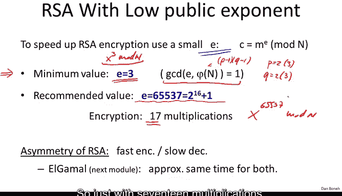
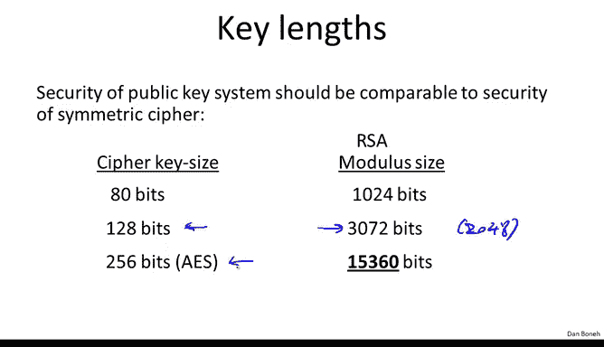
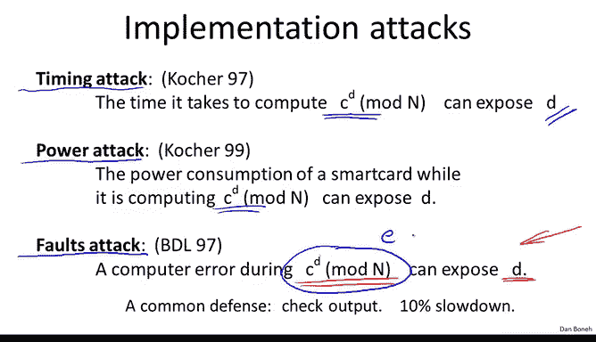
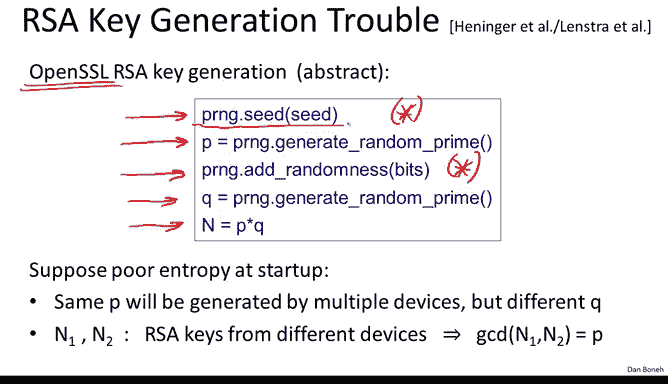
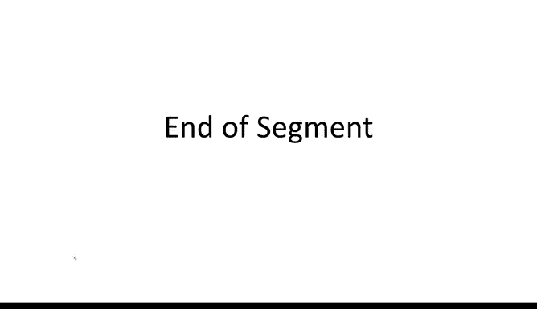

# 斯坦福大学《密码学｜Cryptography 1》中英字幕 - P61：61_06_02_RSA实践应用.zh_en - GPT中英字幕课程资源 - BV1Rf421o79E

To conclude this module， I want to say a few words about how RSA is used in practice。

So first of all， if you want to speed up RSA encryption。

 it's perfectly fine to use a small encryption exponent E so rather than using a random E。

 one can use a small value of E and in fact a minimum value that's possible is e equals 3 so it's not difficult to see that the smallest possible value for E is in fact e equals3 and let's see why well e equals1 is a bad idea because that's not particularly hard to invert with e equals 1 e equals 2 is not a valid RSA exponent because remember in the definition of RSA E had to be relatively prime to phi of n phi of n if you remember is p minus1 times q minus1 which is an even number if p andq are odd primes。

 p minus1 times q minus1 is an even number but if e is even if e equal to 2 it's not going to be relatively prime to p of n so es 2 is not valid either and then e equals 3 is the first minimum value that can be used and then we just have to make sure that in fact p is equal。

So2 mod 3 and Q is equal to2 mod 3， so that p minus1 timesq minus1 is not div by3。So in fact。

 this is a fine public exponent to use， however the recommended value is2 to the 16 plus1。

 so 65537 it's a good idea to use this recommended value of E to compute x cubed mod n you would basically need three multiplications to compute x to the 65。

537 mod n using repeated square and you would need 17 multiplications basically what you would do is you would repeatedly square 16 times and then you would multiply by x1 more time so just with 17 multiplications you can do this exponuniation so this is still much much faster than using a random E which would require something like 2000 multiplications。

😊。

So this leads us into what's called the asymmetry of RSA where in fact the encryption is quite fast。

 encryption only requires 17 multiplications， however decryion is much， much， much slower。

 it requires something on the order of 2，000 multiplications。😊。

I should point out that there is a standard trick for slightly speeding up RSA decryption。

 this is called R CRT， it stands for RSA with Chinese remaindering。

 it's a method for speeding up RSA decryption by about a factor of 4。

 but nevertheless it's still going to be much， much， much slower than encryption。

 the ratio of encryption to decryption in RSA is roughly a factor of 10 to 30。

 so encryption could be up to like 30 times faster than decryption depending on the size of your modulus。

Interestingly， this is a special property of RSA where encryption is so much faster than decryption and other public key systems。

 for example， in the next module we're going to look at algamal encryption。

 don't have this property where both encryption and decryption take roughly the same amount of time。

We've already discussed key lengths for RSA before。

 so I just wanted to flash these numbers to remind you that if you're using a 128 bit AES key really you should be using a 3000 bit modulus although everybody just uses a 2048 bit modulus。

 and then if you're really using a long AES key like up to 56 bit AES key。

 the RSA modulus gets to be quite big。

Now I wanted to mention a number of implementation attacks on RSA these are our attacks that have been demonstrated against particular mathematically correct implementations of RSA。

 however these implementations were vulnerable to certain side channel attacks that make the implementation completely insecure so the first example of this is due to Paul Kocher back in '97 he showed a timing attack where all you do is you measure the time for an RSA decryption and simply by measuring the time you can actually expose the secret Xon and D。

😊，And so this says that if you're going to implement an RSA decryption。

 you had better make sure that the decryption time is independent of the arguments。

Another attack also by Paul Coer two years later showed that if you have a smart card that's implementing RSA decryption。

 you can actually measure the power consumption of the card while it's doing RSA decryption。

 and then simply by looking at the peaks and troughs。

 you can literally read off the bits of D1 bit at a time as the smart card is running through the repeated querying algorithm。

So using a power analysis attack， it's actually fairly easy to get the secret bits of the secret key unless the smart card defends against power analysis attacks。

😊，And finally another attack called a fault attack shows that RSA is very vulnerable to decryption errors and in particular for some reason an error occurs during an RSA decryption。

 one error is actually completely enough to reveal the secret key so this attack is actually fairly significant just one error completely reveals your secret key and as a result many crypto librariesr will actually check the result of the RSA decryption before returning it to the collar and the way you would check it is you would take the output of this exponunciation and simply raise it to the power of E and check that you actually get back C module N。

And if so， you know that your decryption was done correctly。

Now the reason you can do this is because again E is much smaller than D。

 therefore checking takes much less time than actually raising something to the power of D。

 nevertheless， even though checking is 10 times faster than the actual decryption。

 this still introduces a 10% slowdown and so sometimes this is actually turned off but nevertheless it's actually a good idea to check that your RSC output is correctly computed。

😊，And so all these attacks kind of again make the point that if you just implement RSA naively。

 it would be mathematically correct， it would work however。

 there would be all these potential attacks on the implementation。

 and as a result you should never implement RSA yourself。

 always always use standard libraries and just use the implementation available there。

So to be concrete， I wanted to show you an example of one of these attacks。

 and in particular I'll show you the fault attacks on RSA and again this will be a fault attack on what's called RSA with Chinese Ring。

So in fact， as I said at the beginning of the segment RSA decryption is often implemented as follows what you do is you decrypt the Cyphert C modo P。

 then you decrypt the Cyphertexc modular Q and then you combine the two to actually get the decryption modular N and this combination is done using what's called a Chinese remainder theorem which I'm not going to explain here but is not too difficult to see how that works basically once you have the result the decryption mark P and the decryption mod Q。

 you can combine it to get the decryption mod n and it turns out this gives about a factor of four speed up over the naive implementation of directly doing the exponiation modular N。

Okay， so let's see why this is vulnerable default falses。

 Supp it so happens that when your decryption library is computing the decryption modular Q。

 for some reason the processor makes an error and actually what it gets is not the correct XQ。

 it gets an incorrect XQ so let's call this XQ hat。However。

 when it computed the decryption modular P， know no error occurred。

 so these errors are fairly infrequent， and so let's just assume that an error occurred modular1 prime。

 but it did not occur modular the other prime。Well， if that's the case。

 our computation is correct modular P and incorrect modular Q。

 that says that when we combine the two results we're actually going to get an output I'll call it x prime such that the output is correct modular P So x prime is really equal to c to the D mod P but it's incorrect modular Q。

 if we raise both these equations to the power of E， what we obtain is the following two relations。

 Well， let's see this guy we raise it to the power of E。

 What happens is the left hand side becomes x prime to the E。

 the right-hand side here it's c to the D if I raise C to the D to the power of E E and D remember our inverses of one another And as a result if I raise c to the D to the power of E。

 both xs cancel out and I simply get C back。 So I know that x prime to the e is equal to C。

 But modular Q there was a mistake。 So x prime to the E is not equal to C a modular Q。

 So therefore if I look at this difference x prime to the E minus C we know that it's0 modular P。

 it's not zero modular Q。

So now if we compute a GCD of this value within n， what do we get？Well， as I said。

 this is zero mod P， but it's not equal to zero modq。

Which means that this quantity here is divisible by P， but is not divisible by Q。

 so therefore when I compute to GCD， what I'll get is simply P。😡，And again。

 this is because P divides this quantity here when Q does not divide this quantity here。

So now basically what I've just obtained is the factorization of n。

 once I have the factorization of n I can compute phi of n and then given phi of n I can actually compute myself the decryption exponent from the public key。

 so now I've just recovered a secret key from the public key from a single mistake that happened during decryption。

😊，So this is why typically when you do RSA decryption， it's a good idea to check the results。

 especially when you use Chinese rendering to speed up RSA decryption。

The last attack I want to talk about is a very recent observation that was observed by hitting Garital and Lnster etol that shows that RSA key generation can be problematic when it's done with bad entropy So here's how things go wrong So the way openSL generates Ra keys is as follows Well it starts by basically seeding the pseudoran number generator and then it uses random bits from the pseudo random number generator to generate the first prime P。

 then it will go ahead and seede the random number generator some more and will generate bits from the pseudo random number generator to generate Q and finally it will output the product of P andq so there are two steps where we seed the pseudo random number generator。

Now， suppose that this is implemented on a router or a firewall of some sort。

 and suppose that the key generation happens right after the firewall starts up。

 so the firewall boots up，At the time of the boot， there's not a lot of entropy in the pseudoranno number generator。

 and as a result， the firewall is likely to generate a prime P that comes from a very low entropy pool。

 which means that this P is going to be one of a small number of possibilities。

However， after we've generated a P， generating the prime actually takes a little bit of time。

 a few microseconds， and so by then the firewall will have generated more entropy and so after we add more entropy to the entropy pool。

 the prime Q say is generated from a much larger entropy pool and is therefore unique to this firewall。

😊，Now， the problem is that many different firewalls， if they generate an RSA key in this way。

 many of them will actually end up using the same prime P。But a different prime Q。

So what this says is that if we look at two RSA mods from two different firewalls， n1 and N2。

 if we compute a GD of n1 and N2， well both of them have different cues but the same P。

 so if we compute the GCD actually will end up with a factorization of n of both N1 and N2。

 and then we can actually figure out the private key both for N1 and for N2。

So this has actually been observed in practice with both of these groups what they did is they scanned the web and recovered all the public keys out there that are used on various web servers。

 so then ran a massive GCD using some arithmetic tricks they were able to compute this massive GCD of all pairs of public keys in1 and N2 and lo and behold they were actually realized that a fair number of these keys have a common factor so they were actually able to factor these mods。

 so in the experiment they were actually able to factor about 0。4% of all public SSL keys。

 this is an amazing fact that in fact so many web server public keys out there are vulnerable just because they happen to generate the RSA key using low entropy so they have a common factor with somebody else's factor and GCD in the two together gives you the factorization。

So the lesson from all this is when you generate keys。

 no matter whether they're RSA keys or algamal keys or symmetric keys。

 it's crucial that the number that your generator is properly seated。

 so don't generate keys immediately after startup， you have to kind of make sure the seeding of the generator has had enough time to actually generate enough entropy and only then you can start generating keys。

 so this is a really nice example of how a bad random number generator can mess up your RSA public keys。

Okay so this is the end of our discussion of public key encryption from RSA I wanted to mention a few further readings if you want to read more about this。

 so there's a nice paper by Victor Sop that talks about why chosen Cyteex security it's so important in the public key settings so if theblianbaer attack wasn't convincing enough there are many other attacks like this that are possible if you don't use a chosen Cyte secure system so if you want to learn more about chosen Cyteex security please look at Victor Sup's paper there's a survey that I guess I wrote a couple years ago that looks at many different attacks on the RSA system I guess I wrote this when RSA was 20 actually need to update this to 30 years of attack on the RSA crypto system there have been some development in the last decade but for now this is actually a decent survey to look at and read about more attacks on RSA the OEP results that I mentioned our referenced here OEP reconsidered and finally if you're interested in he length analysis of RSA in other public key systems。

There's a nice paper by Arian Leenstra that discusses how you should choose key lengths for your public key systems and even for your symmetric key systems Okay so those are the four references I hope you have the time to look through them and I will stop here and in our next module we're going to look at another family of public key encryption systems this time based on discrete log。

