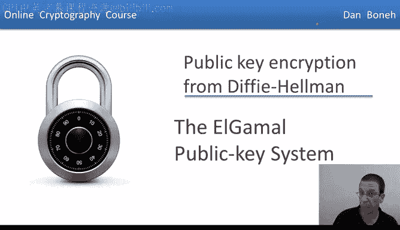
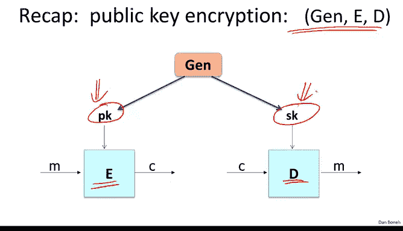
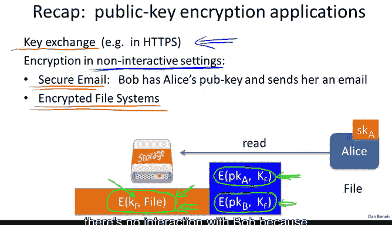
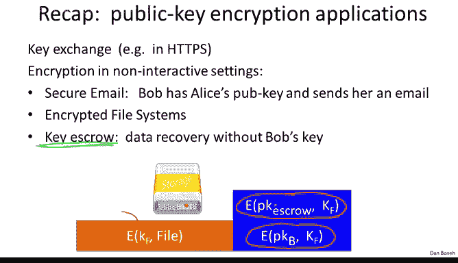
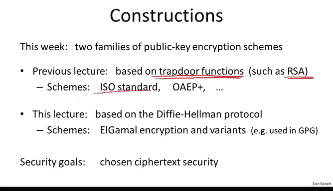
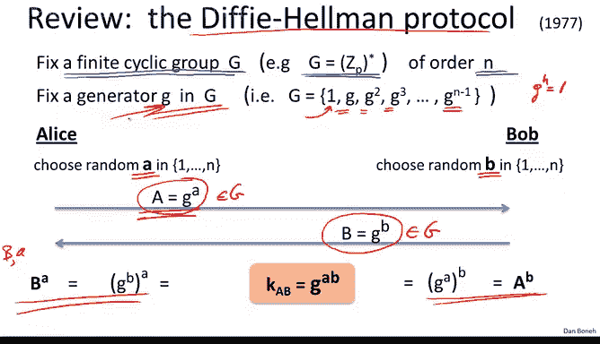
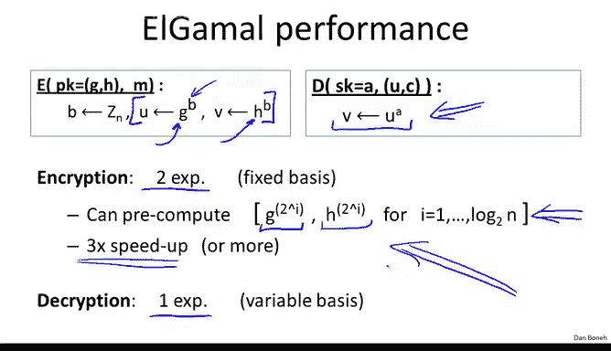
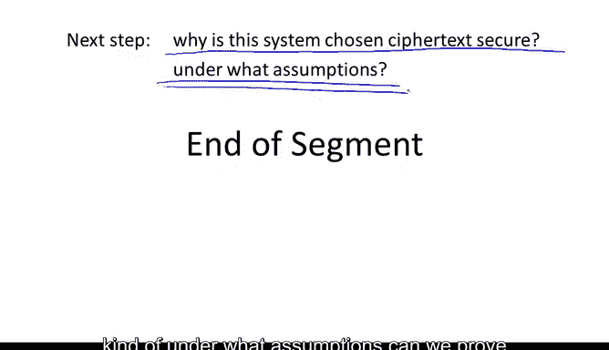

# 斯坦福大学《密码学｜Cryptography 1》中英字幕 - P62：62_06_01_ElGamal公钥系统.zh_en - GPT中英字幕课程资源 - BV1Rf421o79E

In the previous lecture， we looked at a public key encryption system that's built from RSA or more generally from trap door functions In this lecture。

 we're going to look at public key encryption schemes that are built from the Dy Heman protocol。

So first recall that a public key encryption system is made up of three algorithms。

 there's a key generation algorithm that I'll do by Gen that basically generates a public key in a secret key。

 and then there are two algorithms E and D that encrypt and decrypt and the point is the encryption algorithm encrypt using the public key and the decryption algorithm decrypt using the secret key。

The physical world analogy for public key encryption is a locked box where anyone can put a message inside the box and then lock the box that corresponds to a public key。

 and then no one can open this box， except the person who has the secret key that has the key can put it in the lock。

 unlock the box and recover the message in the box。

Now in the previous lecture we looked at a number of applications for public key encryption in particular we looked at the key exchange application in fact this is how public key encryption is used in SSL where the server sends its public key to the browser。

 the browser chooses a secret and then encrypt a secret using the server's public key sends it back to the server。

 the server decrypts and now both the browser and a server have a common secret that they can then use to encrypt data going back and forth between them。

 so in the interactive settings such as in a networking protocol public encryption would primarily be used for setting up a shared symmetric key which the two parties can then use to exchange information however there are many settings where interaction is simply not possible and then public key encryption is directly use to encrypt messages。

One example of this is a secure email， the email system in some sense is designed to be noninactive in a sense that the sender sends an email。

 the email travels from relay to relay to relay until it finally arrives at the destination and the destination should be able to decrypt without interacting with the sender at that point that can be done basically by the sender encrypting the message using the recipient's public key。

 the Cyphertex would travel along the SMTP chain until it reaches the recipient。

 the recipient would use a secret key and recover the original send message。

However there are many other cases where interaction is not possible and I want to show you two such cases。

 the first example is file systems and in fact public key encryption is a good way to manage file sharing in an encrypted file system so let me show you what I mean by that so imagine we have our friend Bob here who wants to store an encrypted file on some storage server so he'll go ahead and write the encrypted file for the storage server what he actually writes on the server is basically the following he will generate a random file encryption key we'll call it K subF and then he will use a symmetric encryption system to encrypt the file using the key K subF。

😊，Then he'll encrypt the key case of F using his own public key。 So public key of Bob。

 this will give Bob access to the file at a later time， right using his secret key。

 Bob can decrypt this header， Re case of F， then he'll decrypt the actual encrypted file and recover the plain text file。

 So decryption will work in two steps。 However， if Bob now wants to also give access to Alice to this file。

 What he'll do is he'll go ahead and in addition， he'll also include in the file header an encryption of case of F under Alice's public key。

 Okay so notice that there was no interaction here， All Bob knows is Alice's public key。

 and yet he was able to make the file accessible to Alice at a later time。 So now Bob disappears。

And then Alice comes and accesses the disc at a later time， she'll read the Cyphertext。

 decrypt her part of the header， recover KF， and then she can decrypt the symmetrically encrypted file and recover the actual file contents Okay so you can see that without any interaction。

 Bob was able to write to the file system and enable Alice to access the file as well。😊，Again。

 at the time that Alice was reading the file， there's no interaction with Bob because maybe Bob is already inaccessible and yet Alice can still read the file and recovered by herself。

So another example of an unattract application of public encryption is what's called key escrow。

Now key escrow may actually sound like a bad thing。

 but in fact it's a mandatory feature in corporate environments， so the idea here is this。

 so imagine Bob writes data to a disk。And then later Bob becomes inaccessible， maybe Bob is fired。

 maybe Bob is out sick， and somehow the company needs to have access to Bob's files。

So having Bob be the only one able to decrypt these files is simply unacceptable in the corporate settings the corporation might need access to those files so the question is what to do and the answer is to introduce this entity called a keyscrow service and the way the system then would work as as follows basically when Bob writes his file to disk his system as its writing the file to this shared storage medium。

 what it would do of course as before it would encrypt the file using the file encryption key KF he would encrypt Kf using Bob's public key but it would also encrypt Kf using an escrow service So here the escrow service is completely offline we never talk to it unless we actually need its services as Bob is writing the file all he does is he simply write the encryption of KF under the escrow Author's public key into the file header Now later Bob disappears and now the company needs to recover Bob's file。

 what does it do well at this point it would contact the escrow service。

 the escrow service would read this part。

the header use its secret key to decrypt the header and recover KF and then use KF to decrypt the actual file Okay so in this way again you noticed that the E Cor service was completely offline。

 there was no interaction with the SC service until the point at which the E Cor services were actually needed。

And again， you can see that this is a very clean and elegant application of public key encryption。

So as I said in the previous lecture we saw constructions for public key encryption based on Traar functions。

 with particular we looked at RSA， we looked at the generic construction we call the ISO standard。

 we looked at constructions like OEP+ and so on and so forth in this lecture we're going to look at public heat constructions from the Dy Heman protocolcol this is another family of public key systems and I'm going to show you how they work。

These public key systems are generally called Elgamal public key encryption schemes。

 Tahar Algamal was actually Marty Heman's student， he came up with his Algamal encryption system as part of his PhD thesis and in fact Algamal encryption for historical reasons is used in an email encryption system called GPG with a new privacy Guard。

As usual， when we construct publicly encryption systems。

 our goal is to build systems that have chosen Cy for tech security so that they are secure both against eavesdropping and tampering attacks。

So before I show you the algal system， let's do a very brief review of the DCC Heman protocol。

So in my description here I'm going to abstract it a little bit from the version that we saw last week and in fact。

 I'm just going to use the concept of a finite cyclic group。 In fact。

 we have an arbitrary finite cyclic group for example。

 it could be the group Zp star but it could also be the points of an elliptic curve and as I mentioned that there are some benefits to doing the phhelman over an elliptic curve but for simplicity I'm just going to refer to G as an abstract finite cyclic group but in your heads you should be thinking G is the group Zp star and let's suppose that the group has order n for some integer N Now we're going to fix a generated G of this group and all this means is basically if you look at the successive powers of G then basically you get all the elements in the group G you notice that because the group has order n we know that G to the power of n is equal to1 and therefore there's no reason to go beyond the n minus first power of G G to the n is equal to1 so that we just wrap around。

Okay， so we have this thiscyclic group G we have this generator whose powers gave us all the elements of G and now let me remind you how the D element protocol works basically what Alice does is she chooses a random A so she computes G to the A and sends that over to Bob Bob chooses a random B and let's see who remembers what does Bob send over to Alice。

😊，So Bob sends over to Alice G to the B， and of course I should remind you that both G to the A and G to the B are just elements in this group G。

And now they can derive a shared secret if you remember the shared secret is a G to the AB and these qualities here show that both sides can actually compute a shared secret given the values of their disposal so Alice for example。

 has B and she has A and so raising B to the power of A gives her the shared secret。😊，The attacker。

 of course， the poor attacker， he gets to see A and B， and his goal is now。

 oh of course he also gets to see the generator G， and his goal now is to compute G to the AB。

 but we said that this is believed to be a hard problem given G to the A and G to the B in a group like ZP star。

 computing G to the AB is difficult。

So now let's see how to convert the DPhe protocol into an actual public key system and as I said。

 this was a brilliant idea due to Tahar Algamal so as before we're going to fix our cyclic group G and a generator little G inside of G。

😊，Now， here I wrote the Dfihamman protocol again， except now we're going to assume that these guys are separated in time。

 So these two steps are don't have to occur simultaneously。

 They could actually take place at quite different times。

 The first step of the Dfi humanman protocol is what we're going to view as key generation。

 That is the public key is going to be this capital A。

 and the secret key is simply going to be the little a。So you notice， of course。

 that extracting the secret key from the public key。

 namely extracting little a from capital A is a discrete log problem so that recovering the secret key is actually difficult。

 Okay so this gives us our public key。 So now at a later time Bob wants to encrypt the message to Alice encrypted using her public key。

 So how does Bob encrypt。 Well， what he's going to do is he's going to compute his contribution to the Dfihelmon protocol namely he's going to send over G to the little B。

 Of course he's going to choose this little B at random。

 and now he's going to compute by himself the shared secret。

 So he's going to compute by himself G to the AB from this G to the AB。

 he's going to derive a symmetric key for a symmetric encryption system。

 and then he's going to encrypt the message M using the symmetric key that he just arrived。

 and that's the pair that he's going to send So he's going to send over his contribution to the Dfihelmon protocol plus the symmetric encryption of the message M that he wants to send over to Alice so you can see basically。

We are doing the exact same thing as we were doing the Dfi Hemand protocol。

 except now where Bob directly immediately is using his Dfihelman secret to encrypt a message that he wants to send over to Alice Now what does Alice do to decrypt basically she's going to also compute a Dfi Heman secret remember now she just received Bob's contribution to the Dfihelman protocol and she has her secret keyA so she can compute also the Dfihelman secret namely Ju to the AB from which she's going to derive the symmetric encryption keyK and then she's going to decrypt a message to recover the actual plain text。

😊，Okay so that's the intuition for how we converts the DPhamman protocol into a public key system。

 by the way this was kind of an interesting development at the time that it came out partially because you notice this is a randomized encryption scheme so every time Bob encrypts a message it's required that he choose a new random B and encrypt a message using this new random B。

😊，So let's see the algal system actually in more detail。

 so now actually let's view it as an actual public encryption system namely algorithm Gen algorithm and E and algorithm D。

 so as usual we're going to fix our finitely group of order N another ingredient that we're going to need is a symmetric encryption system so I'm going to refer to it as E subS and D subs these are the encryption and encryption algorithms of a symmetric encryption system that happens to provide authenticated encryption and the key space for this system is capital K。

😊，And then we're also going to need a hash function that maps pairs of elements in the group。

 namely elements in G squared into the key space。Now here's how the public encryption system works。

 So I have to describe three algorithms， algorithm that generates the public key and the secret key and then the encryption and encryption algorithms。

 So the key generation algorithm works as follows。 all we do is basically build up Alice's contribution to the Dyhaman protocol What we're going to do is we're going to choose a random generator G and G and then we're going to choose a random exponent A the secret key is going to be a and then the public key is going to be the generator G and Alice's contribution to the Dfihamman protocol。

 The reason by the way， we don't use a fixed generator is because it allows us to somewhat use a weaker assumption improving security and so it's actually better to choose a random generator every time it's easy enough to choose a random generator all we do is we take the generator that we started with and then we raise it to some power that's relatively prime to n and that will give us another generator a random generator of the group capital G so you can see here that again public key is simply Alice's contribution to the Dyhamman protocol and the secret key is。

😊。

The random aid that she chose。Now how do we encrypt and decrypt well。

 when Bob wants to encrypt the message， he's going to use the public key。

 remember it consists of G and H and here he wants to encrypt the message M。😊。

So here's what he's going to do。 So he's going to choose his contribution to the Dfi Hemand protocol。

 So this is the secret B that he would normally choose in Dfi Heman and now he's going to compute G to the B。

 which is actually his message that gets sent to Alice and the Dfihelmand protocol he's going to compute a Dfihelman secret that's H to the B。

 if remember H was G to the A therefore this value here is really G to the AB that's the Dfihelman secret That's the one thing that the attacker doesn't actually know Next he's going to compute a symmetric key by basically hashing this pair U comma V So U of course is something that the attacker is going to know because that's going to be sent as part of the Cyphert。

 but V the attacker isn't going to know again for the proof of security actually helps to hash both U and V and so we hash both of them together Also strictly speaking we just needed to hash V because V is the only value that the attacker doesn't know the attacker already knows U because that's going to be part of the data that's sent on the network。

 So anyhow so Bob deriveds this symmetric key K by hashing U and V。

Then he goes ahead and encrypts the message using the symmetric keyK。

 and finally he outputs his contribution to the DFma protocol， the value U。

 and then the symmetric Cyphertex that directly encrypts the message M。

That's it so the Cypherex consists of these two parts and that's the thing that gets sent over the network Let's see how does Alice decrypt now so she's going to use her secret keyA to decrypt and she receives here Bob's contribution to the deffia protocol plus the symmetric encryption of the message that Bob sent。

😊。

What she'll do is she'll compute herself the Dfihelman secret if you remember U to the A。

 the simply G to the B to the A， which is G to the AB。

 So here Alice computed the Dfihelman secret and now let me ask you how does she derive the symmetric keyK given the Dfihelmand secret G to the AB and the ciphertex that she was given？

Well， what she'll do is simply again， now she has you from the Cyphertext。

And she has V because she just computed it herself。

 so now she can redderiveve the symmetric encryption key by hashing U and V together to get the symmetric encryption key and then she just decrypts the ciphertext to get the actual plain text so that's it that's the whole encryption and encryption algorithm in a picture the way the Cyphertext would look is also as kind of what we saw in the last lecture basically there would be a short header that contains U which as you recall is G to the B and then the rest of the Cyphertext would be the encryption of the message that's being sent under thesymmetric key key。

And then to decrypt Alice would use this hiter to derive the difihamman secret from which she will derive K and then decrypt the body to get the original plain text。

 By the way I should note that the way I described the system here is actually not how Algamal described it originally this is in some sense a modern view of Algamal encryption。

 but it's pretty much equivalent to how Algamal viewed it。

So now let's look at the performance of alggamal， so here what I wrote is the kind of the time intensive steps of Alggamal encryption。

 namely during encryption there are these two exponiiations in the group G exponiation。

 remember as a cubic time algorithm using the repeated squing algorithm and as a result it's fairly time intensive。

And when I say time intensive， I mean that on a modern processor it will take a few milliseconds to compute these exponiations and during decryption。

 basically the decryptor computes one exponiation， namely u to the A。

 this is the bottleneck during decryption。Okay so you would think that encryption actually takes twice as long as decryption because encryption requires two exponiations whereas decryption requires only one。

 it turns out that's not entirely accurate because in notice the exponiation during decryption is done to a variable basis namely U changes every time whereas doing encryption the basis is fixed G and H are derived from the public key and are fixed forever so in fact it turns out if you want to do exponiation to a fixed basis you can do a lot of precomputation in particular you can do all the squaring steps in the repeated squaring algorithm offline so here what you would do is you would compute all powers of2 of G so you would compute G G squared G to the fourth due to the eighth G to the 16 due to 32 and so on and so forth these are all the squaring steps of the repeated squaring algorithm you would do offline the same thing for H and then when it comes time to actually do the real exponiation。

 all you need to do is just do the multiplication to accumulate。

Ps of two into the exponent B that you're trying to compute。 So if you think about it。

 this can actually speed up exponiciation by a factor of three。 In fact。

 it would speed up it even more if you allow me to store even larger tables。

 this is called a window exponiation But regardless if you allow the encryptor to store large tables that are derived from the public key。

 then in fact encryption is not going be slower than decion。

 In fact encryption will be faster than decryption。 but again。

 this requires the encryptor to precompute these large tables and store them around。

 So if all the encryptor is doing is just constantly encrypting to a single recipient。

 that could be done actually fairly fast using these precomp tables。

 if the encryptor for every message is encrypting to a different recipient。 for example。

 every time you send an email you send an email to a different recipient， then in fact。

 the encryption will be twice as slow as decryption。So this is a good trick to keep in mind。

 in fact most crypto libraries don't do this and so if you see that you're always encrypting to the same public key and for some reason your encryption process takes a lot of time is a bottleneck for you。

 keep in mind that you can actually really speed things up using precomputation of course if encryption is a bottleneck for you。

 you might as well be using RSA where an RSA encryption is really fast。

Okay， so that's the end of our description of algaal encryption and now the next question of course is why is the system secure in particular。

 can we prove that it's chosen Cyteex secure and more importantly kind of under what assumptions can we prove that the system is chosen Cytex secure and so we're going to discuss that in the next segment。

😊。

