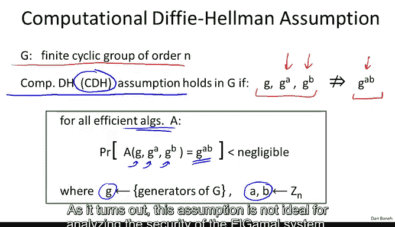
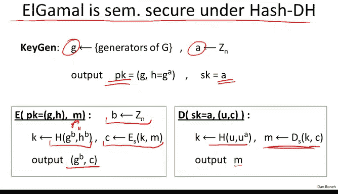

# 斯坦福大学《密码学｜Cryptography 1》中英字幕 - P63：63_06_02_ElGamal安全性.zh_en - GPT中英字幕课程资源 - BV1Rf421o79E

In this segment， we're going to study the security of the Algamal Public key encryption system。

So let me remind you that when we first presented the Dfi Heman protocol。

 we said that its security is based on an assumption that says that given G G to the A and G to the B。

 it's difficult to compute a Dfihelman secret G to the AB this is basically what the attacker has to do he sees Alice's contribution he sees Bob's contribution and then his goal is to figure out what the Dfihelman secret is and we said that this problem is difficult the statement that this problem is difficult is what's called the computational Dfihelman assumption so let's take this assumption more precisely so as usual we're going to look at a financially group of order N so G some group in your head you should be thinking ZP star but there could be other groups for example like an elliptocur group。

And then we say that the computational Dfihelman assumption。

 I'll often use the shorthand CDH for computational Dfihelman will say this assumption holds in G if the following condition holds namely for all efficient algorithms。

 if we choose a random generator， and then we choose random exponents A and B and ZN。

 then when we give the algorithm G G to the A and G to the B。

 the probability that the algorithm will produce the Dfihelman secret is negligible。

 if this is true for all efficient algorithms， then we say that the CDH assumption holds for G。CDH。

 as I said， stands for computationalutal Dy helmetmet。

As it turns out this assumption is not ideal for analyzing the security of the yellowgamal system and instead I'm going to go ahead and make a slightly stronger assumption called a hash D fielman assumption so what is the hash deffihelman assumption again we're focusing on a particular group G and now we're going to also introduce a hash function H that maps pairs of element in G into the key space of some symmetric encryption system and then we say that the hash deffihelman assumption or HgH for short holds for this pair G comma H for the group and the hash function if the following is true。

 basically if I choose a random generator and then I choose random exponentence A and B in the N and then I also choose a random R and K then the following distributions are computationally indistinguishable that is if I give you G G to the A G to the B and then this hash value this should look familiar to you this is the hash value that's used in the egamal system to derive the symmetric encryption key what we're saying is that this distribution is indistinguishable from a distribution where you're also given G G to the A of G to the B。

Now instead of giving the hash you're given just really random key。

 so what this assumption says is that the symmetric key that was derived during encryption in the algal system essentially is indistinguishable from a truly random key that's derived independently from the rest of the parameters of the system it's a truly independent random key looks basically the same as the key that we used to derive from the G to the A and G to the B。

😊，Now I'd like to point out that the hash deffialman assumption is actually a stronger assumption than the computational Dfialman assumption。

 The way to see that is using the contra positiveitive that is supposed the computational Dfialman assumption happens to be easy in the group G。

Then I claim that in fact， the hash G fihelman assumption is also easy in the group G， in fact。

 I'll say for G comma H and this is true， in fact， for all hash functions where the image of the hash function。

Is contains at least two elements In other words， all I want to say is that the hasht fi assumption that is easy for all hash functions and don' map everything to a single point。

Wwhich is true for almost all hash functions of interest to us。

 So actually this is a really simple statement to prove。

 basically if the computational dfihelman assumption is easy。

 what that says is that given G to the A and G to the B。

 I can actually calculate G to the AB myself because I know the hash function H I can calculate this complete value here So if you give me a tuple that's sampled from the left or sample from the right I can very easily tell where it's from。

 if it's sampled from the left， then once I've calculated G to the AB myself。

 I can just test that the last element in the tuple is in fact the hash of G to the B and G to the AB if it is I know the sample from the left if it isn't I know the sample from the right so this gives me pretty high advantage in distinguishing these two distributions So if CDH is easy it's very easy to see that these distributions are distinguishable this basically says that if the hash Dfihelman is in fact hard then CDH must also be hard which then we say that therefore the hash deffihelman is a stronger assumption there might be group。

Where CDH is hard， but HdH is not hard。 So we say that HGH is a stronger assumption。

If you found this discussion of weak assumption versus strong assumption confusing it's not really that important that's fine to ignore it。

 the important thing that I want to show you is in fact that the hasht fiharman assumption is sufficient to prove the semantic security of the algal system Before we do that let me quickly ask you the following puzzle just to make sure the hasht fiman assumption is clear so imagine our keyspace is 01 to the 128 so 128 bit strings and our hash function map pairs of group elements into these 128 byte strings suppose it so happens that we chose a hash function such that it always outputs strings that begin with zero in other words of the 128 bit strings the most significant bit of the output is always zero。

If we chose such a hash function， does the hashty fiman assumption hold for this pair G comma H？

So the answer is no， it doesn't hold and the reason is because it's now very easy to distinguish the two distributions that we have here。

 the distribution on the left and the distribution on the right。

 and the way you would distinguish the two is basically if I choose a truly random element in k in 01 to the 128。

 then most significant bit will be 0 with probability 12。However。

 if tuple that's given to me is chosen from the left distribution。

 then the most significant bit of the hash will always be0 and therefore if I see zero。

 I'm going to say the distribution is a distribution on the left。

 if I see1 I'm going to say the distribution is a distribution on the right。😊。

And that will give me advantage one half in distinguishinging these two distributions and so as a result。

 the hasht fielman assumption is false in this case。

 so clearly you can see that even though CDH might be hard in a certain group G。

 if you choose a bad hash function， then HDDH will not hold for the pair G comma H。

Okay， but suppose it so happens that we choose a group G and a hash function H for which the hasht fihelman assumption holds。

 and in fact， if you choose the hash function to be just shot to 56 for all we know。

 the hasht fihelman assumption holds in the group ZP star and holds in the elliptic curve groups。

My goal now is to show you that algamal is in fact semanally secure under the hash Dfihelman assumption so let me quickly remind you how the algamal system works well we're going to choose a random generator G。

 we're going to choose a random A in the end the public key is going to be G and G to the A the secret key is simply going to be a and now here I wrote shorthand for the algamal encryption basically what to encryptle we do is we choose a random B we hash G to the B and H to the B remember this H to the B is the value G to the AB。

 this is the Dfihelman secret。The hash function gave us a symmetric encryption key K。

 we encrypt a message with K and we output g to the B and the symmetric cphertext to decrypt we have to value u and the Dfialman secret due to the A to derive the symmetric key with decrypts the cphertext and then we output the plain text message M So now let's see how to argue that in fact algamal emmantic secure under this hash D femalealman assumption it's fairly simple so well we have to argue remember we had in semantic security we have these two experiments in one experiment the attacker is given the encryption of M0 and the other experiment。

 the attacker is given the encryption of M1 So I wrote the two experiments here here you notice that the attacker starts by sending off the public key to the adversary the adversary then chooses two equal length messages M0 and M1 and then he gets algamal encryption of M0 and I kind of wrote shorthand for what this algamalciphert is similarly an encryption1 he simply gets the encryption of M1 instead of m0 and everything else is the same about these two experiments。

Now because of the hasht fielman assumption， we know that even though the attacker got to see G to the A and G to the B。

 we know that the output of the hash of G to the B G to the AB is indistinguishable from random。

 therefore if we replace the actual hash function by a truly generated random keyK。

 it's independent of everything else， by the hasht fielman assumption。

 the attacker can't distinguish these two games。And again。

 it's a simple exercise for you to show that if he could distinguish these two games。

 then he would break the Haji Fhelman assumption。But then the same is true for experiment1。

 the attacker also could not distinguish the output of the hash function from a truly random key that was used to generate the channel andciphertext so now basically we look at these two experiments and you realize wait a minute what's going on in these two experiments。

 basically everything is the same except in one experiment the attacker gets the encryption under a symmetric encryption system of M0 and the other one he gets the encryption under a symmetric encryption system of M1 and the key is chosen a random independently of everything else so by the fact that the symmetric encryption system is sesymmetricmanally secure these two games arere indistinguishable if they were distinguishable then the attacker could break the symmetricmantic security of the symmetric encryption system。

So now we can prove you this chain of the equivalences and that prove that the original games in fact are indistinguishable。

 computationally indistinguishable and therefore the Algamal system is semantically secure okay so it's like I said a very simple proof by pictures and you can make this into a rigorous proof without too much work but semantic security isn't enough what we really want is chosen Cypherteex security and the question is is Algamal chosen Cypherte security？

😊，So it turns out to prove the chosen Cypherte security of Algamal。

 we actually need a stronger assumption half defyelman or computational diyalmen are actually not enough to prove chosen Cyphertex security of the system as far as we know。

😊，So to prove chosen Cyphertex security， I'm going to introduce a new assumption called the interactive Dfi hubman assumption and actually technically we really don't like this assumption and we're going to try and get rid of this later on。

 but for now we just want to analyze the security of the basic algamal system against chosen Cyphertex attack。

😊，So to argue that it is chosen spherex secure， here is what the assumption says。

 basically the challenger starts plays a game with the adversary， he generates a random G。

 generates two exponents， and then he sends to the adversary as usual G， G to the A and G to the B。😊。

Now the adversary's goal is basically to figure out a Dfihelman secret， namely G to the AB。

 he outputs the value V and he wins the game if v happens to be equal to g to the AB。

 So so far this looks identical to the computational Dhyhelman assumption there's no difference This is the computational defalman assumption except in interactive Dyhelman we give the attacker a little bit more power so because the attacker has more power it's harder to satisfy the assumption which is why we say that this assumption is stronger than computational Dfihelman Now what is this power that we give we give him the ability to make queries in particular he gets to submit two elements from the group G So U1 v1 is a pair from the group G and then he's told whether u wanted the A is equal to v1 so he gets one if you wanted the as is equal to v1 he gets zero otherwise it's kind of a bizarre type of  query how does condisponsibly help the attacker but it turns out we need to be able to answer these types of queries for the adversary in order to be able to prove chosen ste security。

In fact， he can do these types of queries again and again and again so he can issue as many queries like this as he wants。

 and then the assumption says that despite all these queries。

 he still can't figure out the Dfihelman secrets， namely despite making all these queries。

 the probability that he outputs the Dfihelman secret is negligible。😊。

Okay so clearly if this assumption holds that the computational defman assumption holds because here the adversary has more power and as a result we say that this assumption is stronger than computational deffielman。

 the thing we really don't like about this assumption is the fact that it's interactive in that that the adversary is allowed to make queries to the challenger and as I said we're going to try and get rid of this interaction later on but for now I'll tell you that under this interactive deffielman assumption and under the assumption that the symmetric encryption system provides authentic to encryption and under the assumption that the hash function is kind of an ideal hash function。

 what we call a random oracle then in fact the algamal system is chosen spherteex secure and again this R here den knows the fact that it's in the random oracle model which is not important so much for our purposes is the main thing to remember that under kind of this weird interactive assumption we can actually prove that algamal is chosen stex secure and as far as we know this assumption actually holds for the group Zp star So what we're going to do next is basically。

Answ this question of whether we can get rid of the interactive assumption。

 can we prove security strictly based on CDH and similarly。

 can we prove security without relying on random ors just without having to assume that the hash function is ideal just can we prove security using a concrete hash function and we'll do that very briefly in the next segment。

