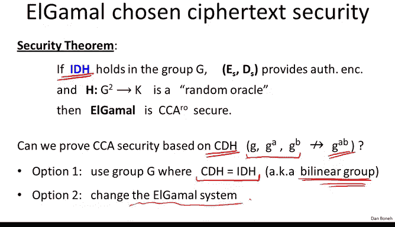
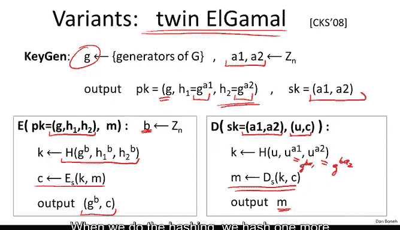
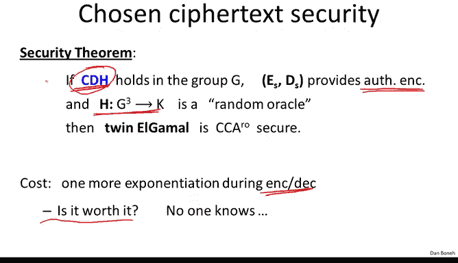

# 斯坦福大学《密码学｜Cryptography 1》中英字幕 - P64：64_06_03_安全性更强的ElGamal变体.zh_en - GPT中英字幕课程资源 - BV1Rf421o79E

In the last segment we saw that the Algamal Public key encryption system is chosen Cypherteec secure under a somewhat strange assumption in this segment we're going to look at variants of algamal that have a much better chosen Cyte security analysis。

Now I should say that over the past decade there's been a ton of research on constructing public encryptions that are chosen Cyteex secure。

 I actually debated for some time on how to best present this year and finally I decided to kind of show you a survey of the main results from the last decades specifically as they apply to the algaM system and then at the end of the module I suggest a number of papers that you can look at for further reading。

So let me start by reminding you how the algamal encryption system works。

 I'm sure by now you all remember how Algamal works， but just to be safe。

 let me remind you that key generation algamal picks a random generator。

 a random exponent from Zn and then the public key is simply the generator and this element G to the A whereas the secret key is simply the discrete log of H base G this value A Now the way we encrypt is we pick a random exponent and B from Zn we compute a hash of G to the B and H to the B and I' going remind you that H to the B is the Dfihel and secret G to the AB and then we actually encrypt a message using a symmetric encryption system with the key K that's derived from the hash function and finally the output Cyphertext is G to the B and the symmetric Cyphertext。

The way we decrypt is， as we've seen before， basically by hashing U and the Dyhelman secrets。

 decrypt in the symmetric system and outputting the message M。😊。

Now in the last segment we said that Algamal is chosen spherex secure under this funny interactive Dfialman assumption I'm not going to remind you what the assumption is here。

 but I' also say that this theorem kind of raises two very natural questions The first question is can we prove CCA security of Algamal just based on the standard computational difialman assumption namely the given G to the a G to the B。

 you can't compute G to the AB Can we prove chosen spherte security just based on that。

And it turns out there are two ways to do it， the first option is to use a group where the computational difihelman assumption is hard but is provably equivalent to the interactive difihelman assumption。

And it turns out it's actually not that hard to construct such groups。

 these groups are called biline groups， and in such groups we know that the algal system is chosen spherex secure strictly based under the computational difiman assumption。

 at least in the random or model。I'll tell you that these biline groups are actually constructed from very special elliptic curves。

 so there's a bit more algebraic structure that enables us to prove this equivalence of IDH and CDH but in general who knows maybe you don't want to use elliptic curve groups maybe you want to use EP star for some reason so it's a pretty natural question to ask can we change the algamal system such that showssphaex security algamal now can be proven directly based on CDH for any group where CDH is hard now without assuming any additional structure about the group？

😊。

And it turns out the answer is yes and there's kind of an elegant construction called twin algamal so let me show you how twin algamall works。

 It's a very simple variation of Algamal that does the following again in key generation we choose a random generator。

 but this time we're going to choose two exponents A1 and A2 as the secret key so the secret key is going to consist of these two exponents A1 and a2。

😊，AndNow the public key of course is going to consist of our generator and then we're going to release G to the A1 and g to the A2 so remember that in regular almal what the public key is simply g to the A and that's it here we have two exponents A1 and A2 and therefore we release both G to the A1 and g to the A2。

Now the way we encrypt， you notice the public key here is one element longer than regular algamal。

 the way we encrypt using this public key is actually very similar to regular algamal。

 we choose a random B and now what we'll hash is actually not just G to the B and H1 to the B but in fact G to the B H1 to the B and H2 to the B so we're basically hashing three elements instead of two elements and then we basically encrypt the message using the derived symmetric encryption key and as usual we output G to the B and C as our final sphertext。

How do we decrypt Well so now the secret key consists of these two exponents A1 and A2 and the sphertex consists of U and the symmetric Cypherex C so let me ask your puzzle and see if you can figure out how to derive the symmetric encryption keyK just given the secret key and the value U。

So it's kind of a huge puzzle and I hope everybody worked out the solution。

 which is basically what we can do is we can take u to the power of a1 and that is basically G to the B A1 and U to the A2 which is G to the B A2 and that basically gives us exactly the same values as H1 to the B and H2 to the B so this way the decryor arrives at the same symmetric key that the encryptor did。

 then he decrypts the Cyphertex using the symmetric system and finally outputs the message N。

So you notice this is a very simple modification to regular algamal all we do is we stick one more element in the public key。

 when we do the hashing， we hash one more element as opposed to just two elements we hash three elements and similarly we do during decryption and nothing else changes the sizet is the same length as before and that's it。

Now the amazing thing is that this simple modification allows us to now prove chosen spher security directly based on the standard computational Dfi helmetman assumption still we're going to need to assume that we have a symmetric encryption system that provides a synicated encryption and that the hash function that we're using is an ideal hash function in what we call a random oracle。

 but nevertheless， given that we can prove chosen spherax security strictly based on the computational Dfialman assumption。

😊，So now what's the cost of this， of course if you think about this during encryption and decryption。

 encrypter has to do one more exponiation and the decryer has to do one more exponiation。

 so the encryptor now does three exponiations instead of two and the decryor does two exponiations instead of one。

So the question is now now it's a philosophical question。

 is this extra effort worth it so you do more work during encryption and decryption and your public key is a little bit bigger but that doesn't really matter the work doing encryption and decryption is more significant and as a result you get chosen s security based on kind of a more natural assumption namely computational leaffielman as opposed to this oddlooking interactive diyhelman assumption but as a worth it's kind of the question is are there groups where CDH holds but IDH does not hold if there were such groups then it would definitely be worth it because in those groups the twin algamal would be secure but the regular algamal would not be CCA secure。

But unfortunately we don't know of any such groups and in fact as far as we know。

 it's certainly possible that any group where CDH holds IDH also holds。

 so the answer is that really we don't know whether this extra cost is worth it or not。

 but nevertheless this is a result that shows that if you wanted to achieve chosen Saax security directly from CDH you can do it without too many changes to the Algal system。

The next question is whether we can get rid of this assumption that the hash function is an ideal hash function namely is a random oracle and this is actually a huge topic。

 there's a lot of work in this area on how to build efficient public key encryption systems that are chosen Cyex secure without random oracles this is a very active area of research as I said in the past decade and even longer and I'll mention that as it applies to algamal they are basically again two families of constructions。

 The first construction， a construction that uses these special groups called these bilinear groups that I just mentioned before。

 it turns out the extra structure of these bilinear groups allows us to build very efficient chosen Cytex secure systems without referring to random oracles and as I said at the end of the module I point to a number of papers that explain how to do that。

 This is quite an interesting construction but it would take me several hours to kind of explain how it works。

 The other alternative is actually to use groups where a stronger assumption called the decision diyalman assumption holds。

I'm not going to define this assumption here， I'll just tell you that this assumption actually holds in subgroups of ZP star in particular if we look at a prime order subgroup of ZP star。

 the decisionion Dfihelman assumption seems to hold in those groups and then in those groups we can actually build a variant of Algamal called the Kramer Sop system that is chosen sex secure under the decisionion Dfihelman assumption without random articless。

 again this is a beautiful beautiful result but again it will take a couple of hours to explain and so I'm not going to do that here this is probably one of these things that I'm going to leave to either the advanced topics or to an advanced course that we do at a later time but again I point to a paper at the end of the module just in case you want to read more about this。

So here's a list of papers that provides more reading material。

 so if you want to read about Dfialman assumptions。

 I guess I wrote a paper about this a long time ago that talks about various assumptions related to Dfielman and in particular studies the decision Dfi Heman assumption。

If you want to learn about how to build chosen Sepherex secure systems from decisionion Dyalman and assumptions like it。

 there's a very cute paper by Kramer and Schop back from 2002 that shows how to do it this is again a very highly recommended paper if you want to learn how to build chosen Seex security from these biline groups then the paper to read is the one cited here which actually uses a general mechanism called identitybased encryption which very surprisingly turns out to actually give us chosen Setex security almost for free。

 so once we build an any-based encryption chosen Sephertic security follows immediately and that's covered in this paper that I described here。

 the twin Dfialman construction and its proof is described in this paper that I referenced here and finally if you want to kind of see a very recent paper that gives a very general framework for building chosen Setic secure systems using what's called extractable hash proofs。

 then there's again a nice paper by Jotequii that was just recently published I definitely recommend reading that all have very very elegant idea。

And I wish I could cover all of them in the basic course。

 but I'm going to have to leave some of these to the more advanced course or perhaps the more advanced topics at the end of this course Okay。

 so I'll stop here and in the next segment I'm going to tie Algamal and our assay encryption together so that you see how the two kind of follow from a more general principle。

